# 目录

一．填空题。.  
二、选择题...   
三．判断题。  
四．简答题（50 分）

选型计算类：. .8  
工具、软件.... ..10  
代码类： .13

# 视觉工程师四级笔试

# 一．填空题。

1.CogPMAlignTool中，计分时考虑杂斑的意义是___是否考虑无关或混乱的特征 _。

如果选中，则PatMax算法在计算模式实例的分数时会考虑无关或混乱的特征。考虑杂乱的特征通常会导致得分较低。仅适用于PatMax算法。如果训练的图案包含形状模型，则可能需要禁用此功能。

2.平行背光配合___远心_____镜头进行尺寸测量精度更高。  
3.下面这段代码得到的 count 和 area 分别指的是___CogBlobTool1 的斑点结果数量__、 _CogBlobTool1 的斑点结果中最大的斑点的面积 _。

double count $\mathtt { = 0 }$ ；

double area $\mathtt { = 0 }$

CogBlobTool blobtool=mToolBlock.Tools[“CogBlobTool1”]as CogBlobTool;

foreach(ICogTool tool in mToolBlock.Tools)

mToolBlock.RunTool(tool,ref message,ref result);

count=blobtool.Results.GetBlobs().Count;

area=blobtool.Results.GetBlobs()[0].Area;

4．C#中，break语句的作用是 _中断并跳出当前循环 。

5．在CaliperTool中，单边模式下的三种计分函数分别是__对比度 _位置 _PositionNeg _。  
6．在C#中，比较常用的循环语句有__for _foreach _和___while_____。do while  
7．CogBlobTool中，硬阈值指的是___选择一个像素值作为阈值将图像进行分割为目标和背景， _，软阈值指的是__将图像像素分为对象、边缘和背景三种 _。  
8．C#中定义一个方法时，方法参数有三种修饰词，分别是_ _out 、 _ref _和 _params _。

out:不赋值，在函数中必须赋值，传参时用out修饰。ref:赋值，在函数中改变值。Params:传参时需放在最后一位，可以自动将最后的所有同类型值放进这个可变长度数组中。

9．PMAlignTool 中弹性参数的单位是__像素 ， （填增加或减小） _增加 _弹性可能会导致找到不准确的特征。  
10．如下图所示，当BlobTool参数如图 $\textcircled{1}$ 设置，输入图像灰度如图 $\textcircled{2}$ 分布，则结果Blob面积为_1pixel____。BlobTool 参数如图 $\textcircled{3}$ 设置时，结果 Blob 面积为___0__ _。

图2：硬阈值，值100，取白底黑点，意为灰度值必须低于100部分才算，然后最小面积为0所以，面积应为1，只考虑中心那个最黑的像素点。

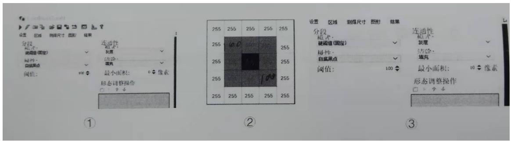  
图3：同样参数，但是最小面积变为了10：当实际面积不满足最小面积，默认没有这个斑点结果。

11.C#语言中，实现循环的主要语句有___for__ __foreach_ ___while_ _、 ___do-while_  
12.bool 类型有两个值分别是___false___,__true   
13.定义方法时使用的参数是__形参____，调用方法时使用的参数是___实参___。  
14.面向对象语言都应至少具有的三个特征是封装、___继承____、___多态____、

封装：将实现一个东西的方法及过程封装起来，想要用了通过调用这个方法就可以直接实现需要的功能，不需要考虑怎么实现以及实现的过程。

继承：单根性、可传递性，A继承与B，B又继承与C。此时A是可以用BC的东西的，但是B用不了A，C用不了AB。

多态：实现多态的方式有：虚方法、抽象方法、接口。

虚方法：可以写也可以不写方法体，也可以空实现。Vartual修饰虚方法，override来重写虚方法。

抽象方法：不可以实例化，需要写在抽象类中，不可以有方法体，重写也是用override，用abstract修饰抽象类或方法。

接口：用 interface 修饰，一般命名方式都是 I 加名字。类可以继承多个接口。

15.类是一种数据结构，它使用 class 关键字声明。  
16.类的方法声明中，若没有显示指定方法的访问修饰符，则默认 private。

public：公共的/公开的，随意访问。

private：私有的，只在类或结构体内部访问。

Protected：受保护的，只有类和派生类可以访问。

Internal：内部访问，只有同一程序集里可以访问。

Protected internal：受保护的内部访问，可以同一程序集代码中或者其他程序集中的派生类访问。

Private protected：私有受保护访问，只可以同一程序集中的派生类访问。

17.C#中类的实例化需要使用的关键字是__new 。  
18.浮点类型包括___float__,____double__,_decimal

float：单精度浮点类型，占用 4 个字节的内存空间。它的精度大约是 6-9 位数字

double:双精度浮点类型，占用 8 个字节的内存空间。它的精度大约是 15-17 位数字

decimal:高精度的十进制类型，占用 16 个字节的内存空间。它的精度是 28-29 位数字

19.数据类型转换分为__显式转换____,隐式转换 。

显式转换：大转小，比如 double 类型强转为 int 类型，需要强转。3.14 变 3

隐式转换：小转大，比如 int 类型转为 double 类型。

20.表达式 $^ {  } 4 ^ { \star } 1 0 { > } = 6 5 ^ { \prime \prime }$ 的值为___false__ _。  
21.CogPMAlignTool 结果中的 X、Y 指___在 InputImage 的选定空间中测得的图案原点的坐标。

Angle指在InputImage的选定空间中测量的图案空间的旋转。

22.物料随流水线运动，假设流水线以 ${ 2 m / s }$ ，相机型号CAM-CC-5000-20-G，为保证正常取像，物料在流水线上的最小理论间距为 _0.1m_

20 表示帧率：理想状态下，每秒拍 20 张图片，流速 ${ 2 m / s }$ ，拍一张对应 $2 / 2 0 { = } 0 . 1  { \mathrm { m } }$

23.被测物体存在两个不同高度的平面，为准确测量物料尺寸应选择____远心____镜头  
24.标定的主要有两个作用，分别是_ _校正畸变__和_____将像素信息转换为mm为单位的真实物理信息  
25CogHistogramTol 结果中部分数据含义 Median 中值、Minimum 最小值、Maximum 最大值、_Mean 平均值、Mode 模式、Std.Dev._标准差、Variance 方差_、Samples 示例。  
26LED光源有亮度高、寿命长、绿色环保、工作电压低、光电转化率高、色彩多样等优势  
27.由于镜头的光学结构和成像特性，取像视野越___大_____、选用的镜头焦距越 _小 __、畸变越明显。

28.合格的机器视觉图像需满足等要求__对比度好 _均匀性好 色彩还原性好 _、_清晰度好_、__分 辨率高、_图像噪点少、_图像锐利度高、等要求   
29.GIGI 中两个 I 是：检测(Inspect)识别(Identify)  
30.影响检测精度的因素：图像质量、视觉工具精度、相机视野、  
31.标定的作用：校正畸变__和_____将像素信息转换为mm为单位的真实物理信息  
32.光源的视场分为 _亮场_ _暗场_  
33.CCTV镜头和远心镜头的区别：

CCTV镜头价格低、分辨率低、畸变高、焦距选择范围大、使用灵活性高、适合简单测量/低精度测量。  
远心镜头：价格高、分辨率高、畸变低、焦距选择范围狭窄、使用灵活性低、适合高精度测量、纵深测量。  
34.C#循环语句中用continue跳过当前循环，使用break中断循环  
35.下图灰度直方图，平均灰度值是218.81中值是255

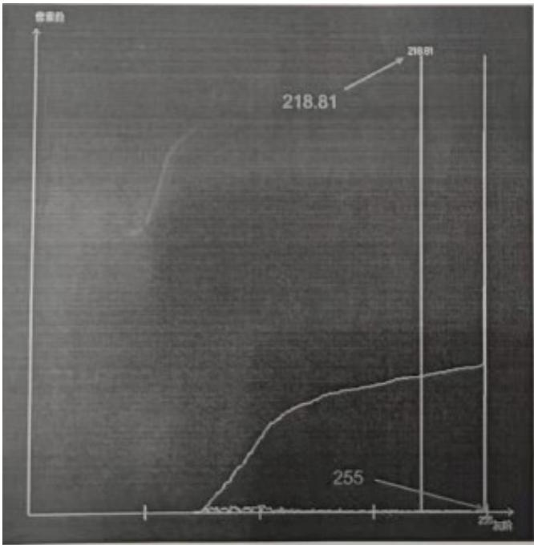

36.public static void Add100(int a)

$\{ \mathsf { a } + = 1 0 0 ; \}$

static void Main(string[]args)因为是 void 没有返回值。

{

int $\mathtt { a } = 0$ :

Add100(a);//这里方法中a已经变为了100，但是它没有返回值，没有将修改后的值传出来。

Console.WriteLine(a.ToString());

Console.ReadKey();

}

运行以上代码段，控制台的输出结果为 0

37在C#中可以使用____try___语句抛出一个异常，使用__catch___语句块捕获异常  
38.在 C#中循环结构语句有_for____、foreach_ __、_while_____ _等等 do while  
39,在C#选择分支语句switch-case语句中____default__子句用干指定在找不到匹配项时执行的动作，

Switch(){case1:....break;case 2:....break;default: ....break;}

40.CogBlobTool 中，图像分割模式包括_ __硬阈值固定 _/_软阈值相对 _/软阈值固定_硬阈值相对、硬阈值动态

41.在 使 用 framework 时 ， 通 过视觉系统设 置 对标定 进 行 设 置 时 ， 常见的标定 模 式除了 Static Pose 外还有_passthrough _MovingCameraXYTheta  
42.CoglPOnelmageTool 中的灰度形态学 NXM 中的闭(close)操作先对图像进行____膨胀____操作，再进行__腐蚀操作。简单理解为：腐蚀是将白色区域变小。膨胀相反。

开运算是先腐蚀后膨胀，此时腐蚀将白色变小(可能使得小白色区域直接消失)，黑色变大，然后膨胀，恢复现有黑色白色区域变为原本的样子，但是消失的部分还是消失状态，所以是消除了小的白色区域的作用。

闭运算则是消除了小的黑色区域。

腐蚀：以结构元中所有像素灰度值的最低值，替换中心像素的灰度值。

作用：减小斑点，增大空洞。

膨胀：以结构元中所有像素灰度值的最高值，替换中心像素的灰度值。

作用：减小空洞，增大斑点。

开运算：先进行腐蚀运算，再进行膨胀运算。

作用：维持空洞，去除斑点。

闭运算：先进行膨胀运算，再进行腐蚀运算。

作用：维持斑点，去除空洞。

43.在项目中的飞拍应用上，最常用的相机触发方式是硬触发

# 二、选择题

1.下列关于数组访问的描述中，哪些选项是错误的?（ ）

A.数组元素索引是从0开始的 对  
B.对数组元素的所有访问都要进行边界检查对

2.Caliper 工具使用单边模式时，以下正确的是 （ A ）

A边缘对比度越高，得分越高，。B边缘对比度越高，运行时间越长。  
C positionNeg 计分函数，边缘越靠近卡尺中线区域，分数越低。  
D Position 计分函数，边缘远离搜索方向，分数越高

默认情况下：对比度越高得分越高，Position函数越靠近卡尺中线得分越高。positionNeg函数越靠近卡尺起始位置得分越高。

3.C#中字符串连接运算符包括以下哪个（ C ） $a + b = a b$

A、& B、- C、+ D、±

4.设 int $\mathtt { a } = 1 2$ .执行语句“” $\mathsf { a } + \mathsf { = } \mathsf { a } ^ { \star } \mathsf { a } ^ { \prime \prime \prime }$ 后 a 的值是？（ C ） $1 2 + 1 2 + 1 2 = 1 5 6$

A、12 B、144 C、156 D、288

5.以下关于 PMAlign 工具说法正确的是？（ ABD ）

A、对比度越低，运行时间越长  
B、粗糙度、精细度越低、运行时间越长  
C、阈值越高，运行时间越长  
D、缩放范围越大，运行时间越长。

6.灰度形态学处理中的开运算操作的作用是什么？（ D ）

A、消除图像中较大的黑斑  
B、消除图像中较大的白点  
C、消除图像中较小的黑斑   
D、消除图像中较小的白点

7.关于 CogPMAlignTool 的算法说法正确的（ABCD ）

A．Patmax：精度最好，在 2D 元件上表现优异，适合于细小特征  
B．Patquick：速度最优，对 3D 及低质量元件最好，容忍更多变形   
C．Patflex：为易弯曲的模板设计，在弯曲及不平的平面上表现优异  
D．Patmax高灵敏度：用于低对比度和高噪点图像，用于背景非常杂的图像

PatFlex,PatMax-高灵敏度，透视 Patmax。

PatQuick 特点：速度最快，对于三维或者低质量原件最佳，承受更多图像差异；

PatMax 特点:精确度最高，在二维元件上表现佳，最适合于细微细节；

PatFlex 特点:为高度灵活的图案设计，在弯曲不平的表面表现较佳，及其灵活但不够精确；

PatMax-高灵敏度特点：适用于对比度很低或者视频噪音或图像变形严重的图像

透视Patmax 特点：适用于已经历透视失真的二维特征；

8.下面哪些措施可以提高 CogPMAlignTool 的运行速度（AC）

A．减小搜索区域  
B．增大搜索区域  
C．提高接受阈值  
D．减小接受阈值

9.在C#中下列代码的运行结果是（C）

for(int $\mathsf { i } = 6$ ；i>0；i--)

Console.Write(--i)因为：--i 是先自减一，后打印

A.1,2,3,4,5.6 B.246

C.531

D.6,4,2

10.哪一个选项中 y 的值最小（D）

A．int $y = 1 0 \% 3$ ；取余 1   
B．int $y { = } 3 \% 1 0$ ；取余 3   
C．int $y = 1 0 \% 1 1$ ；取余 10   
D．int $y { = } 1 0 \% 1 0$ 取余 0

11.以下语句得到 C 的值是多少？（C）

int $\mathsf { A } { = } 4$ ;

int $\mathtt { B } = 6$ ;

int C=A>B?4:14;

若 $\cdot$ 则 ${ \mathsf { C } } { = } 4$ 反之为14

A.2 B.4 C.14 D.10

13.通过哪种图像运算可以消除图片上的细小黑斑噪点？（D）

A.膨胀B.腐蚀C.开运算D.闭运算

膨胀：增强图像的明亮特征，同时抑制较暗的特征

腐蚀：降低图像的明亮特征，从而完全消除噪声像素或小缺陷

开运算 ：先腐蚀运算，再膨胀运算(看上去把细微连在一起的两块目标分开了)

闭运算 ：先膨胀运算，再腐蚀运算（看上去将两个细微连接的图块封闭在一起）

14.光圈，焦距，物距对景深的影响（C）

A.焦距越长，景深越大焦距越短，景深越大；光圈F值越大，光圈越小，景深越大；工作距离越远，景深越大  
B光圈越小景深越小  
C. 物距越小，景深越小   
D. D.以上都对

15.物料如图4所示，欲用灰阶形态学处理去除红色框体中的黑色杂斑且不影响图像轮廓，应选哪种形态学处理(D

A膨胀B腐蚀C开运算D闭运算

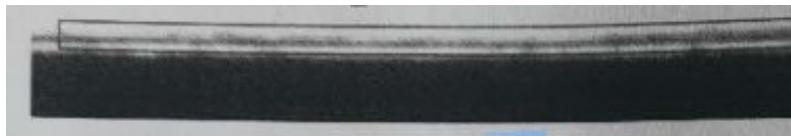

16.下面哪些语句是正确的AD

A using Cognex.VisionPro.ToolBlock；  
B if(toolName $\Bumpeq$ "Locate Models")   
C. string bShowToolStatus $\mathbf { \equiv } =$ "true"   
if(！bshowToolStatus）{.......}  
D.CogToolBlock tb_ResultAnalysis $=$ mToolBlock.Tools["TB ResultAnalysis”]as CogToolBlock

17.在 C#中，以下类型哪些属于引用类型?(C D)

A.Struct--值类型  
B.enum-值类型  
C.Class

D.String

引用类型有：类(class、object、string)、接口(interface)、数组(array)、代理(delegate)

值类型有：整型(byte、sbyte、long、ulong、short、ushort、int、uint)、浮点数类型(float、double)、十进制类型(decimal)、字符类型(char)、布尔型(bool)

18.以下语句说法正确的是(A D)

A.在 C#中，do-while 循环语句至少执行一次  
B.类的构造函数不能带参数  
C.C#中，类可以继承自多个基类  
D.break 语句可以跳出当前循环体

构造函数默认有个无参的，也可以写有参的。

类继承一个父类以及很多个接口

19.下图类 Test 中，Name 属性属于(A)属性

public class Test

```txt
{ Private string_name; public string Name { Get { get是只读，set是只写，二者都有就是读写 Return this._name; } 1   
} 
```

A.只读 B.只写 C.可读写 D，不可读不可写

20.C#中方法是可以重载的，以下关于方法重载说法正确的有(CD)

A.重载的方法，方法名字可以不同19

必须相同，比如Console.WriteLine()括号里可以填19种值，对应的是个同名的不同类型参数类型的方法。

B.重载的方法之间的参数个数必须一致  
不对：可以是不同个参数，不同类型参数，个数相同时类型不能相同。  
C.重载的方法的参数个数可以不一样  
D.重载的方法的参数类型可以不同

21.以下关于 CogPMAlignTool 说法正确的是(AD)

A.CogPMAlignTool 可以通过建模，掩膜等创建模板  
B.一般情况下，相同条件 CogPMAlignTool 的缩放范围越大，它的运行时间越短  
C.基于先进的技术，CogPMAlignTool 的得分在任何情况下和图片上的杂斑没有关系  
D.CogPMAlignTool的模板最好特征唯一，对比度明显，特征轮廓清晰

22.以下说法不正确的是(A D)

A.CogCaliperTool的过滤一半像素值越大，越容易抓边  
B.CogIPOnelmage 支持图像旋转操作  
C.CogBlobTool 可以方便的对结果中斑点的面积进行过滤，以找到满足要求的斑点  
D.CogLineMaxTool 的抓边极性设置和 CogCliperTool 一样，包括由暗到明，由明到暗，任意极性三种 还有一个是混合极性

LineMax 工具的极性主要包括：四种模式，1）明到暗，2）暗到明，3）任一，

即以上两种极性的线段均会拟合，4）混合，区别于任一，其相当于忽略极性，

如下图所示，利用混合模式找到的一条线段可能一半极性是暗到明，另一半极性是

明到暗，而任一模式会将其作为两条线段看待。

23.下面那个关键字修饰的方法参数，可以使方法接受个数可变的参数（ ）A

A.Params B.out C.ref D.static

Params：传参时需放在最后一位，可以自动将最后的所有同类型值放进这个可变长度数组中。

24.在 caliper 工具中，当我们使用单边模式时，以下那些说法是正确(C)

A.任何情况下，边缘对比度越高，分数越高  
B.任何情况下，边缘对比度越高，运行时间越长  
C.默认情况下，Position积分函数方法，边缘越靠近卡尺中线区域，分数越高

D.默认情况下，PositionNeg 积分函数方法，边缘远离搜索方向，分数越高  
25.以下那些因素会对景深产生影响（ABC）  
A.镜头光圈 B.镜头焦距 C.工作距离 D，相机分辨率   
26 哪一个选项中 y 的值最小（B）  
A.int $y = 1 0 0 \% 3 .$ 。B.int y=10%10 C.int y=10%110 D.int y=10%100   
$\%$ 是取余， $\mathsf { A } 1 0 0 \% 3$ 对应的是 33 余 1，y 就是 1.同理，B 的 余数是 0 C 的余数是 10，D 的余数是 10

# 三．判断题。 （每题 2 分，共 10 分）

1.CogPMAlignTool 训练模板参数，精细和粗糙设置得越小运行时间越短。（X）  
2.在 CogBlobTool 中 ， 选取软 阈 值并设 置 合适的 参 数 ， 可 以 有效地降低计 算 Blob 面 积 时 的 空 间 量 化误差。

（Y）ps：会把不完整的像素累加计算，面积更加合理

3.一般情况下，VisionPro 工具计算的结果在图像的像素空间。（Y）  
4.string str=””,string str=null;两语句代表的含义相同。（X）//内容都为空，但是 null 未开辟空间，””是有空间，内容为空。  
5.硬件选型时，镜头的最大兼容芯片尺寸可以小于相机芯片尺寸。（X）  
6.C 型镜头与 CS 型 CCD 之间增加一个 5mm 的 C/CS 转接环可以配合使用。Y  
7.在不更换 CCD 前提下更换大焦距镜头会使视野变大。 N  
8.形态学图像处理膨胀能去除图像中的细小白斑。N  
9.物料如下图所示，白斑宽度为 8 个像素。如需使用此特征作为模板 Coarse 参数可以设置为 8。Y

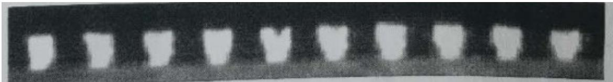

10.图像亮度不够时可以通过减小光圈值，增加光源亮度，延长曝光时间，减小增益等方式进行改善。N  
11.C#中数组元素总和是从0开始，下标可以是整数或者整数表达式Y

eg：int[] nums = { 1, 5, 4, 9, 8}； int n=nums[2]; int n1 $=$ nums[6/3]; 指向的都是索引为 2 结果为 4 的值。

12.CogCheckerBoardTool 可以有效减少镜头畸变导致的误差 Y  
14.减小PMAlign工具的阈值，可以提高运行速度N  
16.CogBlobTool 对于形状多变，明暗对比比较强烈的的特征定位效果比 CogPMAlignTool 要好 Y  
17.定义数组 $\begin{array} { r } { \operatorname { i n t } [ ] a = \{ 1 , 2 , 3 , 4 , 5 \} ; a [ 4 ] = a [ a [ 1 ] ] , } \end{array}$ ，则 $\mathsf { a } [ 4 ] \mathsf { = } 2 .$ a[a[1]] $^ { = 3 }$ 赋值给 a[4], $\mathsf { a } [ 4 ] = 3$   
18.VisionPro中，同一个图片根空间和像素空间的坐标一定相同N  
19.当 framework 中异步模式被勾选时，多个命令可以同时执行。Y  
20.由private修饰的成员,能通过实例化的对象直接在类的外部访问。 $( \mathsf { X } )$ private 私有的，public 公共的  
21.减小 PMAlign 工具的阈值，可以提高运行速度 N

# 四．简答题（50 分）

1.如下图易拉罐压伤检测，请推荐一款适合的光源并画出光路图。(10 分)

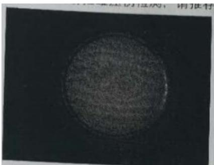

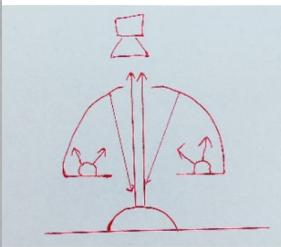  
非同轴漫射光

# 选型计算类：

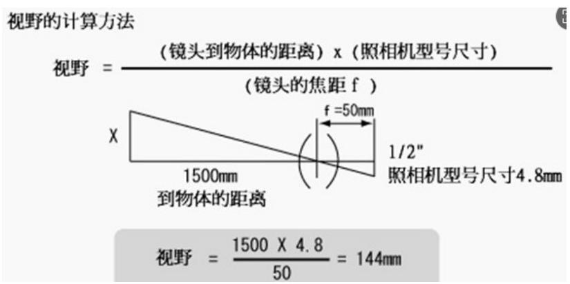

1.飞拍项目在需求沟通阶段需要重点了解设备的哪些参数？在方案阶段做硬件选型时，哪些器件的哪些关键参数/特性需要特别注意的？请展开说明。 7 分）

答：飞拍是指成像系统和被摄物处于匀速相对运动状态下，进行图像采集。需要了解设备的轴运动速度、光学分辨率要求及安装尺寸的限制。

相机选型，第一要求全局快门，第二是最小曝光时间，第三是分辨率，第四是像元大小，第五是帧速；镜头选型，光学分辨率、光圈（亮度）和景深；光源选型，

要求高亮度以满足曝光时间要求。

1.已知如下图所示零件图像视野为 $1 1 6 \mathrm { m m } ^ { \star } 8 6 \mathrm { m m }$ ，所采用 CCD 为 COGNEX CAM-CIC-5000R-14G 芯片尺寸 1/2.5英寸（ $( 5 . 8 \mathsf { m m } \times 4 . 3 \mathsf { m m } )$ ），镜头为35mm定焦镜头，请估算该镜头的工作距离，并计算该图像的像素精度，假设所采用抓边工具精度为1/3像素，请计算测量该工件宽度的测量精度。在本零件的测量中，需要零件边线清晰，请推荐打光方式对其进行测量。（20分）

工作距离：物距*芯片尺寸 $\cdot$ 视野*焦距-------物距 $\cdot$ 视野*焦距/芯片尺寸=116*35/5.8=700mm

像素精度(像素分辨率)：视野/分辨率 $\mathop { : = }$ 116mm/2592=0.0447530864197531mm

测量精度 $\cdot$ 像素精度*工具精度=0.0447530864197531mm*1/3=0.014917695473251mm

打光方式：边线清晰，又对物体表面无检测需求的话，可以用背光，打出来的效果是工件是黑色的，但是零件轮廓边界圆孔很清楚，最适合尺寸测量。

3.已知如下图所示零件图像视野为114mm*86mm，所采用CCD为COGNEX

$( 5 . 8 \mathsf { m m } \times 4 . 3 \mathsf { m m } )$ .镜头为 $3 5 \mathsf { m m }$ 定焦镜头，请估算该镜头的工作距离，并计算该图像的像素精度，假设所采用抓边工具精度为1/3像素，请计算测量该工件宽度的测量精度。在本零件的测量中，需要零件边线清晰，请推荐打光方式对其进行测量。（20分）

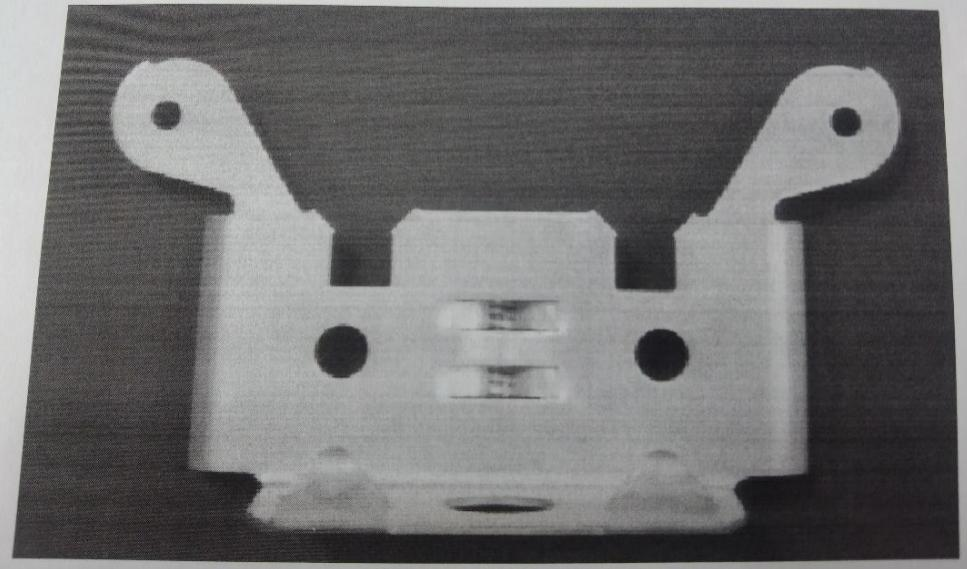

2.如下图所示，被测物体尺寸 $2 0 \mathrm { m m } ^ { \star } 2 0 \mathrm { m m }$ ，相机型号 CAM-CIC-5000R-14-G 靶面尺寸 $5 . 7 { \star } 4 . 3 \mathsf { m m }$ ，工作距离150mm(20 分)

这里未提供视野，相机是个 500w 的分辨率 $2 5 9 2 ^ { \star } 1 9 4 4$ 的相机，那么这里默认视野为 $2 5 ^ { \star } 2 0 \mathsf { m m }$

$\textcircled{1}$ 请估算镜头焦距：焦距 f=5.7mm*150mm/20mm=42.75MM   
$\textcircled{2}$ 计算图像的像素精度:分辨率 2592*1944 25/2592=0.00964mm  
$\textcircled{3}$ 假设所采用抓边工具精度为 1/4 像素，计算测量精度:0.00964mm*1/4=0.00241  
$\textcircled{4}$ 假设物料以 $0 . 5 \mathsf { m } / \mathsf { s }$ 的速度移动，请计算相机理论最大曝光:

不产生拖影的条件是，单位时间内移动距离小于一个像素

原则：速度 $\pmb { 0 . 5 } \pmb { \mathrm { m } } / \pmb { \varsigma } ^ { \star }$ 时间？ $< =$ 路程0.00964（这里是单个像素的尺寸），则成像不会出现拖影

换算下单位： $0 . 5 \mathsf { m } / \mathsf { s } { = } 5 0 0 \mathsf { m m } / \mathsf { s } { = } 0 . 5 \mathsf { m m } / \mathsf { m s }$

最大曝光时间 $\cdot$ 路程/速度=0.00964/0.5mm=0.01928ms

3.相机选型，检测料件大小， $1 2 \mathsf { m m } ^ { \star } 1 0 \mathsf { m m }$ ，要求检测精度 0.01mm/pixel,

速度23件/秒，请问如何选择相机，并给出理由。

$\cdot$ 检测精度0.01mm/pixel，料件大小为 $\_$ ，视野应大于料件大小。  
例如：视野为 $1 6 \mathsf { m m } ^ { \star } 1 2 \mathsf { m m }$ ，则所需相机分辨率：16mm/0.01=1600pixel,12mm/0.01=1200pixel.  
$\textcircled{2}$ 速度为23件/秒，所以帧率应大于等于23帧/s。

则可采用1600*1200分辨率的200w相机，帧率大于等于23帧/s的相机。

4.某项目使用相机 pixel:2592*1944 取像 FOV 是 $9 0 \mathrm { m m } ^ { \star } 6 7 . 5 \mathrm { m m }$ ，相机靶面尺寸 $8 . 8 { \times } 6 . 6 \mathsf { m m }$ ，工作距离 $3 5 0 \mathsf { m m }$ (15 分)

请估算镜头焦距：焦距 $\equiv$ 物距*芯片尺寸/视野 $\mathbf { \sigma } =$ 350mm*8.8mm/90mm 34.222≈

计算图像的像素精度;假设所采用抓边工具精度为1/4像素，计算测量该工件宽度的测量精度：

像素精度：视野/分辨率 90/2592 0.0347222222222222mm≈

测量精度：0.0347222222222222/4=0.0086805555555556mm

5.如下图所示被测物体尺寸 $6 4 \mathsf { m m } ^ { \star } 4 8 \mathsf { m m }$ ，相机型号 CAM-CIC-5000R-14-G 靶面尺寸 $6 . 4 ^ { \star } 4 . 8 \mathsf { m m }$ ，工作距离150mm。(20 分)

$\textcircled{1}$ 请估算镜头焦距：视野*焦距 $\cdot$ 物距*芯片尺寸，焦距 $\stackrel { \cdot } { = }$ 物距*芯片尺寸/视野=150mm*6.4mm/64mm=15mm   
$\textcircled{2}$ 计算图像的像素精度：分辨率： $2 5 9 2 ^ { \star } 1 9 4 4$ 像素精度：视野/分辨率=64mm/2592 0.0247mm≈  
$\textcircled{3}$ 假设所采用抓边工具精度为1/4像素，计算测量该工件宽度的测量精度

64mm/2592*¼ 0.006mm≈

$\textcircled{4}$ 假设物料以 $0 . 5 \mathsf { m } / \mathsf { s }$ 的速度移动，请设计相机理论最大曝光

PS：物体运动拍照，保证不产生拖影的条件为，曝光时间内移动距离小于等于一个像素。

S=vt ：0.5m/s=500mm/s=0.5mm/ms

理论最大曝光时间： $-$

6.已知相机芯片尺寸为 1/2，靶面尺寸为 $6 . 4 \mathrm { m m } ^ { \star } 4 . 8 \mathrm { m m }$ 分辨率为 $6 4 0 ^ { \star } 4 8 0$ ，镜头的最小物距为 $4 0 \mathsf { m m } ,$ ,最大物距为$6 0 \mathsf { m m }$ ，焦距为 $1 2 \mathsf { m m }$ ，如果该项目的精度要求为 $0 . 0 1 \mathsf { m m }$ ，那么单像素的精度是否可以满足精度要求？

答：视野 $^ { \prime = }$ 靶面尺寸*（最小物距~最大物距） $/ 1 2 { = } 6 . 4 \mathsf { m m } ^ { \star }$ （ $4 0 \mathrm { m m } { \sim } 6 0 \mathrm { m m }$ ） $\scriptstyle / 1 2 = 2 1 . 3 3 \sim 3 2 { \mathrm { m m } }$ 所以当物距是40mm 时，视野大约为 21.33mm，物距为 60 时，视野大一些是 32mm

精度 $\circled { = }$ 视野/分辨率，当前的精度为：21.33/640=0.0333mm,32/640=0.05mm,当不同视野大小时，精度对应为0.0333mm~0.05mm 都不满足 $\cdot$ 的精度要求。

7.例如:物体运动速度是 $1 5 0 \mathrm { m m } / \mathrm { s }$ ，沿芯片水平方向运动，相机是 $1 / 2 "$ 芯片 $( 6 . 4 \mathrm { m m } ^ { \star } 4 . 8 \mathrm { m m } )$ 视场水平方向长度是${ 2 0 } \mathsf { m m }$ ，像元尺寸为4.65um，计算成像时不产生的拖影的曝光时间：不产生拖影的条件是，单位时间内移动距离小于一个像素

长边分辨率：6.4mm/4.65um=1376.344pixel

像素分辨率：20mm/1376.344pixel=0.0145312509082032mm

速度：150mm/s=0.15mm/ms

曝光时间=0.0145312509082032mm/0.15=0.0968750060546879ms

不产生拖影的最小曝光时间应该小于等于：0.096ms

8.例如采用相机 CognexCAM-CIC-5000R-14-G，相机芯片尺寸 1/2.5’，芯片大小为 $5 . 7 \mathsf { m m }$ 配合一个 0.5 倍远心镜头，视野大小?

放大倍率 $\cdot$ 芯片尺寸/视野：视野大小=5.7mm/0.5=11.4mm

9.引导项日中，影响整体系统贴合精度的因素有哪些(至少 5 个?

答：机构精度、产品精度、运动过程是否有颤抖、标定、光源效果、计算算法

10.同服模组带动线扫描相机 Y方向移动取像，模组的导程为 16mm伺服模组上通过联轴器直连3600线的编码器，编码器工作在 $\times 2$ 模式下，伺服设定3000脉冲旋转一圈，伺服带动线阵相机移动扫描了 $1 0 0 \mathsf { m m }$ 采集了一副图，一个有效脉冲采集一行，请问这幅图像Y方向有多少个像素?写出推算过程

分析：

模组导程为 $\cdot$ ，意为旋转一圈距离 16mm。

编码器是3600线，工作在 $\cdot$ 模式下，意为旋转一圈16mm应该对应 $3 6 0 0 ^ { \star } 2$ 个脉冲数量。

伺服设定 3000 脉冲旋转一圈，意为当前设定下是 16mm 走一圈对应的 3000 个脉冲。

采集了一张 $\cdot$ 的图像，一个有效脉冲对应了一行图像(一个像素)，所以问的其实就是 $1 0 0 \mathsf { m m }$ 内有多少个脉冲？

3000 脉冲/16mm=187.5 脉冲/mm, 然后 100mm*187.5 脉冲 $\_$ 脉冲，

也就是100mm内对应了18750个脉冲数量，对应了18750个像素。

11. 如 图 ， 视 野 $5 7 \mathrm { m m } ^ { \star } 4 3 \mathrm { m m }$ ， 相 机 型 号 Cognex CAM-CIC-5000R-14-G ， 靶 面 尺 寸 $5 . 7 { \star } 4 . 3 \mathsf { m m }$ ， 工 作距离150mm。

$\textcircled{1}$ 估算镜头焦距   
$\textcircled{2}$ 计算图像的像素精度  
$\textcircled{3}$ 假设所采用的抓边工具的精度为四分之一像素，计算此工件宽度的测量精度。  
$\textcircled{4}$ 假设物料以 $0 . 5 \mathsf { m } / \mathsf { s }$ 速度移动，计算相机理论最大曝光时间。

镜头焦距：物距*芯片/视野=150mm*5.7mm/57mm=15mm

像素精度：57mm/2592pixel=0.02199mm

测量精度：0.02199mm*¼=0.0054976mm

最大曝光时间：曝光时间内物体移动距离应该小于单个像素。

0.02199mm÷0.5m/s=0.02199÷500m/s=0.00004398s=0.04398ms

8、样机采用某某相机（分辨率为 $2 4 4 8 ^ { \star } 2 0 4 8$ ，像元大小为3.45um）和FV2520镜头（ $2 5 \mathsf { m m }$ 焦距镜头），在工作距离 $2 0 0 \mathsf { m m }$ 下实现视野大小是多少（精确到 $\mathsf { m m }$ ）？，计算出图像精度（需要包含计算过程） 。

答：

放大倍率： 芯片/视野 $\cdot$ 像距/物距---25mm/200mm---0.125 倍

视野长：芯片尺寸*长边像素数/放大倍率=3.45um*2448/0.125= 67564.8um=67.5648mm

视野宽：芯片尺寸*宽边像素数/放大倍率=3.45um*2048/0.125= 56524.8um=56.5248mm

像素分辨率（图像精度）：像元尺寸/放大倍率 $\cdot$ 视野长/分辨率长 $\vDash$ 视野宽/分辨率宽 都行：

9、如何对一体轴机构 XYD(R)的走位精度进行拆解，有什么步骤和方法？

答：

1）测试回零精度，X的走位精度，Y的走位精度，D/R的走位精度  
2）测试方法大致如下：

A、回零到拍照位，查看吸笔或者固定的物体在相机中的位置，来回往复10次以上，看回零精度  
B、X轴走位精度， $\cdot$ ，或者-1mm再回到初始位置，来回往复10次以上，查看吸笔或者固定的物体在相机中的位置  
C、Y 轴走位精度， $+ 1 \mathsf { m m }$ ，或者-1mm 再回到初始位置，来回往复10 次以上，查看吸笔或者固定的物体在相机中的位置  
D、D轴走位精度，+0.1,0.3,0.5，1，2度，-0.1,0.3,0.5，1，2度，查看吸笔或者固定的物体在相机中的角度；

10.被测物体长为 $1 0 \mathsf { m m }$ ，宽 6mm，高 3mm，边缘光滑有倒角，要求检测其宽度方向尺寸，检测精度要求$0 . 0 1 \mathsf { m m }$ ，根据要求选择合适的相机，镜头和光源。（10 分）

答：（1）宽度为 6mm，视场 $\mathsf { F O V } { = } 1 0 \mathsf { m m }$ 比较合适，精度要求 $\mathsf { D } { = } 0 . 0 1 \mathsf { m m }$ ，分辨率 F=FOV/D=1000，选择130W（1280*1024）相机，由于只要求测尺寸，不需要颜色识别，选择黑白相机即可

（2）镜头用作测量优先选择远心镜头，130 万相机芯片尺寸为 1/3 英寸，长宽分别为 $\_$ ，放大倍率 M=X/$\mathsf { F O V } { = } 4 . 8 / 1 0 { = } 0 . 4 8$ ，可选择放大倍率为0.5倍的远心镜头。  
（3）考虑到被测物体有一定厚度，且有倒角，精度要求较高，光源选择平行背光源。

11.已知某个项目中使用的是 LYS-GE50-23M 相机，参数为：网口，5MP 2448*2048，23fps，2/3” CMOS 芯片 全局曝光，3.45um 像元。

1）计算相机芯片长宽尺寸大小。  
2）若此项目视野长边为 $1 0 0 \mathsf { m m }$ ，工作距离要求 WD 大于 250mm 且小于 350mm，选用以下哪款常规型号镜头符合安装要求？说明原因。

<table><tr><td>LYL-FA08D-5MP</td><td>8</td><td>1.4-16</td><td>100</td><td>&lt;1%</td><td>M37*P0.5</td><td>C</td></tr><tr><td>LYL-FA12D-5MP</td><td>12</td><td>1.4-16</td><td>150</td><td>&lt;-0.8%</td><td>M30.5*P0.5</td><td>C</td></tr><tr><td>LYL-FA16D-5MP</td><td>16</td><td>1.4-16</td><td>100</td><td>&lt;0.1%</td><td>M30.5*P0.5</td><td>C</td></tr><tr><td>LYL-FA25D-5MP</td><td>25</td><td>1.4-16</td><td>200</td><td>&lt;0.2%</td><td>M30.5*P0.5</td><td>C</td></tr><tr><td>LYL-FA35D-5MP</td><td>35</td><td>1.4-16</td><td>200</td><td>&lt;-0.4%</td><td>M37*P0.5</td><td>C</td></tr><tr><td>LYL-FA50D-5MP</td><td>50</td><td>1.4-16</td><td>300</td><td>&lt;-0.1%</td><td>M37*P0.5</td><td>C</td></tr></table>

答：

芯片尺寸长为：2448*3.45um=8445.6um=8.4456mm

芯片尺寸宽为： $-$

计算焦距：工作距离要求在250mm-350mm之间求合适的焦距

焦距(像距)/物距 $\varXi$ 芯片尺寸/视野 →→→→焦距 $\vdots =$ 芯片尺寸/视野*物距(250mm-350mm)

物距为 250mm：8.4456mm/100mm*250mm=21.114mm

物距为 350mm：8.4456mm/100mm*350mm=29.5596mm

因工作距离为250mm-350mm 所以焦距范围应在21.114mm-29.5596mm所以选择25mm焦距的镜头按题目提供的型号，选择LYL-FA25D-5MP这个。

# 工具、软件

1.参数解释，解释如下图中最大线数，角度容差，长度阈值，距离容差的意思。（15分）

最大线数：您要工具定位的最大行数。

角度容差：找到的线段的旋转量可能与您指定的预期角度不同。较低的值将强制工具定位与梯度搜索方向更平行的线段。

长度阈值：设置找到的线段的最小可接受长度。

距离容差：内线和拟合线之间的最大允许距离。随着您增加边缘距离公差，您可以允许该工具将更多边缘点视为内部并更改找到的线的位置。

角度容差(上边值为 15 的)：边缘点渐变方向与法线垂直的最大允许角度差。增大此值可使工具将更多的边缘点视为内点，从而更改找到的线段的位置。

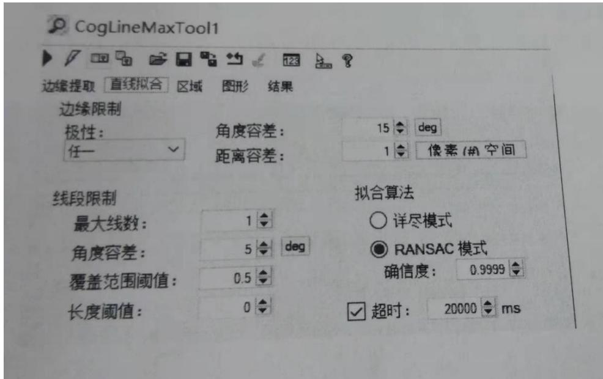

1.请画出下面两种棋盘格标定之后的坐标系《原点，x，Y)

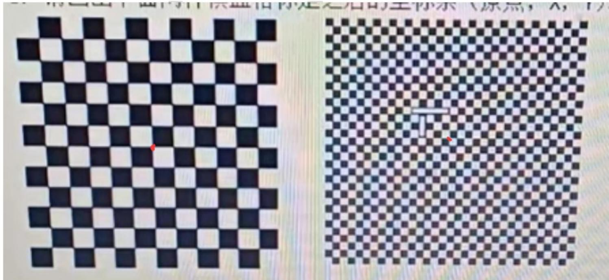

按照 CalibCheckboardTool 工具的标定参数设定：

左图没有基准符号的情况下原点在视野中心。即图中标记红点位置

右图基准符号是rect矩形的情况下原点在两个矩形尽端交点位置。即图中标记红点位置

如果是 DataMatrix 码，其原点应在，读出的 2-3 码内包含的坐标信息后计算其原点位置

2.利用 VisionPro 进行取相时出现如下报错提示，请给出解决思路。(至少 3

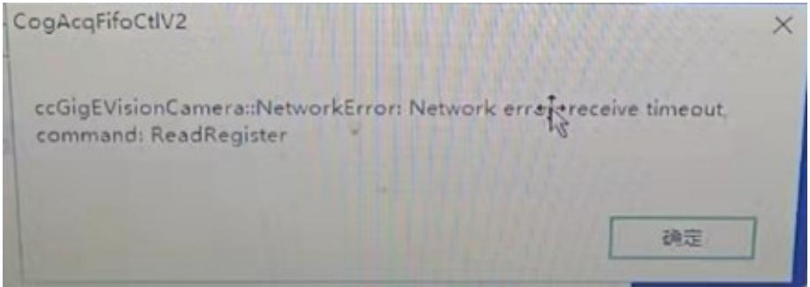

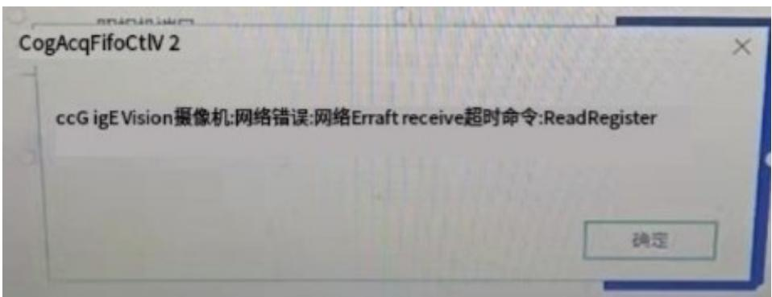

参考：

$\cdot$ 取像失败：触发模式为硬触发，给了指令未给触发信号导致超过超时期还未取像。需要给完拍照指令后给触发信号。  
$\textcircled{2}$ 取像失败：相机掉线，断电重启相机。  
$\cdot$ 取像失败：相机IP地址异常、设定相机IP地址、修改巨帧数据包、关防火墙、勾选ebus选项。

3.简述一下相机成像过程中坐标系的转换。

参考：来自某技术小组人员：

世界坐标 (3D) --(外参 R, T)- $_ - >$ 相机坐标 (3D) --(透视投影 / 内参 K)--> 理想图像坐标 (2D) --(畸变校正)--> 实际图像坐标 (2D) --(离散化)- $\cdot$ 像素坐标 (2D)

DeepSeek:

世界点 (Xw, Yw, Zw) --(外参：R, T)- $_ - >$ 相机点 (Xc, Yc, Zc) --(透视投影：f)--> 图像物理点 (x, y) --(内参：fx, fy, u0, v0)-->像素点 (u, v)

4.左图为原始图，转为右边图像后，分别使用了那些形态学操作，并说明形态学调整的作用。

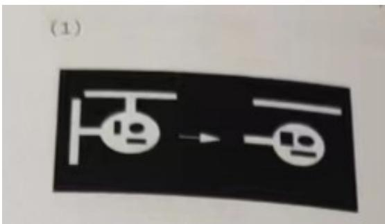

水平方向1x3腐蚀操作，将水平方向的白色斑点消除，黑色斑点变大。

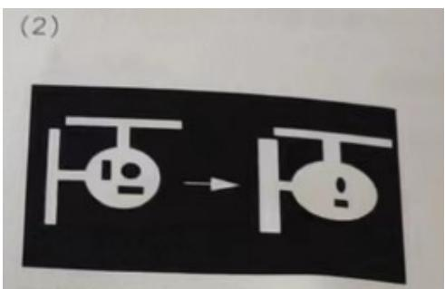

水平方向1x3膨胀操作，水平方向白色斑点变大，黑色斑点变小。

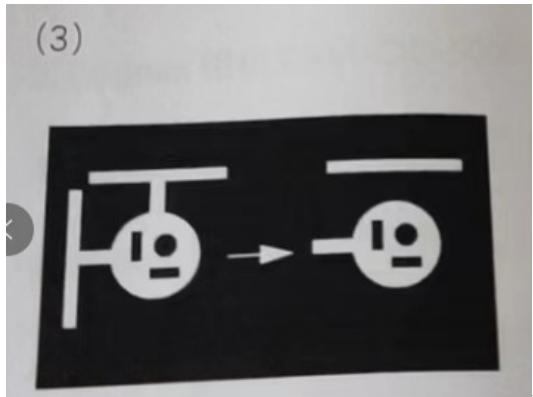

水平方向1x3开运算，先腐蚀后膨胀，腐蚀时将白色斑点去除，黑色区域变

大，膨胀时，将变大的黑色区域恢复原样。

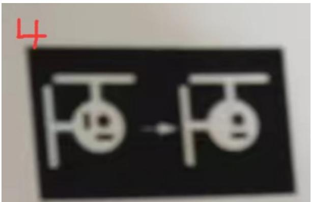

水平方向 1x3 闭运算，先膨胀后腐蚀，膨胀时将水平方向黑色斑点去

除部分，黑色区域变大，腐蚀时，将变大的白色区域恢复原样。

# PS：

腐蚀:以结构元中所有像素灰度值的最低值，替换中心像素的灰度值。

作用:减小斑点，增大空洞。------直白点:黑色区域变大，白色区域变小。

膨胀:以结构元中所有像素灰度值的最高值，替换中心像素的灰度值。

作用:减小空洞，增大斑点。------直白点:黑色区域变小，白色区域变大。

开运算:先进行腐蚀运算，再进行膨胀运算。

作用：维持空洞，去除斑点。

闭运算:先进行膨胀运算，再进行腐蚀运算。

作用:维持斑点，去除空洞。

5.工厂为提高效率，欲将静止检测项目改为运动中检测，请给出两个CCD方面的改善建议？

# 代码类：

```txt
1.仔细阅读如下代码，请问什么情况下该ToolBlock的输出中“Result”的结果为true(10分)public overzxide bool GroupRun(ref string message,ref CogToolResultConstants result1{//To let the execution stop in this script when a debugger is attached,uncommeithe following lines//if DEBUG{//System.Dsagnostics.Debuggex.Launch()System.Diagnostica,Debugger.Break();{//endifthis.Outputs.Result=false; //初值false 
```

foreach(ICogTool tool in Tools)   
{ //RunTool_tool,ref message,ref result) If(tooll.Name.Controls("CogPMAignTool"))//当工具名为模板工具时 { CogPMAignTool pMAignTool $\equiv$ tool as CogPMAignTool; Tool. Run(); If(pMAignTool.Results! $\equiv$ null&&pMAignTool.Results.Count>0&&pMAignTool.Results [0].Score $>$ this.Inputs.InputScore)//模板工具结果不为空，且结果数量 $>0$ 且工具第0个结果得分大于给定的值 { This.Outputs.Result $\equiv$ ture; //此时输出为true并break跳出foreach循环。 Break; } } Else if(tooll is CogHistogramTool) //如果工具是Histogram工具 { CogHistogramTool histogramTool $\equiv$ tool as CogHistogramTool; histogramTool. Run(); If(histogramTool.Result..StandardDeviation $\rightharpoondown$ this.Inputs.dGreyLimitDeviation) //当直方图工具的标准差大于设定值 { This.Outputs RESULT $\equiv$ true; //此时输出为true } }   
} Return false; n

参考：如果模板工具运行成功，并且模板工具结果数量大于0，并且模板工具的第一个结果的得分得大于设定的输入的InputScore的值输出的结果为true。或者灰度直方图工具的标准差值大于输入的dGreyLimitDeviation的值，输出的结果为true。

# 2.等比数列求和

$a_{n} = a_{1} * q^{n - 1}, a_{2} = 3, q = -1.$

编写主体函数输出前n项总和。

$a_{n} = a_{1}*q^{n - 1},a_{1} = 3,q = -1$

编写主体函数输出前项总和

答：

等比数列求和公式为 $\mathbf { S } _ { n } = \frac { \ b { a } _ { 1 } ( 1 - \ b { q } ^ { n } ) } { 1 - \ b { q } }$

前提是q不为1，题目给的-1满足要求。

Console.WriteLine("请输入 n 的值");

```javascript
int n = int.Parse(Console.ReadLine()); 
```

```javascript
int a1 = 3, q = -1; 
```

```lisp
double sum=0;   
for (int i = 0; i < n; i++)   
{ if (i == 0) { sum = 0; } else if (i%2==0)//偶数 { sum = a1 * (1 - Math.Pow(-1, i)) / (1 - q); } else { sum = a1 * (1 - Math.Pow(-1, i)) / (1 - q); } sum += sum;   
} Console.WriteLine(sum);   
Console.ReadKey(); 
```

//输入0输出0，输入奇数输出0，输入偶数输出6

3.请设计一个方法，接受一个 List<int>类型的参数，并且可以一次得到该集合的最大值和最小值。（15 分）

参考：

需要设计一个从 int 集合里拿最大最小值的方法，然后需要接收一个集合，可能需要用特殊符号分隔开填入的 int类型的各个值。需要String的Split函数来分割。同时设计的这个方法需要有2个返回值，那么需要ref或者out来实现多个返回值。

$\textcircled{1}$ 用 ref ：特点是可以多个返回值，方法外需要赋初值。

```cs
static void Main(string[] args) //Main 函数
{
    Console.WriteLine("输入一些整数，用英文的“,”号来隔开”); //输入整数集合。逗号分割各个整数
    string str = Console.ReadLine();
    int max = intMinMax;
    //把 int 类型最小值赋给 max 当做最大值
    int min = intMinMax;
    //把 int 类型最大值赋给 min 当做最小值
    string[] str = str.Split〔,〕);
    //把 String 类型的字符串用,分割为 String[])
    GetMinMax(strs, ref max, ref min); //调用写好的方法,传入需要改变的 max 和 min 参数
    Console.WriteLine("\\当前输入的整数集合中的最大值为\{max\},最小值为\{min\}",//打印需要的结果
    Console.ReadKey();
}
public static void GetMinMax(string[] str, ref int max, ref int min)//传参一个 String[]，两个 int 变量
{
    for (int i = 0; i < str.Length; i++) 
    {
        if (Convert.ToInt32(str[i]) > max) //从 String[] 中拿值需要强转为 int 类型,并做判断
        {
            max = Convert.ToInt32(str[i]);
        }
        else if (Convert.ToInt32(str[i]) < min)
        {
            min = Convert.ToInt32(str[i]);
        }
    }
}
```

$\textcircled{2}$ 用 out ：:特点是可以多个返回值，方法外不可以赋初值。需要方法内赋值。

static void Main(string[] args) //Main 函数

{

Console.WriteLine("输入一些整数，用英文的“,”号来隔开");

//输入整数集合。逗号分割各个整数

```txt
string str1 = Console.ReadLine(); 
```

```txt
int max1; //把int类型最小值赋给max当做最大值 
```

```txt
int min1; //把int类型最大值赋给min当做最小值
```

```javascript
string[] strs1 = str1.Split('','); //把 String 类型的字符串用,分割为 String[] 
```

```javascript
GetMaxMin1(strs1, out max1, out min1);//调用写好的方法，传入需要改变的max和min参数
```

```javascript
Console.WriteLine("当前输入的整数集合中的最大值为{max1},最小值为{min1}");
```

```txt
//打印需要的结果
```

```javascript
Console.ReadKey(); 
```

}

```txt
public static void GetMaxMin1(string[] str, out int max1, out int min1) 
```

//传参传进来一个 String[]，两个 int 变量

{

```javascript
max1 = 0; 
```

```javascript
min1 = 0; 
```

```txt
for (int i = 0; i < str.Length; i++) 
```

{

```txt
if (Convert.ToInt32(str[i]) > max1)//从 String[]中拿值需要强转为 int 类型,并做判断
```

{

```txt
max1 = Convert.ToInt32(str[i]); 
```

}

```txt
else if Convert.ToInt32(str[i]) < min1) { min1 = Convert.ToInt32(str[i]); } } 
```

4.知道 $a b c + c b a = 1 3 3 3$ ，其中 abc 均为一位数，编程求出满足条件的 abc 的所有组合

参考：

方法 $\textcircled{2}$

```txt
for (int a = 0; a < 10; a++)  
{  
    for (int b = 0; b < 10; b++)  
{  
    for (int c = 0; c < 10; c++)  
{  
        if (Convert.ToInt32(a.ToString() + b.ToString() + c.ToString()) + Convert.ToInt32(c.ToString() + b.ToString() + a.ToString())) == 1333)  
        {  
            Console.WriteLine("\\当 abc+cba=1333 时, a 的值为{a},b 的值为{b},c 的值为{c}.");  
        }  
    }  
}  
Console.WriteLine("");
```

方法 $\textcircled{1}$

```c
for (int a1 = 0; a1 < 10; a1++)  
{  
    for (int b1 = 0; b1 < 10; b1++)  
{  
        for (int c1 = 0; c1 < 10; c1++)  
{ 
```

```javascript
if (a1 * 100 + b1 * 10 + c1 + c1 * 100 + b1 * 10 + a1 == 1333)  
{Console.WriteLine("\\"当abc+cba=1333时，a1的值为{a1},b1的值为{b1},c1的值为{c1}.");}  
}  
}  
}  
Console.ReadKey();
```

5.写出下列函数计算出的表达式

int recursive(int i)   
{ int sum $= 0$ if $(0 == \mathrm{i})$ { return(1); } else { sum=i\*recursive(1-i); return sum; }

//递归：函数自己调用自己，当达到某个条件后终止递归。

当 $\scriptstyle { \mathrm { i } } = 0$ 时，sum=1，当 $\mathrm { i } = 1$ 时，sum=1，当i为其它值时会陷入死循环

6.设计一个方法，该方法接受一个int型数组的参数，返回数组中出现次数最多的数,如果有出现次数相同的情况,返回数组中第一个出现的数。(例如[10.9,8,8,5]

应该返回 8，数组[10.9.8,7}应该返回 10)(15 分)

参考：

$\cdot$ 默认整数数组

int $\mathtt { a } = 0$ , $\scriptstyle \mathtt { b } = 0$ , $\mathtt { c } { = } 0 ; / / \mathtt { a }$ 用来当前某个值出现的次数，b存出现最多的次数，c存存次数最多的对应的值

int[] nums $=$ { 1,2,3,4,5,7,7,7,7,7,8,8,8,8,8,9,9,9,0,0,0,0,0,11,11,11};

Get1(nums, a, b, c);//调用方法，这里用了重载，

```txt
public static void Get1(int[] nums,int a,int b,int c) { for (int i = 0; i < nums.Length; i++) { 
```

$\cdot$ 自定义数组  
```javascript
a = 0;
for (int j = 0; j < nums.Length; j++) {
    if (nums[i] == nums[j])//拿某个值和别的所有值挨着对比，一样了就计数重复次数+1
        a++;
    }
    if (a > b)//一旦某个值出现次数比原本统计最高次数还多，那么这个值就是出现最多的
        b = a;//刷新了最高出现的次数。
        c = nums[i];
    }
} Console.WriteLine($"当前这个数组中{c}这个值出现次数最多,出现了{b}次");
}
```

}//方法  
7.求数组内最大最小值  
```cs
Console.WriteLine("输入一组整数,用','隔开");
string str = Console.ReadLine(   );
string[] strs = str.Split(   );
int a1 = 0, b1 = 0, c1 = 0;
Get1(strs, a1, b1, c1);
public static void Get1(string[] strs, int a1, int b1, int c1)
\{
	for (int i = 0; i < strs.Length; i++) \{
		a1 = 0;
		for (int j = 0; j < strs.Length; j++) \{
			if (Convert.ToInt32(strs[i]) == Convert.ToInt32(strs[j]))//拿某个值和别的所有值挨着对比,一样了就计数重复次数+1
				\{
					a1++;
				\}
				if (a1 > b1)//一旦某个值出现次数比原本统计最高次数还多,那么这个值就是出现最多的
						\{
							b1 = a1;//刷新了最高出现的次数。
							c1 = Convert.ToInt32(strs[i]);
						\}
						\}//for
						\}//for
Console.WriteLine(\$ "当前这个数组中\{c1\}这个值出现次数最多,出现了\{b1\}次"); 
```

求 int 类型数组最大最小值(3,2,5,15,-3,-412,643,6,1,432,-321,44,32)

$\cdot$ int[] number={3,2,5,15,-3,-412,643,6,1,432,-321,44,32};//声明一个 int 类型数组将题目提供的数组放进去

int max=int.MinValue;//int.MinValue 是 int 类型最小的一个值，把它作为最大值赋给 max，后边比较任意数肯定都

//比他大。或者根据数组内容自定义一个比最小值还要小的值例如-999

int min=int.MaxValue;//int.MaxValue 是 int 类型最大的一个值，把它作为最小值赋给 max，后边比较任意数肯定都

//比他小。或者根据数组内容自定义一个比最大值还要大的值例如999

```javascript
for(int i=0;i<numnumber.Length-1;i++)//for 循环，循环次数为数组长度-1（因为例如5个数数组长度为5，索引为 01234)  
{  
    If(number[i]>max)//判断如果数组里索引为i的数比max的值还大，  
    {  
        max=newnumber[i);//判断满足条件，则将数组里第i位的数赋值给max。循环完获得最大的值。  
    }  
    If(number[i]<min)//判断如果数组里索引为i的数比max的值还小，  
    {  
        min=newnumber[i];//判断满足条件，则将数组里第i位的数赋值给min。循环完获得最小的值。  
    }  
}
```

8.对下列数组进行排序,从大到小{3,2,5,15,-3,-412,643,6,1,432,-321,44,32}

1).冒泡排序：

$\textcircled{1}$ 将数组第 $\mathsf { n }$ 和 $n { + 1 }$ 位数值对比，比它小就交换两个数值，直到和最后一位对比并判断后，此时最小值在最右边。  
$\textcircled{2}$ 将数组第 $\mathsf { n }$ 和 $n { + 1 }$ 位数值对比，比它小就交换两个数值，直到和倒数第二位对比并判断后，此时第二小的值在从右往左第二位。以此类推

int[] number = { 3, 2, 5, 15, -3, -412, 643, 6, 1, 432, -321, 44, 32 };//声明 int 类型数组存这组数据   
int[] number1 $= \{ 3 , - 7 , 5 , - 9 , 8 \} ;$ ：  
Array.Sort(number1);//Array 数组方法，Sort 从小到大排序。此时 number1={-9,-7,3,5,8}  
Array.Reverse(number1); // reverse 是颠倒。此时 number1 $=$ {8,5,3,-7,-9}  
```txt
for (int i = 0; i < number.Length - 1; i++) //for 循环次数  
{  
    for (int j = 0; j < number.Length - 1 - i; j++)  
{  
    if (number[j] < number[j + 1])  
{  
        int temp = number[j];  
        number[j] = number[j + 1];  
        number[j + 1] = temp;  
    }  
} 
```

2).选择排序---可以看思路，自己做下试试。

//选择排序思路：从数组里选第一位当最小/大看待，然后和后边每一位比较看他是否是最小/大，

//不是则把实际最小/大的索引给到num这个变量，然后嵌套的循环比较完每一个值之后交换最小/大值放在i位值。

//以此方法把值从小到大，或者从大到小，从左到右挨着拿到。

//外层循环i次数要＜长度－1因为例如长7，i取值为0 1 2 3 4 5.

//内层循环j：起始位置为 $\mathsf { i } + \mathsf { 1 }$ ，每次都从i后1为开始比较，比较到最后一位，长7，最后一位索引应是6

//每次嵌套循环之后需要把拿到的最小/大的索引值和数组里i位置交换。

2).方法