# L4： 需要熟练使用脚本调用工具，实现复杂视觉算法搭建视觉系统，根据客户需求确定项目实施方案。

# 目录

# 考试大纲.. 2

# 一、Vision Tools：

1.C#简单脚本基础介绍..  
2.脚本调试。  
3.工具调用及参数的输入输出。  
4.VPP 界面显示(Inspection 输入输出的介绍)-参考以及机试操作..  
5.循环排序-具体详细介绍参考C#基础文档..   
6.Help 的查询。 8

# 二、 Framework 介绍-参考 C#第二阶段培训文档-视频.. 8

1.框架介绍... 8   
2. Machine Support 各个模块的介绍：光源模块、通讯模块、Vpp 模块儿... .14  
3. Visual Studio 的调试方法。 .14  
4.Inspection 的添加... . 15  
5.通讯协议的修改。 .15   
6.VPP 数据传递。 .. 16  
7.相机调用... . 16   
8.标定模块的设置和添加。-参考第二阶段视频.. 1  
9.设备映射逻辑介绍。-参考第二阶段视频. 17  
10.设备通讯逻辑介绍、-参考第二阶段视频. . 17  
11.数据收集模块-参考第二阶段视频.. 17  
12.跑图的设置。-参考第二阶段视频.. .17

# 三、Dataman 脚本调试与修改。 .17

1.多码调试应用.. . 17   
2.选型.. . 17   
3.码密度计算.. . 19   
4. ID脚本参考-3V验证器评判标准. .. 20

# 机器视觉维护与应用技能等级要求--工作领域.. . 24

# 一、机器视觉系统方案评估... .. 24

1. 相机选型.. . 24  
2. 镜头选型.. . 25   
3. 光源选型： . 26  
4.精度计算.. . 27   
3D视觉系统图像处理. . 27  
5.光源安装位置设计.. ..28  
6. 相机、镜头安装位置设计.. . 28  
7. 项目风险评估.. .28   
8. 确认视觉方案文档.. .28

# 二、视觉系统集成与应用. .29

1视觉系统集成.. .29   
2视觉系统编程.. .29  
3视觉系统调试.. .29

# 考试大纲

# 一、Vision Tools：

# 1.C#简单脚本基础介绍

参考文件夹内C#基础的TXT文档。

# 2.脚本调试。

参考机试操作

# 3.工具调用及参数的输入输出

参考PMAlign工具示例以及机试操作

$\textcircled{1}$ 设定运行参数：RunParams

pmaRunParams.AcceptThreshold $= 0.6$ //运行参数界面接受阈值  
pmaRunParams.ApproximateNumberToFind $= 3$ //运行参数界面，查找概数。  
pmaRunParams.AutoEdgeThresholdEnabled $= \mathrm{true}$ //运行参数界面，自动边缘阈值。  
pmaRunParams.EgeThreshold $= 20$ //运行参数界面，自动边缘阈值。  
pmaRunParams.CoarseAcceptThresholdEnabled $= \mathrm{false}$ //运行参数界面，粗糙度接受阈值法启用/不启用  
pmaRunParams.CoarseAcceptThreshold $= 0.34$ //运行参数界面，粗糙度接受阈值为0.34  
pmaRunParams.ContrastThreshold $= 11$ //运行参数界面，对比度阈值。  
int n=pma RunParams.ChangedEventSuspended;  
pma RunParams.GrainLimitsUsePattern $= \mathrm{false}$ //运行参数界面的自动粒子模式限制开关。  
pma RunParams.GrainLimitFine $= 1$ //运行参数界面粒度参数下限 精细  
pma RunParams.GrainLimitCoarse $= 2$ //运行参数界面粒度参数上限 粗糙  
pma RunParams.HasChanged $= \mathrm{true}$ pma RunParams.OutsideRegionThreshold $= 0.1$ //搜索区域界面下的区域以外计分参数，特征阈值  
pma RunParams.OwnedFlexParams.ControlPointsX $= 6$ pma RunParams.RunAlgorithm $= \mathrm{CogPMAlignRunAlgorithmConstants.PatQuick}$ //运行参数界面的几  
PatMaxPerspective.PatMax.PatFlex.BestTrained  
pma RunParams.RunMode $= \mathrm{CogPMAlignRunModeConstantsSearchImage}$ //运行参数界面模式：RefineStartPose  
pma RunParams.ScoreUsingClutter $= \mathrm{false}$ //运行参数界面计分时考虑杂斑选项  
//pma RunParams.SearchImageMask;//获取搜索图像相关信息。

pma.RunParams.SearchRegionMode $=$ CogRegionModeConstants.PixelAlignedBoundingBoxAdjustMask;//搜索区域下区 域模式.AffineTransform.PixelAlignedBoundingBox

pma.RunParams.Timeout = 5000;//运行参数界面 超时

pma.RunParams.TimeoutEnabled $=$ false;////运行参数界面 超时选项

pma.RunParams.XYOverlap $= 0 . 7$ ;//运行参数界面 XY 重叠参数。

pma.RunParams.ZoneAngle.High=0.6;//单位弧度运行参数界面，角度缩放相关：.Overlap 重叠.Nominal 标称值.Low 下限.High 上限

pma.RunParams.ZoneScale.High=1.2;//运行参数界面，整体缩放相关：.Overlap 重叠.Nominal 标称值.Low 下限.High 上限

pma.RunParams.ZoneScaleX.High $_ { 1 } = 1 . 2$ ;//运行参数界面...

pma.RunParams.ZoneScaleY.High $_ { 1 } = 1 . 2$ ;//运行参数界面...

# $\textcircled{2}$ 设定训练参数：Pattern

pma.Pattern.AutoEdgeThresholdEnabled $=$ false;//训练参数里自动边缘阈值开关。

pma.Pattern.EdgeThreshold = 11;//训练参数里自动边缘阈值取值设定。

pma.Pattern.Elasticity = 0.1;//训练参数里弹性参数取值设定。

pma.Pattern.ExpectedDeformationRate $= 0 . 5$ ;//取值 0-1 不清楚是什么参数。

pma.Pattern.GrainLimitAutoSelect $=$ false;//训练参数界面的自动粒子模式限制开关。

pma.Pattern.GrainLimitFine = 1;//训练参数界面粒度参数下限 精细

pma.Pattern.GrainLimitCoarse = 2;//训练参数界面粒度参数上限 粗糙

pma.Pattern.IgnorePolarity $=$ false;//训练参数下忽略极性开关。

pma.Pattern.HighSensitivityParameter $= 1$ ; //训练参数下高灵敏度参数。取值范围 1-10

pma.Pattern.RepeatingPatterns $=$ false;//训练参数下重复模式

pma.Pattern.TrainAlgorithm $=$ CogPMAlignTrainAlgorithmConstants.PatQuick;// 训 练 参 数 下 训 练 的 算法.PatMaxPerspective.PatMaxHighSensitivity.PatMaxAndPatQuick.PatMax.PatFlex

pma.Pattern.TrainMode= CogPMAlignTrainModeConstants.Image;// 三 种 训 练 模

式.ShapeModelsWithTransform;.ShapeModelsWithImage.Image

pma.Pattern.TrainRegionMode $=$ CogRegionModeConstants.PixelAlignedBoundingBoxAdjustMask;// 训 练 区 域 模式.PixelAlignedBoundingBox.AffineTransform

# $\textcircled{3}$ 搜索区域：SearchRegion

//eg：一般 会搭配循环使用，比如设定固定的搜索区域一次搜索一个区域。通过几行几列把所有区域都搜索过来一遍。

CogRectangle rect2 $=$ new CogRectangle();

```c
for (int i = 0; i < 5; i++)  
{  
    for (int j = 0; j < 5; j++)  
{ 
```

//起点 $^ +$ 长宽方式创建矩形

rect2.SetXYWidthHeight(0+100*j,0+i*100, 100, 80);//先水平方向平移 4 次一次 100。然后到第二行，再水平平移100距离四次，共计25个搜索区域。

pmaSEARCHRegion $=$ rect2;   
pmaRUN();

System.Threading.Thread.Sleep(30);//可以加个休眠，算是延时。可以帮助看 25 个位置是否合适。 单位 ms}}

CogRectangle rect $=$ new CogRectangle();

rect.SetCenterWidthHeight(150, 150, 150, 130);//中心+长宽方式创建矩形

pma.SearchRegion $=$ rect;

# $\textcircled{4}$ 拿结果：Results

pma.Run();

int pmacount=pma.Results.Count;//获取结果数量。

double n1= pma.Results[0].Clutter;//杂斑

double $\mathsf { n } 2 \mathsf { = }$ pma.Results[0].Contrast;//对比度

double $\mathsf { n } \mathsf { 3 } \mathrm { = }$ pma.Results[0].Coverage;//范围

bool $\mathsf { n } 4 =$ pma.Results[0].FineStage;//精细阶段

double $\mathsf { n } 5 \mathrm { = }$ pma.Results[0].FitError;//拟合误差

double $\mathsf { n } 6 =$ pma.Results[0].ID;//索引 序号

double $\mathsf { n 7 } =$ pma.Results[0].MaxCoarseAcceptThreshold;//最大粗接受阈值

double ${ \mathsf { n } } 1 0 =$ pma.Results[0].OutsideRegionAreaProportion;//外部区域占比

double $\mathsf { n } \mathtt { 1 1 } \mathtt { = }$ pma.Results[0].OutsideRegionFeatureProportion;//外部区域特征。

double $\mathsf { n } \mathsf { 1 2 } \mathsf { = }$ pma.Results[0].Score;//第 0 项结果的分数。

double ${ \mathsf { d } } 1 =$ pma.Results[0].GetPose().Rotation;//第 0 项结果的弧度

double ${ \mathsf { d } } 2 =$ pma.Results[0].GetPose().Scaling;//第 0 项结果的整体缩放

double ${ \mathsf { d } } 3 =$ pma.Results[0].GetPose().ScalingX;//第 0 项结果的 X 缩放

double ${ \mathsf { d } } 4 =$ pma.Results[0].GetPose().ScalingY;//第 0 项结果的 Y 缩放

double ${ \mathsf { d } } 5 =$ pma.Results[0].GetPose().Skew;//第 0 项结果的倾斜

double ${ \mathsf { d } } 6 =$ pma.Results[0].GetPose().TranslationX;//第 0 项结果的坐标 X

double ${ \mathsf { d } } 7 =$ pma.Results[0].GetPose().TranslationY;//第 0 项结果的坐标 Y

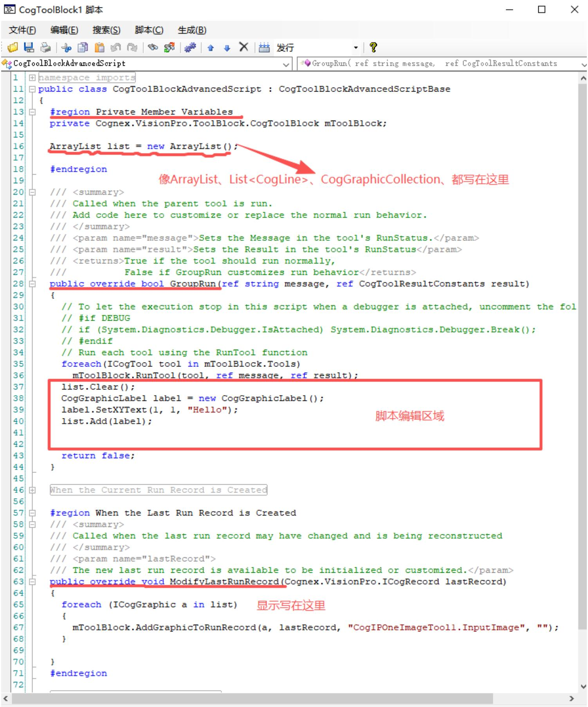

ArrayList list=new ArrayList();//存文本、存圆、线、等等。 泛型集合

List<CogLine> list_line=new List<CogLine>();//存线

CogGraphicCollection gc=new CogGraphicCollection();//存文本、存圆、线、等等。

后边一般要跟上清除/清空。比如：

list.Clear(); list_line.Clear(); gc.Clear();

然后可以写文本、圆、线等要显示的对象及添加进提前写好的存储显示内容的集合中：

CogGraphicLabel label $=$ new CogGraphicLabel(); //new 个存文本的对象，

label.Alignment $=$ CogGraphicLabelAlignmentConstants.TopLeft;//指定存储位置为设定 XY 的某个比如左上、中心等位置。

label.Color $=$ CogColorConstants.Red; //指定字体颜色

label.SetXYText(x, y, s);//指定要显示的位置以及内容。

list.Add(label);//把写好的这个文本对象加进提前写好的集合中。

然后显示出来：同样的可以写显示文本、圆、线等。也可以全写一起(建议用这一种。)

# 显示文本：

```txt
foreach (CogGraphicLabel a in list)//只可以显示List里文本部分，前提是List里放的有文本。  
{mToolBar.AddGraphicToRunRecord(a,lastRecord, "CogIPOnImageTool1.InputImage", "",);}  
foreach (CogCircle a in list)//只可以显示List里圆部分，前提是List里放的有圆。  
{mToolBar.AddGraphicToRunRecord(a,lastRecord, "CogIPOnImageTool1.InputImage", "",);}  
foreach (CogLine a in list)//只可以显示List里圆部分，前提是List里放的有线。  
{mToolBar.AddGraphicToRunRecord(a,lastRecord, "CogIPOnImageTool1.InputImage", "",);}  
foreach (ICogGraphic a in list)//全显示，不需要考虑里边放了什么  
{mToolBar.AddGraphicToRunRecord(a,lastRecord, "CogIPOnImageTool1.InputImage", "",;} 
```

# $\textcircled{2}$ 灵活运用：

CogGraphicLabel myLabel $=$ new CogGraphicLabel();//模板(放上多个文本中相同的，不需要再次修改的内容，比如多个文本虽有不同，但是都显示在同一个空间、比如字号都相同、比如背景色始终相同。)

CogGraphicLabel myLabelTmp $=$ new CogGraphicLabel();//这个是根据实际效果，可以先复制前边的模版，省去多个文本相同部分的脚本编辑，然后再自定义其它不同的脚本(颜色、字体等)。

//这里定义文本模板： 比如都显示在#空间下，颜色都是绿色字体，文本是宋体 字号30

myLabel.Alignment $=$ CogGraphicLabelAlignmentConstants.BaselineLeft;

myLabel.SelectedSpaceName $=$ "#";

myLabel.Color $=$ CogColorConstants.Green;

myLabel.Font $=$ new Font(“宋体”,30);

//这里是具体的某个文本，先复制模板内容，然后添加进显示具体位置，然后存进集合。

myLabelTmp $=$ myLabel.Copy(CogCopyShapeConstants.All);

myLabelTmp.SetXYText(x_Init, y_Init $^ +$ y_step * nRow++, "DeltaXTop $\mid =$ " $^ +$ DeltaXTop.ToString("f3"));

labelList.Add(myLabelTmp);

参考 VisionPro 文档：CogGraphicLabel 属性界面：

$\textcircled{3}$ 相对高级应用(最实用)：尤其是需要多个显示，以及需要根据某些条件来判定显示OKNG/绿色红色等。

public void Graphic(double x, double y, string s, bool b)

//自定义显示方法需要传显示位置XY，显示文本s，根据判定条件拿到的ture或者false{CogGraphicLabel label $=$ newCogGraphicLabel();label Alignment $\equiv$ CogGraphicLabelAlignmentConstants.TopLeft;label.Color $= \texttt{b} = =$ false？CogColorConstants.Red：CogColorConstants.Green;//根据true和false对应绿色红色label.SetXYText(x,y,s+（ $\mathsf{b} = =$ false？"NG":"OK”）);//根据true和false对应显示OKNGlist.Add.label);1

调用：Graphic(0, 100, "中间弹片：", false); 根据自定义的方法提供需要的 xy 文本，true 或者 false 条件。// X Y S文本 ds是比如拿到的距离，个数等。 d是 判定条件，(比如要求个数小于5，距离大于100等)

```txt
public void Graphic(double x, double y, string s, double ds, double d) { CogGraphicLabel label = new CogGraphicLabel(); label Alignment = CogGraphicLabelAlignmentConstants.TopLeft; label.Color = ds < d ? CogColorConstants.Red : CogColorConstants.Green; label.SetXYText(x, y, ds < d ? "NG: " + s : "OK: " + s); if(d == 0.3 || d == 1) 
```

//根据不同的判定条件，有可能会需要显示不同的效果，比如要求大于多少才 OK 且绿色，或者小于多少才 OK 且绿色

{ label.SetXYText(x,y,ds $>$ d？s $^+$ "NG"：s $^+$ "OK"); label.Color $=$ ds $>$ d?CogColorConstants.Red:CogColorConstants.Green; } list.Add.label);   
}

调用：Graphic(0, 25, "外侧圆夹角：", angle2, 1)根据自定义的方法提供需要的x、y、文本，判定值，条件。

# $\textcircled{4}$ 只保留一个图层：

```javascript
ICogRecord hold = lastRecord.SubRecords["CogIPOneImageTool1.OutputImage";//保存需要保留的图层lastRecord.SubRecords.Clear();//清除当前全部图层。lastRecord.SubRecords.Add(hold);//添加需要保留的图层。foreach(ICogGraphic label in gc)//foreach循环方式把需要显示的内容显示在指定图层。{mToolBar.AddGraphicToRunRecord[label,lastRecord,"CogIPOneImageTool1.OutputImage",""));} 
```

$\textcircled{5}$ VisionPro 文档 CogGraphicLabel 的属性界面。

<table><tr><td>Name</td><td>Description</td></tr><tr><td>Alignment</td><td>Controls how the text is aligned with respect to the X,Y position.</td></tr><tr><td>BackgroundColor</td><td>Controls the background color for text. Use cogColorNone for transparent.</td></tr><tr><td>ChangedEventSuspended</td><td>If nonzero, indicates that the raising of the Changed event has been suspended. This value is incremented when SuspendChangedEvent is called and decremented when ResumeAndRaiseChangedEvent is called.</td></tr><tr><td>Children</td><td>Children of this graphic.</td></tr><tr><td>Color</td><td>Color of this graphic. Can be any OLE_COLOR.</td></tr><tr><td>DragBackgroundColor</td><td>Controls the background color for text when the label is being dragged. Use cogColorNone for transparent.</td></tr><tr><td>DragColor</td><td>Color of this graphic when dragged.</td></tr><tr><td>DragLineStyle</td><td>Line style of this graphic when dragged.</td></tr><tr><td>DragLineWidthInScreenPixels</td><td>Line width of this graphic when dragged.</td></tr><tr><td>Font</td><td></td></tr><tr><td>GraphicDOFEnable</td><td>Interactive Degree of freedom for this graphic object. Provides the ability to govern interactive manipulation of an object; for example could be used to prevent an object from being resized.</td></tr><tr><td>GraphicDOFEnableBase</td><td>Interactive Degree of freedom for a graphic object. Allows access to each graphic&#x27;s GraphicDOFEnable property without knowing the specific graphic type.</td></tr><tr><td>HasChanged</td><td>If true, the serializable state of this object has changed since the last time it was serialized.</td></tr><tr><td>Interactive</td><td>Interactive property allow this graphic object to be selected. See GraphicDOFEnable for information on governing interactive manipulation of an object.</td></tr><tr><td>LineStyle</td><td>Line style of this graphic.</td></tr><tr><td>LineWidthInScreenPixels</td><td>Line width (in screen pixels) of this graphic.</td></tr><tr><td>MouseCursor</td><td>Mouse cursor to be displayed when the mouse is over the graphic. The cursor will be visible only if the graphic is interactive.</td></tr><tr><td>Offset</td><td>The distance from X,Y, as measured in OffsetSpaceName coordinates,to use to adjust the label position.</td></tr><tr><td>OffsetAngle</td><td>The angle (in radians) as measured in OffsetAngleSpaceName coordinates to use to adjust the label position.</td></tr><tr><td>OffsetAngleSpaceName</td><td>Coordinate space in which this shape&#x27;s OffsetAngle property is to be interpreted.</td></tr><tr><td>OffsetSpaceName</td><td>Coordinate space in which this shape&#x27;s Offset property is to be interpreted.</td></tr><tr><td>Parent</td><td>Parent of this graphic.</td></tr><tr><td>Rotation</td><td>The angle (in radians, from the x-axis) of the text label.</td></tr><tr><td>Selected</td><td>True when the shape is selected in a display.</td></tr><tr><td>SelectedBackgroundColor</td><td>Controls the background color for text when the label is selected. Use cogColorNone for transparent.</td></tr><tr><td>SelectedColor</td><td>Color of this graphic when selected.</td></tr><tr><td>SelectedLineStyle</td><td>Line style of this graphic when selected.</td></tr><tr><td>SelectedLineWidthInScreenPixels</td><td>Line width of this graphic when selected.</td></tr><tr><td>SelectedSpaceName</td><td>Coordinate space in which this shape is to be interpreted.</td></tr><tr><td>Text</td><td>Text for this label.</td></tr><tr><td>TipText</td><td>Text to describe this graphic in a tool tip.</td></tr><tr><td>Visible</td><td>Visible property of this graphic.</td></tr><tr><td>X</td><td>X coordinate of the text.</td></tr><tr><td>Y</td><td>Y coordinate of the text.</td></tr></table>

# 5.循环排序-具体详细介绍参考 C#基础文档

# 冒泡排序：

int[] number = { 2, 6, -43, -32, 77, -37, 44, 45, 23, -62, 33, 22 }; //要求降序排列 左边大 右边小

```txt
for (int i = 0; i < number.Length - 1; i++)  
{  
    for (int j = 0; j < number.Length - 1 - i; j++)  
{  
        if (number[j] < number[j + 1])  
            {  
                int temp = number[j + 1];  
                number[j + 1] = number[j];  
                number[j] = temp;  
            }  
    }  
}  
for (int i = 0; i < number.Length; i++)  
{  
    Console.Write(number[i] + " ");  
} 
```

```javascript
Console.ReadKey(); 
```

冒泡排序和选择排序：可以直接复制到VS中查看的：

//冒泡排序思路：通过俩俩比较，把最大/小值放在最右侧， 例如长为7的数组

//外循环次数：因为是俩俩比较，所以按照索引来是0 1比较，1 2比较，最后是5 6比较。

//那么 i<长度-1 也就是 $\mathrm { i } < 7 . 1$ 此时 i 取值为 0 1 2 3 4 5

//内循环，每次都需要，第 0 和 1 比较，然后 1 和 2 比较，但是要跳过最右侧已经拿到的最大/小值。

//所以内循环 j 需要取值为原有的基础减去 i 的值，i 为 0 还没比较那不需要，i 为 1 说明已经拿到了 1 个最大/小值，所以比较时j取值少取最后一位

//每次j的0 和1比较时候若满足小/大条件，就直接先交换位置。通过temp第三方变量。

```javascript
int[] nums = {5, 9, 10, -110, 55, 123, 1}; //长7  
for (int i = 0; i < nums.Length-1; i++)//长7索引i应取012345  
{  
    for (int j = 0; j < nums.Length-1-i; j++)//已经比较过的值往右挪了，所以减去i，让j随着i的循环比较次数变少  
{  
        if (nums[j] < nums[j+1])//左比右小，交换，那么就是小值放最右，从大到小排序  
{  
            int temp = nums[j]; //交换值。  
            nums[j] = nums[j+1];  
            nums[j+1] = temp;  
        }  
    }  
}  
foreach (int n in nums)  
{  
    Console.Write(n+" ");  
}  
Console.ReadLine();  
Console.WriteLine(); 
```

//选择排序思路：从数组里选第一位当最小/大看待，然后和后边每一位比较看他是否是最小/大，

//不是则把实际最小/大的索引给到num这个变量，然后嵌套的循环比较完每一个值之后交换最小/大值放在i位值。

//以此方法把值从小到大，或者从大到小，从左到右挨着拿到。

//外层循环i次数要 $<$ 长度－1 因为例如长 7，i 取值为 0 1 2 3 4 5.

//内层循环j：起始位置为 $\mathrm { i } + 1$ ，每次都从i后1为开始比较，比较到最后一位，长7，最后一位索引应是6

//每次嵌套循环之后需要把拿到的最小/大的索引值和数组里i位置交换。

int[] nums2 = { 15, -9, 10, 110 , 55, -123, -1};//长为 7

for (int ${ \mathfrak { i } } = 0$ ; i $<$ nums2.Length-1; $\mathrm { i } { + } { + } ) / / \mathrm { i }$ 为长度－1 {

```txt
int num = i; //默认i为最小  
for (int j = i+1; j < nums2.Length; j++)//  
{  
    if (nums2[num] < nums2[j]) //第一位和后续每一个比较，拿到最小所在索引  
    {  
        num = j; //把最小索引赋值给num  
    }  
}  
int temp = nums2[num]; //通过索引拿到最小值，给到i所在的位置。  
nums2[num] = nums2[i];  
nums2[i] = temp;
```

```txt
foreach(int n in nums2)   
{ Console.Write(n+" ");   
}   
Console.ReadKey(); 
```

# 6.Help 的查询。

在任意工具、Cogjob、CogToolBlock、Quickbuild 界面都可以点击？按钮，点开文档主页。

输入关键词: 例如：

输入 CogPMAlignTool


Cognex VisionPro

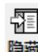

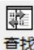

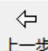


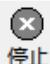

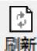

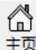

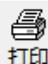

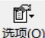

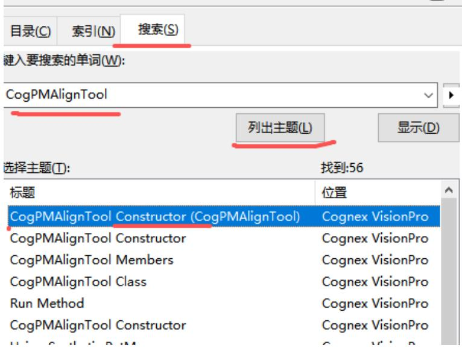

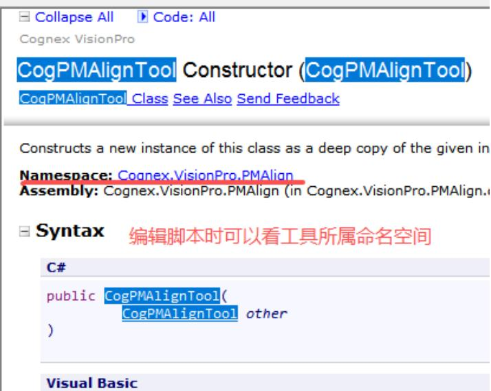

输入 PMAlign 、blob、caliper、Histogram、等等搜索，找到 edit Control 选项，可以看中文工具使用详细介绍。

# 查看工具使用介绍：

添加工具，在工具窗口，点问号，然后点控制参考页-会自动弹出搜索界面，默认搜索了edit Control，可以直达工具中文使用介绍界面

# 二、Framework 介绍-参考 C#第二阶段培训文档-视频

# 1.框架介绍

$\textcircled{1}$ .软件图标：准星图标贴装、放大镜 $+$ 准星贴装带检测、放大镜单检测(cami)  
$\textcircled{2}$ .FrameWork：是个视觉服务器，是 visionPro、机械手对位和检测设备之间的桥梁

主要包括内容：获取图像、自动标定、运行 INspection 的 ToolBlocks与光源控制器对接、设置跟机台主控程序通讯的 TCP/IP 或者串口显示log信息、呈现inspection结果给用户、保存图片、offline模拟

# $\textcircled{3}$ .界面介绍：

相机设置： 相机类型：Gige(2D)、Displacementsensor(3D 位移传感器)、OtherIP、带宽：满载 $100 \%$ 、亮度(增益)、对比度、限时、触发模式、触发极性标定设置：

相机运动：Passthrough：系统不进行标定或者不在 calibration 内标定，为采集的图像已经含有标定信息的传感器或其它采图设备使用、

StaticPose：相机静止，常规 9/11 点标定等，Chardboard 标定。

MovingCameraXYTheta：标定块不动。相机运动标定。

MovingCameraXYThetaInverse：建立相对坐标系而使用

畸变模型：Physical Configuration：默认 0

Distortion Mode：扭曲模式，此项一般选择 OneParamRadial 模式，如果是真远心镜头可以选择 Telecentric 模式。

Degrees of freedom：角度自由度，分为 RotationAndTransLation(XYTheta)，

RotationOnly(OnlyTheta),TranslaionOnly1Axis(Only1Axis),TranslationOnly2Axies(OnlyXY),

11 点标定使用 RotationAndTranslation，9 点标定使用 TranslationOnly2Axies. 其它两项很少使用。

Calibration Plate Mylar标定板规格：，按照实际使用填写，否则导致标定坐标系异常。

Minimum Rotation：最小旋转角度，最小 $5 ^ { \circ }$ ，否则计算不准确。

Align Home2D to Motion2D at Image Center:默认不勾选。

批处理：运行模拟文件，可以加载标定图片文件。 IDB editor可以打开idb、cdb图片、打开标定完生成的文件。

Image 选项：image Attributes：包含 calibrationID、inputID、FovXY、RobotXY 等

Inspection 设置：

Dwell time：延时等多久再运行。

Lighting Dwell time：让光源持续亮几秒

Time out：inspection 运行时间超出设定的这个时间，就会运行失败。默认 10000ms

work Mode：Normal：vpp 会以系统框架认为的最快速度去运行。

sequence(单线程)：默认第一张图run，run不完，则等10次一次10ms完了还没run完就不等。直接run第二张图。

Dualcore 双线程：

lgnore load Toolblock：勾选表示忽略，意味下次开软件，不显示加载对应的inspection了，打开速度块，省空间标定信息：上下限 新框架可以直接双击修改。

Fovxy、MotionAspect：机械手 Y/X 的值。MotionScalingX/Y=aspect 的值。

MotionSkew：模组/机械手的 XY 夹角。CalpiatePitchXY 标定片尺寸。

CameraRotationXY：当前相机安装方向和机械手方向的夹角。CenterXY，视野中心坐标

ImageSizeXY 相机分辨率。MotionCapability：畸变模型(标定设置里选择的)

PixAspectRatio：

PixelSizeXY：像素分辨率。TrainedSteps：拍次数(1 11 12 等)

$\textcircled{4}$ Tools 工具：Motion Error Visualizer：可以加载标定好的 vpp 查看标定结果怎么样。主要包含：XYA 误差、纵横比、标定图像点数的畸变程度。

最后一项可以加载两个标定文件，比如第一次标定和第二次标定，对比两次的误差。

可以查看，第几次拍照、input坐标、期望坐标。实际坐标

将所有工具块设为发布(relesse)模式：自动将各个inspection里脚本里调试改发布

其余详细见图片：

settings 设置:图像文件名字设置、添加不同权限的用户、视觉系统工具、

框架设置：窗口数量、界面分布、默认语言、窗口尺寸、最后图片尺寸、缓存大小、最多存多少图片

Asynthronous Communication Mode：异步通讯启用。

Listen for tcp client heartbeat:隔一段时间就确定一次通讯是否正常

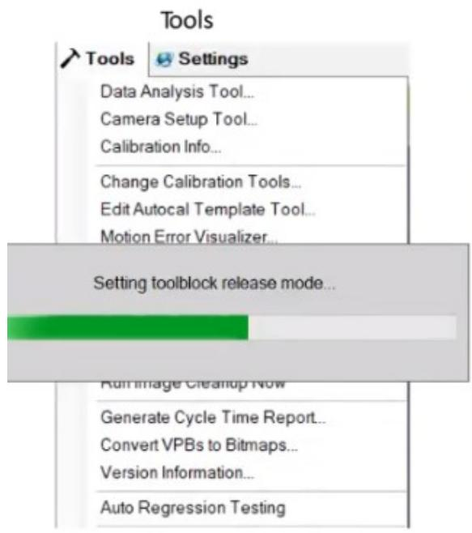

·DataAnalysisTool:数据分析工具，添加csv文件进行数据分析  
·CameraSetupTool:相机设置工具，MP架线保持相机的一致性  
·Calibrationinfo：可以查看标定结果信息  
·ChangeCalibration Tools:更改标定工具（*）  
·EditAutocalTemplateTool：更改自动标定工具 $( \ast )$   
·Motion ErrorVisualizer：分析机构误差  
·ResetAutocalCalibration Scripts:还原自动标定脚本 $( { \ast } )$   
·ForceAIlToolstoReleaseMode:强制所有工具到Release模式  
·Reduce Inspection ToolSize:减小InspectionT具尺寸   
·ReloadAll Inspection：重新加载所有Inspection  
·Runlmage Cleanup Now：清理图片   
·GenerateCycleTimeReport：CT报告（+machinesupport实现）  
·ConvertVPBstoBitmaps:转换VPB(CGA->VPB)文件为Bitmap  
·Versioninformation:版本信息   
·Auto Regression Testing：自动回归测试

Framework文件分布如下：  
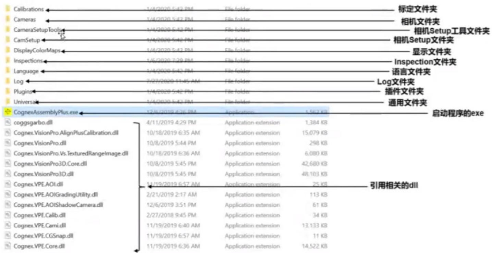  
$\textcircled{5}$ 存图名字设定： 参考图片

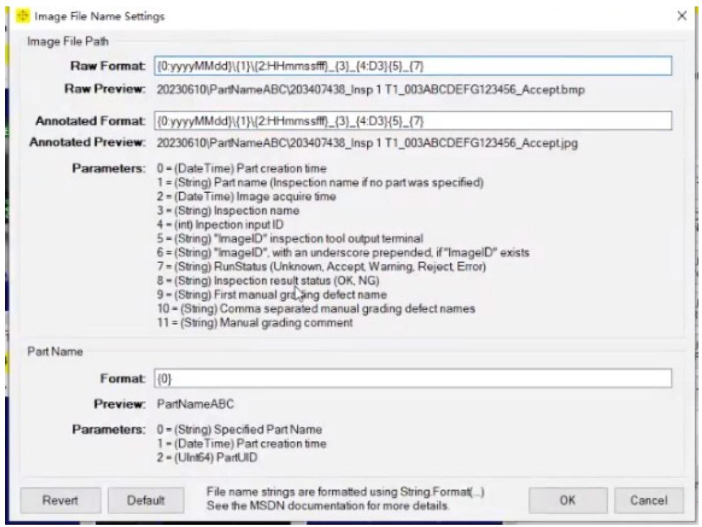

# $\textcircled{6}$ 创建一个新的框架及 MachineSupport：

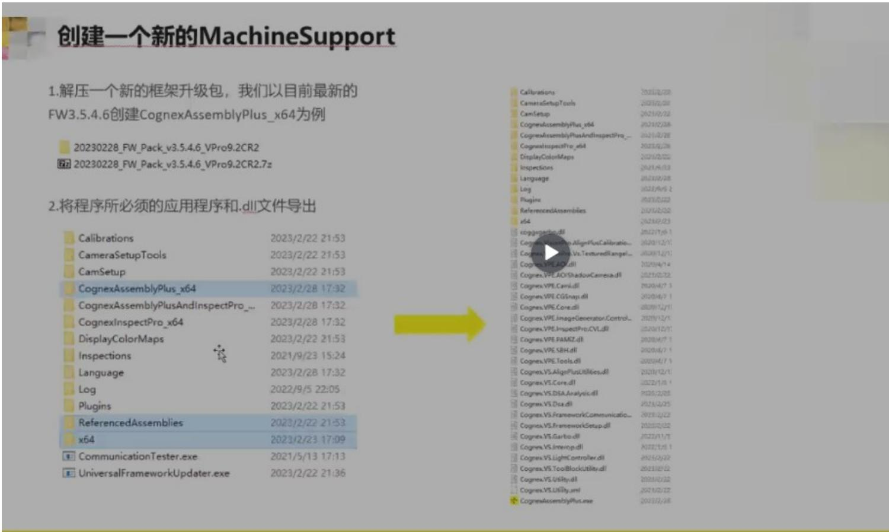

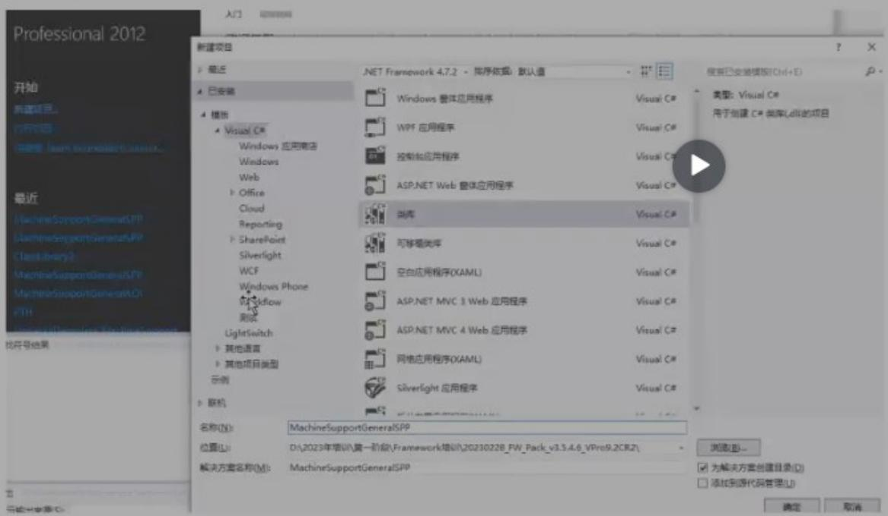

2019 Cognex Confidential


# 创建一个新的MachineSupport

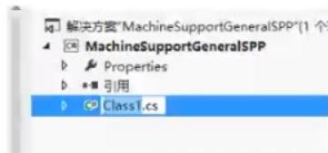

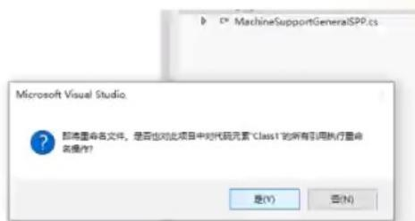

程序集名称都修改为Cognex.VS.MachineSupport

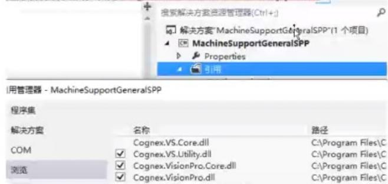

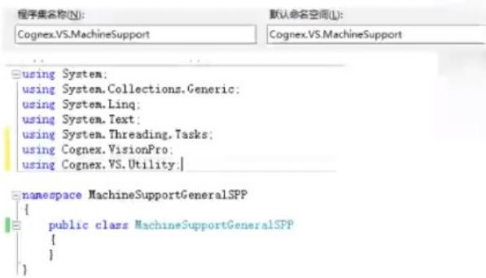

# 6.让MachineSupportGeneralSPP继承IMachineSupport并实现接口，并添加工

#

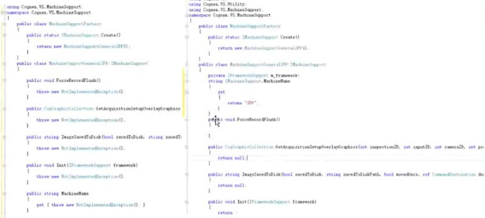

2019 Cognex Confidential


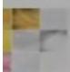

# 创建一个新的MachineSupport

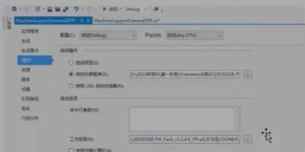

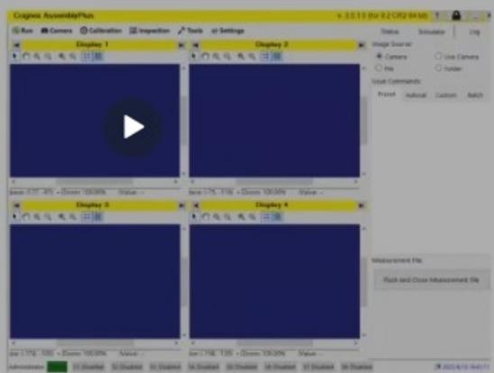

# 2. Machine Support 各个模块的介绍：光源模块、通讯模块、Vpp 模块儿

# Machine Support

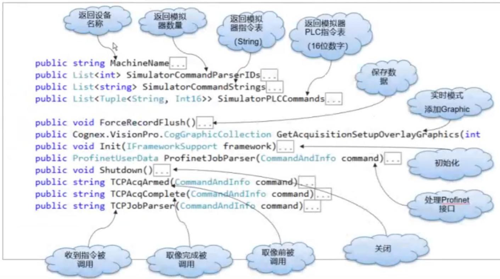

# 3. Visual Studio 的调试方法。

打开 MachineSupport 文件夹，打开 MachineSupport..... .sln 文件。会默认用 VS 打开。

VS 界面点调试，点 MachineSupport....调试属性。

属性界面：选择应用程序选型，目标框架选择4.7.2.

调试选项：启动外部程序-选择浏览，找到软件目录下 Cognex 文件夹名为 CognexAssembly....exe 程序

工作目录选择，软件目录下 Cognex 层级。

选中 VS 界面右侧解决方案管理器 查看 Cs 类文件：MachineSupport.cs、等等

编辑完后点VS界面上方生成按钮，点重新生成解决方案，等待生成后若是没有报错即生成成功，报错了话就查找报错的地方，修改后再生成，警告可以忽略。

# 4.Inspection 的添加

# 标定及inspection模块

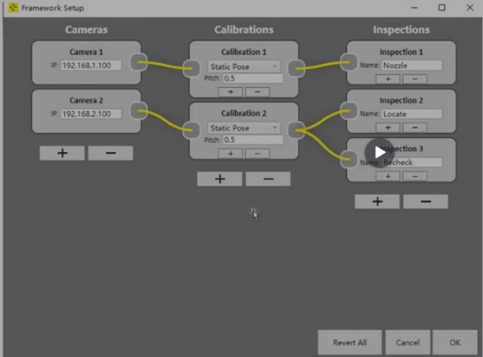

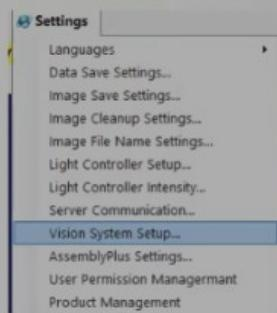

1.打开程序后找到：视觉系统设置  
2.点击添加Cameras、Calibrations和lnspections并连线最后确定，该名字就是在Inspection中显示的名字

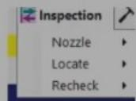

2019Cognex Confidentil

COGNEX

# 5.通讯协议的修改。

TCPJob 函数的使用-参考视频

# Machine Support:和VPP进行数据交换和传递

# 将数据输入到vpp的Input中

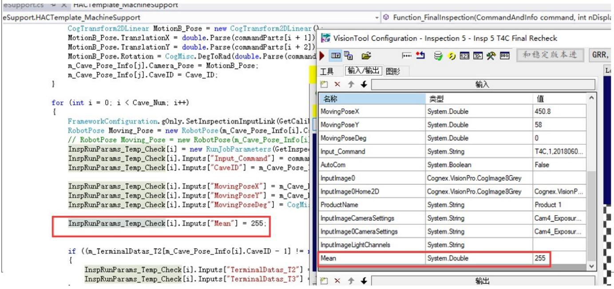

# 7.相机调用

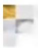

# 相机的调用

```txt
当需要对相机进行特殊设置时候需要对相机进行调用，一般一般在“Prepare”中进行设置，不用写在Config中  
m_framework Cameras[0].FrameGrabber.OwnedGigEAccess.SetDoubleFeature("TriggerDelayAbs", Came1TriggerDelayAbs);  
对该相机在（100,100）坐标取一个长800，宽600的像
```

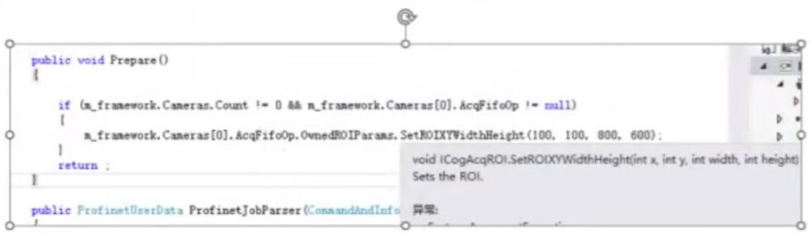

8.标定模块的设置和添加。-参考第二阶段视频  
9.设备映射逻辑介绍。-参考第二阶段视频  
10.设备通讯逻辑介绍、-参考第二阶段视频  
11.数据收集模块-参考第二阶段视频  
12.跑图的设置。-参考第二阶段视频

# 三、Dataman 脚本调试与修改。

# 1.多码调试应用

Symbology Settings(码类型设置)：

General：勾选需要解的码的类型

Multicode Settings(多码)： Number of codes 设置允许读取到的码的数量 适用于一幅图里有多个码

allow Partial Results：勾选时可以将解出来的每一个码都输出

# 2.选型

扫码需求：用于自动化设备还是手动工站

条码特性：条码大小，规格，打码方式材料等

安装方式：有多大空间可供扫码枪安装调试

公司主推产品：如以前是DM302X，现在是DM262X一次性扫一个码还是多个码等

常见固定式扫码枪型号：DM302X(停产)，DM262X-1540P，DM262X-1120/DM262X-1120F,DM50X,DM374X(大视野)

常见手持式扫码枪型号：DM8050HDXM，DM8600/DM8600 HDX

1.扫码枪选型：DM262x DM302x DM50x

<table><tr><td>参数</td><td>DataMan 50/60 Imager</td></tr><tr><td>图像传感器</td><td>Sensor 1/3 inch CMOS</td></tr><tr><td>图像传感器属性</td><td>4.51 mm x 2.88 mm (H x V), 6.0 μm square pixels</td></tr><tr><td>分辨率 (pixels)</td><td>752 x 480</td></tr><tr><td>快门速度</td><td>18 μs to 25 ms exposure</td></tr><tr><td>帧率</td><td>up to 60 fps at full resolution</td></tr><tr><td>镜头</td><td>45mm/70mm/110mm</td></tr><tr><td>光源</td><td>集成内部光源</td></tr><tr><td>尺寸</td><td>DM50 23.5mm x 26.5mm x 45.4mm
DM60 55mm x 44.5mm x 23.5mm</td></tr><tr><td>通信方式</td><td>DM50 USB和RS-232
DM60 USB、RS-232和以太网</td></tr><tr><td>解码速率</td><td>最高解码速率为 45/秒</td></tr></table>

DM50x：

# DataMan262X以太网读码器规格

<table><tr><td>图像分辨率</td><td>1280 x 960 全局快门</td></tr><tr><td>读取</td><td>45 fps</td></tr><tr><td>解码速率</td><td>45 次解码/每秒</td></tr><tr><td>镜头选择</td><td>6.2 mm(3 位镜头或液态镜头,40..200 mm)
16 mm(手动调焦或液态镜头,45 mm..1 m)</td></tr><tr><td>照明</td><td>模块化照明/现场配置照明:四种独立控制,高功率 LE
D(红、白、蓝、IR)配有带通滤波器和偏光过滤器</td></tr><tr><td>通信</td><td>RS-232 和以太网接口</td></tr><tr><td>尺寸</td><td>直立 - 43.1mm x 22.4mm x 64mm
折角 - 43.1 x 35.8mm x 49.3mm</td></tr></table>

DM262x：

DM262X三个型号： DM262X（像素是120W）用的都是液态镜头 可以自动对焦 302X可以装液态和固态镜头

DM262X-1120-P 是白色透明盖子

DM262X-1120-F黑色的盖子四个灯都是偏振光

DM262X-1540黑色的镜头盖子 两个偏振光和强光

# DataMan302X以太网读码器规格

<table><tr><td>图像分辨率</td><td>1280 x 1024</td></tr><tr><td>帧率</td><td>up to 60 fps</td></tr><tr><td>解码速率</td><td>45 次解码/每秒</td></tr><tr><td>镜头选择</td><td>10.3mm liquid lens
19 mm liquid lens
16mm/25mm lens</td></tr><tr><td>照明</td><td>Diffuse lens cover, red illumination (assembled)
Polarized red LED high-powered integrated light
其他配件</td></tr><tr><td>快门速度</td><td>5us..1000us</td></tr><tr><td>通信</td><td>RS-232 和 以太网接口</td></tr></table>

DM302x：

·DM302X有八排灯，每一排都可以单独打开或者关闭；  
·DM50X是固态镜头，不能自动对焦只能手动调焦距，跟视觉的相机一样，DM262X都是液态镜头可以自动对焦，DM302X可以装液态镜头也可以装固态镜头，看实际需求；  
■DM262X用的是16mm的镜头，DM302X用的是10.5的镜头；  
·DM262X像素是120W，DM302X像素是130W;   
■DM8050X和DM8600X都是手持扫码枪，不用调试参数；

# 3.码密度计算

含义：码的每个module(模块)的平均像素值 每个模块占了几个像素

意义：它是判断扫码稳定性的一个重要依据，它不是越大越好也不是越小越好，需要控制在一个合理的范围，二维码般建议在5~8，一维码建议在3以上

# 码PMM值计算

1.视野是 $7 8 m m ^ { \star } 5 0 m m$ 中间有个二维码尺寸为 $5 m m ^ { \star } 5 m m$ 二维码是12*12Code

(通俗来讲就是求此二维码每个模块包含几个像素)

用扫码枪DM50X(752*480)的长边计算

$\textcircled{1}$ 先算出视野里每个mm单位所包含的像素个数：

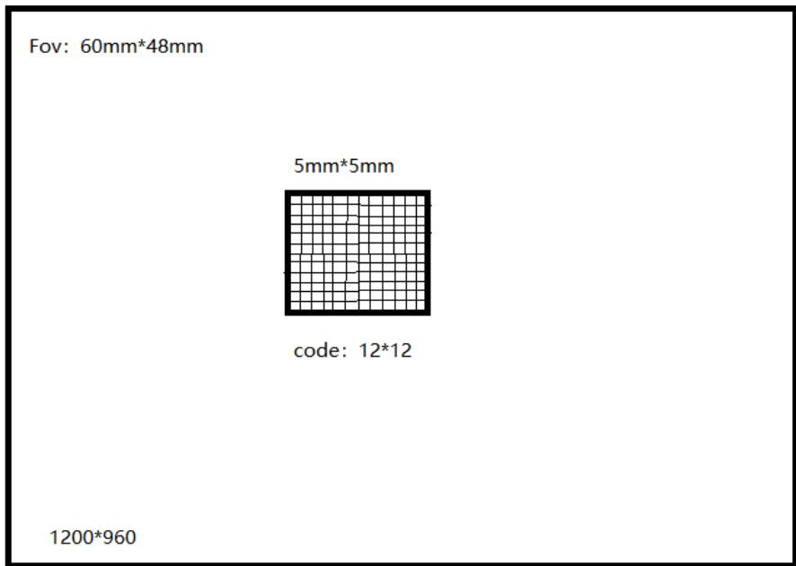

$7 5 2 / 7 8 \mathsf { m m } = 9 . 6$ 表示每mm有9.6个像素

$\textcircled{2}$ 再算出每个模块尺寸为多少mm：5/12=0.4166666667mm  
$\textcircled{3}$ 计算码密度： $-$ $\cdot$   
另一种: $-$ 像素/ $\cdot$ 17094017094017094017094017094

黑色大框是扫码枪或者相机的视野： $6 0 \mathsf { m m } ^ { \star } 4 8 \mathsf { m m }$ ，分辨率为1200*960

中间的小框是个二维码尺寸为： ${ \pmb 5 } \mathbf { m } \mathbf { m } ^ { * } { \pmb 5 } \mathbf { m } \mathbf { m }$

这个二维码的码值为12*12，也就是说二维码的是有144个模块儿(小格子)组成。

此时计算码密度：

1.计算每个像素多长： $6 0 m m / 7 2 0 0 = 0 . 0 5 m m$ 这是每个小像素点的长宽  
2.计算这个二维码长或宽占用了几个像素： $5 m m / 0 . 0 5 m m = 7 0 0$   
3.二维码长边有12个模块儿共计占用100个像素：100/12=8.333

# 4. ID 脚本参考-3V 验证器评判标准

# 默认脚本

//Default script for data formatting   
function onResult (decodeResults, readerProperties, output)   
{ if (decodeResults[0].decoded) { output(content $\equiv$ decodeResults[0].content; 1


上图是默认脚本，意思是假如解到码了就输出这个条码

# 例子脚本1

//Default script for data formatting   
function onResult (decodeResults, readerProperties, output)   
{ if (decodeResults[0].decoded) { output(content $\equiv$ decodeResults[0].content+`r'; }

上图是手持扫码枪使用的脚本，意思是假如解到码了就输出这个条码后并回车。

# 例子脚本2

//Defaultscriptfordataformatting   
function onResult (decodeResults, readerProperties, output)   
{ if (decodeResults[0].decoded) { I output.content $=$ "XYZ" $^+$ decodeResults[0].content+"r\n"; } else { output.content $=$ "NG"; } 上图意思是假如解到码了就在条码前面加XYZ，后面跟回车换行，否则输出NG

COGNEX

# 例子脚本3

//Default script for data formatting   
function onResult (decodeResults, readerProperties, output)   
{ if ((decodeResults[0].decoded&&decodeResults[0].content.length $= =$ "12")|| (decodeResults[0].decoded&&decodeResults[0].content.length $= =$ "16")) { output(content $\equiv$ decodeResults[0].content+'\r'; 1 else { output(content $= =$ ""; } 上图意思是假如解到的码是12或16位，就输出并换行，否则就不输出

COGNEX

# 例子脚本4

```javascript
function onResult (decodeResults, readerProperties, output)   
{ if ((decodeResults[0].decoded&&decodeResults[0].content.length=="17")) { output(content = decodeResults[0].contentsubstr(0,1) } else { output(content = ""; } } 
```

上图意思是假如解到的码是17位，就输出第一位，否则就不输出

# 二.DataMatrix码的介绍

# 4.COGNEX-3V验证器评判标准

COGNEX-3V是以AIMDPM指标作为评判标准，AIMDPM指标主要分为以下6项，如下：

$\textcircled{1}$ SymbolContrast：单元格对比度衡量的是明单元格与暗单元格之间的明暗差昇。  
$\textcircled{2}$ PrintGrowth：衡量的是印刷的墨水质量有无变化，导致墨点不一致。  
$\textcircled{3}$ UEC：衡量的是数据区域的损坏已经在多大程度上影响代码的读取安全边际。  
$\textcircled{4}$ Modulation：衡量的是一个模块是否有可能被错误地识别为明模块或暗模块。  
$\textcircled{5}$ FixedPatternDamage：衡量的是定位器案、时钟图案和静音区的完整性。  
$\textcircled{6}$ GridNonUniformity：衡量的是符号网格交叉点偏离出理想位置的程度。

# 结论：

验证和可读性是不一样的

对于验证为A的DPM代码，使用低端的识读器也可能无法读取

对于验证为D的DPM代码，使用康耐视读码器和适当的光源可实现很高的读取率

COG

# 5.ID 知识

1.条码基础知识‘；

一维条码组成：静区 起始符 数据符终止符静区

二维条码组成：计时图案 数据区 模块或单元L型寻边区 静区

二维条码DM码L型寻边区对应的另一边是 时钟区：定义条码是NxN个模块组成

DataMatrix码的判定：激光镭雕和喷墨的码质量需要检测：

Verifier：根据 ISO 15415 或 Aim Dpm 标准来定值

COGNEX-3V 验证器评判标准：ABCDE DE 不合格

常见不合格码种类：L型寻边区缺失 对比度不佳 模块化不佳 模块偏离条码损坏条码变形(长宽非1:1)

直接元件标识工艺： 四种方法：喷墨 打点阵和复刻 激光 电化蚀刻

一维二维区别：一维码存储数据少，尺寸太大 水平方向 破损不能读取

二维码存储数据多，尺寸小 水平加竖直方向 破损能读取

# 2.扫码枪软件介绍：

Displayed image settings 设置：Size：设置图片的质量 full 是原图 也可以是多少分之一

Image transfer settings 设置: 勾选 Transfer all images 可以使得当多通道存在时 每个通道解码结果显示一张图片

Symbology Settings(码类型设置)：

General：勾选需要解的码的类型

Multicode Settings(多码)： Number of codes 设置允许读取到的码的数量 适用于一幅图里有多个码

allow Partial Results：勾选时可以将解出来的每一个码都输出

Communication Settings(通信)：IP 设置 波特率设置

Custom Commands(字段)： 勾选(勾选后需设置内容 一般常见的+ — 或者 no off )或者不勾选 和机构对应(一般当收不到机构触发信号时优先考虑 IP 和这个触发 字段)

System Settings: 设置读取或未读取到 反馈的内容：read no read error -10000 等等

System Device log：当扫码枪报警灯亮 点这个 清除报警信息 可以解除报警

Live(实时)：勾选 Decoding 能够实时显示解码

勾选Focus Feedback ，图像显示窗口右侧会显示一个带有颜色的计数条高度表示对焦情况，越低表

# 示对焦越差

勾选Automatic Exposure：表示自动曝光，增益滑动条 显示的是当前目标的像素灰度值

其中蓝框ROI区域：表示解码区域

Optimize Focus：优化对焦

Optimize Brightness：优化曝光

Symbology Assistant：码制助手

trigger type：触发模式

Train Code :训练条码

Advanced Trigger Settings：触发模式高级设置 和其他调节参数设置

训练界面参数介绍：

勾选Tune Light Bank： 读码器会自动调节光源，如果我们清楚光源的设置，自动调节时，就会跳过光源的设定

勾选 Exhaustive Tuning：强制调节光源

当被禁用时：读码器一旦在某一光源设定下成功解码，将不再改变光源设置

当启用是：读码器会测试所有光源设置模式，无论是否已经解码成功， 训练完后会有三个选项选择：

勾选 Enable Fitter Tuning：DataMan 会使用图像过滤器

勾选：Optimize Focus During Tuning：训练时自动对焦

勾选 Train Code After Tuning：会在自动调节成功之后，对条码进行训练

# 触发模式参数含义：

Single：拍摄单张图片进行解码，每个setup会拍一张，可以设置单个setup的超时时间

Presentation：连续拍照，每次对视野中的单个条码进行解码

Manual：在足够长的时间里进行拍照，直到成功解码或者触发信号结束

Burst：拍摄一组图片解码，并在首次成功解码时停止解码，我们可以设定每组图片拍摄数量，还有每次拍照的时间间隔，每次拍照都可以设定一个超时时间

Self：与 Presentation 模式类似

Continuous：在触发信号结束之前连续拍照，可以设定每次拍照时间间隔

Timeout：表示读码器等待时间，知道读码器读码成功或者失败

Tune的作用：读码器可以自动调节最佳光源亮度，自动调节最佳焦距，自动欧诺个调节最佳增益等信息，最后给出三种最优解码方案来选择

# 优点：

$\textcircled{1}$ 便于现场工程师快于调试  
$\textcircled{2}$ 加快解码时间，提高解码成功率

$\textcircled{3}$ 对于比较难读的码可以自动调节最佳解码方案  
$\textcircled{4}$ 便于现场零基础人员

Save Configuration：读取 保存调试好的读码参数 CFG 和 cdc 格式

调试流程： $\textcircled{1}$ 链接扫码枪

$\textcircled{2}$ 进入扫码枪软件  
$\textcircled{3}$ 根据条码情况，调整合适的视野尺寸和读码位置

优化曝光 频率打光方式，选择需要的触发方式，保存并退出  
$\textcircled{4}$ 保存读码参数

IP：参考 CCD 的 IP 设置

端口：默认23

4.扫码枪的脚本：

启用脚本格式：

例子：

5.PPM值计算：

PPM值的含义：码的每个module的平均像素值 $    $ 其实就是 码里每个单元所占用的像素数

意义：判断扫码稳定性的一个重要依据，不是越大越好或者越小越好，需要控制在一个合理范围

，二维码一般建议在 5~8，一维码建议在 3 以上

计算：例如 扫码枪 DM50x 分辨率为 $7 5 2 ^ { * } 4 8 0$ ，视野 $7 8 \mathrm { m m } ^ { * } 5 0 \mathrm { m m }$ ，二维码尺寸 $5 \mathsf { m m } ^ { * } 5 \mathsf { m m }$ ，二维码模块数为${ \Omega } ^ { \ast } { \Omega }$ ，现在问二维码 PPM 值：即二维码每个模块占用的像素数

$\textcircled{1}$ 先计算每MM有多少个像素，用长边 $7 5 2 / 7 8 = 9 . 6$ 每 $\mathsf { m m }$ 有9.6个像素  
$\textcircled{2}$ 计算 二维码每个模块多少 mm：5/12= 0.41666667  
$\textcircled{3}$ 计算PPM： $9 . 6 ^ { * } 0 . 4 1 6 6 6 6 6 7 { = } 4$ 则每个模块占用4个像素

3.扫码枪多码调试应用

视野 $5 0 \mathsf { m m }$ ，50mm 5mm*5mm ${ \Omega } ^ { \ast } { \Omega }$

# 机器视觉维护与应用技能等级要求--工作领域

# 一、机器视觉系统方案评估

# 1. 相机选型

选型有芯片类型、芯片尺寸、黑白彩色、曝光方式、帧率、接口、分辨率等依据

分辨率：通过视野大小和精度需求来确定 相机分辨率

eg：视野(工件 $\_$ 允许 $2 \mathsf { m m }$ 的浮动)： $1 2 \mathsf { m m } ^ { * } 1 0 \mathsf { m m }$ ，检测精度需求为 $\cdot$ 则理论需求的相机分辨率为： $1 2 \mathrm { m m } / 0 . 0 1 \mathrm { m m } = 1 2 0 0$ 以及 $1 0 \mathrm { m m } / 0 . 0 1 \mathrm { m m } = 1 0 0 0$ 此时选择一个分辨率略大于 $1 2 0 0 ^ { * } 1 0 0 0$ 的相机就能满足检测需求。

黑白彩色：一般不需要检测图像颜色信息的都用黑白相机

曝光时间：若是飞拍则需一定的最小曝光时间原则是：最小曝光时间内物体或者相机移动的距离≤1个像素就行。

帧率：满足飞拍时连续拍照的时间间隔

数据接口：GigE cameLink USB

芯片尺寸：几分之一英寸

镜头接口：C和CS

快门方式：一般来说运动物体用全局快门，静止物体用卷帘快门

Cognex Cam-CIC-5000R-14-G：500w 卷帘快门 14 帧/秒 黑白相机

接口GigE 分辨率 $2 5 9 2 ^ { * } 1 9 4 4$ 像素位深12bits 靶面尺寸：2.5分之一英寸

感光芯片：COMS 芯片尺寸： $5 . 7 \mathrm { m m } ^ { * } 4 . 2 8 \mathrm { m m }$

# 相机选型总结：

精度满足要求： 一般实际精度要高于项目所需求的精度eg：需求为 $0 . 0 2 \mathsf { m m }$ 我们可以给 $0 . 0 1 \mathsf { m m }$ 甚至 $0 . 0 0 5 \mathsf { m m }$ 的精度确定色彩要求：

曝光时间：

帧率/数据接口：

芯片尺寸：

镜头接口：

其他相关

PS：常见芯片尺寸： $\%$ 英寸为 $3 . 6 \mathrm { m m } \times 2 . 7 \mathrm { m m }$ 对角线 $4 \mathsf { m m }$

$\%$ 英寸为 $4 . 8 \mathrm { m m } \times 3 . 6 \mathrm { m m }$ 对角线 6mm $\%$ 英寸为 $6 . 4 \mathsf { m m } \times 4 . 8 \mathsf { m m }$ 对角线 $8 \mathsf { m m }$

$\%$ 英寸为 $8 . 8 \mathrm { m m } \times 6 . 6 \mathrm { m m }$ 对角线 11mm 1 英寸为 $1 2 . 8 \mathrm { m m } \times 9 . 6 \mathrm { m m }$ 对角线 16mm

物距*芯片尺寸 $\cdot$ 视野*焦距

视野的计算方法

(镜头到物体的距离）x（照相机型号尺寸)视野 $\Bumpeq$ （镜头的焦距f）

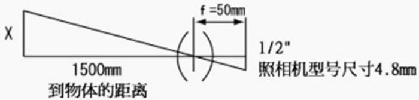

视野 $= \frac { 1 5 0 0 \times 4 . 8 } { 5 0 } = 1 4 4 \mathrm { m m }$

例如： 工件尺寸为 $1 0 \mathrm { m m } \times 8 \mathrm { m m }$ 工作台上料有 $_ { 2 \mathsf { m m } }$ 误差 精度要求 $0 . 0 2 \mathsf { m m }$ 工作距离 $1 3 0 \mathsf { m m }$

答：相机的视野需求最小也要 $1 2 \mathrm { m m } \times 1 0 \mathrm { m m }$ 实际可以给到比如 $1 5 \mathrm { m m } \times 1 2 \mathrm { m m }$ 的视野大小（视野应略大于工件检测区域）

相机短边 $1 2 \mathrm { m m } / 0 . 0 2 \mathrm { m m } ^ { * 1 } / _ { 3 } = 1 8 0 0$ 相机长边 $1 5 \mathsf { m m } / 0 . 0 2 \mathsf { m m } ^ { * } \% = 2 2 5 0$

Ps：这里给出的 0.02 精度又 $^ { * 1 } \%$ 是根据项目需求不同 比如用作测量的项目要求精度更高此时 $^ { * 1 } \%$ 可以给出更高的精度此时可以选用2590x1944的500w分辨率的相机 黑白彩色根据实际需求

若是需要飞拍则考虑：快门方式为全局曝光 相机最小曝光时间（ms）轴带着相机的运行速度或者是被拍摄物体运行的速度（ $\mathrm { ( m m / s ) }$ ）

某系统的拍摄精度是 $0 . 1 \mathsf { m m } ,$ /像素，相机曝光时间是 1/2000 秒，拍摄物体运动速度是 $1 0 \mathsf { m m } / \mathsf { s }$ ，这样目标在曝光时间内物体运动的距离是 $0 . 0 0 5 \mathrm { m m } { < } { < } 0 . 1 \mathrm { m m }$ ，因此可以用该系统拍摄。

这里曝光是0.0005s速度是 $1 0 \mathsf { m m } / \mathsf { s }$ 距离则是 $1 0 ^ { * } 0 . 0 0 0 5 { = } 0 . 0 0 5 \mathrm { m m }$ 这个距离小于给出的拍摄精度0.1mm 则代表这个拍摄系统可以用于此工作场景

# 2.镜头选型

# 有接口、焦距、倍率、工作距离、支持的最大分辨率等依据

$\textcircled{1}$ 根据相机芯片大小和工作空间限制确定使用镜头的焦距或放大倍率物距*芯片尺寸 $\ddots$ 视野*焦距  
$\textcircled{2}$ 考虑是否需要远心镜头  
$\textcircled{3}$ 景深是否满足需求   
$\textcircled{4}$ 镜头是否兼容相机芯片尺寸：应大于等于  
$\textcircled{5}$ 确定镜头分辨率：应大于等于相机分辨率   
$\textcircled{6}$ 确定畸变率是否满足要求  
$\textcircled{7}$ 超大视野或超小视野  
$\textcircled{8}$ 是否需要考虑透过光谱  
$\textcircled{9}$ 镜头是否要配合其他配件  
$\textcircled{10}$ 价格等

奥普特镜头：

OPT-AC2514-5M：A:奥普特 C：C 型接口 25：焦距 $2 5 \mathsf { m m } 1 4 \colon \mathsf { F }$ 值为 1.4 5M:5 百万像素

OPT-AC5024-2M：A:奥普特 C：C 型接口 50：焦距 50mm 24：F 值为 2.4 2M:2 百万像素

OPT-AM1-110：1：放大倍率：1 倍 110：工作距离 110mm

放大倍率： 像距/物距 芯片尺寸/视野

# 镜头命名规则：

CCTV 镜头：OPT-AC2514-5M

OPT：表示奥普特

AC：表示C接口定焦镜头

25：焦距为 $2 5 \mathsf { m m }$

14：F 值为 1.4

5M：5百万像素

OPT-AC5024-2M：奥普特、C 接口定焦镜头、焦距 50MM、F 值为 2.4、2 百万像素

远心镜头：OPT-AM1-110：

奥普特 1：表示放大倍率 110：表示工作距离 110MM

放大倍率 $: = ^ { \cdot }$ 像距/物距 $\left. = \right.$ 芯片尺寸/视野

假如此相机芯片尺寸为 1/3 英寸即 $4 . 8 \mathrm { m m } ^ { * } 3 . 6 \mathrm { m m }$

此时焦距： $\mathsf { f } =$ 物距 $\mathsf { x }$ 芯片尺寸/视野长边 $= 1 3 0 { \times } 4 . 8 / 1 5 { = } 4 1 . 6 \mathrm { m m }$

此时根据焦距 $4 1 . 6 \mathsf { m m }$ 以及500w分辨率选用合适的镜头（镜头分辨率应大于等于相机分辨率）

镜头的最大兼容芯片尺寸必须大于相机芯片尺寸（简单理解为假如相机芯片为1mmx1mm尺寸的话 镜头直径必须大于1mm此时镜头才不会遮挡相机视野）

镜头和相机要考虑接口类型是否匹配：

C型镜头匹配C型相机 CS型镜头匹配CS型相机

C 型镜头 $+ 5 \mathsf { m m }$ 接圈匹配 CS 型相机 CS 型镜头不匹配 C 型相机

# 3.光源选型：

# 有光源本身的颜色、形状、发光类型等，产品的表面材质反光特性、光源安装高度和照射角度等依据

方向： 暗场 亮场 无影光 漫射背光 平行背光 根据检测物体表面是否反光或者凹凸不平等

低角度光(暗场)：主要用于边缘有倒角、圆角物体轮廓提取、冲压、浇筑、浮雕图案识别与检测，光滑表面 划伤、裂痕检测。

缺点：对于透明物体表面的划痕检测效果不理想效果不理想

高角度光(亮场)：主要用于表面粗糙程度不同区域的区分、边缘或内部有垂直断差或者比较陡峭（超过60度）边缘检测或测量。

缺点：对于反光区域相差不大的效果不理想

背光：用于轮廓和边缘检测；用于透明物体内不透明物体的检测。

非同轴漫射光应用及光路图：可以避免因弯曲表面导致的打光不均匀

同轴光：含有 $50 \%$ 度银镜。同轴光源能够凸显物体表面不平整，克服表面反光造成的干扰，主要用于检测 物体平整光滑表面的碰伤、划伤、裂纹和异物。

光谱：可见光 近可见光 不可见光 根据黑白彩色相机 物体颜色 等

其他：偏振片(偏振光):用于减少眩光或者是镜面反射 其它配件

彩色光源：黑白相机对 660nm 波长的红光最敏感 且红色 LED 成本低 较常使用

蓝色光：波长短，适合检测物体表面质量

紫光：波长更短，散射性好

白色：中性颜色，适合拍彩色图片，或者被摄物体颜色有变化，

绿色：亮度高且波长和蓝色接近，可替代蓝色

红外：用于透明物体检测，波长越长穿透力越强，波长越短，扩散性越好

照射光的种类： 平行光 直射光 散射光 偏光光

平行光：照射角度整齐的光，太阳光就是平行光。发光角度越窄的LED直射光越接近平行光。

直射光：LED光源直接照射对象物的光

散射光：各种角度的光源混合在一起的光，日常生活用光几乎都是扩散光。

偏光光：光源的传递方向在特定的垂直平面上波动收到限制的光。通常是利用偏光板来防止特定方向的反射

# 选型思路：

$\cdot$ 了解项目需求，明确要检测或者测量的目标  
$\cdot$ 分析目标与背景的区别，找出两者之间最可能差异大的光学现象  
$\cdot$ 根据光源与目标之间的配合关系，初步确定光源的发光类型  
$\cdot$ 拿实际光源测试，以确定满足要求的打光方式  
$\textcircled{5}$ 根据具体确定适用于客户的产品

# 具体选型：

$\cdot$ 考虑方向选用： 直射光 漫射光  
$\cdot$ 考虑颜色可见光 近可见光 不可见光  
$\textcircled{3}$ 偏振片 等其它配件  
$\textcircled{4}$ 考虑选用：漫射背光 平行背光 暗场配光 明场配光 无影光

1)背光源：用作物体轮廓提取、透明物体内不透明物体的检测、贯穿性缺陷检测、狭缝或通孔内杂质检 测透明物体表面划痕、内部异物、破损等检测   
2)Dome 光：用做物体表面弯曲 凹凸不平整 球面 等场景  
3）条光：多打侧面角度光 条码识别，定位标记识别、液晶元件检测、大面积物体表面划痕检测、零部件边缘检测  
4）环光：产品包装外观、标签检测、显微镜照明、通用外观检测 5)   
5）同轴光：金属玻璃瓶等高反光表面的划痕检测、晶片上激光标注检测、轴承、饮料罐上刻印字符光源控制器选择：

1.普通光源控制器 光源常亮 亮度一般 用做定拍场景  
2.高亮频闪光源控制器 光源不是常亮亮度高 一般用作飞拍场景

精度计算  
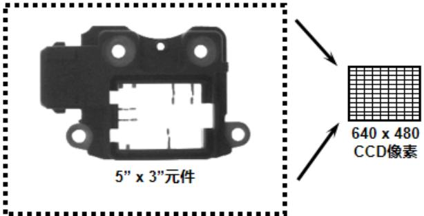  
6.4"x 4.8"视野

视野为 $6 . 4 \mathsf { m m } ^ { * } 4 . 8 \mathsf { m m }$ 分辨率为 $6 4 0 ^ { * } 4 8 0$

精确度视觉工具 $= \frac { 1 } { 1 0 }$ 像素

视觉精度计算： 单方向视野范围/相机单方向分辨率

相机精度：6.4mm/640像素=0.01mm

测量精度：0.01mm*视觉工具精度=0.01mm*0.1=0.001mm

eg：1.康耐视 500w 相机拍照，视野为 50mm*40mm，所使用的视觉工具精度为 ¼ 个像素，求测量精度？（500w 相机分辨率为 $2 5 9 2 ^ { * } 1 9 4 4 ,$ ）

相机精度:(即像素分辨率) 相机精度=50mm/2592=0.0193mm

测量精度：测量精度 $\cdot$ 相机精度*视觉工具精度=0.0193mm*¼=0.004825mm

# 3D 视觉系统图像处理

图像获取：Xscale、StepsPerLine、DistancePerCycle、MeasuringFiled 参数设定

XScale(mm)：X 方向的分辨率 意味着 X 方向采集一张图片的宽度为多少多少 mm，

StepsPerLine：采集一个像素所需要的脉冲数

DistancePerCycle：指的是脉冲信号一圈下来的距离 多少个脉冲信号走一圈是根据接的触发线来决定

比如 DS910B UVFlex 项目 A+A-B+B-四个线则表示每四个脉冲信号走一圈，

MeasuringFiled：相机视野大小，不同的视野对应着不同的采集频率，决定了采集区域和采集速度

曝光时间：0.1-1ms

eg:常见康耐视 3D 相机型号：DS925B(0.003)、 DS910B(0.002)

DS910B:四触发线 $A + A - B + B -$ 对应粉灰紫黑四个颜色

# 例 1:

XScale=0.04mm(单帧图像的宽度)

StepsPerLine=20 个脉冲(1 帧图像需要的脉冲数)

DistancePerCycle=0.008mm(电机走一圈的距离)

MeasuringFiled=7

上述参数设置意为：20个脉冲信号对应四个触发线，此时电机走五圈，一圈 0.008mm，五圈下来的

距离为 0.04mm

MeasuringFiled=7 表示相机此时取像速度为 552Hz(等同 552 帧/s)

# 例 2:

XScale=0.04mm

StepsPerLine $\cdot$ 个脉冲

DistancePerCycle=0.008mm

MeasuringFiled=7

此时已知测量长度为 9.2mm 问带着相机的轴的轴速最大为多少？

单张图片宽度0.04mm，求得测量长度为9.2mm时需要采集：9.2mm/0.04mm=230张图片，

当前参数下帧率为 552/s，则测完此长度需要的时间：230/552=0.41666667s

一秒钟测量的距离：9.2mm/0.41666667s =22mm/s

理论最大运动速度为22mm/s

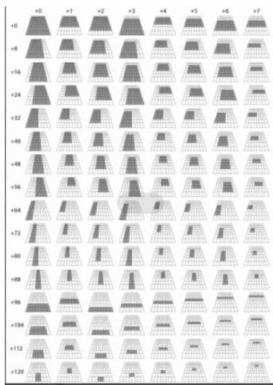

<table><tr><td colspan="9">Maximum Acquiring Rate Depending on the Measuring Field Number</td></tr><tr><td></td><td>+0</td><td>+1</td><td>+2</td><td>+3</td><td>+4</td><td>+5</td><td>+6</td><td>+7</td></tr><tr><td>0</td><td>144Hz</td><td>192Hz</td><td>192Hz</td><td>192Hz</td><td>284Hz</td><td>284Hz</td><td>284Hz</td><td>552Hz</td></tr><tr><td>8</td><td>181Hz</td><td>239Hz</td><td>239Hz</td><td>239Hz</td><td>354Hz</td><td>354Hz</td><td>354Hz</td><td>680Hz</td></tr><tr><td>16</td><td>181Hz</td><td>239Hz</td><td>239Hz</td><td>239Hz</td><td>354Hz</td><td>354Hz</td><td>354Hz</td><td>680Hz</td></tr><tr><td>24</td><td>181Hz</td><td>239Hz</td><td>239Hz</td><td>239Hz</td><td>354Hz</td><td>354Hz</td><td>354Hz</td><td>680Hz</td></tr><tr><td>32</td><td>241Hz</td><td>318Hz</td><td>318Hz</td><td>318Hz</td><td>469Hz</td><td>469Hz</td><td>469Hz</td><td>892Hz</td></tr><tr><td>40</td><td>241Hz</td><td>318Hz</td><td>318Hz</td><td>318Hz</td><td>469Hz</td><td>469Hz</td><td>469Hz</td><td>892Hz</td></tr><tr><td>48</td><td>241Hz</td><td>318Hz</td><td>318Hz</td><td>318Hz</td><td>469Hz</td><td>469Hz</td><td>469Hz</td><td>892Hz</td></tr><tr><td>56</td><td>241Hz</td><td>318Hz</td><td>318Hz</td><td>318Hz</td><td>469Hz</td><td>469Hz</td><td>469Hz</td><td>892Hz</td></tr><tr><td>64</td><td>362Hz</td><td>476Hz</td><td>476Hz</td><td>476Hz</td><td>694Hz</td><td>694Hz</td><td>694Hz</td><td>1200Hz</td></tr><tr><td>72</td><td>362Hz</td><td>476Hz</td><td>476Hz</td><td>476Hz</td><td>694Hz</td><td>694Hz</td><td>694Hz</td><td>1200Hz</td></tr><tr><td>80</td><td>362Hz</td><td>476Hz</td><td>476Hz</td><td>476Hz</td><td>694Hz</td><td>694Hz</td><td>694Hz</td><td>1200Hz</td></tr><tr><td>88</td><td>362Hz</td><td>476Hz</td><td>476Hz</td><td>476Hz</td><td>694Hz</td><td>694Hz</td><td>694Hz</td><td>1200Hz</td></tr><tr><td>96</td><td>552Hz</td><td>552Hz</td><td>1030Hz</td><td>1030Hz</td><td>1030Hz</td><td>1030Hz</td><td>1030Hz</td><td>1030Hz</td></tr><tr><td>104</td><td>680Hz</td><td>680Hz</td><td>1200Hz</td><td>1200Hz</td><td>1200Hz</td><td>1200Hz</td><td>1200Hz</td><td>1200Hz</td></tr><tr><td>112</td><td>892Hz</td><td>892Hz</td><td>1200Hz</td><td>1200Hz</td><td>1200Hz</td><td>1200Hz</td><td>1200Hz</td><td>1200Hz</td></tr><tr><td>120</td><td>1200Hz</td><td>1200Hz</td><td>1200Hz</td><td>1200Hz</td><td>1200Hz</td><td>1200Hz</td><td>1200Hz</td><td>1200Hz</td></tr></table>

左图为 MeasuringFiled 参数不同数值对应的视野范围及景深

右图为 MeasuringFiled 参数不同数值对应的取像速度

# 4.3D 相机相关问题讲解 DS925B DS910B

Xscale、StepsPerLine、DistancePerCycle、MeasuringFiled 等参数解释

以XY方向一帧一帧的扫码图像，最终拼成一幅图片

测高原理则是 三角测量法：

超时：超时时间设置应大于相机采集图像所需的时间

参数解释： 触发方式为硬件半自动

图像属性：宽度 高度 等于采出来的图 的长宽尺寸

自 定 义 属 性 ： 例 如 XScale=0.04mm ， StepsPerLine $\mathtt { \Omega } = 2 0$ 个 脉 冲DistancePerCycle=0.008mmMeasuringFiled=7

XScale(mm)：X 方向的分辨率 意味着 X 方向采集一张图片的宽度为多少多少 mm，

StepsPerLine：采集一个像素所需要的脉冲数

DistancePerCycle：指的是脉冲信号一圈下来的距离 多少个脉冲信号走一圈是根据接的触发线来决定

比如 DS910B UVFlex 项目 $A + A - B + B .$ -四个线则表示每四个脉冲信号走一圈，

MeasuringFiled：相机在 Intensity 模式下，的一个视野大小，不同的视野对应着不同的采集频率，决定了采集区域和采集速度

# 5.光源安装位置设计

能够根据工作场景要求正确设定光源安装高度和角度

# 6. 相机、镜头安装位置设计

能够根据工作场景要求正确设计相机安装高度和角度

# 7. 项目风险评估

能够根据机构精度、安装空间、物料特征、成本、产能等因素，综合评估项目潜在风险

# 8. 确认视觉方案文档

能够根据项目评估情况，确定软件版本、硬件选型、打光方案、工控机性能要求、项目风险、通讯协议、BOM，编写视觉方案文档

# 二、视觉系统集成与应用

# 1 视觉系统集成

2.1.1 能够正确分析项目需求，并根据项目需求编写视觉方案  
2.1.2 能够根据项目需求完成相机、镜头与光源的选型  
2.1.3 能够根据工作任务完成视觉系统硬件组装  
2.1.4能够根据工作任务完成打光测试与验证

# 2 视觉系统编程

2.2.1 能够根据工作任务和设备机构布局搭建视觉系统集成方案  
2.2.2 能够根据工作任务和设备机构布局验证视觉系统集成方案  
2.2.3 能够根据视觉系统集成方案编写视觉应用程序  
2.2.4 能够根据工作任务完成视觉系统与设备通讯的联机测试

# 3 视觉系统调试

2.3.1能够根据批量生产环境，对视觉系统工具、通讯、标定等各项参数予以调校和测试  
2.3.2能够验证视觉系统程序兼容性和稳定性