# LineMax 参考文 档

# LineMax

• Caliper 工具和 Find Line 工具均需要提供一个预期线的位置从而去找到边缘点（找线工具即为多个卡尺工具的组合，根据卡尺找到的一系列边缘点进行拟合），这里提到的 LineMax 工具可以对图像中的一个或多个线段进行搜索，但是其不采用卡尺工具的方式，而是先找寻图像中的所有可能边缘点，然后利用这些边缘点根据设定的一些限制条件（例如方向，极性以及一些其他属性）去拟合线段。

# 梯度向量

• 如前述， LineMax 首先需要找到图像中的所有可能边缘点，其利用一系列梯度向量表示边缘所包含的信息，对于每个梯度向量，主要由强度和方向组成， 1 ）方向即梯度向量的方向，表示亮度增强的方向， 2 ）强度即梯度向量的长度，表示前区域与其邻域之间的对比度大小。如下图 (a) 所示，对于图像中产生的一系列梯度向量即称为一个梯度场， LineMax 对图像中潜在候选边缘的搜索以及线段的拟合均是在梯度场中进行的，而不是直接对图像进行搜索。

# 边缘点检测

• LineMax 工具中可通过设置一系列参数，从而快速找到感兴趣的特征，大大降低运行速度，因此在使用工具时，设置合适的参数值可节省运行时间。  
• 为了降低运行时间同时减少数据处理量，LineMax工具通过采用图像采样的方式（即将图像分为多个方形区域，例如一个区域为 4*4pixel 大小，每个区域均会产生一个梯度向量），这个方形区域的操作称为梯度核（其和之前提到的卷积核以及形态学处理的结构元素等类似）

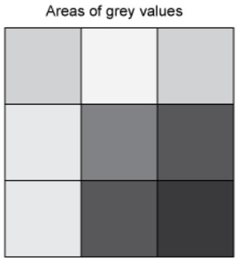

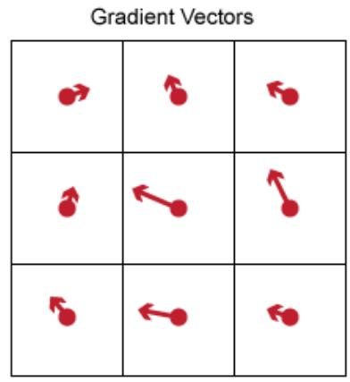  
（ a)

# LineMax

• 一般情况下，梯度核的大小默认为 2 （即表示 2*2pixel 大小的区域），对于一些比较尖锐的特征，需要采用较小的梯核大小以提高精度，而对于一些平滑的特征，则需要较大的梯度核来定位边缘。总体来说，梯度核越小，精度越高但运行时间也越长，反之，梯度核越大，精度下降但运行时间加快。  
• LineMax 工具利用梯度场投影来分析梯度场（类比于之前的卡尺工具和找线工具，其利用灰度投影进行分析），在利用梯度场投影时，需要给定一系列特定方向 ( 一般为垂直预期线的方向）的投影区域，如下图 (a) 所示 .  
• 投影长度定义为投影区域的大小，投影长度越小，则表示投影区域内包含更少的梯度向量，运行速度也会更慢，当投影长度增大时，投影区域内梯度向量增多，且运行速度加快，但可能会得到一些无关的边缘点。

Note: 投影长度需要小于等于梯度核大小（即投影区域内至少包含一个梯度向量）， VisionPro 中若设置投影长度小于梯度大小，则梯度核大小会自动变成投影长度大小

• 每个投影区域均会产生一个单独的梯度向量，并将其传递到直线拟合阶段  
• 梯度向量的强度必须大于绝对对比度阈值和规范化对比度阈值，提高规范化对比度阈值，可以丢弃图像明亮区域中的错误边缘点。当将其设置为 1丢弃所有的边缘点。

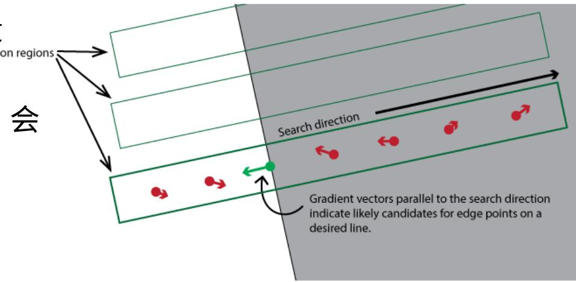  
（ a)  
COGNEX

# LineMax

#  线段的拟合

• 通过前述的梯度场投影，可以找到一系列的边缘点，对这些边缘点进行拟合即可得到一些列线段。  
• 内点和外点： LineMax 将找到的边缘点分为内点和外点，内点和外点的区别在于其是否满足线段拟合参数的要求，当足要求时则定义为内点，否则定义为外点，如下图 (a) 所示 , 绿色点表示内点，用于线段拟合，红色点和黄色点均表示为外

点，其中红色点不考虑用于任何线段的拟合，黄色线表示用于考虑线段的拟合，但是最终却没有将其拟合为线段 ( 相当于找线工具里的忽略点）

#  线段的限制

• 在线段拟合过程中可以设置相应参数，对拟合的线段进行限制，避免拟合得到一些不想要的线段。  
• 线段极性：极性主要包括四种模式， 1 ）明到暗， 2 ）暗到明， 3 ）任即以上两种极性的线段均会拟合， 4 ）混合，区别于任一，其相当于忽略如下图所示，利用混合模式找到的一条线段可能一半极性是暗到明，另一明到暗，而任一模式会将其作为两条线段看待。 Mi

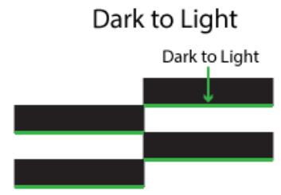

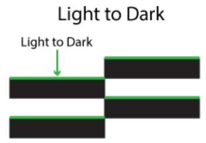

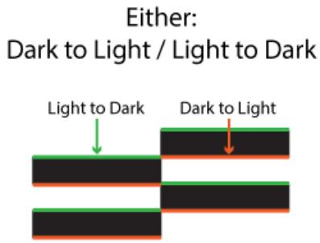

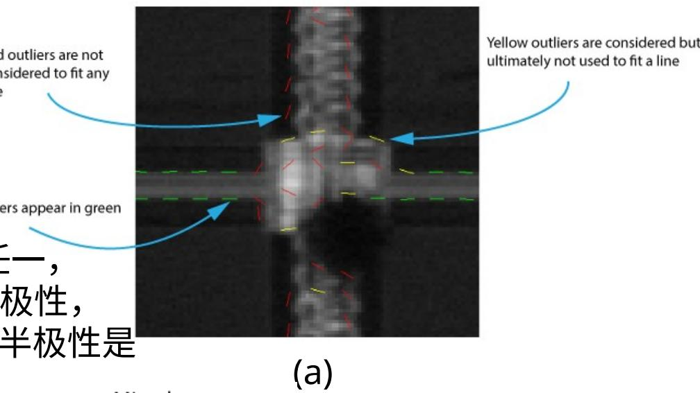  
Mixed: Dark to Light & Light to Dark

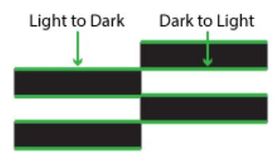

# LineMax

# 图像掩膜

# 拟合算法

# LineMax 的返回结果

• LineMax 支持图像掩膜器，可以利用图像掩膜将图像中的某些区域不纳入计算范围，如右图所示。  
• LineMax 中的线段拟合算法主要分为随机抽样一致性 (RANSAC, 在保留大多数候选边缘点的情况下进行线段拟合 ) 和穷尽模式 ( 考虑所有的边缘点组合进行边缘拟合 ) ， LineMax 默认使用 RANSAC 算法，一般穷尽模式会非常耗时。  
• LineMax返回的结果如下图所示，其中最大误差表示为最远的内点相对线段的距离。

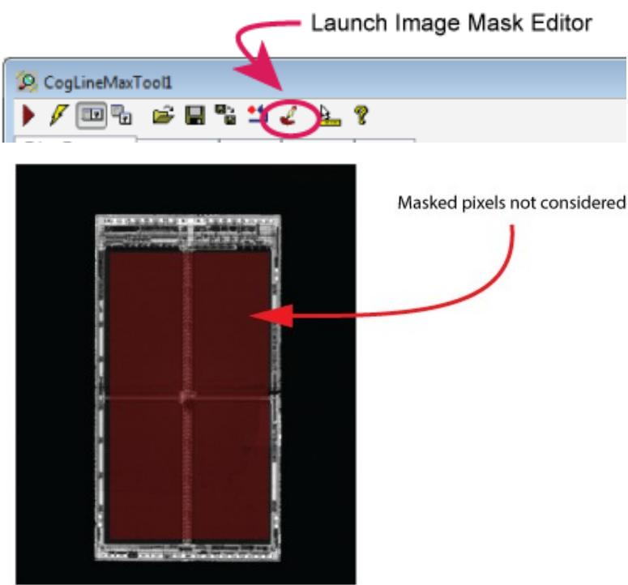

<table><tr><td>ID</td><td>起点X</td><td>起点Y</td><td>终点X</td><td>终点Y</td><td>内点数</td><td>覆盖范围</td><td>正切角</td><td>法角</td><td>长度</td><td>极性</td><td>高度</td><td>对比度</td><td>规范化对比度</td><td>RMS误差</td><td>最大误差</td></tr><tr><td>0</td><td>167.511</td><td>336.999</td><td>332.825</td><td>372.847</td><td>14</td><td>1</td><td>12.235</td><td>102.235</td><td>169.156</td><td>LightToDark</td><td>109.038</td><td>98.9839</td><td>0.453793</td><td>0.433428</td><td>0.886009</td></tr></table>

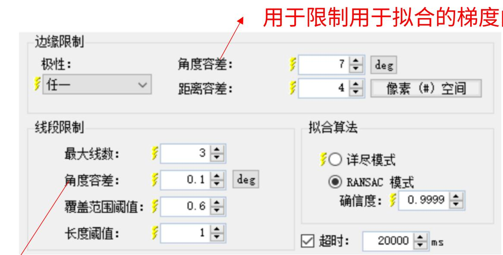

用于拟合后线段的限制

预期线

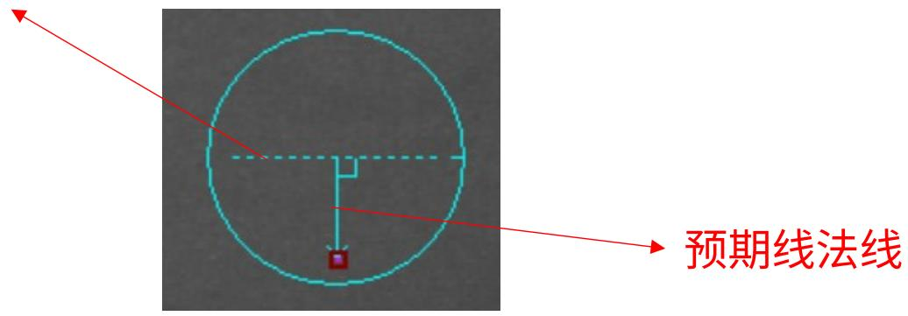

向量，位于容差内的点为内点

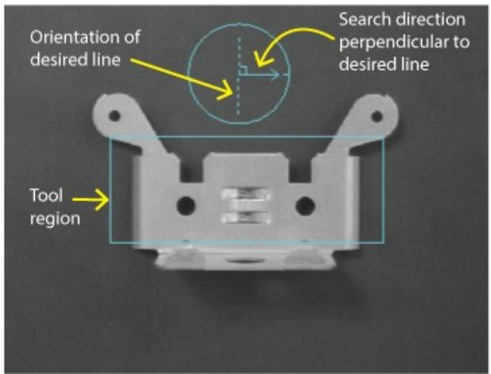  
预期线的方向设置

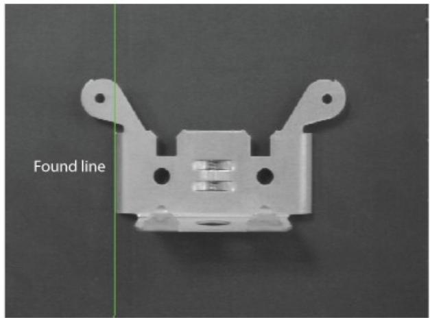

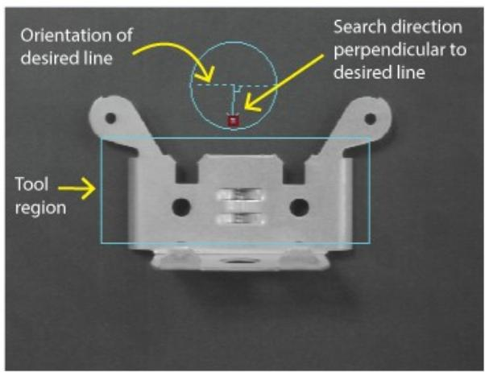

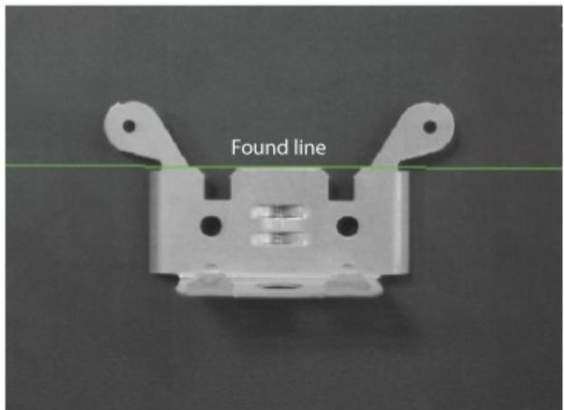