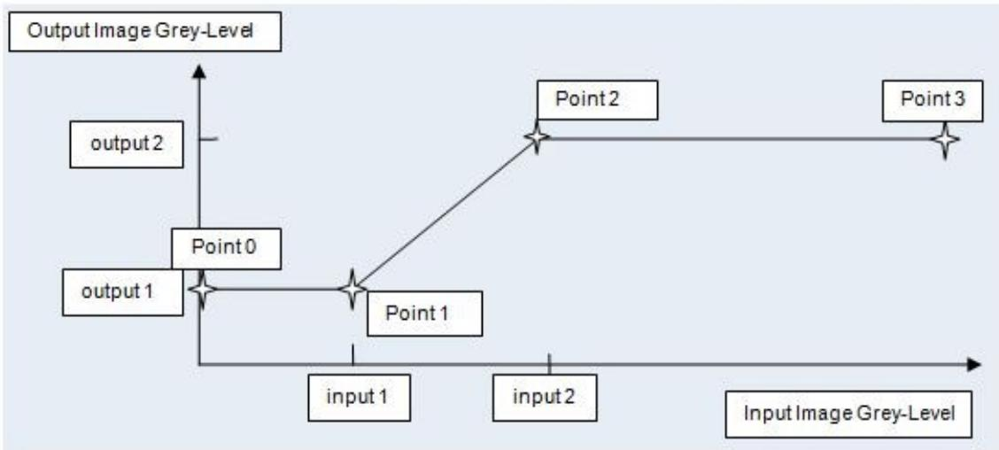
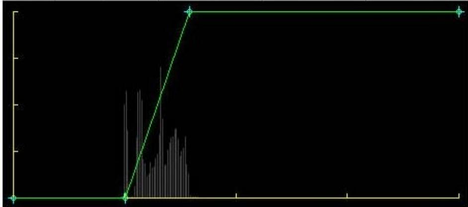
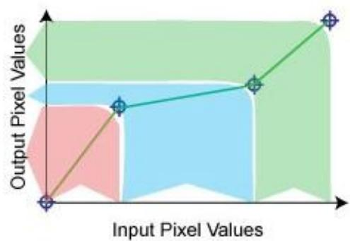
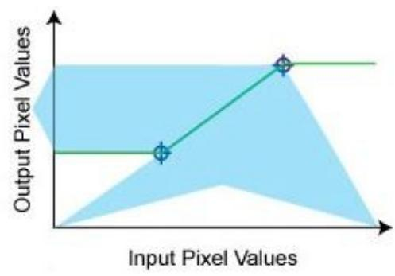
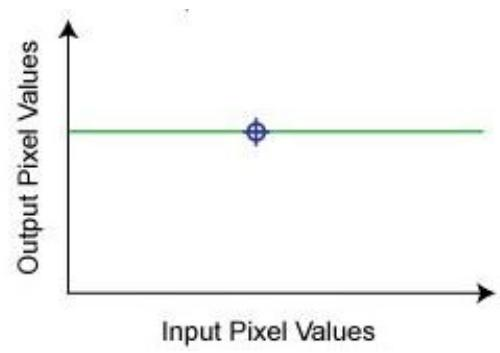
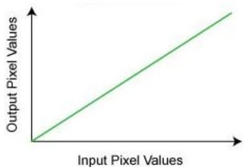
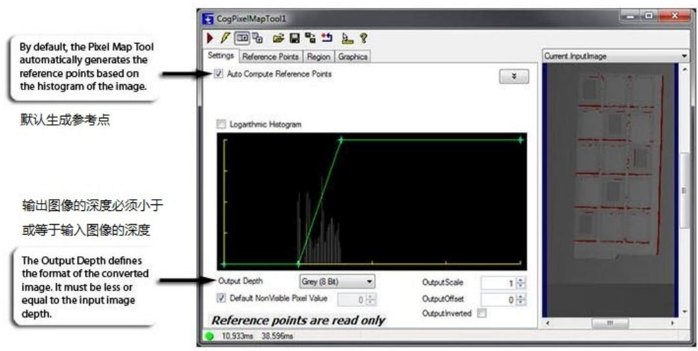
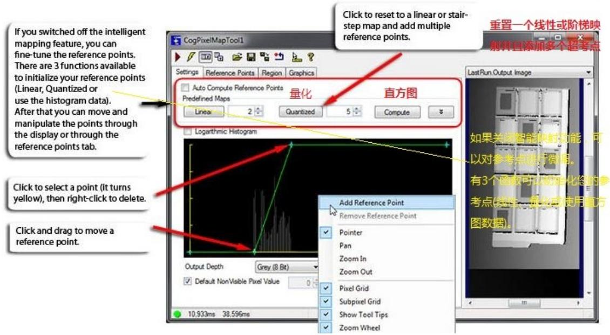
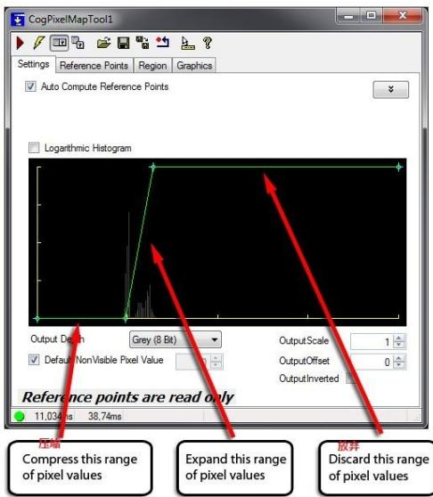

智能像素映射工具是将输入图像(例如DS1000系列传感器中的cogimage16范围图像)的像素值映射到输出图像(例如 CogImage8Grey)的最简单方法。支持的格式和转换如下:

表1:支持转换  

<table><tr><td>From\To</td><td>CogImage16Range</td><td>CogImage16Grey</td><td>CogImage8Grey</td></tr><tr><td>CogImage16Range</td><td>See the note below</td><td>✓</td><td>✓</td></tr><tr><td>CogImage16Grey</td><td>See the note below</td><td>✓</td><td>✓</td></tr><tr><td>CogImage8Grey</td><td>See the note below</td><td>Not required</td><td>✓</td></tr></table>

注意:映射到 CogImage16Range 会生成一个不需要 3D 变换的范围图像，因此不支持。

智能像素映射工具一旦得到输入图像，就会根据直方图数据自动生成映射，增强图像的视觉特征。如果结果不是您所期望的，可以手动映射像素。

这个功能可以让你:

将16位图像减少到8位图像，同时有选择地保留像素值的特定范围。该特性尤其有利于DS1100 用户(CogImage16Range $\Rightarrow$ CogImage8Grey) 。由于

通过选择性地扩大感兴趣特征的像素值范围，提高低对比度图像特征的可见性。这允许您提供增强的x射线和热图像缺陷的可视化。

创建复合像素映射函数，允许您对输入像素值的不同范围应用不同的线性映射。这允许您提取和组合来自热相机的特定温度范围，或选择性地过滤来自DS1000系列位移传感器等3D剖析相机的特定高度范围。

# 1、Reference Points

  
图1:参考点——映射是如何创建的

PixelMap工具的工作原理是根据输入图像的直方图数据创建两个参考点(如果您愿意，也可以创建一系列参考点)。第一个点标识为(input1, output1)，第二个点标识为(input2,output2)。Output1，也称为第一个映射值，可以在默认情况下用于映射不可见像素，但是您可以覆盖这个行为。VisionPro将添加点0和点3来反映输入图像到输出图像的全范围映射。对于 CogImage16Range，不可见的像素值可以自动映射到 output1 或用户指定的值。

<table><tr><td>Points</td><td>Relative Input</td><td>Relative Output</td><td>Absolute Input</td><td>Absolute Output</td></tr><tr><td>0</td><td>0</td><td>0</td><td>0</td><td>0</td></tr><tr><td>1</td><td>0.251602</td><td>0</td><td>16489</td><td>0</td></tr><tr><td>2</td><td>0.395493</td><td>1</td><td>25919</td><td>256</td></tr><tr><td>3</td><td>1</td><td>1</td><td>65536</td><td>256</td></tr></table>

  
图2:参考点及其图形位置

每个参考点定义单个输入像素值到单个输出像素值的映射。PixelMap工具在每一对参考点之间创建像素值的线性映射。线性映射的结果集形成一个映射函数。

所有小于最低参考点的输入像素值都映射到该参考点定义的输出值。所有大于最高参考点的输入像素值都映射到该参考点定义的输出值。如果指定一个映射点，则所有输入像素值都映射该输出像素值。如果没有定义映射点，则使用单个线性映射映射像素。

下图显示了如何使用引用点来定义映射函数。

  
Four reference points: Threelinearmappings

Two reference points: Onelinearmapping, input points below and abovepointsmapped topoints'output values.

One reference point: Allinput valuesmapped toa single output value.

  
图3:参考点和对应的映射

Noreference points: Single linearmapping ofall input values toall output values.

# 2、使用 PixelMap 图形控件

PixelMap工具编辑控件自动生成实际图像的映射函数，如果需要，还可以让您轻松创建、修改、查看和删除定义像素映射的参考点，如下所示:

# 3、使用PixelMap工具将16位图像映射到8位图像

VisionPro支持16位灰度图像的采集和处理，但一些VisionPro视觉工具只支持8位灰度图像。16位灰度图像中的每个像素可以有65,536(2的16次方)个可能的像素值中的一个，而8位灰度图像中的每个像素只能有256个可能的值中的一个。

像素值从16位图像到8位图像的简单线性映射意味着 8位输出图像中的每个像素值对应16位输入图像中的256个像素值。输入图像中的像素值0-255在输出图像中赋值为0，像素值256-511赋值为1，依此类推。这种映射会导致从输入图像中丢失大量信息。

PixelMap工具允许您控制将16位图像映射到8位图像的过程，这样您可以在降低输入图像的整体深度的同时保留有意义的信息。像素映射工具能够根据输入图像的直方图数据自动重绘像素。虽然生成映射公式有多种方法，但建议您首先使用intelligent特性。

# 4、视觉上重新映射16位图像

# 5、使用校准的16位图像

一些16位图像设备，如红外(IR)相机，可能产生校准的16位图像。例如，在红外照相机的情况下，特定的像素值可以表示特定的表面温度。如果您的应用程序对特定温度范围内的特征进行分析感兴趣，您可以配置PixelMap工具来扩展输入图像像素值的相应范围，而不需要参考图像直方图。