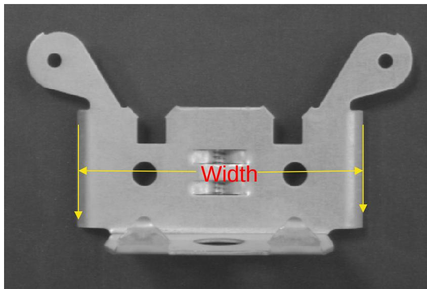
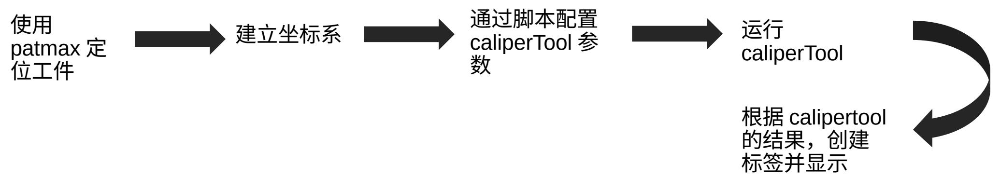
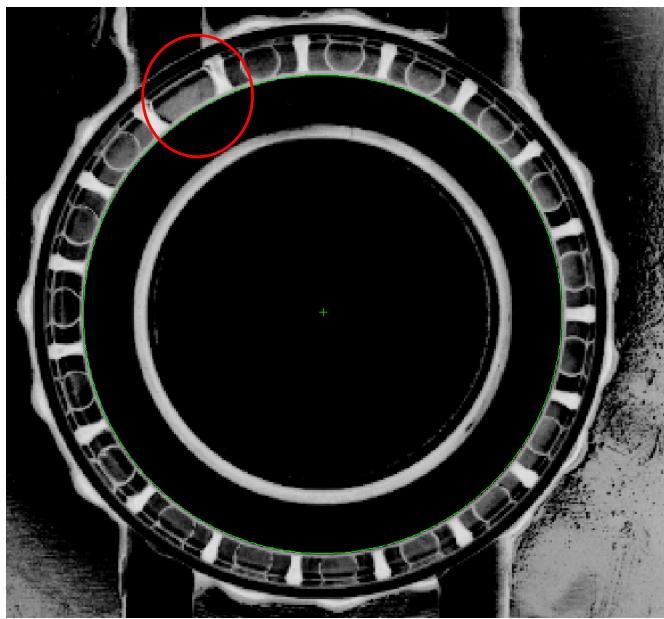
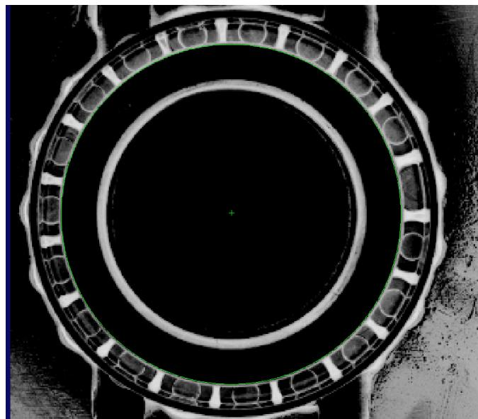
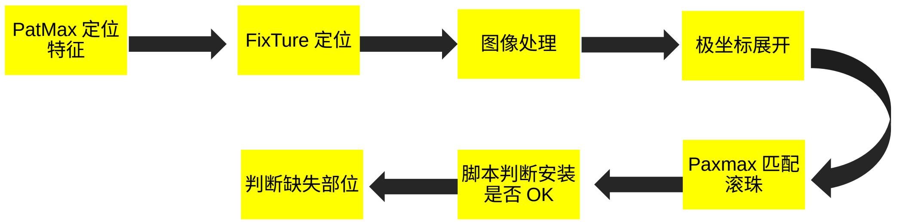
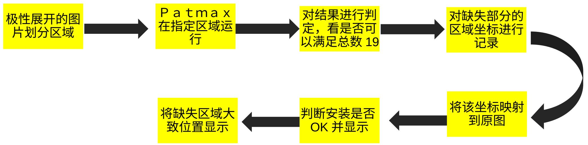
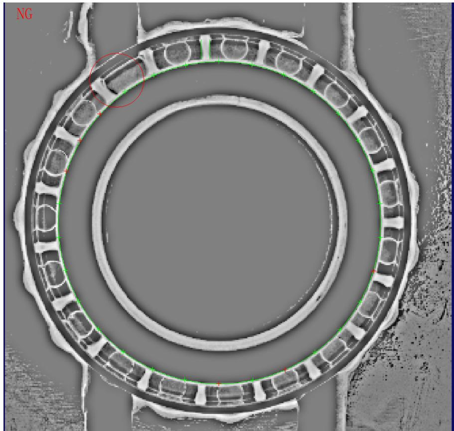

# Script Demo

Leon Lei| 2023/04/08

# Script Demo 学习目标

1. 通过实战练习熟练掌握脚本控制 ToolBlock 的工具的运行参数  
2. 熟练掌握脚本控制 ToolBlock 的工具运行及结果获取  
3. 掌握相关信息在图像上显示的方法

# Script Demo – 案例 1 零件尺寸的测量与显示

#  如下图所示

使用 CogCaliperTool 获取工件的宽度，要求如下：

1.CogCaliperTool 的对比度阈值在运行时设置为 15  
Edge pair width 参数设置为 1000   
2. 将宽度显示在 CogCaliperTool 抓取的两个中间

# Script Demo – 案例 1 零件尺寸的测量与显示

 案例流程分析

# Script Demo – 案例 1 零件尺寸的测量与显示

# 脚本示例

public class CogToolBlockAdvancedScript : CogToolBlockAdvancedScriptBase   
{ #region Private Member Variables private Cognex.VisionPro.ToolBlock.CogToolBlock mToolBlock; //定义要显示的标签 private CogGraphicLabel mylabel; #endregion /public override bool GroupRun(ref string message, ref CogToolResultConstants result) { // To let the execution stop in this script when a debugger is attached, uncomment the following lines. //if DEBUG // if (System.DiagnosticsDBGger.IsAttached) System.DiagnosticsDBGger.Break(); // #endif mylabel $=$ new CogGraphicLabel(); //获取Caliper工具的的引用 CogCaliperTool mycaliper $=$ mToolBlock.Tools["CogCaliperTool11"] as CogCaliperTool; //caliper运行前，按照要求设置运行参数 mycaliperRUNParams.ContrastThreshold $= 15$ . mycaliperRUNParams.FilterHalfSizeInPixels $= 2$ . mycaliperRUNParams.Ege0Position $= -500$ . mycaliperRUNParams.EdgelPosition $= 500$ . // Run each tool using the RunTool function foreach(ICogTool tool in mToolBlock.Tools) mToolBlock.CogTool tool, ref message, ref result); //获取结果,坐标x,y和宽度 double $\mathbf{x} =$ mycaliper.Results[O].PositionX; double y $=$ mycaliper.Results[O].PositionY; double width $=$ mycaliper.Results[O].PositionX; //根据结果设置标签 mylabel.Color $=$ CogColorConstants.Green; mylabel.SetXYText(x,y, "Width:"+width.ToString("f3")); return false; } When the Current Run Record is Created #region When the Last Run Record is Created /xx/ public override void ModifyLastRunRecord(Cognex.VisionPro.ICogRecord lastRecord) { //添加标签 mToolBlock.AddGraphicToRunRecord(mlabel,lastRecord,"CogPMAlignTooll.InputImage","s"); } #endregion

# Script Demo – 案例 2 轴承安装检测

  
NG

  
OK

如图所示，轴承中红色圆圈部分存在部分的滚珠未安装到位，要求如下：

1.我们需要使用合适的方法检测轴承滚珠是否安装到位， 19个滚珠有无缺失  
2. 对缺失部分大致位置进行标注

# Script Demo – 案例 2 轴承安装检测

# 一些挑战

1. 图片质量，滚珠的对比度不是很好  
2. 如何匹配到每个滚珠，以检测滚珠状况  
3. 如何将大致位置标注出来？

1. 也许可以通过一些图像处理增强对比度  
2. 也许可以通过一些手段展开圆形图片，循环匹配滚珠  
3 . 展开后的极坐标图片上的坐标映射到原图

# Script Demo – 案例 2 轴承安装检测

# 程序大致流程

1. 定位  
2. 找到极性展开的区域  
3. 找到极性展开的起始角度  
4.Patmax 循环匹配滚珠

# Script Demo – 案例 2 轴承安装检测

  
脚本思路分析

# Script Demo – 案例 2 轴承安装检测

结果展示

# Script Demo – 总结

#  熟练进行 visionpro 脚本编写的要求分析

1. 熟悉掌握工具的参数  
2. 可以快速通过帮助文档，查询到想要的工具的结果及说明  
3. 熟练的 C# 编程能力

# Thank you