# Framework Introduce

Jianjun.song | 2023/05/03

# 目录

<table><tr><td>分类</td><td>课程</td><td>培训内容</td><td>课堂</td><td>责任人</td></tr><tr><td>Vision Basic</td><td>1.视觉项目评估</td><td>整体视觉项目评估方案,相机,镜头,光源</td><td>0</td><td></td></tr><tr><td rowspan="5">Vision Tools Script</td><td>1.Vision Pro 脚本的编写 &amp; 脚本调试</td><td></td><td rowspan="3">1</td><td rowspan="3">胡建鹏</td></tr><tr><td>2.工具的调用及其参数的输入输出</td><td>工具的调用及其参数的输入输出</td></tr><tr><td>3.VPP界面显示(Inspection输入输出的介绍)</td><td>VPP界面显示(Inspection输入输出)</td></tr><tr><td>4.Vision Tools Script Demo 1</td><td>练习 Vision Tools Script</td><td>1</td><td>甲文</td></tr><tr><td>5.Vision Tools Script Demo 2</td><td>练习 Vision Tools Script</td><td>1</td><td>雷过</td></tr><tr><td rowspan="13">Framework</td><td>1.Framework 框架介绍</td><td>Framework 框架介绍</td><td rowspan="4">1</td><td rowspan="4">锦涛</td></tr><tr><td>2.创建一个新的 MachineSupport</td><td>项目启动,创建一个空的 machinesupport。</td></tr><tr><td>3.相机调用</td><td>相机的设置调用等</td></tr><tr><td>4.标定及 inspection 模块</td><td>标定及 Inspection 的添加,功能设置等</td></tr><tr><td>5.IMachineSupport 接口主要函数介绍</td><td>MS 中最重要的,要用户实现的接口介绍</td><td rowspan="2">1</td><td rowspan="2">建军</td></tr><tr><td>6.其他 Framework 中主要函数介绍</td><td>其他常用的 Framework 函数讲解</td></tr><tr><td rowspan="3">7.通讯模块</td><td>控制 inspection 输入输出</td><td rowspan="6">1</td><td rowspan="6">认同</td></tr><tr><td>控制对应 Inspection 运行</td></tr><tr><td>与 SI 通讯的建立,按照 SI 指令运行inspection,获取结果,发送坐标等结果到 SI。</td></tr><tr><td>8.Vpp 间数据传输介绍</td><td>跨 vpp 数据分享及传递</td></tr><tr><td>9.MachineSupport 自定义窗口的添加</td><td>项目自定义窗体的添加和设计。</td></tr><tr><td>10.存图模块</td><td>项目存图逻辑如 Group 模块。</td></tr><tr><td>11.从 0 开始搭建一个简单的三相机对位项目。</td><td>综合演练</td><td>1</td><td>黄海</td></tr></table>

# Framework 框架介绍

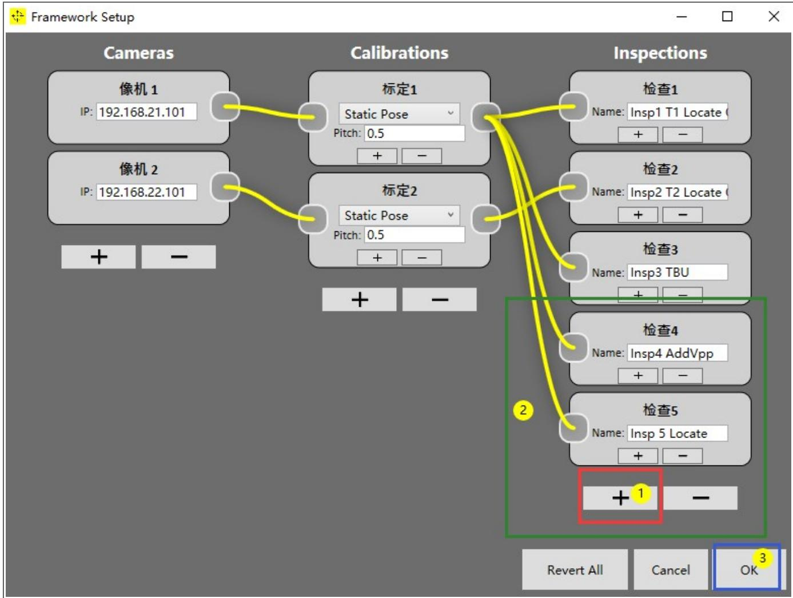

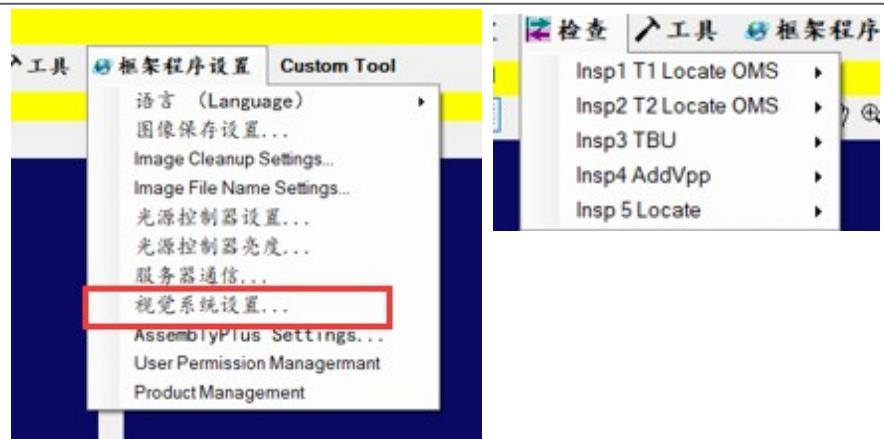

1.打开程序后找到：视觉系统设置  
2. 按照左图中 $\textcircled{1} \textcircled{2} \textcircled{3}$ 顺序添加 VPP 并命名连线，最后确定，该名字就是在 Inspection中显示的名字

# Framework 框架介绍

# Framework 文件分布如下 :

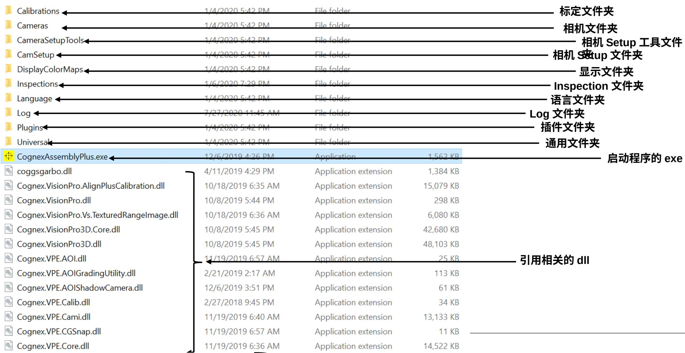

# Machine Support

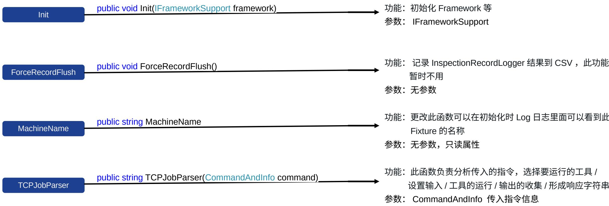

# Machine Support

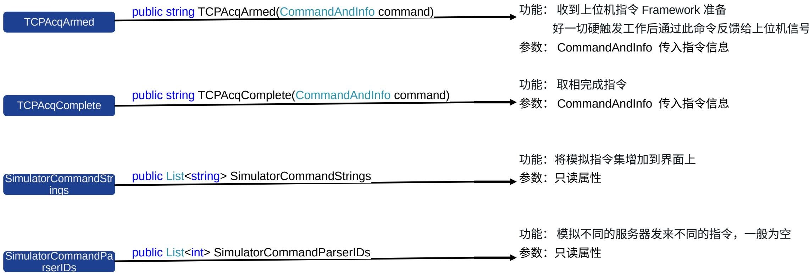

# Machine Support

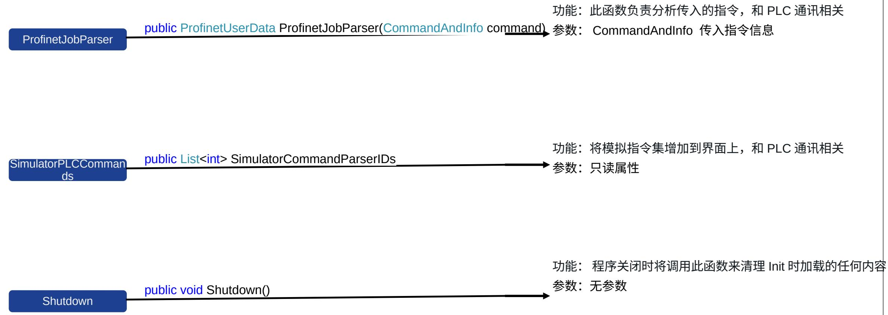

# Machine Support

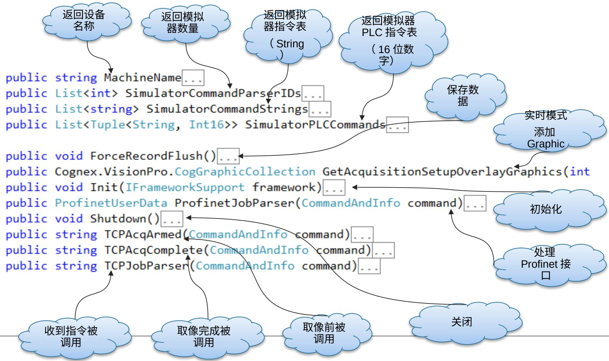

# Machine Support

```cs
namespace Cognex.VS.MachineSupport
{
    public class MachineSupportFactory
    {
        public static IMachineSupport Create()
        }
    public class MachineSupportSample : IMachineSupport
    {
        private IFrameworkSupport m_framework;
        public string MachineName;
        public List<int> SimulatorCommandParserIDs;
        public List<string> SimulatorCommandStrings;
        public List<Tuple<String, Int16>> SimulatorPLCCommands;
        public void ForceRecordFlush()
        {
            public Cognex.VisionPro.CogGraphicCollection GetAcquisitionSetupOverlayGraphics(int)
            public void Init(IFrameworkSupport framework)
            public ProfinetUserData ProfinetJobParser(CommandAndInfo command);
            public void Shutdown()
            {
                public string TCPAcqArmed(CommandAndInfo command);
                public string TCPAcqComplete(CommandAndInfo command);
                public string TCPJobParser(CommandAndInfo command);
            }
        }
} 
```

# Machine Support ：光源的调用

runJobParams.Inputs["WedingPadSort"] = padsort;   
command.WaitForDisplayResultCompleted = true;   
success $=$ m_frameworkRUNJob commanded,LightControllAction.AutoOnAndOff, true, runJobParams);   
//20180728//////////////////////////////////////////////////////////////////////////////////////////////////////////////////////////////////////////////////////////////////////////////////////////////////////////////////////////////////////////////////////////////////////////////////////////////////////////////// ///AutoOnTurn lig   
bRunStatus $=$ success;   
if(!success) { MessageManager.gOnly.Info("Vision Tool Run Error,\r\nCogGraphicLabel errorLabel $\equiv$ new CogGraphicLabel();

# 一般通过软指令触发光源开关：

```javascript
success = m_frameworkRunJob(command, LightControlAction.AutoOnAndOff, true, runJobParams); 
```

# 在飞拍或者 3D 相机等需要硬件触发的：

```javascript
CommandWaitDisplayResultCompleted True, success = m_frameworkRunJob commanded, LightControlAction.NoAction, true, runJobParams); 
```

# Machine Support ：文件介绍


ShelfAlignmentMachineSupport

ShelfAlignmentMachineSupport.sln   
ShelfAlignmentMachineSupport.suo   
ShelfAlignmentMachineSupport.v1...   
ShelfAlignmentMachineSupport.v1..

SimulatorCommandStrings

@ SetupCustomGUI0   
Shutdown0   
F SimulatorCommandParserlDs

SimulatorCommandStrings

P SimulatorPLCCommands   
@ SingedNormDegrees(double degrees)   
@ Sortlmages(int nTBlndex, string strRawlmgPath, string strAnnotatedlmgPath, int nErrCode)   
@a str1AnnotatedlmgPath   
@ str1RawlmaPath

打开 MachineSupport ，找到“ SimulatorCommandStings” 进入

# Machine Support ：添加 command 指令

```typescript
List<string> strings = new List<string>(); //strings.Add("P0"); strings.Add("P1,SN"); //strings.Add("P100"); strings.Add("P200,SN,0,0,0"); strings.Add("P300,SN,0,0,0,0.085,0.08"); strings.Add("P400,SN,0,0,0,0.085,0.08"); //strings.Add("P500"); strings.Add("CheckPosition,FOV"); strings.Add("CheckSize,FOV"); strings.Add("GROUP,SN,OK"); 
```

添加一个你想要的界面指令，可以先仿照上面的指令添加一个自己的指令，这个会在MachineSupport 里重新生成后显示程序预设命令中

当然如果你不知道添加什么命令，可以先空着不添加，后面需要了再添加

# Machine Support ：添加 TCPJobParser

U个5用  
```txt
public string TCPJobParser(CCommandAndInfo command) //收到客户端的指令，对指令进行解析，返回客户端的响应  
{ bool runStatus; string strResult = ""; String cmd = command.Command.Trim(); string[] strArray = cmd.Split〔,〕); if (strArray.Length == 0) return "Unsupported Command"; mStepName = strArray[0]; if (command.IsSimulatorCommand) { mSN = strArray[1]; } else { mSN = strArray[1]; } try { 
```

TCPJobParser(CommandAndInfo command)   
```txt
str4AnnotatedImgPath 
```

```txt
str4RawImgPath 
```

```txt
strMaterialSN 
```

```txt
strMaterialSNTmp 
```

```txt
strTypeG 
```

```txt
strTypeP 
```

```txt
TBU_Function(CommandAndInfo command, String[] commandParts) 
```

```txt
TCPAcqArmed(CommandAndInfo command) 
```

```txt
TCPAcqComplete(CommandAndInfo command) 
```

```txt
TCPJobParser.CommandAndInfo command) 
```

```txt
TCPRjpResultRea TCPJobParser(CCommandAndInfo command) meters parameters) UpdateInspVeri 
```

```txt
WriteSettings0 
```

```txt
WriteXML(string Label_Fir, string Label_Sec, string Label_Thir, string Label_Value) 
```

case "P1":   
```txt
//Rest AlginTimes and AllExecTime  
mAlignTimes = 0;  
mAllExecTime = 0;  
if (mSN.Length < 3) 
```

找到TCPJobParser，添加你上面命令对应的指令，这里分了P1和P100调用不同的 Calibration, 记得后面的 return SendData 中调用不同的函数，比如我们借调的 CamjobParserP1 和 CamjobParserP100

# Machine Support ：添加 CamjobParserP1

public string CamjobParserP1(CommandAndInfo command，string[] strArray）// 方法：这是一个处理联系ToolBlock的方法  
```proto
//Rest stopwatch
spWatch Reset();
spWatch.Start();
mStratTime = DateTime.Now.ToString("yyyyMMdd_HHmmss_fff");
string reslut = "";
bool runStatus;
ulong partID = 0;
JobParameters jobParamsP1 = new JobParameters(0, m_currentPartID);
jobParamsP1.Inputs["I_RunNum"] = 1;
jobParamsP1.Inputs["Str_SN"] = mSN;
jobParamsP1.Inputs["Str_Command"] = command.Command.Trim();
runStatus = m_framework.RunJob commanded, LightControlAction.AutoOnAndOff, true, jobParamsP1);
if (runStatus)
{
reslut = (string)jobParamsP1.Outputs["Str_SendDate)];
}
else
{
reslut = (string)jobParamsP1.Outputs["Str 默认Data)];
}
spWatch_Stop();
mEndTime = DateTime.Now.ToString("yyyyMMdd_HHmmss_fff");
mExecTime = spWatch.Milliseconds;
mAllExecTime += mExecTime;
Thread T1 = new Thread(new ParameterizedThreadStart(SaveImage));
T1.Start(jobParamsP1);
return reslut;
} 
```

该方法通过抓取十字 mark 定位 CurObjectplacement

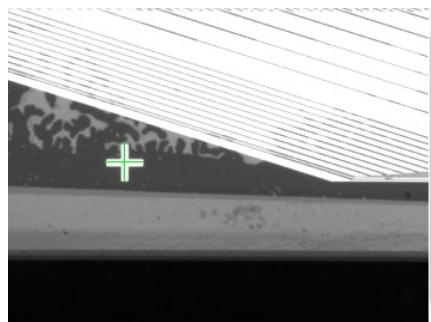

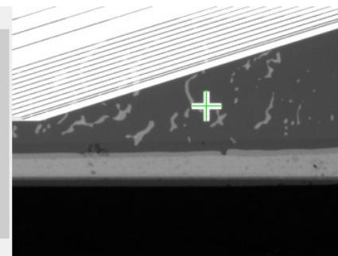

# Machine Support ：添加 CamjobParserP100

```txt
public string CamjobParserP100(CommandAndInfo command, string[] strArray) // 方法：这是一个处理联系ToolBlock的方法  
{ spWatch Reset(); spWatch.Start(); mStratTime = DateTime.Now.ToString("yyyyMMdd_HHmmss_fff"); string reslut = ""; bool runStatus; ulong partID = 0; RunJobParameters jobParamsP100 = new RunJobParameters(0, m_currentPartID); jobParamsP100.Inputs["I_RunNum"] = 100; jobParamsP100.Inputs["Str_Command"] = command.Command.Trim(); runStatus = m_framework.runJob commanded, LightControlAction.AutoOnAndOff, true, jobParamsP100); if (runStatus) { reslut = (string)jobParamsP100.Outputs["Str_S新闻发布Data"]; } else { reslut = (string)jobParamsP100.Outputs["Str 默认Data"]; } string dataStr = ""; for (int i = 0; DataToController != null && i < DataToController.Count; ++i) { Tuple<string, double> entry = (Tuple<string, double>) DataToController[i]; dataStr += string.Format("\\d:\\{0:F3\\}", entry.Item2); } spWatch.Stop(); mEndTime = DateTime.Now.ToString("yyyyMMdd_HHmmss_fff"); mExecTime = spWatch.Milliseconds; mAllExecTime += mExecTime; return reslut; } 
```

该方法通过抓取圆圈 mark 定位 DesObjectplacement

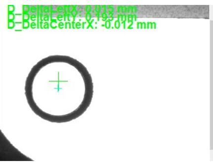

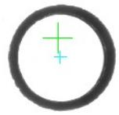

# Machine Support ：和 VPP 进行数据交换和传递

比如我们在 Output 中添加 string 变量 Str_SendData ，将 X Y A 输入给它，当然你也可以添加或者减少数据

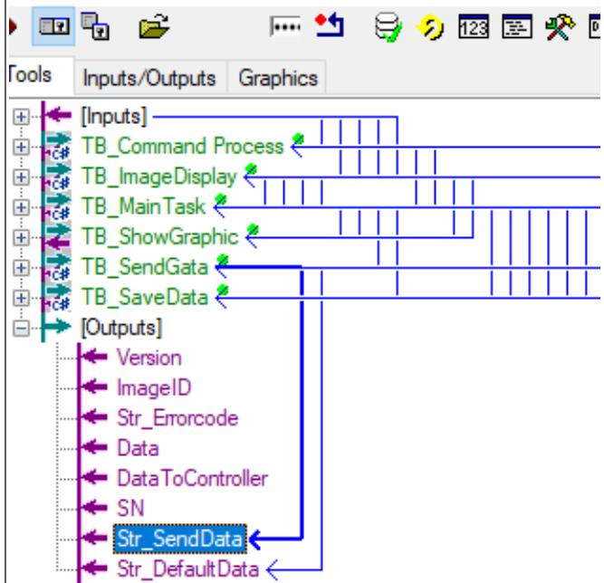

将 Output 中的 str_SendData 传输给 MachineSupport 中 strReturn 并返回，需要修改协议时也可以添加其他数据或者 ErrorCode 之类

strReturn $+ =$ (string)InspRunParams_TBU[j].Outputs["strSend"]; 1 return strReturn;

# Machine Support ：和 VPP 进行数据交换和传递

# 将数据输入到 vpp 的 Input 中

esupport.cs 中XHACiemplate_iviacninesupport

eSupport.HACTemplate_MachineSupport

CogTransform2DLinear MotionB_Pose $=$ new CogTransform2DLinear ()

MotionB_Pose.TranslationX $=$ double.Parse (commandParts[i $^ +$ 1]）

MotionB_Pose.TranslationY $=$ double.Parse(commandParts[i + 2])

MotionB_Pose.Rotation $=$ CogMisc.DegToRad(double.Parse (command

m_Cave_Pose_Info[j].Camera_Pose $=$ MotionB_Pose:

m_Cave_Pose_Info[j].CaveID $=$ Cave_ID:

for (int $\mathrm { ~ \small ~ \frac ~ { ~ i ~ } ~ } = \mathrm { ~ \scriptsize ~ 0 ~ }$ :i<Cave_Num;i++)

FrameworkConfiguration. gOnly.SetInspectionInputLink (GetCalil RobotPose Moving_Pose $=$ new RobotPose(m_Cave_Pose_Info[i].C // RobotPose Moving_Pose $=$ new RobotPose(m_Cave_Pose_Info[i InspRunParams_Temp_Check [i] $=$ new RunJobParameters (GetInspe InspRunParams_Temp_Check[i]. Inputs["Input_Command"] $=$ comma InspRunParams_Temp_Check[i]. Inputs["CaveID"] $=$ m_Cave_Pose_

InspRunParams_Temp_Check[i]. Inputs["MovingPoseX"] $=$ m_Cave_ InspRunParams_Temp_Check[i]. Inputs["MovingPoseY"] $=$ m_Cave_ InspRunParams_Temp_Check[i].Inputs["MovingPoseDeg"] $=$ CogMi

InspRunParams_Temp_Check[i].Inputs["Mean"] = 255:

if((m_TerminalDatas_T2[m_Cave_Pose_Info[i].CaveID - 1]!=] { InspRunParams_Temp_Check[i]. Inputs["TerminalDatas_T2"] InspRunParams_Temp_Check[i].Inputs["TerminalDatas_T3"]

Function_Finallnspection(CommandAndInfo command, int nDispl:

VisionTool Configuration - Inspection 5 - Insp 5 T4C Final Recheck

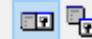


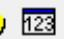


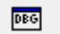


工具输入/输出图形

<table><tr><td>名称</td><td>类型</td><td>值</td></tr><tr><td>MovingPoseX</td><td>System.Double</td><td>450.8</td></tr><tr><td>MovingPoseY</td><td>System.Double</td><td>58</td></tr><tr><td>MovingPoseDeg</td><td>System.Double</td><td>0</td></tr><tr><td>Input_Command</td><td>System.String</td><td>T4C,1,2018060...</td></tr><tr><td>AutoCom</td><td>System.Boolean</td><td>False</td></tr><tr><td>InputImage0</td><td>Cognex.VisionPro.CogImage8Grey</td><td></td></tr><tr><td>InputImage0Home2D</td><td>Cognex.VisionPro.CogImage8Grey</td><td>Cognex.VisionP...</td></tr><tr><td>ProductName</td><td>System.String</td><td>Product 1</td></tr><tr><td>InputImageCameraSettings</td><td>System.String</td><td>Cam4_Exosur...</td></tr><tr><td>InputImage0CameraSettings</td><td>System.String</td><td>Cam4_Exosur...</td></tr><tr><td>InputImageLightChannels</td><td>System.String</td><td></td></tr><tr><td>Mean</td><td>System.Double</td><td>255</td></tr></table>

# 作业

1. 用自己添加的 MachineSupport ，将第 2 个 Inspection 的 Output 端输出 X Y （ x y 都是 double 类型）传到第 3 个 Inspection 中的Input 中对应坐标 X Y  
2.假定调用2个实体相机，相机分辨率是 $2 4 4 8 ^ { \star } 2 0 4 8$ ，要求完成  
a- 相机 1 实时界面时显示一条横线和一条竖线（标记视野中心，线显示绿色）  
b-相机2实时界面时显示三条横线和四条竖线（横线显示红色，竖线显示绿色）

使用合适的函数，完成上述要求


# Thank you