LineMax工具在你的运行时图像中找到一条线段，它对应于线性边缘点:

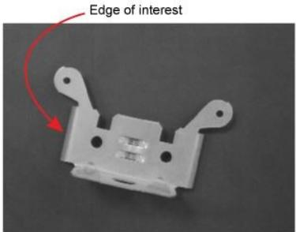

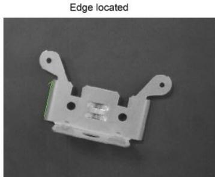

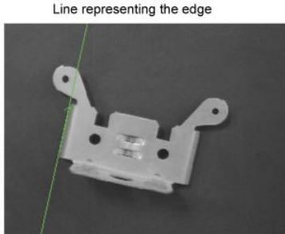

LineMax工具在图像中定位候选边缘点,然后根据指定的标准匹配最好的线段。您将工具配置为您想要查找的线段的预期方向,它的极性(黑暗到光转换),以及其他行特性。

LineMax工具比查找线工具(形状查找工具的一部分)更健壮，找线工具需要精确地放置卡尺位置，以便找到单独的边缘点。Cognex 为新应用程序推荐 LineMax 工具，并继续为现有应用程序支持Find Line工具。

# Gradient Vectors(梯度向量)

LineMax 工具分析运行时图像，以生成一组表示其包含的所有边缘信息的梯度向量。每个梯度向量都有方向和大小:

方向指向图像亮度增加的地方；

星等表示图像的这个区域与周围区域的对比强度。

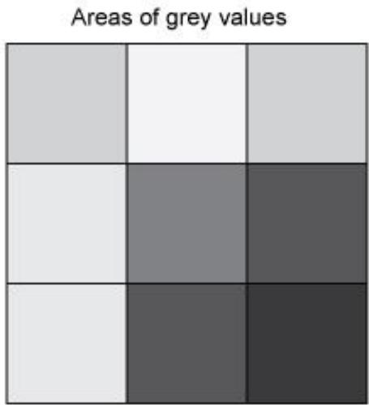

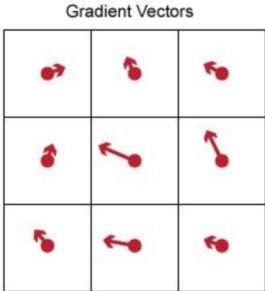

从运行时映像生成的所有梯度向量的集合表示梯度字段。LineMax工具定义了潜在的边缘候选人,并在梯度字段上执行行线,而不是原始的运行时映像。

# Edge Point Detection

LineMax工具使用一组参数来提取要检测的特性的候选边缘点。为这些参数设置最佳值可以使LineMax工具在尽可能短的执行时间内找到所需的边。

为了减少需要处理的数据量并提高执行时间，该工具对运行时图像进行采样，并为梯度核定义的图像的正方形区域生成梯度向量。

默认的梯度内核大小值2允许LineMax工具使用2x2平方内核生成梯度向量来计算运行时图像。具有锐边的运行时图像可能需要较小的精度值，而具有软特性的图像可能需要较大的边缘位置值。通常情况下，较小的值会导致具有较高精度但较高执行时间的结果，而较大的值可以减少执行时间，但代价是一定的准确性。

该工具对梯度场进行投影，分析沿指定搜索方向的一系列投影区域的梯度场:

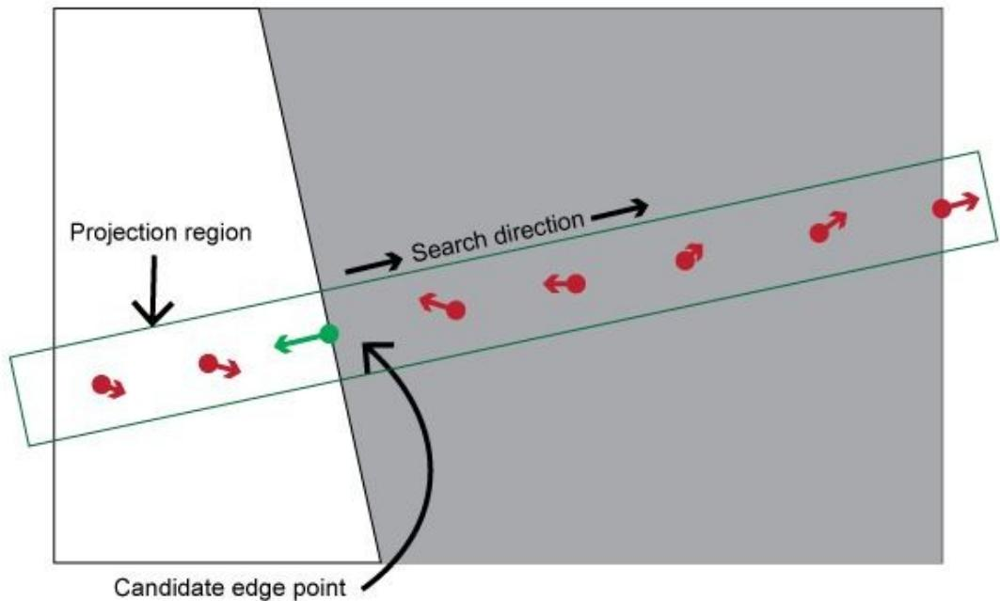

搜索方向垂直于期望线段的方向。

与搜索方向平行的梯度向量被认为是更可能的候选边缘点。

参数投影长度决定了投影区域的大小，最终决定了用来分析每个梯度场的区域数量。一个小的值比一个大的投影区域包含更少的梯度向量。一般来说，小的值需要更多的时间来执行，而大的值可以提高工具的执行速度，但可能无法检测到您希望工具定位的边缘。

每个投影区域产生一个单独的梯度向量，并将其传递到直线拟合阶段。

梯度向量的大小必须大于绝对对比度阈值和标准化对比度阈值。

提高归一化对比度阈值，以丢弃图像亮区中的错误边缘点。注意，将它设置为 1会丢弃所有的边缘点，使得工具实际上没有功能。

# Line Fitting

LineMax工具使用一组行拟合参数将所有边缘点拟合到一个或多个线段上

Fitting Algorithm

该工具支持两种线拟合算法:

穷举模式:对所有的边缘点组合进行线性拟合;

随机样本 致性算法(RANSAC)是一种鲁棒拟合边缘点的算法。

Cognex 建议您使用默认的 RANSAC 模式，并在必要时切换到穷举模式，以找到您的视觉应用程序所需的边缘点

Inliers and Outliers（内点和外点）

LineMax 工具将找到的边缘点定义为 inliers 或 outliers：

该工具仅当边缘点的梯度方向和位置与线拟合参数指定的基于线的梯度角和

距离公差一致时，才将其识别为候选线的输入点。

与线拟合参数不一致的边缘点被识别为离群点。

LineMax工具的编辑控件可以显示每个找到的边缘点的渐变方向，以及表示它是离群点还是离群点的颜色:

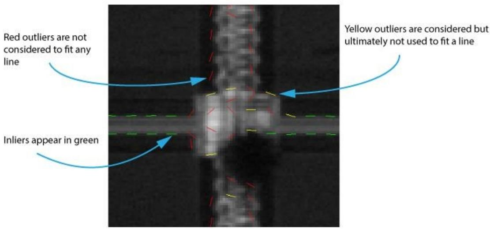

# Edge Constraints

该工具依赖于关于已找到的边点的许多限制来确定它们是否适合所需的线：

# Edge Polarity

您必须指定边缘点的极性，这些点适合您想要工具定位的线段。下图说明了所有可能的极性:

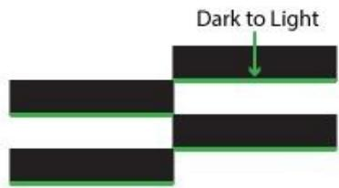  
DarktoLight   
Either:

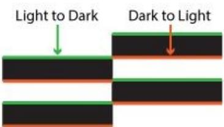  
DarktoLight/LighttoDark

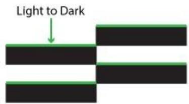  
LighttoDark   
Mixed:

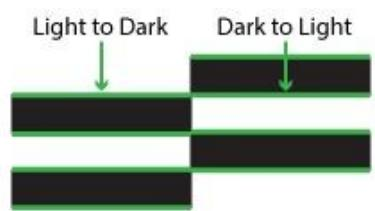  
Dark toLight&LighttoDark

# Edge Angle Tolerance

LineMax工具使用边缘角度公差来限制边缘点的梯度向量方向与线段的期望方向之间的差异。候选梯度向量的方向在该范围内，包括作为内线的发现线段。

当你增加边缘角度公差时，你允许工具考虑更多的边缘点作为边界点，并改变发现线的位置，如下图所示:

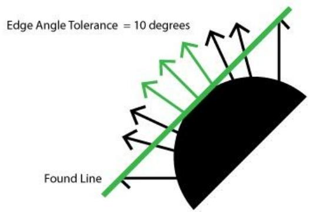

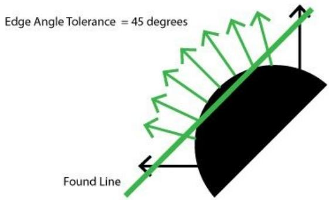

# Edge Distance Tolerance

LineMax工具根据距离公差(以像素或当前选择空间的单位度量)将一条线与候选边缘点进行匹配。

当您增加边缘距离公差时，您允许工具考虑更多的边缘点作为输入，并更改找到的线的位置，如下图所示：

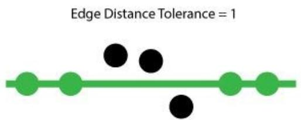

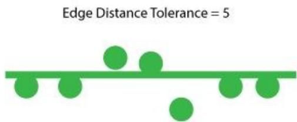

注意，如果此设置太大，则来自平行线的边缘点可以解释为表示单线。一般情况下，设置距离容忍阈值，使其小于图像中最接近的平行线之间距离的一半。

# Image Masking

LineMax工具支持使用添加掩膜图像来防止工具在图像的选定部分中搜索边缘点。掩模图像使用半透明的红色像素来表示被遮挡的像素，而底层图像的其他像素则保持不变。

例如，下图显示了一个没有掩膜的输入图像和一个所有内部特性都被掩膜的输入图像：

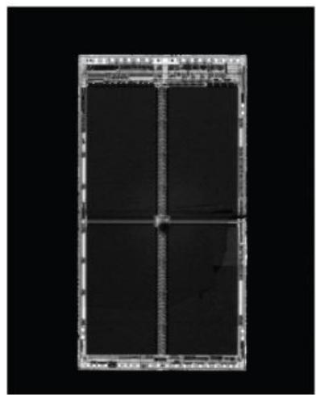

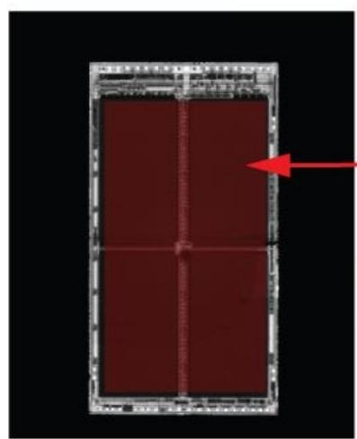

Masked pixels not considered

使用图像掩码编辑器将图像掩码添加到输入图像。要从CogLineMaxTool编辑控件访问图像掩模编辑器，请单击下图中突出显示的按钮:

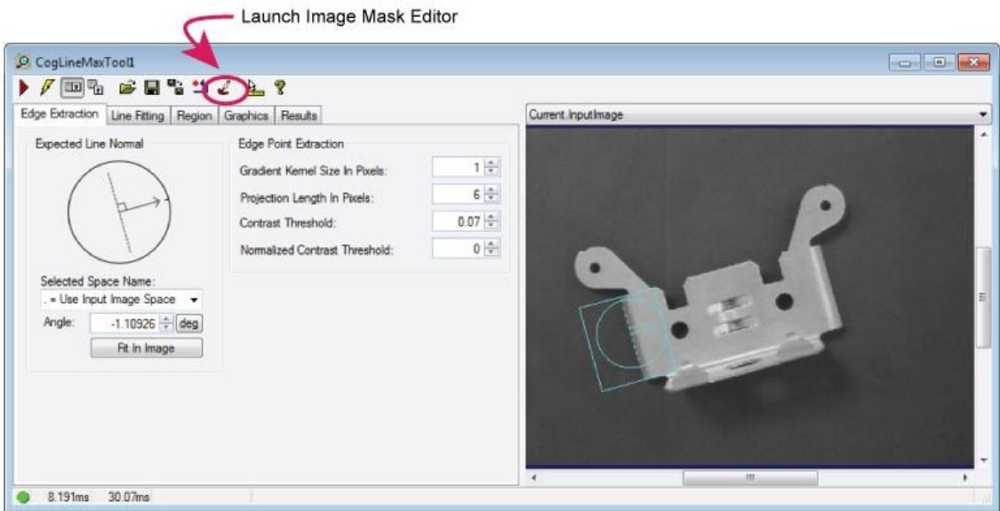

请参阅主题图像掩膜编辑器获取更多信息。

# Image Mask Editor

本主题包含以下部分：

图像掩模编辑器提供了向CNLSearch或PMAlign工具的训练图像添加掩模的方法。有关使用掩码的更多信息，请参阅使用搜索掩码的主题。其他 VisionPro工具使用遮罩来阻挡不需要的训练图像部分，但只有CNLSearch和PMAlign工具提供对图像遮罩编辑器的访问。编辑器将只创建蒙版图像，它不能编辑底层训练图像。

要启动图像掩码编辑器,请点击编辑控件的顶部的控制按钮行 ,即 CNLSearch 或 pm 对齐工具编辑控件。只有当工具有训练图像时,按钮才启用。不能在 CNLSearch和pm对齐编辑控件之外启动图像掩码编辑器。

掩模图像使用半透明的红色像素来表示不关心像素，这些像素被掩蔽起来，而底层训练图像的关心像素则保持不变。如果您正在使用图像蒙版编辑器为一个 PMAlign训练图像创建蒙版，您还可以添加不在乎但得分像素，它以半透明的黄色显示。查看 PMAlign工具的描述，了解更多关于“不在乎但得分像素”的信息。

蒙版出现在叠加在训练图像上的编辑器中。例如，下图显示了图像掩码编辑器，它在PMAlign工具的训练图像上带有掩码：

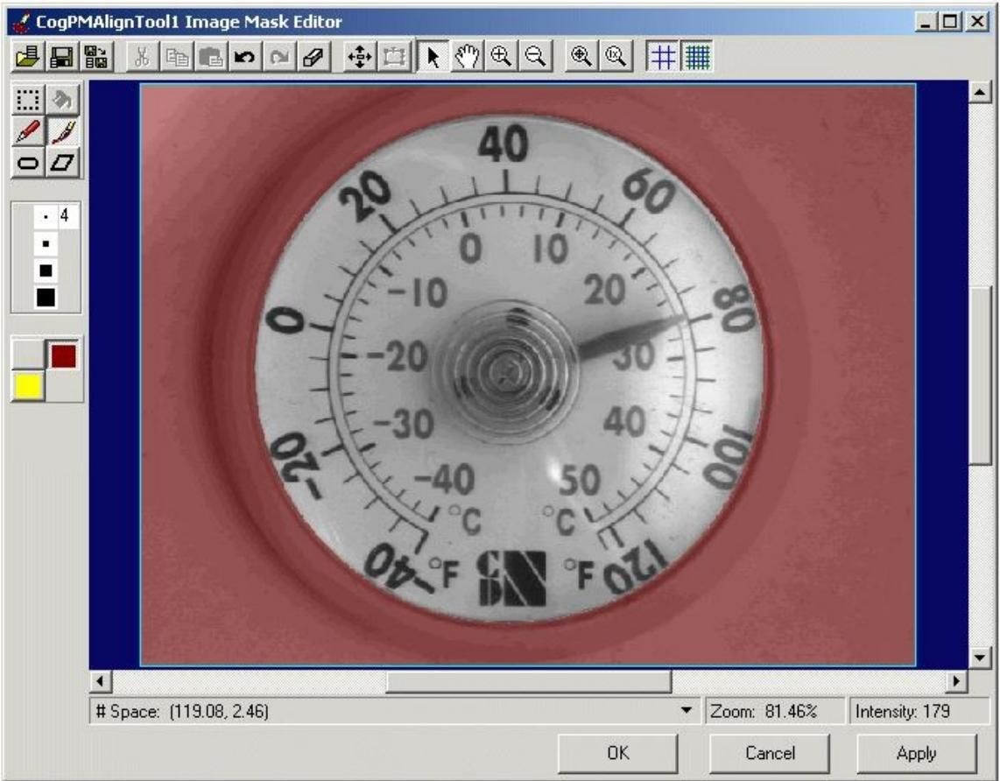

图像掩模编辑器支持沿顶部的按钮栏和沿侧边的工具面板，以及用于显示训练图像及其相应掩模的显示窗口。下面三个按钮出现在编辑器的底部:

单击OK将当前蒙版添加到训练图像并关闭图像蒙版编辑器；

单击“取消”关闭图像掩模编辑器，并放弃自上次应用以来对掩模的任何更改；

单击 Apply 将蒙版添加到训练图像，同时保持图像蒙版编辑器处于打开状态。

注：图像掩模编辑器使用ImageFile工具打开和保存掩模图像，并使用CopyRegion工具执行剪切、复制和粘贴操作。因此，如果您选择执行自定义安装，并且不同时安装ImageFile工具和CopyRegion工具，则图像蒙版编辑器将不起作用。

# Mask Images

遮罩由以下几种像素组成:

Care像素是清晰的，允许分析底层图像的视觉工具将底层像素包含在其分析中；

不要在意那些以半透明的红色显示的像素，这样会阻止分析底层图像的视觉工具将底层像素包含在其分析中；

不要在意，但是要对像素进行评分，这些像素以半透明的黄色显示，表示为了创建搜索模式而忽略训练图像中的哪些像素，而在搜索图像中找到的像素则作为杂乱的特征进行评分。不关心，但得分像素是唯一可用的面具图像的一个恶性工具。

大多数遮罩图像具有与底层图像相同的尺寸，但是您可以使用具有较小尺寸的遮罩。图像遮罩编辑器允许您精确地控制遮罩在图像上的大小和位置。

您可以使用图像掩码编辑器的工具来创建一个新的掩码，或者导入一个现有的位图或TIFF文件并将其用作掩码。但是，请注意，图像蒙版编辑器不支持彩色 TIFF图像。要使用TIFF图像作为掩码，它必须是8位灰度。

最后，如果您导入一个图像来使用 PMAlign工具的蒙版，并且该图像包含的像素的灰度值在128到191之间，那么图像蒙版编辑器将以鲜红色显示它们。Cognex保留了从128到191的灰色值，PMAlign工具不允许您使用包含这些非法值的掩码来训练搜索模式。

# The Display

图像掩模编辑器的显示窗口同时显示当前掩模和底层训练图像。在显示窗口内右键单击，弹出如下图所示的菜单:

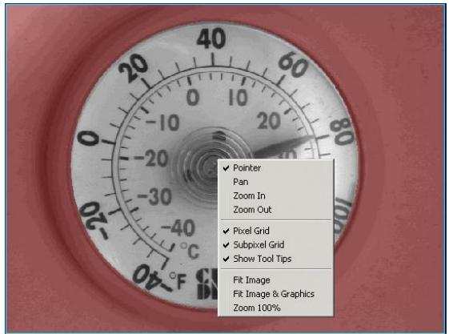

# Control Buttons

图像掩模编辑器支持以下按钮栏沿顶部的编辑器:

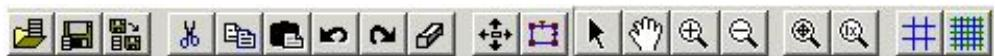

下表描述了每个按钮的功能:

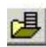

Open Image Mask

导入现有的位图或TIFF文件并将其用作掩码图像。

图像掩码编辑器可用于导入CNLSearch工具和PMAlign工具的掩码，但这些工具在解释传入掩码图像中的灰色值的方式上有所不同。

CNLSearch工具对传入掩码的灰度值的解释如下:

0: Don't Care pixels

1 to 255: Care pixels

PMAlign工具通过以下方式来解释传入蒙版的灰度值:

0 to 63: Don't Care pixels

64 to 127: Don't Care but Score pixels

128 to 191: Reserved for Cognex use (appear as bright red

pixels in the TrainImage buffer) （ 为 Cognex 使 用 ( 在

TrainImage缓冲区中显示为明亮的红色像素)）

192 to 255: Care pixels

# 品 Cut

剪切蒙版图像的当前选定区域。剪切按钮只在您使用工具面板中的选择工具时可用。你切割的掩模区域会变得透明

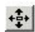

Change mask offset and size

使用以下对话框修改遮罩图像的偏移量和大小:

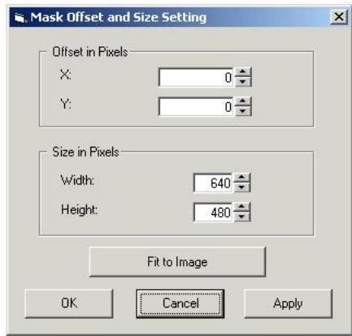

X和Y偏移量测量图像左上角的偏移量。如果您调整图像的大小，旧掩模图像的左上角将被复制到新掩模图像的左上角。

点击Fit To Image，将蒙版图像的尺寸与训练图像的尺寸匹配。安装操作立即进行，不需要单击Apply。