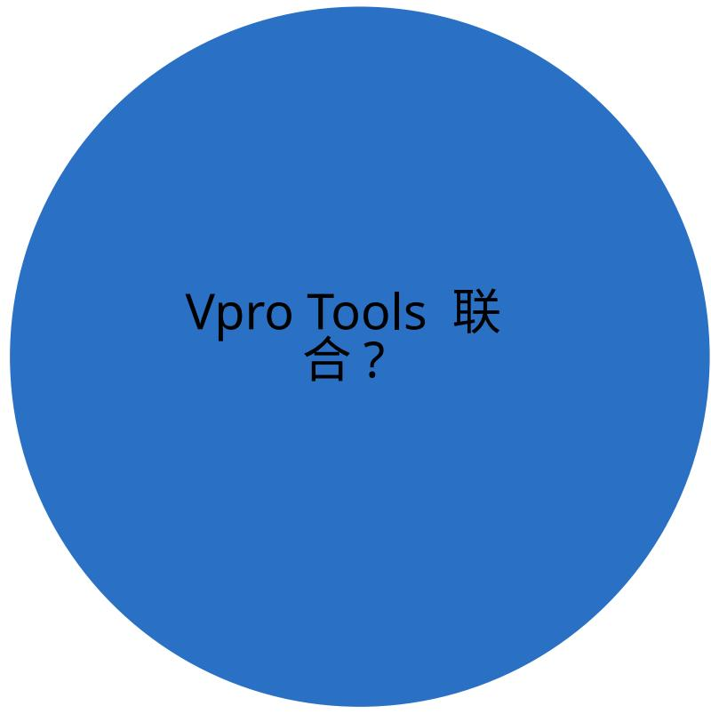
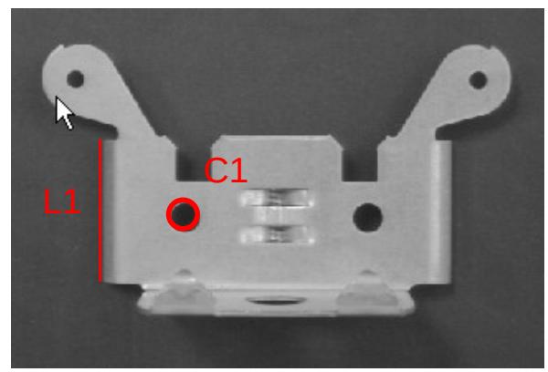
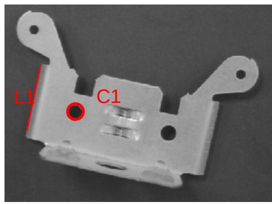
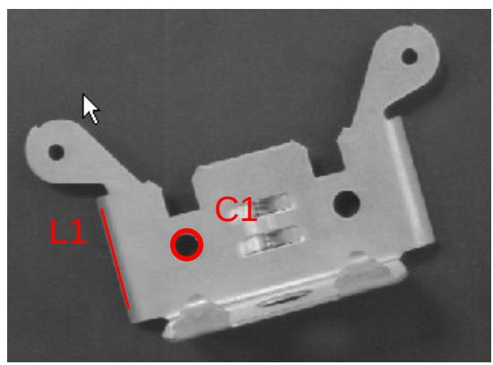
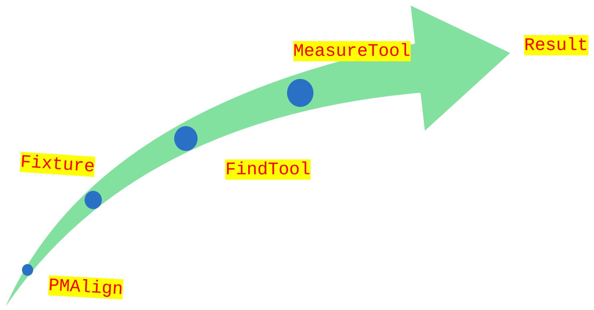
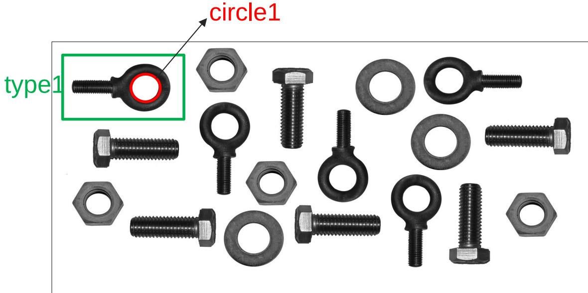
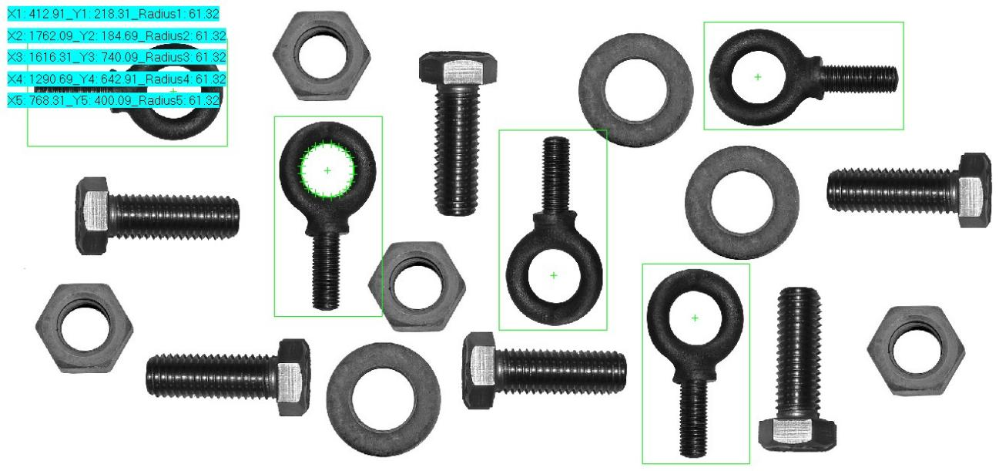
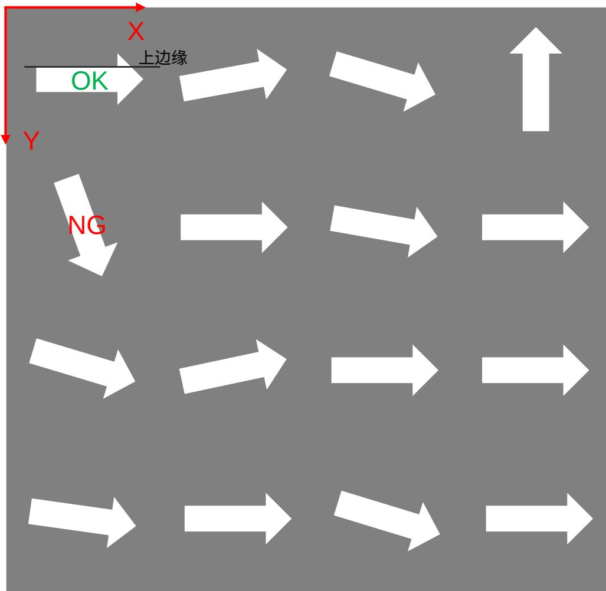
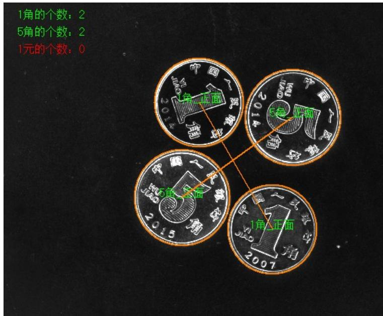
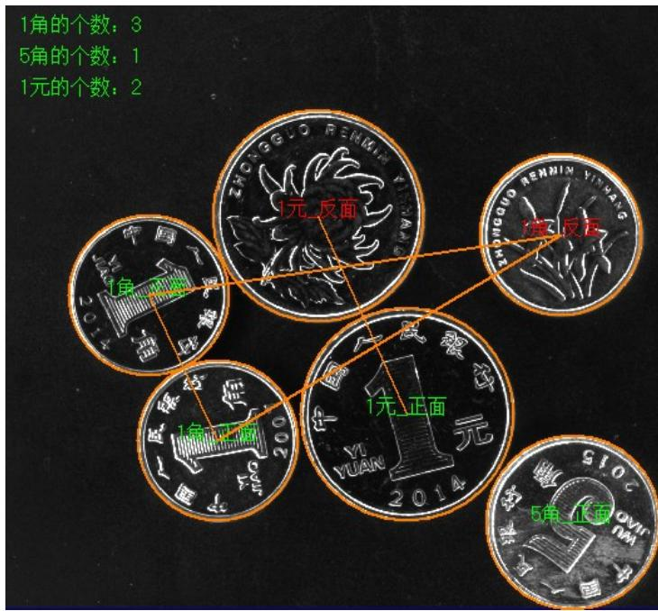

# Vision Tools Demo1

Cognex | 2023.4.18

# 培训目的

本次培训的目的是让大家理解视觉工具之间的使用逻辑关系及脚本的熟练运用；

培训的重点：

1. 工具联合使用  
2. 代码思路详解  
3. 循环逻辑演练   
4. 显示模块演练

什么是 Vpro Tools 的联合 ?

什么是 CogPMAlignTool?

什么是 CogFixtureTool?

什么是 CogFind…Tool?

如何去展示界面化结果 ?

什么是 Vpro Tools 的联合 ?

# 图像特征差异

  
Image1

  
Image2

  
Image3

  
ImageN

该如何处理角度的不同和位置的不同 ?

# Vpro Tools 的使用流程

# Demo1

# 题目要求 :

1. 通过 Vpro 实现准确定位 type1 的螺丝，并测量螺丝circle1 的半径  
2. 将 circle1 的圆心坐标和半径输出到输出端，依次命名为 X1/Y1/Radius1…  
3. 将 X1/Y1/Radius1 所有结果显示在图片左上角

# 结果展示 :

# Demo2

# 题目要求 :

如右图，是一个四行四列摆放的共 16 个工件，使用该图片完成如下需求，作业保存 ToolBlock 即可：

1. 使用 PatMax 或者 Blob 从左到右，从上到下匹配出每个工件，并建立合适的 Fixture  
2. 逐个抓取工件的上边缘计算角度  
3. 判断每个工件的角度，大于 15度的在对应工件上显示NG（红色字体显示），否则显示OK （绿色字体显示）

# 结果展示 :

# 课后练习

# 题目要求 :

按照如下要求完成练习，作业保存为 ToolBlock的形式：

1. 统计图片中所有硬币的数量，命名为TotalCounts 并输出到 Outputs (10)  
2. 分别统计每种数额的硬币的数量 (25)  
3. 正确判断每种硬币的正反面 (25)  
4. 按照右图示例显示相关信息到界面，第二问中硬币数量小于 1 的显示为红色，第三问中硬币是反的也显示为红色 (20)  
5. 将所有硬币的外圆显示在图像上，并将相同类型的硬币的圆心连线，颜色均显示为橙色 (20)（作业保存格式 :ToolBlock ，命名： TB_Name,Inputs 里面增加一个花费时间记录，例如Time:90 ）

# 结果展示 :

# THANKS