# Vision Tools Script

HuJianPeng/2023.4.10

# 培训内容

1.Vision Pro 脚本的编写&脚本调试

2.工具的调用及其参数的输入输出

3.VPP 界面显示（Inspection 输入输出的介绍）

# VisionPro .net 脚本

• VisionPro 脚本通常来说就是 VisionPro 自带的脚本编辑器，通过在脚本编辑器里编辑代码控制工具组运行。

可以让用户自定义和扩展 VisionPro 的功能

根据其他工具的结果有条件地执行工具

对工具结果执行额外的计算

创建定制的、可重用的工具

等等…

# VisionPro .net 脚本

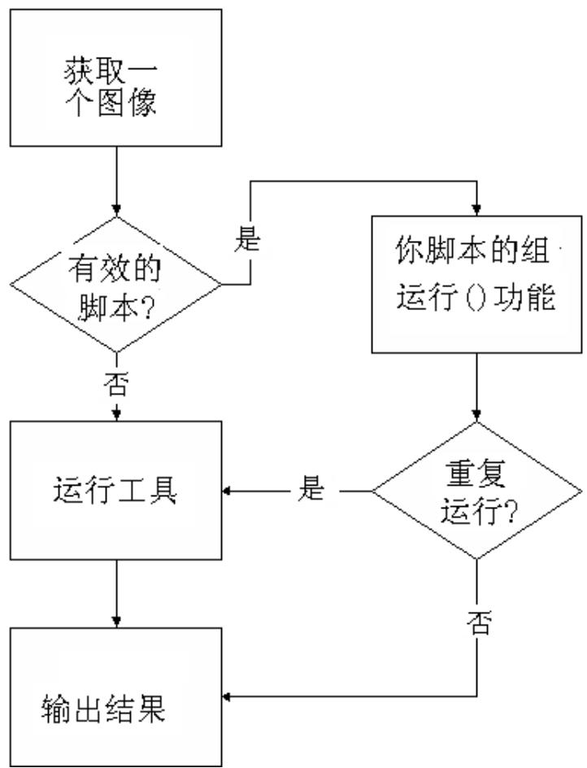

# VisionPro .net 脚本的作用

• 通过引用 “自定义工具/方法”执行 VisionPro 工具不能完成的动作。

获取工具终端不能获得的 API 部分。

例如：CobBlobResult.BoundingBox()

有条件地运行工具或者修改执行的顺序

检查工具组的运行状态(RunStatus)

解决 VisionPro 的设计人员不能预期的问题

# VisionPro .net 脚本

# • 首先，我们看一下 VisionPro 的结构

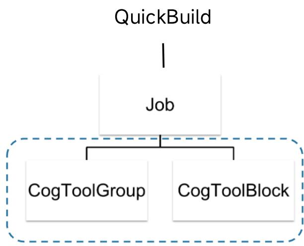

CogToolGroup 和 CogToolBlock 可以彼 此嵌套也可以自嵌套：

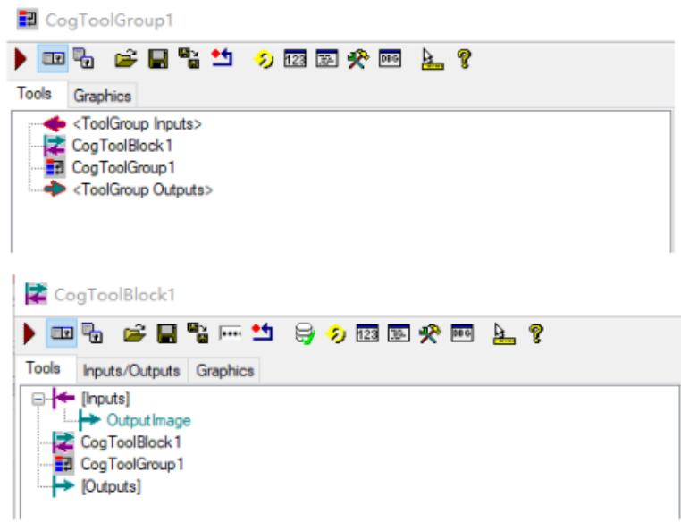

# VisionPro .net 脚本

Job Script

可以控制 Job 内的取像动作等

ToolGroup Script

• 可以控制 ToolGroup 内的工具行为,支持 COM 和.Net 框架

• ToolBlock Script

• 可以控制 ToolBlock 里的工具的运行和逻辑等等,但脚本编辑器相对于 CogToolGroup 更简洁高效

# ToolBlock Scripting

从使用语言来分

VB

• C#

从类型来分

Simple script

Advanced script

在我们项目中基本使用 C# 语言，推荐使用 Advanced script

# Simple vs Advanced

# Simple 优势

使用起来简单

# Advanced 优势

更加灵活（可以动态添加终端，等等）

功能强大（可以对图像显示等进行更改）

可以动态禁用启用工具

等等

Simple Script 与 Advanced Script 区别：

1）Simple Script 没有记录覆盖这一模块，如果需要在脚本编辑器添加界面显示，必须是在 Advanced Script 编辑模式下才可以。

2）在脚本编辑器实例化工具类,代码编辑方式不相同；

3） Inputs/Outputs 输入输出，代码编辑方式也不相同；

# Simple VS Advanced

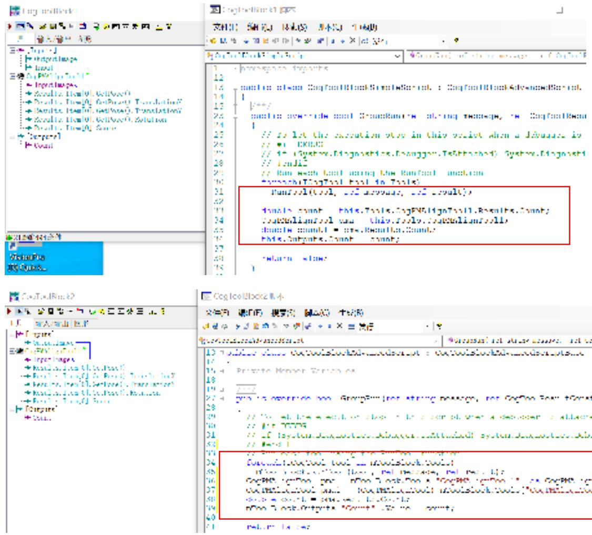

# Simple

# Advance

# 脚本编辑器中每个模块的作用

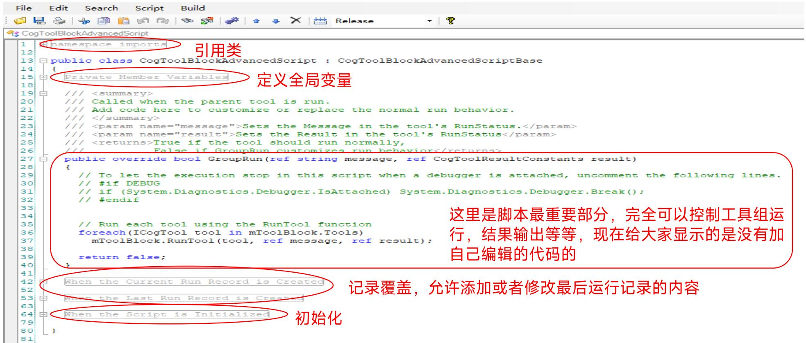

 以上实例是以 C# Advanced Script 为例子，如果是 Simple Script 是没有记录覆盖这个模块的。

# 添加/删除/引用 dll 类

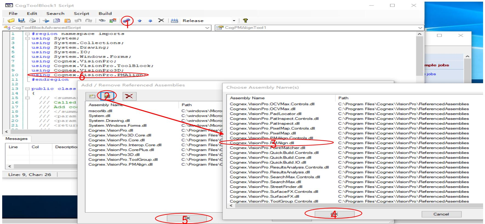

按照 1~6 步骤操作添加 VisionPro 工具类或者.Net 类，以上实例是添加 Cognex.VisionPro.PMAlign.dll.

般情况下，在 CogToolBlock/CogToolGroup 工具组中没有添加对应的工具，而后添加工具就要引用当前工具的类，如果已经添加了当前工具的类，则不需要再次添加类。

# 添加/删除/引用 dll 类

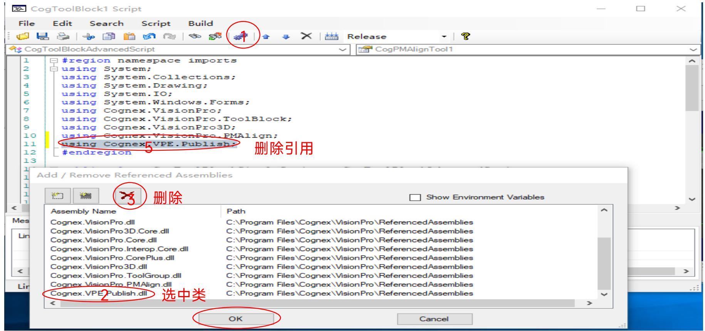

 按照 1~5 步骤操作删除类，以上实例是删除 Cognex.VPE.Publish.dll

# 工具的调用

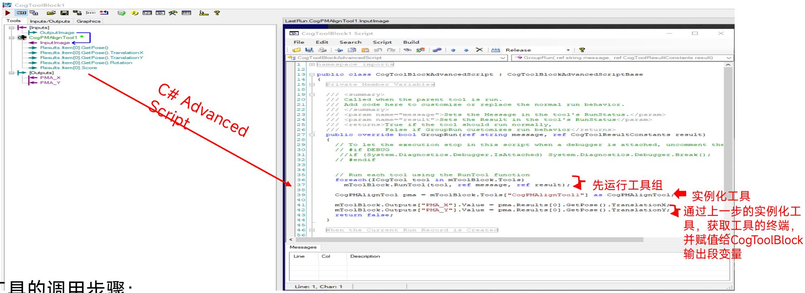

工具的调用步骤：

1）先运行工具

2）再实例化工具

3）通过上一步实例化工具，获取工具的终端结果当然也可以先实例化工具，再给工具赋值属性参数，最后运行工具后获取工具的终端结果也是可以。

# 工具的调用-参数的输入输出

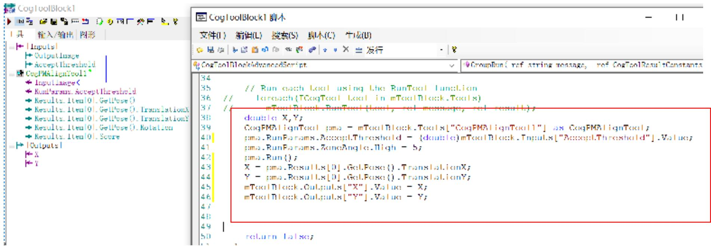

可以用脚本控制工具的运行参数并把输入端的值赋给它。也可以通过脚本运行工具，得到工具的结果赋给输出端输出。

# 脚本调试基本方法

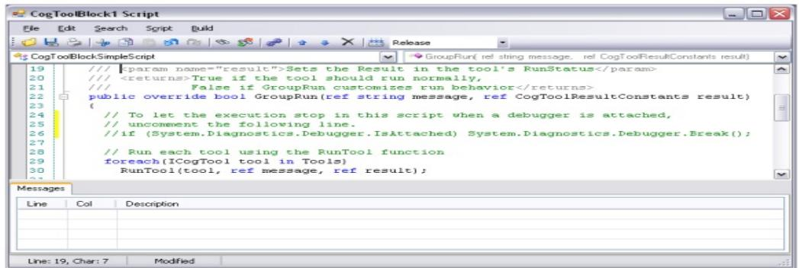


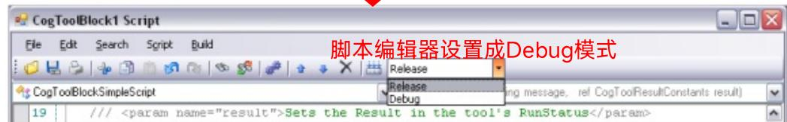


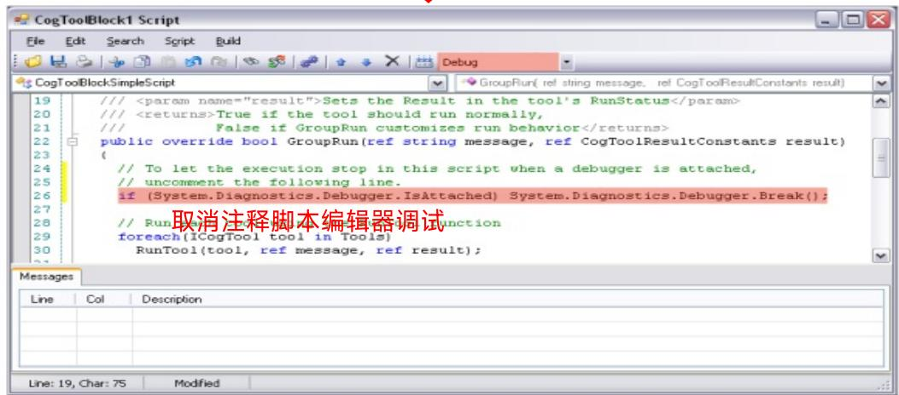

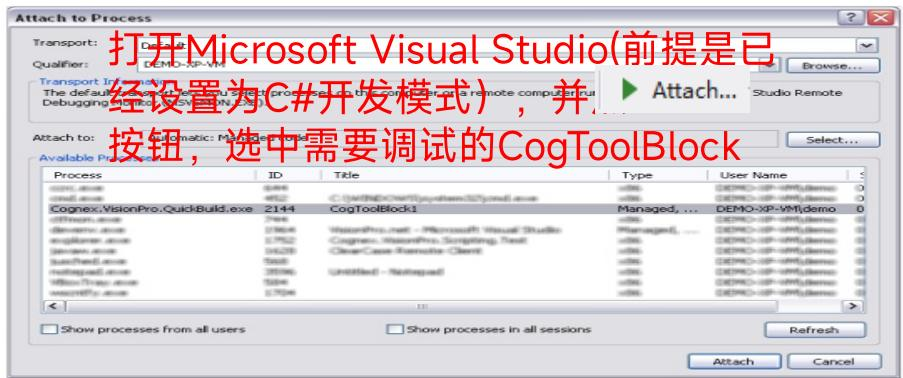


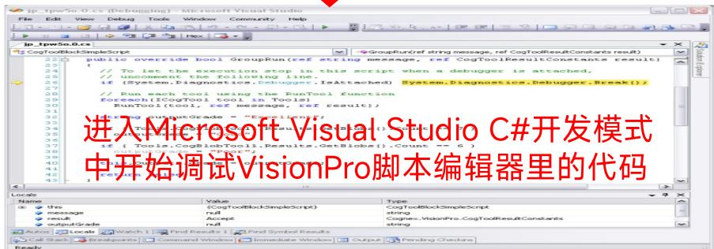


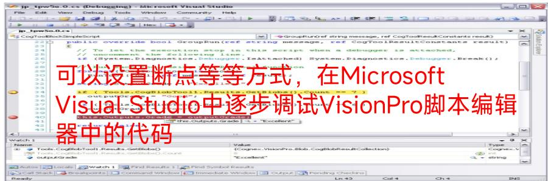

# 课堂演练

1.动手练习添加 CogPMAlignTool,CogFindLineTool,CogCreateLineTool,CogFixtureTool,CogHistogramTool 工具的引用。

2.用如下图片添加两个 CogPMAlignTool，设置不同的参数，用高级脚本实现逻辑：当第一个 CogPMAlignTool 抓到输出第一个 CogPMAlignTool 分数，没抓到时，启用第二个 CogPMAlignTool，并用脚本将第二个 CogPMAlignTool 的接受阈值设为 0.3 抓取，抓到输出第二个 CogPMAlignTool 分数，没抓到输出 999。

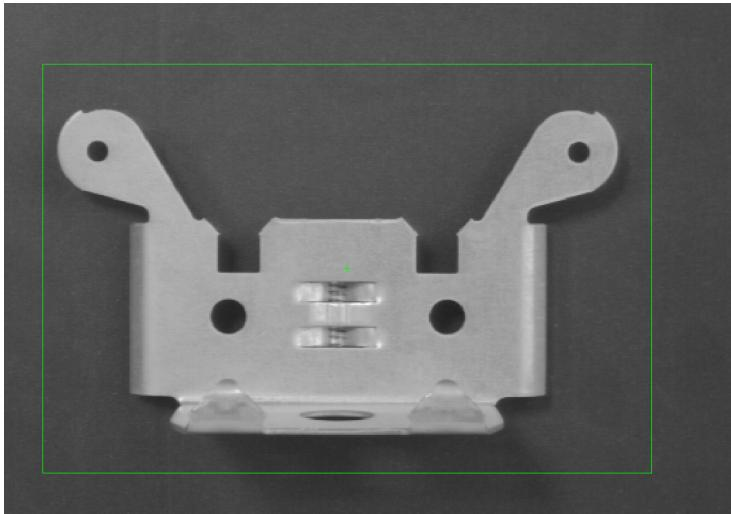

# 显示函数介绍 | Label

# a. CogCreateGraphicLabelTool

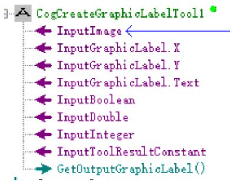

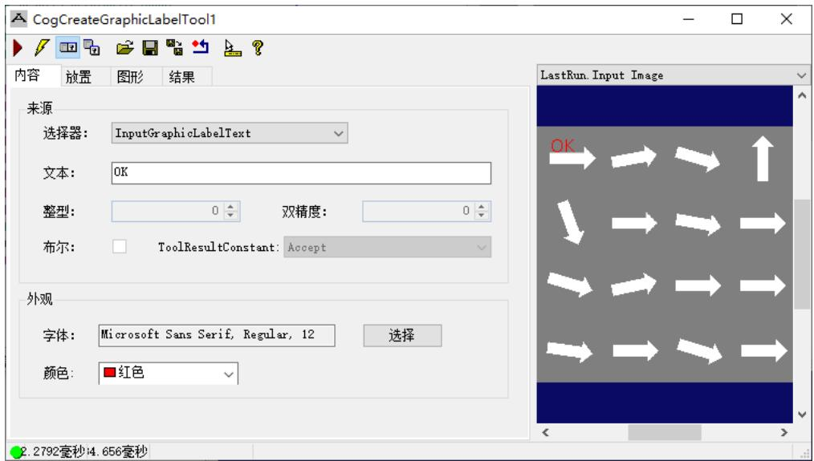

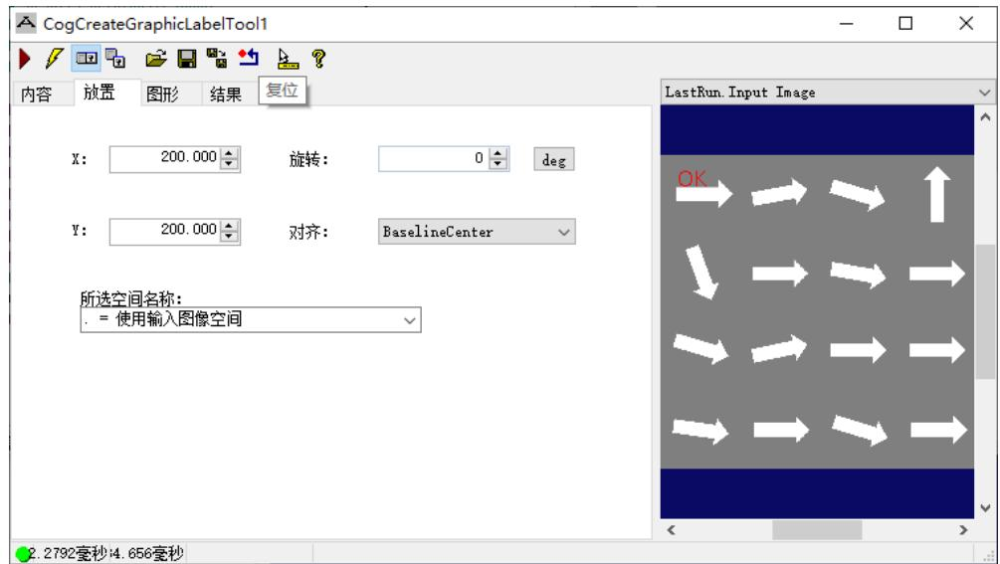

# 显示函数介绍 | CogGraphicLabel

# b. CogGraphicLabel

```javascript
CogGraphicLabel myLabelX = new CogGraphicLabel(); //声明Label对象
ArrayList labelList = new ArrayList(); //声明列表对象
myLabelX.SelectedSpaceName = "#";
//显示空间
myLabelX.Font = myFont; //显示字体
myLabelX.setXYText(100, 100, "text"); //显示位置，内容
myLabelX.Color = CogColorConstants.Red; //显示颜色
myLabelX.Rotation = CogMisc.DegToRad(0); //显示角度
labelList.Add(myLabelX); //添加到列表
```

```javascript
ICogRecord hold = lastRecord.SubRecords["CogIPOnelmageTool1.OutputImage"]; //创建指定的ICogRecordlastRecord.SubRecords.Clear(); //清空所有的RecordlastRecord.SubRecords.Add(hold); //添加指定的Recordforeach(CogGraphicLabel label in labelList){ //将list中所有的label逐一加入到Record中mToolBar.AddGraphicToRunRecord.label, lastRecord, "CogIPOnelmageTool1.OutputImage", "script");}
```

# 显示函数介绍 | CogPointMarker

# c. CogPointMarker

CogPointMarker centerPoint $=$ new CogPointMarker();

ArrayList pointGraphicList $=$ new ArrayList();

centerPoint.SelectedSpaceName = “#”;

centerPoint. $\mathsf { X } = 5 0 0$ ; centerPoint. $\textsf { Y } = 5 0 0$

centerPoint.LineStyle $=$ CogGraphicLineStyleConstants.Solid; //线体类型

centerPoint.LineWidthInScreenPixels $= 2$ ; //线体宽度

centerPoint.SizeInScreenPixels $= 3 0$ ; //点的尺寸

centerPoint.Color $=$ CogColorConstants.Red;

pointGraphicList.Add(centerPoint);

ICogRecord hold $=$ lastRecord.SubRecords["CogIPOneImageTool1.OutputImage"];

lastRecord.SubRecords.Clear();

lastRecord.SubRecords.Add(hold);

foreach(CogPointMarker point in pointGraphicList){

mToolBlock.AddGraphicToRunRecord(point, lastRecord, "CogIPOneImageTool1.OutputImage", "script");}

# 显示函数介绍 | CogLine&CogLineSegment

d. CogLine&CogLineSegment

CogLine myline $=$ new CogLine ();

ArrayList lineGraphicList $=$ new ArrayList();

myline.SelectedSpaceName = “#”;

myline. $. \mathsf { X } = 1 5 0$ ; myline. $\Upsilon = 1 5 0$ ;

myline.Color $=$ CogColorConstants.Red;

myline.SelectedLineStyle $=$ CogGraphicLineStyleConstants.Solid;

lineGraphicList.Add(myline);

ICogRecord hold $=$ lastRecord.SubRecords["CogIPOneImageTool1.OutputImage"];

lastRecord.SubRecords.Clear();

lastRecord.SubRecords.Add(hold);

foreach(CogLine line in lineGraphicList){

mToolBlock.AddGraphicToRunRecord(line, lastRecord,"CogIPOneImageTool1.OutputImage", "script");}

# Inspections(.vpp)输入输出端口

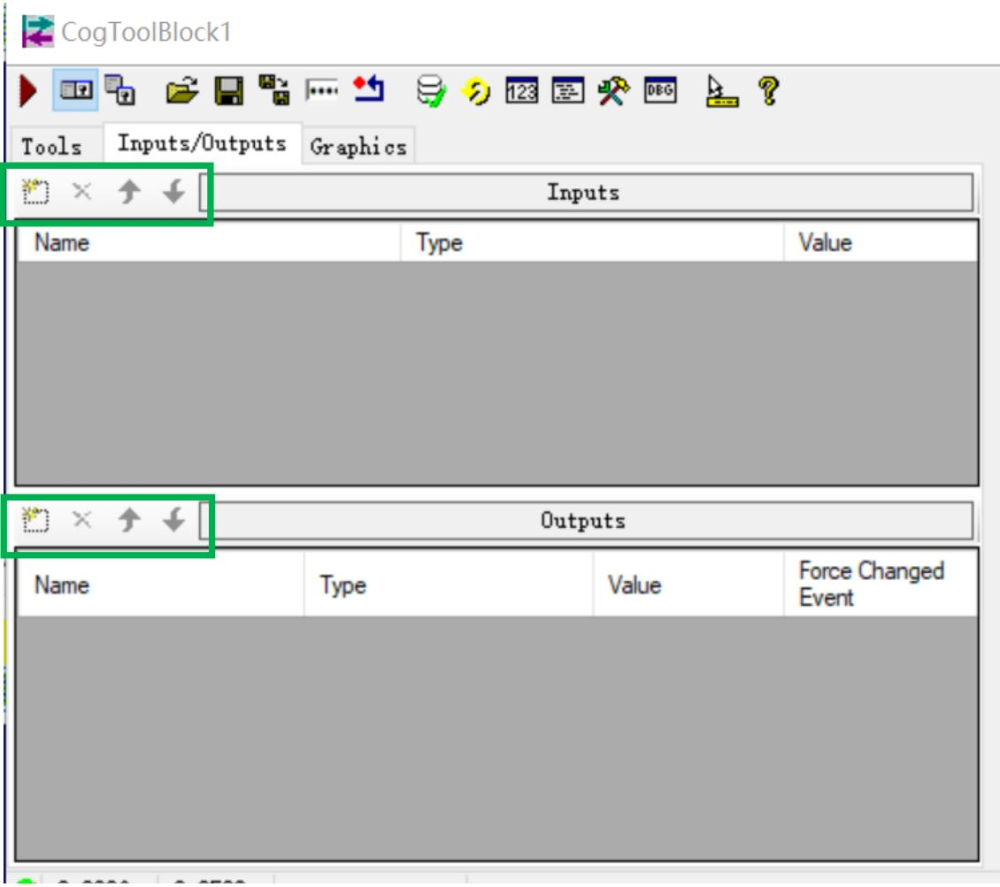

CogToolBlock 输入输出端口是显示当前 CogToolBlock 的输入输出值，该值包括图像，Visionpro 工具，数据，数组等等类型。

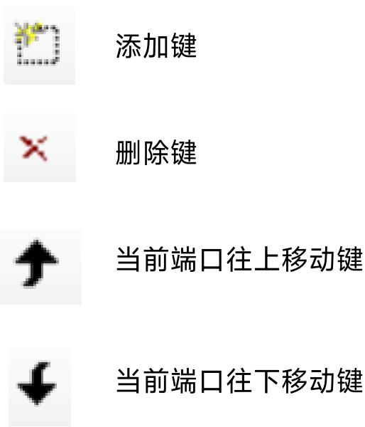

# Inspections(.vpp)输入输出端口

#  CogToolBlock 输入输出的常见类型

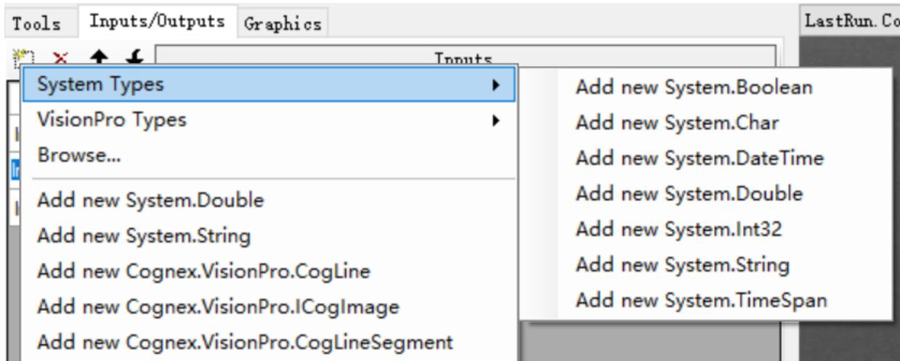

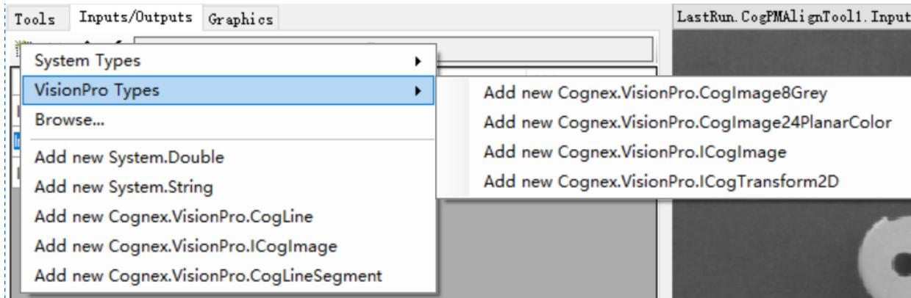

 System 类型

 Visionpro 类型

# Inspections(.vpp)输入输出端口

#  CogToolBlock 输入输出的常见类型

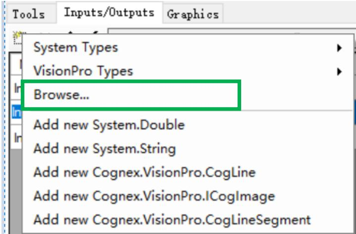

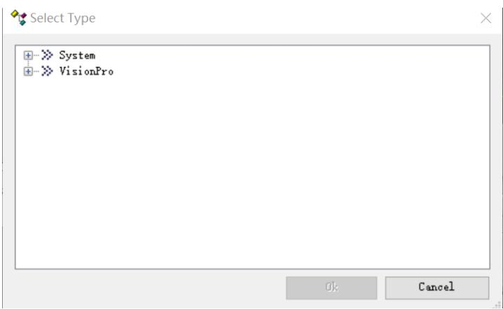

 点击 Browse 进去后，会看到所有的 System 类型和 Visionpro 类型

 如果在里面找不到我们想要的类型，我们可以在脚本里面添加，例如：输入端添加一个 ArrayList 类型

```javascript
ArrayList ss = new ArrayList();
mToolBlock.Inputs.Add(new CogToolBlockTerminal("list", ss));
```

 在 C#Advanced script 里面输入上图代码，再运行一次该 ToolBlock，就自动添加了该 ArrayList 输入端口，添加完要屏蔽或者删除该代码

# 课堂演练

如图所示，抓取两个圆，显示出左边圆心 XY 坐标，画出两个圆心连成的线段并用红色显示

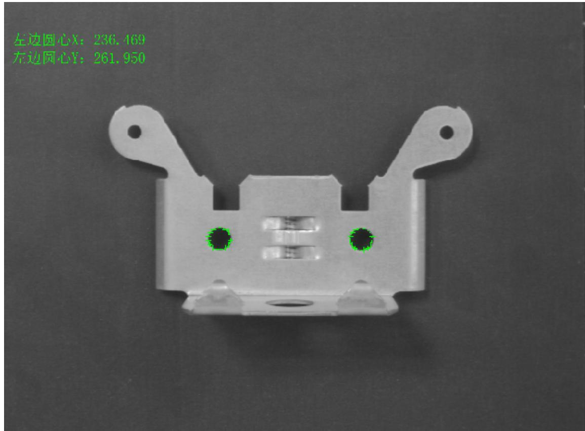

# 课后练习

使用 PMAlign 工具实现如图显示，抓出所有滚珠，显示滚珠数量（20 分），如果滚珠个数小于 15，该产品用红色字体显示为 NG，反之，绿色字体显示为 OK（20 分），抓取每一个滚珠的中心点，再根据抓取的每一个滚珠的中心点，拟合一个圆，并在界面显示出拟合圆的圆心坐标（30 分），在每个滚珠中心位置显示各滚珠的得分（30 分）。

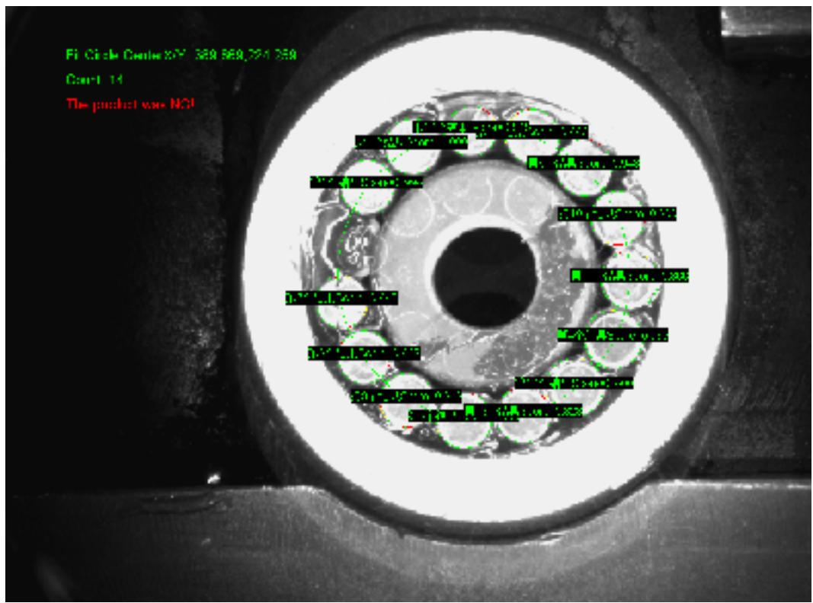

COGNEX

# FASTERFORWA

Thank You
