# ID basic knowledge

terry.ding@cognex.com

丁正勇

# 议程

- 条码基础知识   
一维码与二维码的差异  
- 激光识读器和图像式识读器

# 基本码制

- 一维线性条码  
- PDF417   
- DataMatrix   
QR-Code

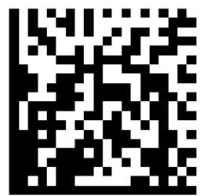

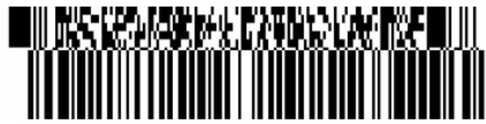

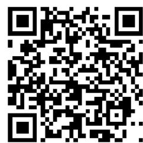

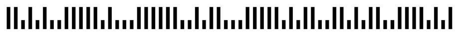

1111111111111111111111111

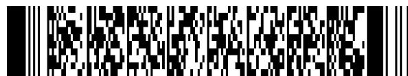

# 条和空的排列规则不同形成了不同的码制，常用的如：

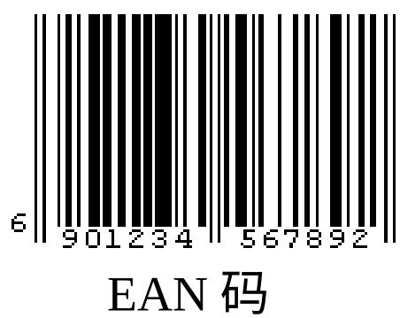

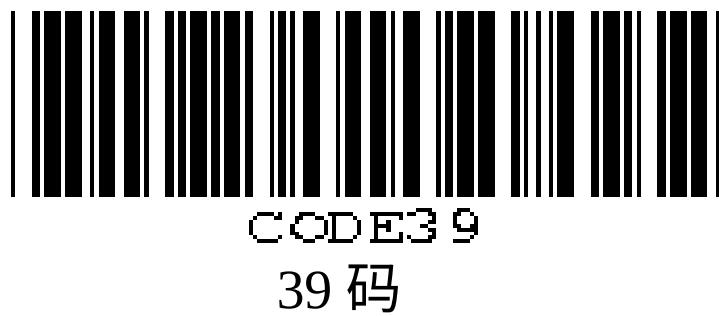

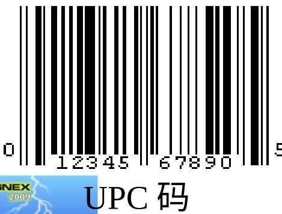

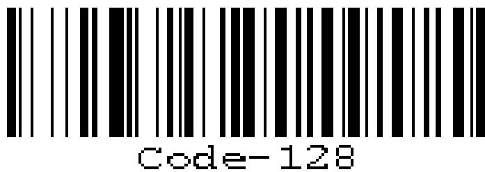  
128 码

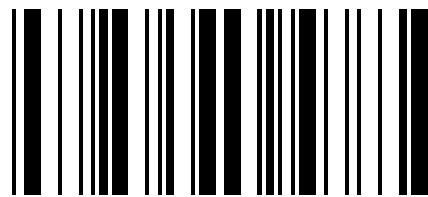  
A1234B   
Codabar 码

# 常用的二维条码

  
Data Matrix

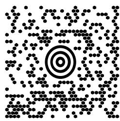  
Maxi Code

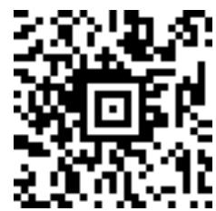  
Aztec Code

  
QR Code

  
Vericode

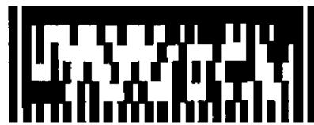  
Ultracode

  
PDF417

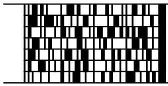  
Code 49

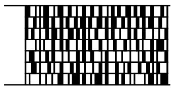  
Code 16K

# 条码符号的组成

# 二维矩阵码符号的组成

计时图录

数据区

非共或单元

L型导边区

#

# 直接元件标示（DPM）工艺

# 4种主要方法

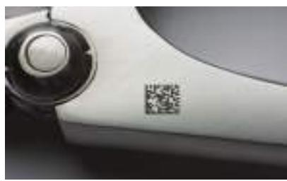  
激光

  
喷墨

  
打点阵和复刻

  
电化蚀刻

# 选择时的要素

- 元件期待寿命  
- 材料成分  
- 环境磨损  
数量

- 表面质地  
编码数据量  
- 空间  
- 位置

# 直接元件标示 最佳实践：数据矩阵标示的放置

- 在清晰、无障碍的位置标示  
- 确保代码周围至少预留 3-4 个单元宽度的“静音区”   
- 在曲面上标示时，代码不得大于直径的 $16\%$ 或部件周长的 $5\%$ 。

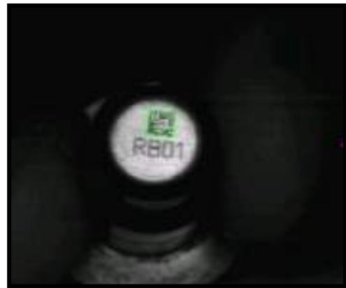  
低分辨率的小代码

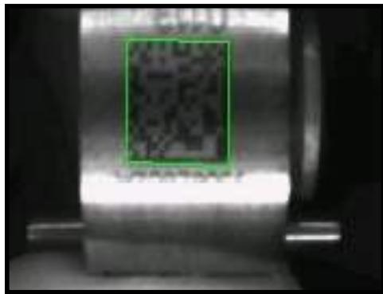  
在弯曲表面上标记

# Module Size Calculation:

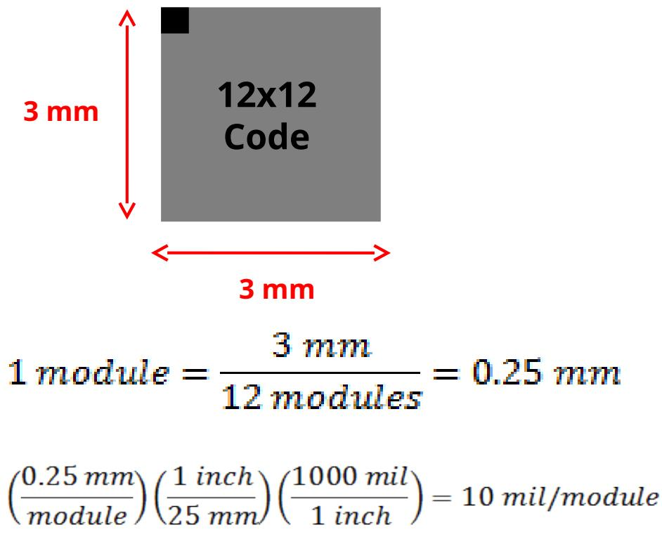

# 什么是 PPM? (Pixels per Module)

A: How many pixels on the sensor for each module, at a focal distance.

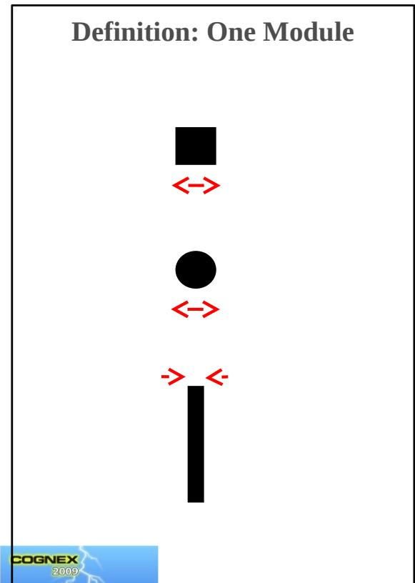  
Example:

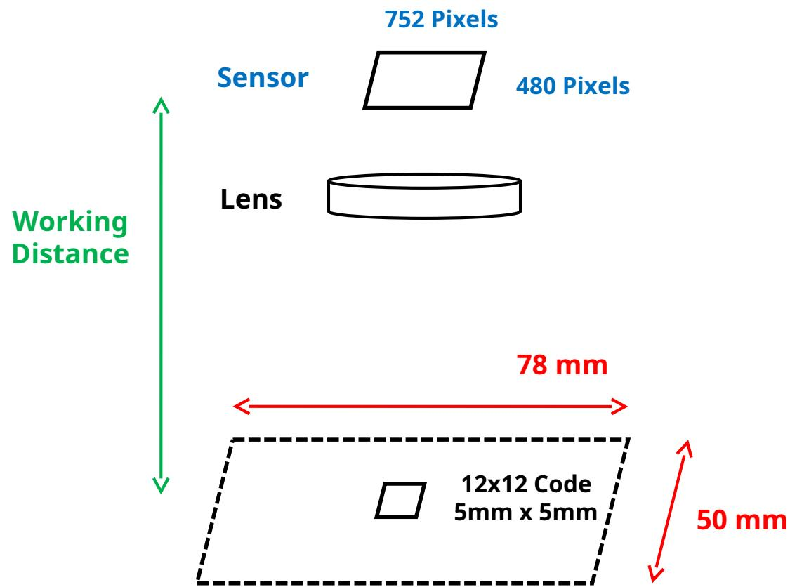

# 名词：读码 / 未读取 / 错误解码

- Read: 正确解码  
- No-Read: 数据没有被提取  
- 多种原因：时间不够，没有把握,etc.  
- Misread: 确信的解码，但是数据错误

- 错误解码比未读取的危害更大  
Cognex 解码原则宁可不解也不错解.

# 读码过程

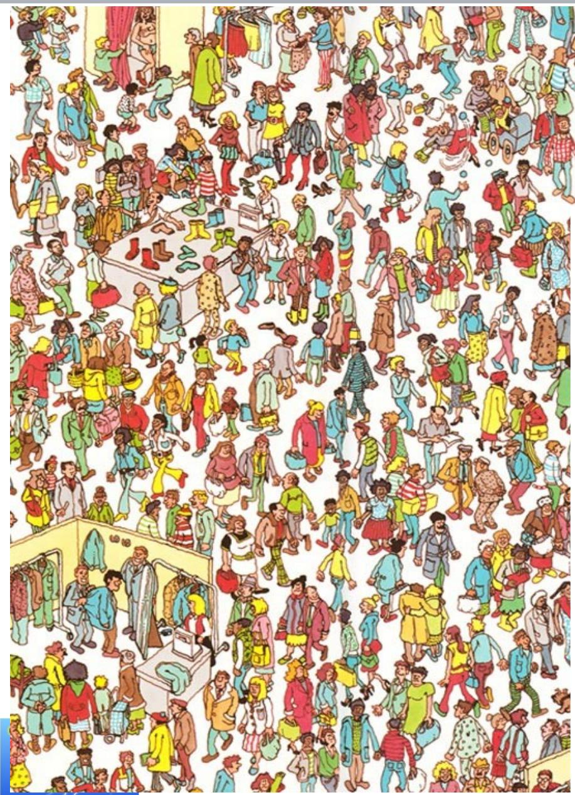

# - 限制寻找 & 解码

- 降低出错的几率 -> 提高  
常常（并不总是）能降低解码时间  
什么是学习/训练  
- 大概的尺寸 (PPM)  
- 极性  
- 反射状况  
- # 行数 /# 列数 (2D)  
- 纠错类型 (2D)  
数据大小 (1D)

# 二维码与一维码的区别

# 二维条码（2-D Barcode）

D

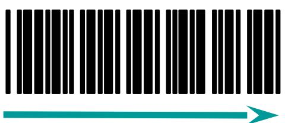

2D

在水平和垂直方向的二维空间存储信息的条码，称为二维条码（2-dimensional bar code）。

# 二维条码（2-D Barcode）

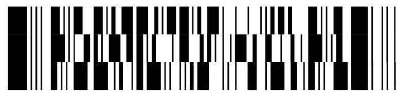

PDF417

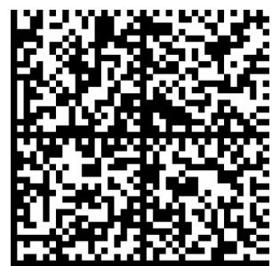  
线性堆叠式二维码  
Data Matrix   
矩阵式二维码

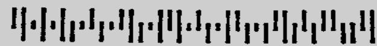  
MR P KIMMENS   
BPO 4-State   
邮政码

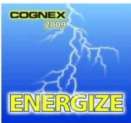

# 二维码的优点 - 数据容量

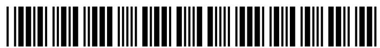  
一维条码的局限  
较小的数据容量  
1234567890

  
二维条码的优点  
更大的数据容量 (2-3 KB)  
a-z, A-Z, 0-9

# 二维码的优点 - 超越数字 / 字母

<table><tr><td>一维条码的局限</td><td>二维条码的优点</td></tr><tr><td>通常只能表达字母、数字和一些符号有些可以表达128个ASCII字符</td><td>可以表达8位二进制数据，可以对图像、汉字等进行编码</td></tr></table>

# 小零件的标识 & 污损的标签

<table><tr><td>一维条码的局限</td><td>二维条码的优点</td></tr><tr><td>条码尺寸相对较大</td><td>条码尺寸相对较小</td></tr><tr><td>条码受损后不能阅读</td><td>条码受损后仍然可以阅读</td></tr></table>

# 激光读码器与图像识读器差异

# 激光扫描技术

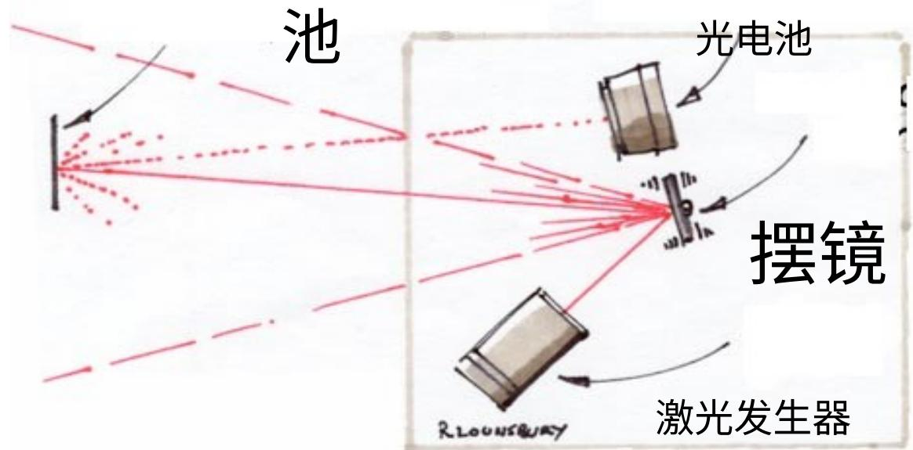  
目标反射光至光电

  
条形码

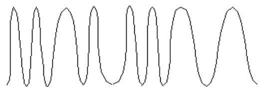  
光探测器信号

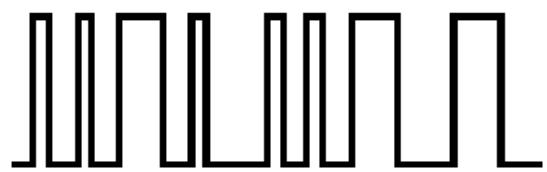  
数字信号

# 激光扫描仪的局限性

# - 难以扫描的条形码

- 印刷效果差  
- 存在缺陷 / 受损  
- 对比度低  
- 镜面反射   
- 高度窄

# - 单向扫描

• 无全方位扫描（360°）或正交（0°和90°）读码  
- 安装和定位受限

# - 活动部件容易出现故障

# - 不能读取 2 维代码

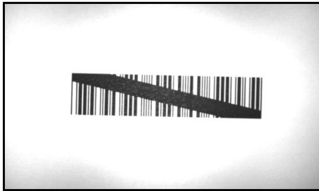

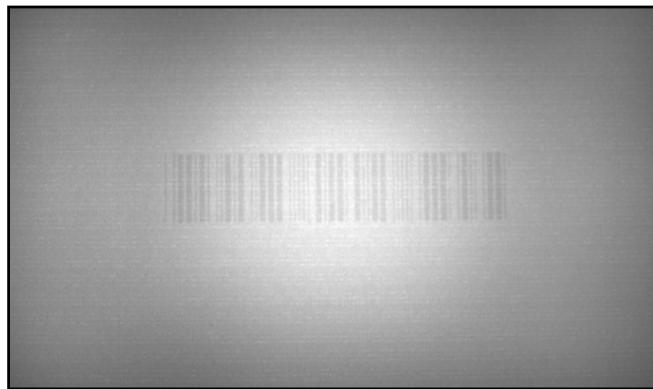

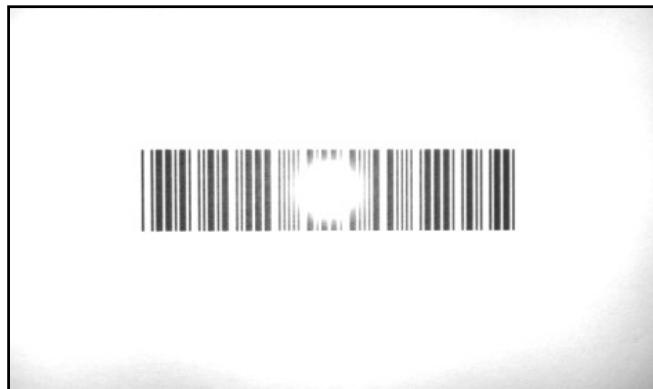

# 视觉识读器技术原理

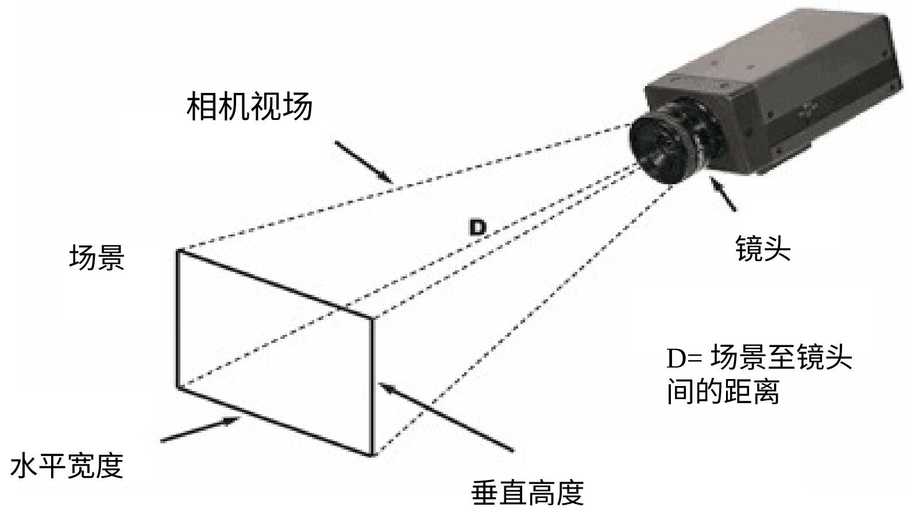

# 基于图像读取 1 维条形码的优点

- 可以轻松读取所有代码，从印刷好的到难读的受损的代码。

- 印刷效果差  
- 存在缺陷 / 受损 / 空洞  
- 对比度低  
- 镜面反射   
- 高度低  
- 过度透视

- 全向读码  
- 无机械元件

- 较激光扫描仪更可靠

- 可以读取 1 维和 2 维代码

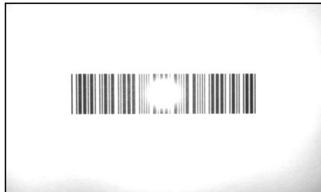

# 为什么早期，成像仪不能取代激光识读器？

# 成本

- 图像传感器和外围设备部件的成本降低。

# - 尺寸

- 如今可使用高密度和高集成的部件。  
- 如今可以使用火柴盒大小的基于图像的集成式读码器。

# - 性能

- 图像处理算法现已超越激光扫描仪的性能。

# 图像式和激光式解码器的区别

<table><tr><td></td><td>图像式</td><td>激光式</td></tr><tr><td>内部结构</td><td>一体式，无活动部件，不易损坏</td><td>具有活动的摆镜，故障率高</td></tr><tr><td>解码方向</td><td>全向</td><td>单一方向</td></tr><tr><td>码制</td><td>一维码和二维码</td><td>一维码</td></tr><tr><td>解码能力</td><td>破损、质量差的代码</td><td>一般的条形码</td></tr><tr><td>图像反馈</td><td>有</td><td>无</td></tr></table>

# 早期图像式识读器

- 速度 帧率不够  
- 景深（DOF）较小   
DM 解决这些问题

# 从激光扫描到图像解码

- 激光扫描仪仍然占据在用的 1 维条形码读码器的最大份额  
- 不过，激光扫描仪正快速地被基于图像读码器取代。  
- 基于图像读码器具有优越的读码性能（对比度低、损坏、噪音等。）  
- 基于图像读码器还可以读取 2 维码 - 而现如今, 几乎所有主要行业均采用了 2 维码。

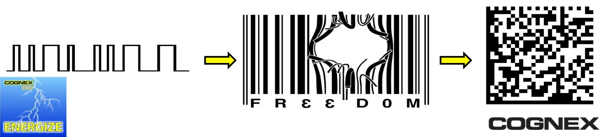