# VisionPro 介绍

2019/12/19

Zhang Juan

# VisionPro是什么？

# 迅速配置工具

应用程序向导调出保存的Quickbuild输出并且将其转化成一个完整的机器视觉应用程序的客户化代码。

# 迅速原型环境

图形的Quickbuild界面可以迅速地配置所述库到模板中，或者到工作的机器视觉应用程序核心中。

# 基本软件库

提供与硬件互动所需框架的软件，以及一整套包括功能强大的视觉工具和算法的库。

# 硬件

高功能相机和板卡平台，用于在计算机上采集数字图像。

# 四种开发模式

# Quickbuild 视觉 + 向导生成的操作界面：

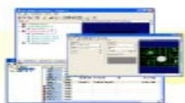  
使用Quickbuild互动开发视觉、输入/输出和工作控件

  
使用应用程序向导生成操作界面

  
配置生成的应用程序

# Quickbuild 视觉 + 修改的操作界面:

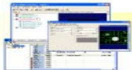  
使用Quickbuild互动开发视觉、输入/输出和工作控件

  
使用应用程序向导生成操作界面（选择VB或C#语言）

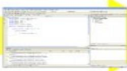  
使用 Microsoft Visual Studio 定制生成的操作界面

  
配置定制的应用程序

# Quickbuild 视觉 + 自定义的操作界面:

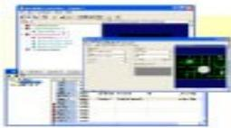  
使用Quickbuild互动开发视觉、输入/输出和工作控件

  
使用 Microsoft Visual Studio 自定义操作界面

  
配置自定义应用程序

# 自定义应用程序：

  
使用 VisionPro API 并利用 Microsoft Visual Studio 开发自定义应用程序（视觉、输入/输出、控制，和操作界面）

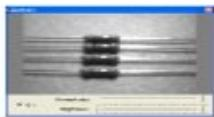  
配置自定义应用程序

# 路径1开发模式

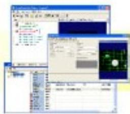  
使用Quickbuild互动开发视觉、输入/输出和工作控件

  
使用应用程序向导生成操作界面

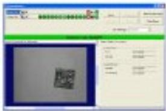  
配置生成的应用程序

# 优点：

没有编程要求  
速度快  
- 可以继续使用QuickBuild修改视觉、工作和输入/输出

# 缺点：

- 操作界面受到应用程序向导的限制

# 路径2开发模式

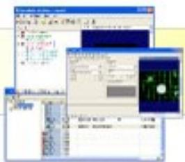  
使用Quickbuild互动开发视觉、输入/输出和工作控件

  
使用应用程序向导生成操作界面（选择VB或C#语言）

  
使用 Microsoft Visual Studio 定制生成的操作界面

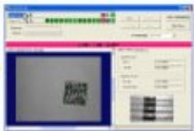  
配置定制的应用程序

# 优点：

■ 易于客户化生成的应用程序  
仍然可以使用QuickBuild修改所述视觉应用程序

# 缺点：

要求一定的编程  
必须在向导生成的代码的框架内工作  
- 向导生成的代码修改后不能再次运行向导来更新，否则会丢失您的修改内容

# 路径3开发模式

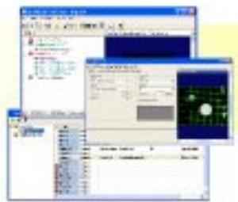  
使用Quickbuild互动开发视觉、输入/输出和工作控件

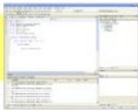  
使用 Microsoft Visual Studio 自定义操作界面

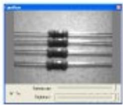  
配置自定义应用程序

# 优点：

完全控制操作界面的外观和动作。  
仍然可以使用QuickBuild修改所述视觉应用程序

# 缺点：

要求编程

# 路径4开发模式

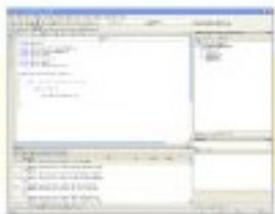  
使用 VisionPro API 并利用 Microsoft Visual Studio 开发自定义应用程序（视觉、输入/输出、机器控制，和操作界面）

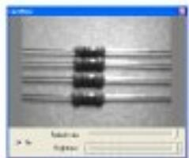  
配置自定义应用程序

# 优点：

应用完全灵活

# 缺点：

需要最高编程

# QuickBuild

# 路径1开发周期

QuickBuild 是进入 VisionPro 的互动窗口  
几乎所有 VisionPro 用户都使用 QuickBuild 开始构建他们的应用程序

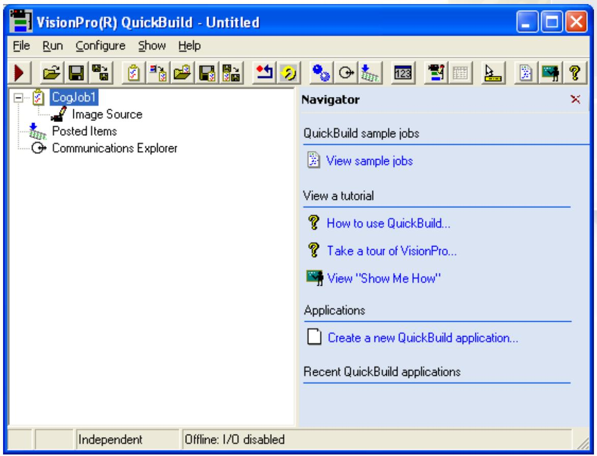

# QuickBuild管理工作

# 每个工作均有：

一个提供图像的像源

在这些图像上运行的一些视觉工具组合

多个工作平行执行

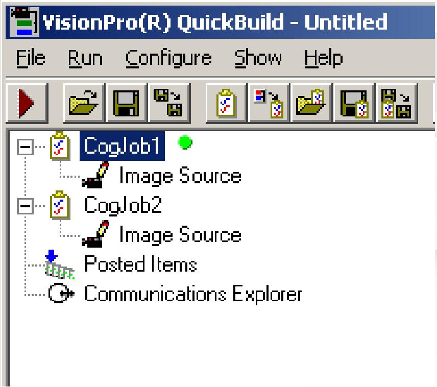

# 给工作添加工具

工具是一种 VisionPro 对象，在指定图像上进行具体的分析

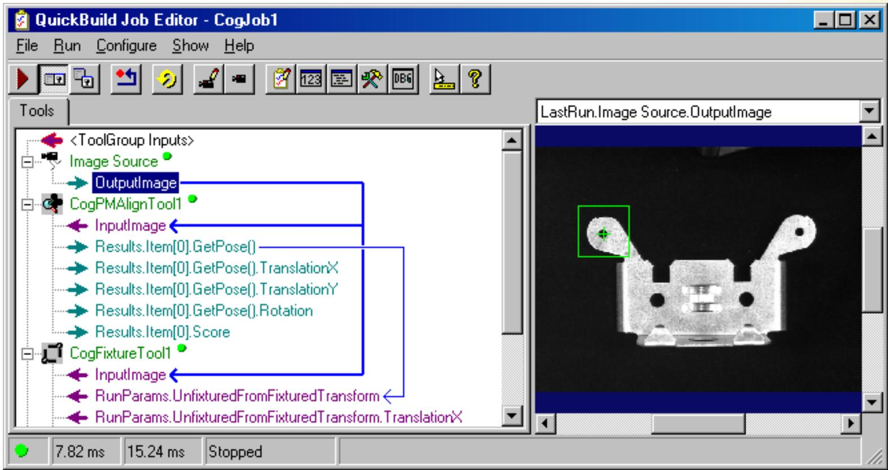

# 如何添加工具

在工具箱中选择工具并拖放进工作中

插入标志表明工具在工具组中的位置

- 当添加有多个工具时，执行顺序是从上至下依次进行

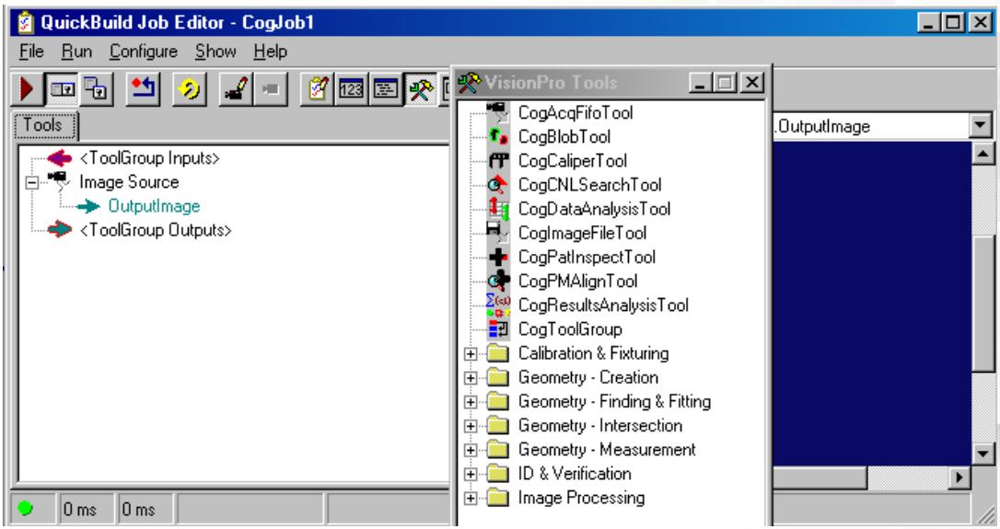

# 工作

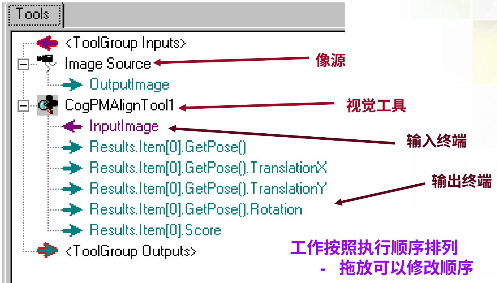

# 使用终端传送数据

- 终端用于向某工具或者工具组显示数据元素。

拖放可以在工具或者工具组之间传送数据

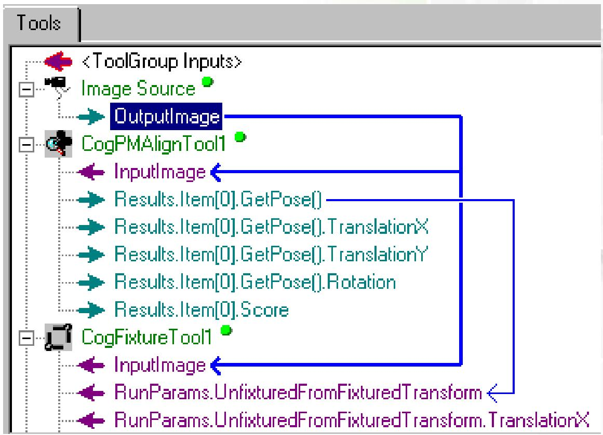

# 保存项目/工具/工作

当您保存项目或者某个工具时，其被保存为 .vpp 文件

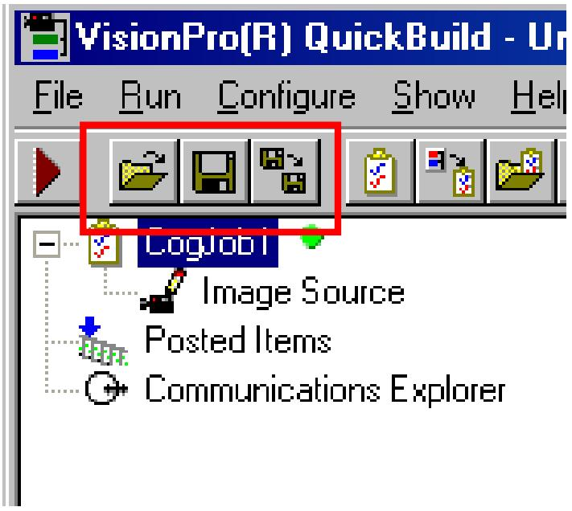

# 运行应用程序向导

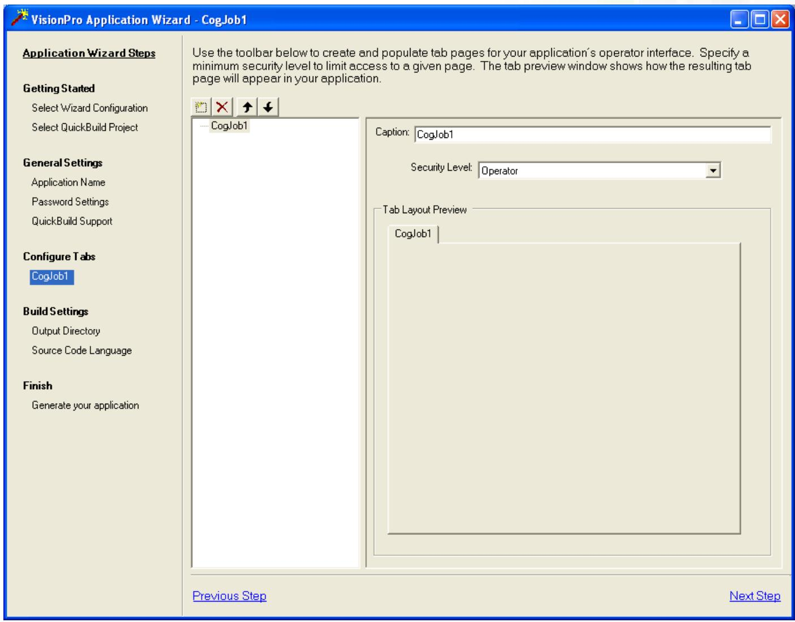

# 配置已经完成的应用程序

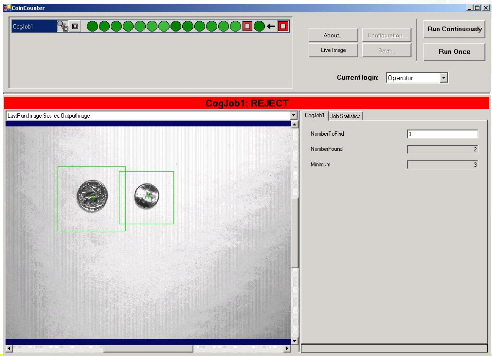

# VisionPro资源

# VisionPro资源

# VisionPro 提供各种不同层次的资源

QuickBuild 导向面板

在线帮助

- 系统级访问

- VisionPro 库  
- 视觉工具信息

- QuickBuild

- 到工具信息的快捷方式

案例

- QuickBuild   
- .Net 和 C#  
- 脚本

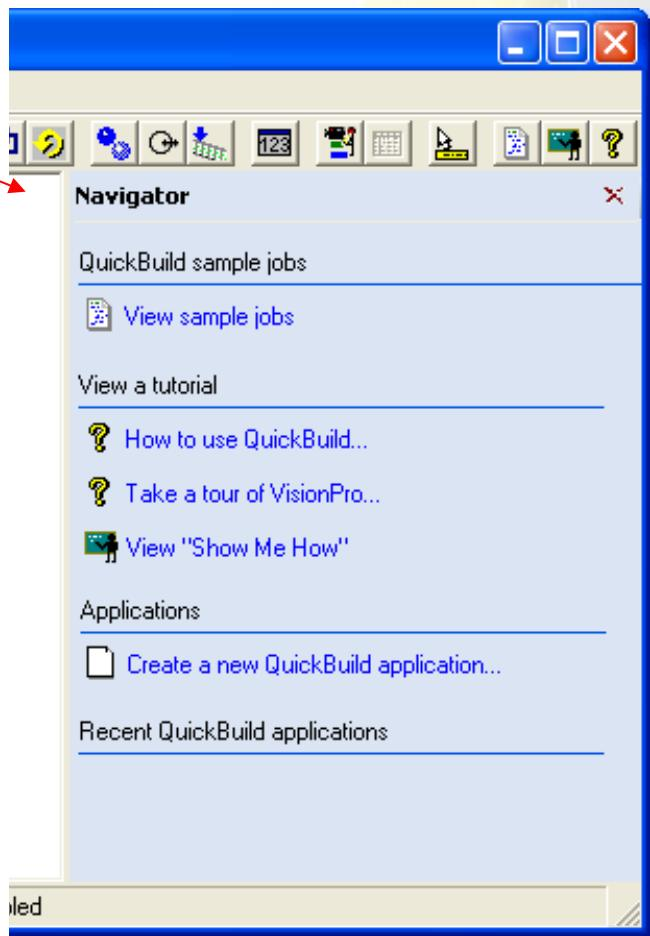

# VisionPro资源-案例

# QuickBuild 案例可在不同的地方找到

# QuickBuild 界面

# 系统级

- 快捷方式  
- 为系统上安装中包括的 VisionPro 案例建立了一个 HTML 链接  
- Windows 浏览器  
- 使用 Windows 浏览器，用户可以点击进入到包含有案例文件的目录

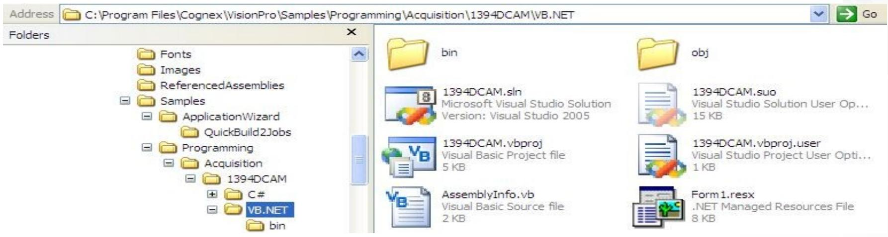

# VisionPro资源-案例

# QuickBuild 案例

选择一个案例可以将其作为一件工作添加到 QuickBuild 中  
通过案例工作的导向可以解释其使用方法。  
脚本安全也可以通过导航方式来浏览

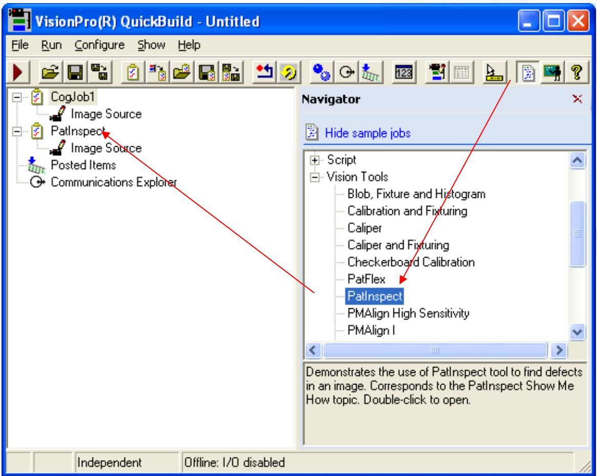

Thank you.