# PatMax 参考文档

# N E 2 0 2

# PatMax Software

PatMax 中的关键词  

<table><tr><td>关键词</td><td>定义</td><td>关键词</td><td>定义</td></tr><tr><td>Alignment(对齐)</td><td>利用 PatMax 在图片中匹配寻找已训练特征的过程</td><td>Granularity（粒度）</td><td>图片中可测的最小特征大小</td></tr><tr><td>boundary point (边缘点)</td><td>特征边缘上的点，包含位置和方向两个属性，方向和特征边缘垂直且方向指向正强度方向</td><td>Pattern（模型）</td><td>训练特征的几何描述</td></tr><tr><td>Clutter（杂斑）</td><td>非训练模型中的无关特征</td><td>run-time image（运行</td><td>需要找寻特征的图片</td></tr><tr><td>Deformation（变形）</td><td>模型的非线性变化</td><td>Score（分数）</td><td>找寻特征和训练特征的相似程度</td></tr><tr><td>Deformation rate（变形率）</td><td>已找到模型相对训练模型的变形程度</td><td>shape model（形状模型）</td><td>形状模型由几何形状（例如线段，圆，多边形），极性（黑到白或白到黑），权重组成。</td></tr><tr><td>degree of freedom（自由度）</td><td>可表征变形情况的数值参数，例如角度</td><td>shape training（形状训练）</td><td>由一个或多个形状进行训练 PatMax 模型</td></tr><tr><td>Feature（特征）</td><td>不同像素值区域间的连续边界，特征可用一系列边缘点表示</td><td>Transformation（变换）</td><td>描述点从一个坐标系到另一个坐标系转换的方程表示</td></tr><tr><td>generalized degree of freedom（广义自由度）</td><td>除了 x 和 y 方向平移外的自由度，例如等比例，x 和 y 方向比例，以及自由度</td><td></td><td></td></tr></table>

# PatMax Software

PatMax 的基本流程

训练特征

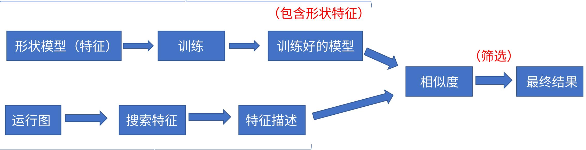

搜索特征

# 运行参数调整 （匹配特征的限制与筛选）

# Note:

 PatMax 有两种算法，即 PatMax 和 PatQuick ， PatMax 准确度更高并且有相关得分的信息，但是会比PatQuick 慢。  
 PatMax 和 PatQuick 训练时不是依赖于像素网格的表示，而直接依托于形状几何特征，所以可以很好的进行旋转，平移以及尺度变换，进而更快更准确的在运行图中进行匹配。 COGNEX COGNE

# PatMax Software

PatMax 的模型及变换

 PatMax 中的模型：由一系列包含空间位置关系的特征组成

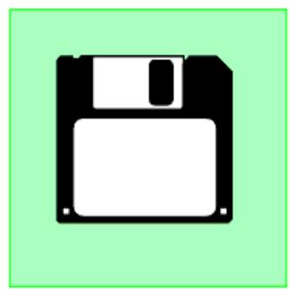  
Image

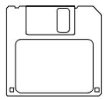  
Pattern

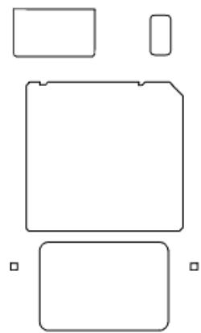  
Features

 PatMax 中模型的变换：模型可以从尺寸，旋转，平移三个方面变换

• 尺寸：整体的缩放， x 方向或 y 方向的缩放  
旋转：任意方向的旋转   
平移： x 方向或 y 方向的平移

X 方向平移

Y 方向平移

旋转

缩放

X 方向缩放

Y 方向缩放

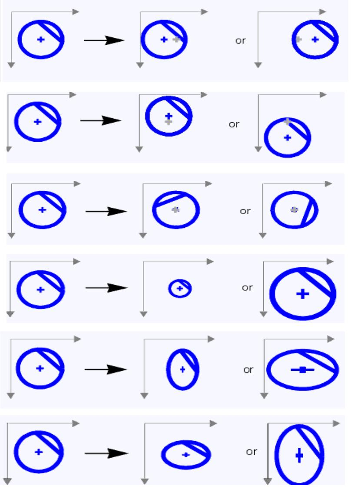

# PatMax 的模型及变换

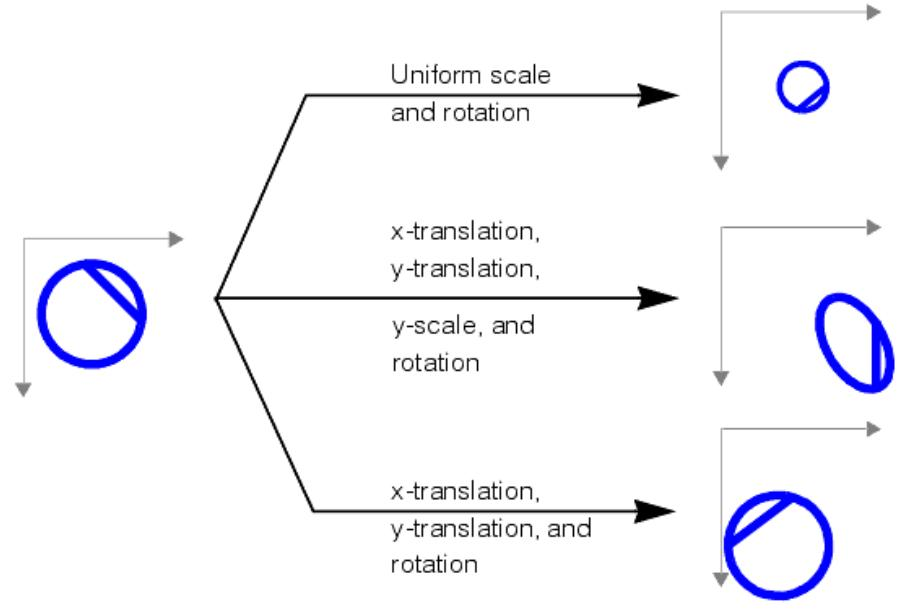  
多种变换的组合（实际情况中基本是多种变换的组合）

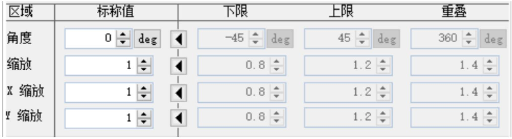  
VisionPro 中的尺度和角度参数设置

# Note:

 根据实际检测物体的情况，确定合适的角度和缩放参数范围，一方面可以提高模型的稳定性，另一方面提高运行的速度。

# PatMax 的模型特征

# 模型特征特点

• 模型区域可以有不同的对比度，强度以及纹理特性（通常特征考虑的是边缘特性，而不是边缘的亮度），特征可以是封闭或开放的 , 如图 (a) 所示。  
• 特征通常由一系列有序边缘点组成，点包含位置和方向（方向为图像坐标系的x轴与特征点方向之间的角度，其中特征点的方向为垂直于特征边缘且按照由暗到明的方向，如图(b)所示。

#  模型特征的大小和粒度

• 模型通常利用不同大小的特征进行训练匹配，小的特征几个像素，大的特征有 50 或 100 个像素，甚至更大。

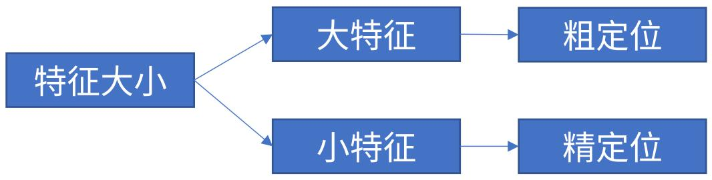

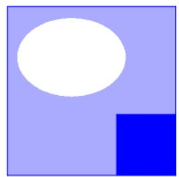  
Image

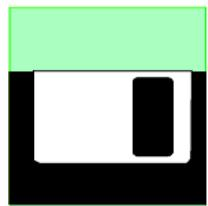  
Image

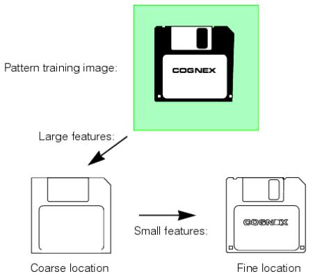

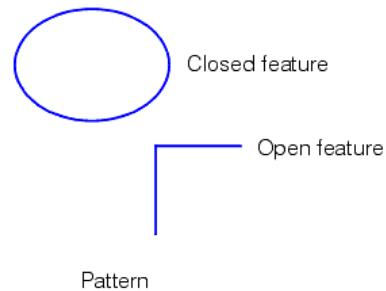

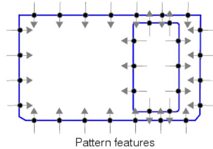  
（ a)  
（ b)

# PatMax Software

模型的粒度（ granularity ）

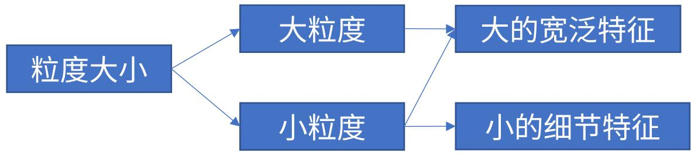

Note: 小粒度可以同时兼顾大特征和小特征，但是小粒度会对检测的结果比较敏感且费时间，根据实际情况，选择合适的粒度范围即可

• 粒度表示感兴趣区域的大小，以像素为单位，在此区域内的特征将被检测。  
• 大的特征在大粒度或小粒度设置下均可检测到，小的细节特征在粒度较大时会无法检测到  
• 某些情况下，特征可能处于小粒度或大粒度情况，而不处于某个中间粒度，通常粒度会设置一定的范围。  
• 粒度除了影响检测特征的大小，也会影响到检测特征边界点间的距离，大粒度对应大的特征边界点距离

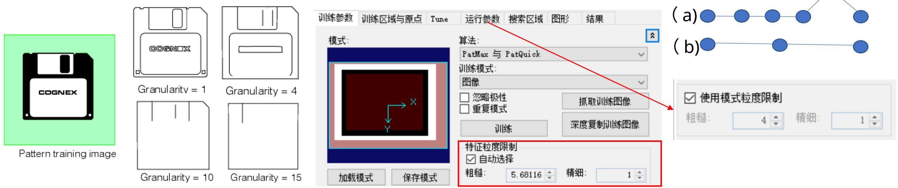

# PatMax Software

# 模型的极性

• 通常在使用形状模型训练时，由于特征点会有一个白到黑或黑到白的极性，当选择考虑极性时，模型会按照指定的极性训练得到特征，后续在运行图中检测时也会按照相应的极性进行特征搜索；若忽略极性，则检测特征不受极性的影响，如右图所示，考虑极性则会检测到左边三个图像中的特征，右边三个特征则可能不会检测到，即使检测到，其分数也会比左边低很多，而忽略极性则可以检测到所有图像中的特征。

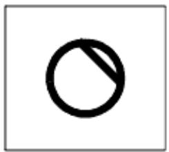  
Trained pattern

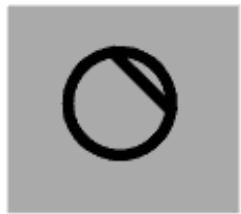

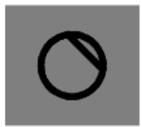

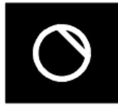

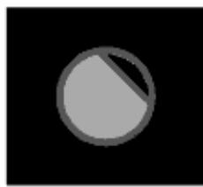

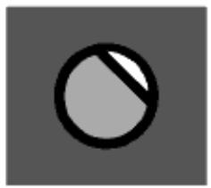  
Matching polarity

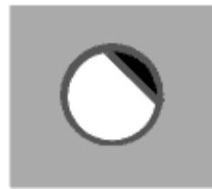  
Mismatched polarity

# Note:

• 若检测图像的特征会经常出现极性的变化，则训练时需要忽略极性，若只想检测特定极性的特征，则训练时需要考虑极性。  
• 当使用形状模型训练时，所有的形状要么都考虑极性，要么均不考虑，若有不明确极性的形状，则忽略此形状或忽略所有形状极性。  
• 不考虑极性会比考虑极性时的速度慢大概 $1 0 \%$ 。

# PatMax Software

# 模型掩膜

• 当利用图像而非形状模型进行训练时，可以使用掩膜忽略一些无用的特征或不同图像中存在差异的特征，同样可以用粒度对特征的大小进行限制。  
• 利用掩膜的训练方式和形状模型的训练方式不能共存（其实没有必要，用了形状模型，就已经把不必要的特征忽略了没必要再用掩膜图像去忽略）

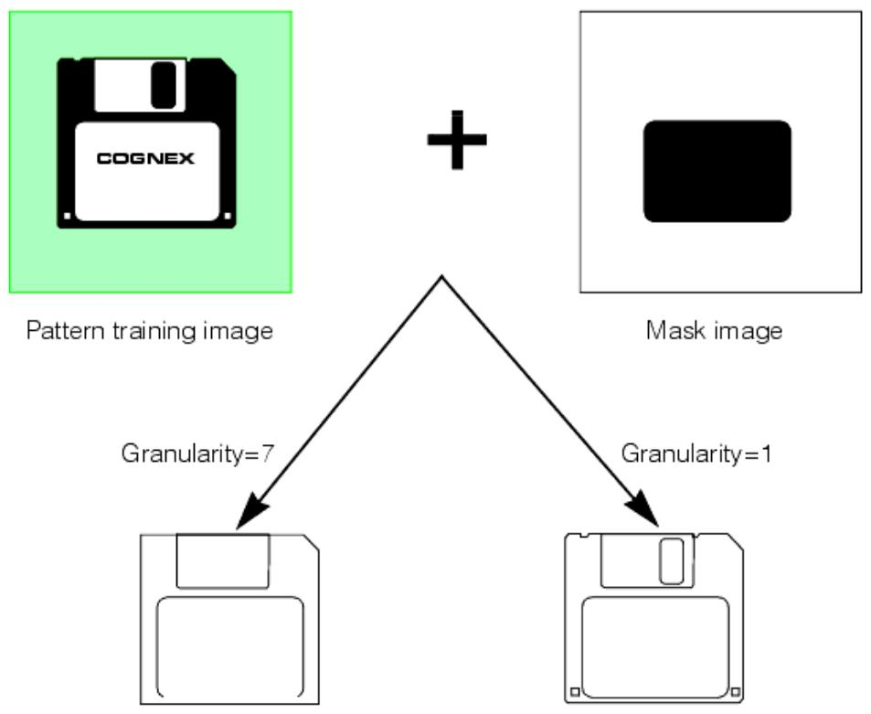

# 掩膜 (Mask) 的定义

掩膜图像中，灰度值大于等于192的像素点会被考虑，同时纳入训练特征的考虑范围，灰度值在0到63之间则不被考虑，也不会出现在训练特征中，但是纳入记分范围，其在运行图中表现为杂斑（clutter)特征;灰度值处于64到127之间的像素点既不考虑也不记分，不会成为训练特征，在运行图中也不做任何考虑，灰度值在 128 到 191 之间的像素点暂时保留不代表任何部分。  
• 当使用PatQuick算法时，灰度值处于0到63的像素点不考虑为杂斑，其不做任何考虑。

# PatMax Software

PatMax 的运作模式（一些基本概念）

运行时空间（ Run-Time Space) ：当在运行图中搜索特征时，运行图会有一些自由度的设置（比如尺度和旋转），PatMax 会在运行图中找到候选特征，然后再确定从训练模型到运行图中特征的最佳转换关系。  
模型粒度 (Pattern Granularity) ： PatMax 在运行时首先搜索大特征，当匹配到模型后，其会利用较小特征确定训练模运行图中模型的变换关系，默认情况下， PatMax 在训练图中的粒度范围和运行图中相同。  
• 运行模式： PatMax 支持两种运行模式，默认情况下，其采用搜索图像模式对整幅图像匹配已训练的模型；其同时支持改进启动姿态模式，将模型搜索限制在定义姿态下（通常由其他工具给定）的几个像素范围内，并且这种模式不采用粗粒度的设置来搜索图像中的大特征，而细化搜索小特征（其假设特征在给定启动姿态的极窄范围内）。  
• 高灵敏模式：图像质量会严重影响 PatMax 的结果，一般清晰，尖锐，高对比度的图像会比低对比度且含噪声的图像更易得到好的匹配结果，为了解决图像质量的影响（含噪声，低对比度等），可采用高灵敏模式，但是这种模式会需要更多的训练和检测时间，同时对于含有大量细小特征的模型检测效果会比正常模式差，所以对于绝大数的应用考虑采用正常模式。  
• 敏感度参数：当使用高灵敏模式时，可设置灵敏度参数来抑制噪声的干扰，其范围为 1 到 10 ，值越大噪声抑制也越明参数通常默认设置为2可获得最佳结果，越低的灵敏度参数对训练和运行的时间影响也越小，通常参数越大对噪声越不敏感，正常范围取 1 到 5 就好，要想获得好的结果，则参数基本不会大于 5 。  
• 模式权重：当采用形状模型训练 PatMax 时，每个形状模型均可分配一个权重系数，权重越大，其对最终得分影响也越大

# PatMax Software

# PatMax 的模式变换

• 当运行 PatMax 的时候，其会返回一个变换，用来描述训练模型到找到的模型间的转换关系。

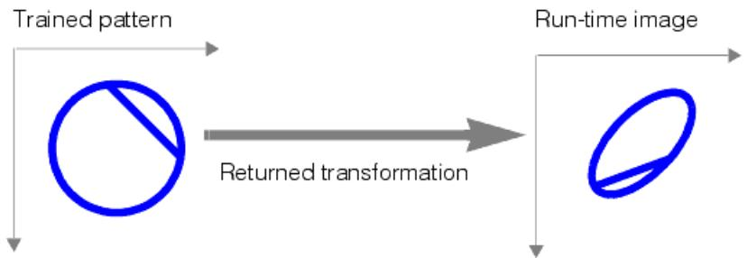

• 广义模式原点（ Generalized Pattern Origin ）：某些情况下需要先对训练模型进行变换（例如训练模型中已知的尺旋转变换），然后再对运行图进行模式匹配，

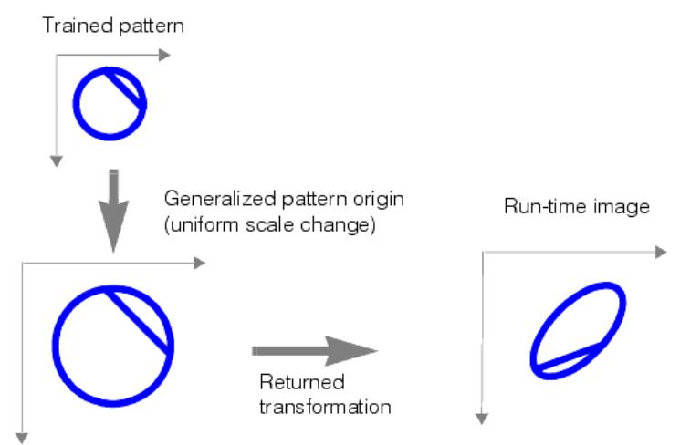

• PatMax 会返回广义模式原点变换后的模型和运行图中模型的差异结果  
• 广义模式原点对运行速度，准确度以及结果个数没有影响  
• 广义模式原点在 $\mathsf { X }$ 和 y 方向上的偏移量等同于之前的模型

# PatMax 的匹配分数

• PatMax 中利用分数来反映找到的模型和训练模型的相似程度，为 0 到 1 的范围值， 0 表示完全不匹配， 1 表示完全匹PatMax 算法的分数除了考虑模型的匹配程度，同时考虑杂斑的存在，而 PatQuick 只考虑模型的匹配程度。

• 在考虑模型匹配时， PatMax 只考虑模型的形状，而不考虑亮度和对比度（只要所有的极性是相同的，或者极性是忽略的）。  
• PatMax 对模型的弹性拉伸有一定的兼容性，缺少或无关的特征会返回较低的分数

对比度：除了总体的分数， PatMax 也会返回模型的对比度（对比度是运行图中匹配模型的所有边界点的平均灰度差值），可以在运行图时设定对比度的阈值，只有模型平均灰度偏差值大于阈值时才会被考虑

拟合误差：运行图中模型所有边界点与训练模型所有边界点之间平均距离的加权和再开平方根

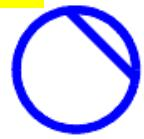  
Trained pattern

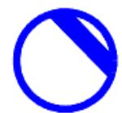

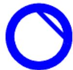  
Stretched patterns

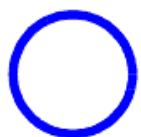

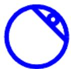  
Broken patterns

覆盖分数：训练模型在运行图中的存在比例，分数为 1 则表示训练模型在运行图中全部出现，可利用此分数来检测缺失或遮挡的特征  
• 杂斑分数：匹配模型中特征为非训练模型特征的占比， 0 表示匹配到的模型不包含无关特征， 1 则表示所有的特征均为无关特征，在大多数情况下， PatMax 计分需要不考虑杂斑特征。

# PatMax Software

PatMax 的对齐设置

# 自由度

• 当利用对齐设置时，对每个自由度（除了 x 方向和 y 方向的平移），需要注意以下两个方面， 1 ）当禁用某个自由度时需要对其指定一个标称值， PatMax 将只会匹配和对应自由度下相近的模型，并且不会计算模型的自由度，而直接以给定的标称值表示其自由度。例如对只需对齐标准块的平移属性时，则需要禁用旋转和缩放，此时若标准块有轻微的旋转和缩放时， PatMax 定位精度和分数将有所降低，并且其不会计算这两个自由度，而以标称值表示，如下图所示。

• 当启用每个自由度时，处理时间也会增加，并且每个自由度的范围越大，处理时间也越长。

PatMax 可能会匹配到超过指定自由度范围的模型，例如指定缩放为 0.95 到 1.05 ，其会匹配到 0.91 或 1.09 的结果，所以需要去检查自由度的结果，将这些结果剔除。

• 给自由度指定合适的标称值，可以使匹配模型更快更稳定。

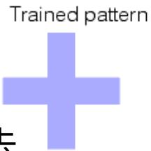

Nominal angle value (0°) Slight mismatch

Range of angle values $\cdot 5 ^ { \circ }$ to $+ 5 ^ { \circ } )$ ） Perfect match

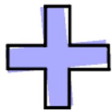

Results

Score:0.80

Location 102.4,103.6

Rotation:0°

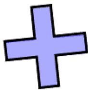

Results

Score: 0.98

Location 101.2,100.9

Rotation: -3

# PatMax Software

# 图像匹配的混淆

• 当自由度的个数以及每个自由度的范围增加时， PatMax 匹配的候选项也会相应增多（容易出现混淆情况），如下图所示，当禁用缩放自由度时，只会找到一个模型，而开启缩放自由度时则会匹配到两个模型。  
 非统一缩放的影响

• 当使用非统一缩放时，PatMax会降低到PatQuick的精度水平，非统一缩放包括x方向和y方向的缩放，可以是一个标称值，也可以是一个范围，当采用标称值时，其精度不受影响，而使用范围时精度则会大大降低，一般情况下对于相对固定的长宽变化，推荐使用标称值，而不是一个缩放范围。

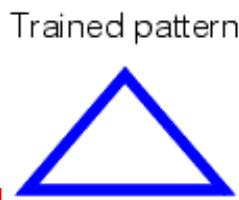

# 模型查找概数和接受阈值

• PatMax 可能会找到超过或少于查找概数的结果，例如查找概数为 2 ，但是超过接受阈值的结果有 3 个，此时则会获得3 个结果，此外，当超过接受阈值的结果只有 1 个时，则会返回 1 个结果。

• 接受阈值过小，则匹配的候选项也会增加，相应的运行时间增长，阈值过高，可以剔除一些混淆模型且运行时间缩短，但是有可能出现匹配不到模型的情况。  
• 当使用粗糙度接受阈值时，通常使用 0.66 的阈值来帮助精调匹配过程，一般得分超过“ 0.66* 接受阈值”时，则会成候选结果，降低粗糙度接受阈值，可以增加候选结果（主要根据粗糙特征）。当 PatMax 运行成功时，可以在结果中得到粗糙分数，其即为最低的粗糙度接受阈值，当模型匹配不到较好结果时可以尝试调节粗糙度接受阈值。

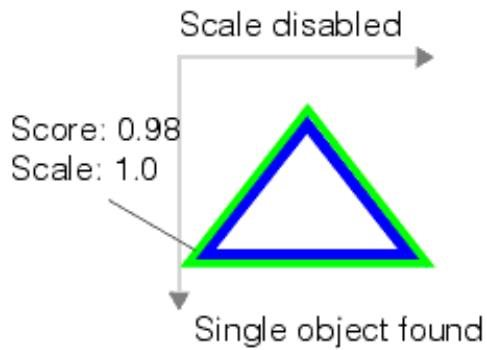  
Run-time images

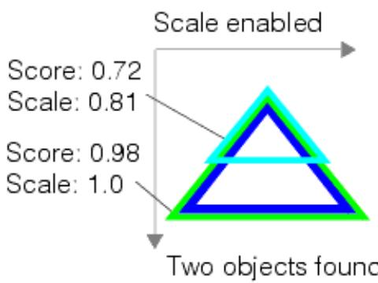

# 非线性变形模式

• 当模型出现非线性几何变化时， PatMax 可能无法匹配到模型或匹配到一个很低分数的模型，对此有两种改善方法，  
1) 当出现轻微变形时，可以考虑给定一个弹性值，从而增加变形容忍度。  
2 ）当变形较大时，考虑采用 PatFlex 算法。

# 弹性（ Elasticity)

• 弹性值以像素为单位，使用弹性不会影响 PatMax 的运行速度  
• 增加弹性值不会降低 PatMax 准确度，但是会因此获得一些额外的模型实例且其位置信息是不准确的  
• 弹性值太低，则匹配分数低或难以匹配到模型，同时模型的位置也会不准确且不稳定，一般弹性值从 0 开始，慢慢增加直到结果满意。

#  PatFlex

• PatFlex 可以容忍更大的非线性变形影响，如圆形或柱形失真，表面弯曲变形。

Initial image:

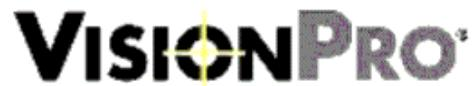

Cylindrical deformation:

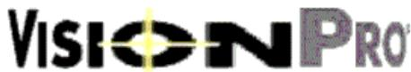

Surface flexdeformation:

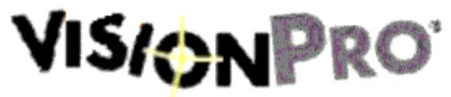

PatFlex 会独立检测模型特征的变化，然后构建一个特别的转换关系从训练模型映射到运行图中的模型。因为其可以独立的检测特征，所以理论可以应当任意的变形情况，

# PatFlex 的参数设置

#  期望（训练时）变形率和最大（运行时）变形率

变形率表示运行图像中控制点的未变形位置与找到的控制点位置之间的方差百分比，其设置为 0 到 1 ， 0 表示没有变形， 1 表示最大变形。期望变形率在训练时设置，而设置最大变形率用于运行图的时候。

Trained pattern:

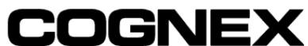

Vision for Industry

Vision for Industry

Moderate deformation:(rate $= 0 . 3$ ）

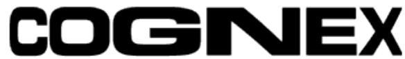

Vision for Industry

High deformation: (rate > 1.0)

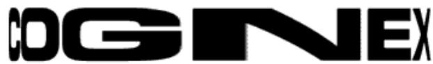

Cin for Industry

# 控制点

• 可以利用 PatFlex, 通过指定一系列控制点来完成模型的映射，默认情况下PatFlex会创建一系列网格控制点，这些控制点均匀的分布在模型上，这种方式一般可以很好的对模型变形进行表示，同时运行时间也合理；对于一些高频的变形情况，例如一张皱巴巴的纸，需要增加控制点的个数。

#  平滑度

平滑度决定PatFlex如何将变换关系和找到的控制点位置紧密匹配，平滑度为0意味着变换关系可以完美匹配控制点，平滑度无穷大则为仿射变换（不包含非线性变换），大多数情况下，平滑度为3是合适的，如果平滑度太小，变换关系对于控制点很准确，但是中间点就不怎么准确了。

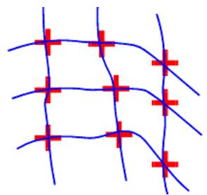  
Low smoothness:

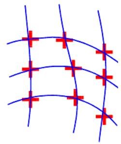  
High smoothness:

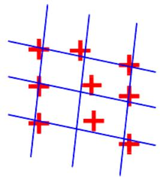

# PatMax Software

# PatFlex 的参数设置

# 精调模式（ Refinement Mode ）

• 精调模式决定 PatFlex 计算转换关系的精细程度，其主要有以下四种模式

<table><tr><td>模式</td><td>描述</td><td>模式</td><td>描述</td></tr><tr><td>None</td><td>不做精调</td><td>Medium</td><td>和 Coarse 差不多，去除了一些高度不准确的类型</td></tr><tr><td>Coarse</td><td>对转换进行精调，使其残差低于指定粗粒度限制的情况</td><td>Fine</td><td>残差低于指定细粒度限制的情况</td></tr></table>

# PatFlex 的性能

• 相比其它的 PatMax 算法， PatFlex 需要更多的训练和运行时间，另外当自由度的个数和范围增多时，最大变形率或控增加时，时间会更加的长，增加期望变形率会延长训练时间，但对实际运行时的时间影响很小。

# PatFlex 的结果

• 除了返回描述模型变形的变换关系， PatFlex 也会返回所有类似于 PatMax 的结果

# erspective PatMax （透视 PatMax)

透视PatMax可用于定位平面透视变换情况下的二维特征，其可用于定位3D应用中的一些二维特征。

Initial image

Planar perspective distortion

VISIONPRO'

VISIONPRO

# PaxMax 忽略杂斑计分

• 当忽略杂斑进行计分时，则不管无关特征是否存在，如右图所示。

# 运行图中的掩膜

• 除了在训练图这增加掩膜，运行图中也可添加掩膜，PatMax将不会考虑这部分的特征；当训练图中的特征在运行图中被掩掉，则会降低覆盖分数。

# PaxMax 中的重叠控制

训练参数训练区域与原点Tune

运行参数 搜索区域图形 结果

Score using clutter: Score ignoring clutter:

.98 .98

.92 .98

xy重叠：

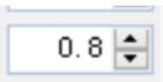

• 默认情况下，当 PatMax 匹配到的几个模型出现较大重叠时， PatMax 会返回一个最佳匹配的结果。  
PatMax有两种重叠阈值，即面积重叠阈值（模型训练区域的重叠比例）和区域重叠阈值（每个自由度的重叠情况）当需要检测的多个目标较大重叠时，则需要提高面积重叠阈值，反之若检测的多个目标重叠较小时，则可以降低面积重叠阈值；提高区域重叠阈值，可使得较大自由度范围变化的多个目标视为单个目标，反之，则只有在较小自由度下变化的的多个目标才会被视为单个目标。

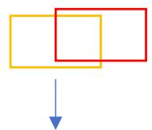

低面积重叠阈值：1个结果 低区域重叠阈值：1个结果高面积重叠阈值： 2 个结果 高区域重叠阈值：2个结果

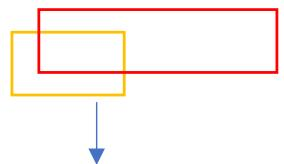

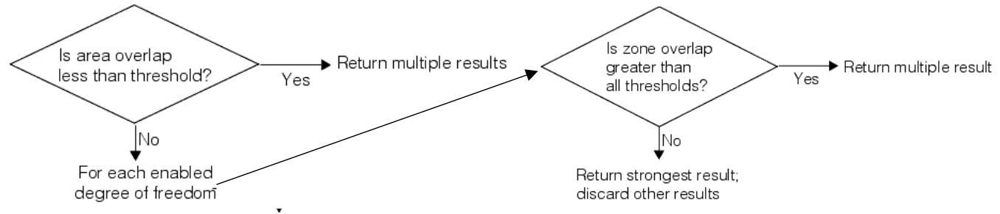

# PaxMax 中的退化结果

• 当启用自由度时， PatMax 可能检测出的多个模型均满足要求，即出现退化结果，如下图所示。

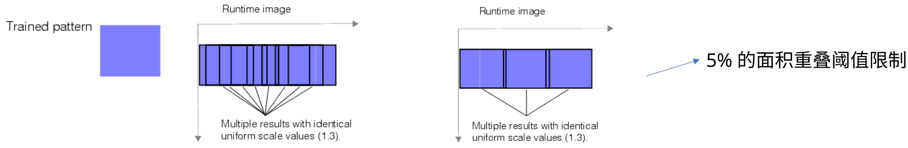

对于非方形像素的相机系统，当需要对旋转的模型进行高精度定位时，则必须对系统进行标定，并且训练图和运行图均需在标定后的空间执行。

# PaxMax 的使用

# 形状训练

• 形状训练有以下优点， 1 ）可以自己定义最优的模型去训练， 2 ）不会被噪声干扰， 3 ）对目标尺度变化较大的情况也会有效， 4 ）可以利用模型中的角点信息， 5 ）相比图像训练，内存占用更小  
当提供 CogShapeModelCollection 用于形状训练时，必须提供将形状尺寸转到像素空间的变换方式，可以指定形状所的空间，或提供 TrainShapeModelsTransform

# PaxMax 中的形状训练指南

#  计算粒度（ Granularity)

• 形状模型训练时， PatMax 会根据提供的形状模型自动计算粗粒度和细粒度限制（其主要根据形状的像素大小，所以训练形状向像素空间的变换方式，需要能反映特征的实际大小），并根据这些限制得到粗糙和精细特征。

• 如果训练形状模型的特征大小远大于或小于实际特征大小，则会得到不合适的粒度值以及训练模型。

# 训练区域

• 给定训练区域，则 PatMax 只会考虑给定区域内的特征，训练区域的位置需要结合不同坐标空间进行设置。

# 指定权重

不同形状的不同权重设置将影响到最终的模型分数。

正权重：结果偏向于形状和图像特征可以准确匹配的情况，权重的大小对精度没有影响，形状对PatQuick计分有积的作用，其和权重大小，形状的周长，结果位姿的匹配度成正比。此情况下的特征对覆盖分数有贡献，但是权重大小和范围分数无关。 (not trained) (not trained)

负权重：结果偏向于形状和图像特征无法匹配的情况，形状对返回姿态的精度没有影响，形状对 PatQuick 计分的影响和正权重情况相反。此情况下的特征对覆盖分数无影响，其主要被考虑为杂斑。 regic

0 权重：对结果和精度没影响，此情况下特征主要被考虑为杂斑。

权重的大小对 PatMax 没有影响（只需考虑权重是正还是负或 0 ），若想使用权重的大小，则可以先禁用 PatMax 算法，然后计分结果会返回 PatQuick 的结果（受权重大小影响），此时再启用 PatMax ， PatQuick 的分数会被计算并和阈值比但最终结果返回的还是PatMax的结果。

# PaxMax 中的形状训练指南

#  计算粒度（ Granularity)

• 形状模型训练时， PatMax 会根据提供的形状模型自动计算粗粒度和细粒度限制（其主要根据形状的像素大小，所以训练形状向像素空间的变换方式，需要能反映特征的实际大小），并根据这些限制得到粗糙和精细特征。

• 如果训练形状模型的特征大小远大于或小于实际特征大小，则会得到不合适的粒度值以及训练模型。

# 训练区域

• 给定训练区域，则 PatMax 只会考虑给定区域内的特征，训练区域的位置需要结合不同坐标空间进行设置。

# 指定权重

• 不同形状的不同权重设置将影响到最终的模型分数。  
• 正权重：结果偏向于形状和图像特征可以准确匹配的情况，权重的大小对精度没有影响，形状对 PatQuick 计分有积的作用，其和权重大小，形状的周长，结果位姿的匹配度成正比。此情况下的特征对覆盖范围分数无关。

负权重：结果偏向于形状和图像特征无法匹配的情况，形状对返回姿态的精度影响，形状对 PatQuick 计分的影响和正权重情况相反。此情况下的特征对覆盖无影响，其主要被考虑为杂斑。

0权重：对结果和精度没影响，此情况下特征主要被考虑为杂斑。

权重的大小对 PatMax 没有影响（只需考虑权重是正还是负或 0 ），若想使用权重的大小，则可以先禁用 PatMax 算法，然后计分结果会返回 PatQuick 的结果（受权重大小影响），此时再启用 PatMax ， PatQuick 的分数会被计算并和阈值比但最终结果返回的还是PatMax的结果。

# PatMax Software

# PaxMax 中的图像训练

• 右图的例子即表示超出训练区域的特征被训练的情况。实际训练后最好检查一下训练特征中不包含一些无关的特征。

PaxMax 中的一些参数及模型训练特性（有些参数前面已经做了详细说明，所以这边有些参数不做详细讨论）

# 模型粒度

• 如果用粗粒度训练出来的特征包含一些非实际特征边界的特征，则可以提高粗粒度，从而去除无用的冗余特征，提高匹配速度。  
• 如果用细粒度训练出来的特征包含一些模型外的特征，例如纹理特征，则可以提高细粒度，去除这些无用的细小特征提升训练的可行度。  
• 如果用细粒度没有训练出一些想要的精细特征，则可以尝试降低细粒度，从而提升准确度。

Note: 训练完记得观察训练的特征是否为想要的特征，当使用 PatFlex 算法时，通常会将细粒度设置的比其他算法小，因PatFlex 需要更多的精细特征。

# 重复模式

• 使用该模式意味着模型中允许存在一些相同的元素。  
自动边缘阈值

• PatMax 通常使用默认的边缘阈值，当特征的对比度很低时， PatMax 可能会定位失败，所以此时可以设置合适的最小灰度阈值。

# 简单的模型原点

• 通常PatMax结果中返回的位置即为模型原点的位置，实际当模型启用自由度时，其返回的结果可能会存在一定的偏如下图所示，当原点位于模型外部，模型旋转时，其原点除了旋转还存在位置上的偏移，而当模型原点位于模型中心时，则不会存在位置的偏移。

• 一般情况下模型原点会设置在模型的中心，对于 PatFlex 算法，应该保证模型原点在模型内部，否则匹配结果将变得不准确

# 模型训练信息

• 当使用 PatMax 进行训练时，其通常会提供一些诊断信息，如下表所示

<table><tr><td>信息</td><td>说明</td><td>信息</td><td>说明</td></tr><tr><td>10000:模型特征太少</td><td>PatMax没有足够的特征去训练得到一个可靠的模型,可检查一下显示的训练特征</td><td>10101:模型包含信息不足</td><td>训练模型在当前自由度下存在潜在的混淆影响(见本ppt22而PatMax中的图像训练)</td></tr><tr><td>10001:难以选择特征粒度,可手动设置</td><td>可检查一下特征显示情况,出现此信息通常是因为采用的自动选择特征粒度</td><td>10102:模型退化,结果不稳定,因为所有粗糙粒度边界点的方向相同</td><td>受粗粒度限制的影响,所有特征边界点拥有同样的方向,可检查特征显示</td></tr><tr><td>10100:模型可能不准确,因为模型出现模糊</td><td>模型模糊,得到的结果不准确,一般只在PatMax算法中返回此信息</td><td>10200:模型运行缓慢,可能精细特征太多,可手动调节参数</td><td>由于模型中大量小特征的存在,导致匹配时间长,可增大粗粒度值</td></tr></table>

# PatMax Software

#  PatMax 定制包

• PatMax 定制包可用于特定的应用类型，通过导入定制包来改变一些 PatMax 内部的参数（需要在训练模型之前导入）

# 超大图像

• PatMax 无法操作图像的任一维度像素坐标大于 32767 的情况。

# 杂斑计分

• 当背景不断变化时， PatMax 需要忽略杂斑进行计分，如果背景不变，则可以考虑采用杂斑计分，当使用形状模型训练时，一般需要忽略杂斑计分（因为已经指定了想要的形状，无需再引入一些无关特征）

#  尺度变化

• 尺度本身的变化对 PatMax 的精度和速度是没有影响的，如果现在在匹配一些小的简单的模型，而训练了一个尺寸大点的模型，此时最好使用形状模型训练。  
• 随着训练模型和运行图中模型的尺度变化增大， PatMax 的性能会随之下降，通常 $10 \%$ 到 $20 \%$ 以下的尺度变化对性能没啥影响，但是变化在此之上则可能出现精度的下降，当尺度系数大于 2 时（大概扩大 2 倍），某些情况可能会出现无法匹配到模型。 21

当训练模型不受粒度影响时，某些情下即使出现大的尺度变化，也可能检测到相应的特征，如右图所示。

  
此情况难以应对大的尺度变化

  
大尺度变化时，检测相比左图好点

# PatMax Software

# 模型运行信息

• 当使用 PatMax 进行匹配时，其通常会提供一些诊断信息，如下表所示

<table><tr><td>信息</td><td>说明</td><td>信息</td><td>说明</td></tr><tr><td>20300：N个结果因为对比度阈值被丢弃，最佳丢弃结果的分数为S</td><td>丢弃结果的对比度阈值低于设定值，可考虑降低对比度阈值，此信息中的分数是近似的，因为在计算最终分数之前，该结果被排除在处理范</td><td>20302：N个结果因为过多的杂斑被丢弃，最佳丢弃结果的分数为S</td><td>丢弃结果含有大量的无关特征，可以考虑计分时忽略杂斑，此信息只会在选择考虑杂斑时才会出现。</td></tr><tr><td>20301：N个结果因为接近最佳结果被丢弃，最佳丢弃结果的分数为S</td><td>丢弃结果和最佳结果有重叠，可考虑调整重叠系数，此信息中的分数是近似的，因为在计算最终分数之前，该结果被排除在处理范围之外</td><td>20303：结果检测到退化系统</td><td>结果中含有大量的退化结果只能通过单个结果的诊断信息来获取此条信息，而不是所有结果。</td></tr></table>

# 防止退化结果

• 确保模型在所有启用的自由度中可提供不同的特征（若均提供相同的特征，则会出现退化结果）  
• 只启用模型在不同运行图中会改变的自由度，若所有图中的自由度相同，可考虑采用一个标称值  
确保运行图不包含无关特征  
注意查看相关的训练和运行诊断信息

# PatMax Software

# 常见的图像变化影响

<table><tr><td>变化</td><td>可能的影响</td><td>可能的解决措施</td></tr><tr><td>严重的图像噪声</td><td>1)精度降低,2)模型定位失败</td><td>1)提高粒度限制,尤其是细粒度,2)降低接受阈值3)用高灵敏模式</td></tr><tr><td>特征极性变化</td><td>1)错误匹配 2)运行速度延缓</td><td>忽略极性</td></tr><tr><td>极低的图像对比度</td><td>1)精度降低,2)模型定位失败</td><td>1)提高粒度限制,尤其是细粒度2)降低接受阈值3)用高灵敏模式</td></tr><tr><td>极高的图像对比度(相机饱和)</td><td>1)精度降低,2)模型定位失败</td><td>1)降低接受阈值2)调整相机光圈或照明以防止饱和</td></tr><tr><td>旋转和尺寸变化</td><td>1)运行速度延缓 2)错误匹配</td><td>启用对应自由度并设置合理的标称值或范围</td></tr><tr><td>长宽比变化</td><td>1)运行速度延缓 2)错误匹配 3)精度降低</td><td>启用对应自由度并设置合理的标称值或范围</td></tr><tr><td>形状变化(模型特征的几何排列变化)</td><td>1)错误匹配 2)精度降低</td><td>1)提高弹性值2)降低接受阈值</td></tr><tr><td>丢失特征</td><td>1)无法定位模型</td><td>降低接受阈值</td></tr><tr><td>额外特征</td><td>1)无法定位模型 2)错误匹配</td><td>1)降低接受阈值2)仅用范围分数计分</td></tr></table>

# Find Patterns

简单的代码示例

初始化模型和训练区域

初始化训练参数训练

设置运行参数

运行检测

CogPMAlignTool CPMA = mToolBlock.Tools[“CogPMAlignTool1”] as CogPMAlignTool;// 获取 PatMax 工具

CogRectangleAffine CRectAff = new CogRectangleAffine();

定义训练区域，可通过其他工具的结果设置，

CRectAff.SetOriginLengthsRotationSkew(93, 25, 568, 565,

0, 0); 这里随便给定了一些参数

CPMA.Pattern.TrainRegion = CRectAff;

CPMA.Pattern.GrainLimitFine = 1;

CPMA.Pattern.GrainLimitCoarse = 2;

CPMA.Pattern.Train();

初始化训练参数进行训练，这里可以对前述提到的一些参数进行设置，以获得合适的训练模型

CPMA.RunParams.AcceptThreshold = 0.5;

CPMA.RunParams.ApproximateNumberToFind =

CPMA.Run();

double OriginX = CPMA.Results[0].GetPose().TranslationX;返

double OriginY = CPMA.Results[0].GetPose().TranslationY;

设置运行参数进行检测，这里可以对前述提到的一些参数

1;进行设置，以获得期望的检测结果

回 PatMax 工具获得的结果，可以对想要的结果进行提取

# Calibration and Shape Training

使用形状模型时如何对形状指定空间  
可通过 SSN 菜单指定相应的空间

CogPMAlignTool1建模器

使用形状模型训练 PatMax 时， PatMax 使用转换将这些形状映射到像素空间，然后计算模型粒度。如果形状的对应空间和训练图像空间的组合没有提供与运行时图像中预期模型大小匹配的比例时，则不会得到较好的匹配结果  
• 为了获得最佳的效果，最好使用标定后的统一坐标系

# Using Synthetic PatMax

PatMax 编辑面板的简单使用流程

# Thanks