COGNEX

# FASTER FORWA

# 从零开始搭建一个项目

Huanghai

# 培训内容

1. Machine 工作流程  
2. 标定设计  
3. 标定通讯协议 - 取料标定  
4. 标定通讯协议 - 对位标定  
5. Framework 设计  
6. Inspection 设计  
7. 生产通讯协议  
8. Inspection

# Machine 工作流程

CCD1 为大视野，需要单独标定

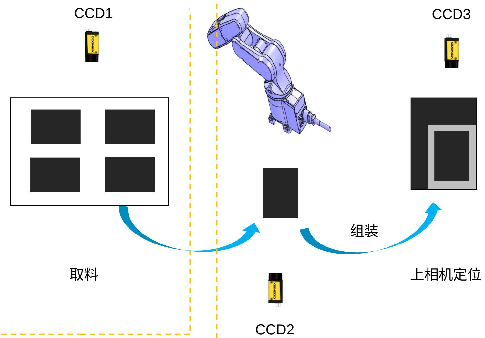  
下相机定位

复检

# 标定设计

取料标定 CCD1 为大视野使用 4mm 标定片，需要确定 XYAngle 并且需要绑定 Robot与产品的关系 11point 标定 +Training 。  
组装标定 CCD2 与 CCD3 使用 2mm 标定片，需要确定 XYAngel 并需要关联 CCD2与 CCD3 联合标定 11+1point 标定。

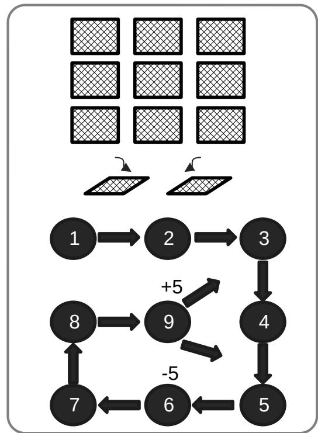  
11 Point Calibration

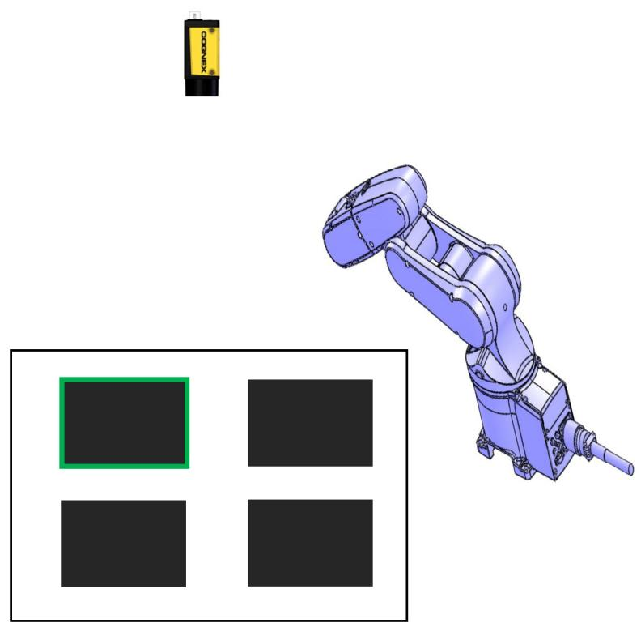  
Training

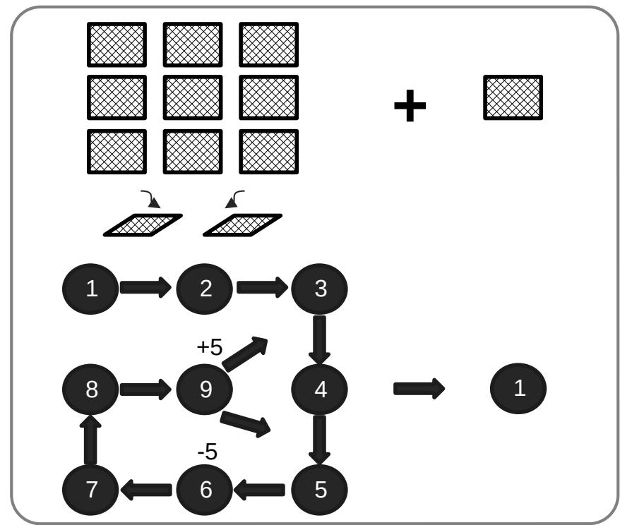  
11+1 Point Calibration

# 标定通讯协议 – 取料标定

<table><tr><td>Machine Send</td><td>COGNEX Vision Send</td><td>OK/NG</td><td>Comment</td></tr><tr><td rowspan="2">SC,1,11</td><td>SC,1</td><td>OK</td><td rowspan="2">Start the calibration. 
SC: Start Calibration, 1: use first calibration file, 11: 执行11点标定</td></tr><tr><td>SC,0</td><td>NG</td></tr><tr><td rowspan="2">C1, X1,Y1,θ1</td><td>C1,1</td><td>OK</td><td rowspan="2">Send the P1 coordinate to the vision</td></tr><tr><td>C1,0</td><td>NG</td></tr><tr><td rowspan="2">C1, X2, Y2, θ2</td><td>C1,1</td><td>OK</td><td rowspan="2">Send the P2 coordinate to the vision</td></tr><tr><td>C1,0</td><td>NG</td></tr><tr><td>...</td><td>...</td><td>...</td><td>......</td></tr><tr><td rowspan="2">C1,X11,Y11,θ11</td><td>C1,1</td><td>OK</td><td rowspan="2">Send the P11 coordinate to the vision</td></tr><tr><td>C1,0</td><td>NG</td></tr><tr><td rowspan="2">EC</td><td>EC,1</td><td>OK</td><td rowspan="2">End the calibration</td></tr><tr><td>EC,0</td><td>NG</td></tr><tr><td rowspan="2">Train, X, Y, θ</td><td>Train, 1</td><td>OK</td><td rowspan="2">训练 Robot 取料时 Robot 的坐标</td></tr><tr><td>Train, 0</td><td>NG</td></tr></table>

• Use TCP/IP protocol, and the vision system is server, end by \r\n for each send and receive.

# 标定通讯协议 – 对位标定

<table><tr><td>Machine Send</td><td>COGNEX Vision Send</td><td>OK/NG</td><td>Comment</td></tr><tr><td rowspan="2">SC,2,11,3,1</td><td>SC,1</td><td>OK</td><td rowspan="2">Start the calibration.</td></tr><tr><td>SC,0</td><td>NG</td></tr><tr><td rowspan="2">C2, X1,Y1,θ1</td><td>C1,1</td><td>OK</td><td rowspan="2">Send the P1 coordinate to the vision</td></tr><tr><td>C1,0</td><td>NG</td></tr><tr><td rowspan="2">C2 X2, Y2, θ2</td><td>C1,1</td><td>OK</td><td rowspan="2">Send the P2 coordinate to the vision</td></tr><tr><td>C1,0</td><td>NG</td></tr><tr><td>...</td><td>...</td><td>...</td><td>....</td></tr><tr><td rowspan="2">C2,X11,Y11,θ11</td><td>C1,1</td><td>OK</td><td rowspan="2">Send the P11 coordinate to the vision</td></tr><tr><td>C1,0</td><td>NG</td></tr><tr><td rowspan="2">C3, X, Y, θ</td><td>C3,1</td><td>OK</td><td rowspan="2">Send the P12 coordinate to the vision</td></tr><tr><td>C3,0</td><td>NG</td></tr><tr><td rowspan="2">EC</td><td>EC,1</td><td>OK</td><td rowspan="2">End the calibration</td></tr><tr><td>EC,0</td><td>NG</td></tr></table>

• Use TCP/IP protocol, and the vision system is server, end by \r\n for each send and receive.

# Framework 设计

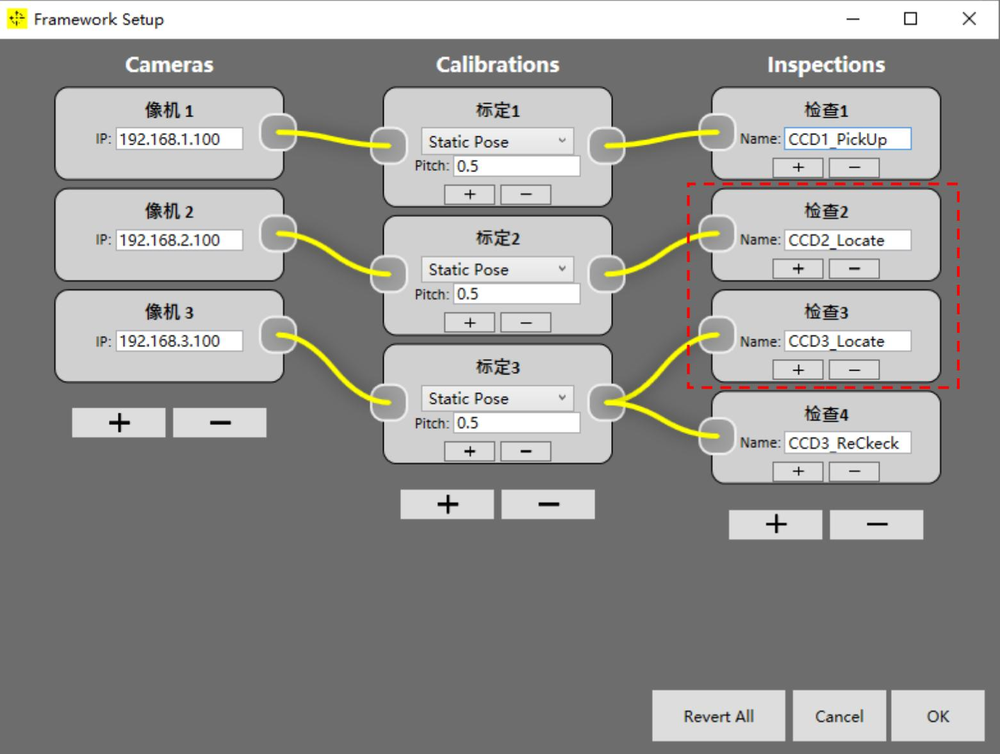

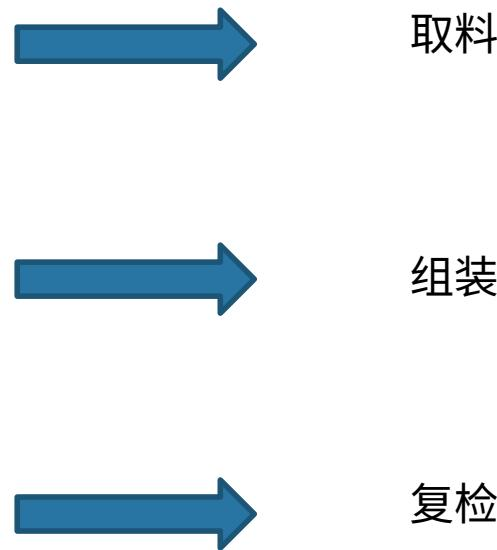

# Inspection 设计

• CCD1_PickUp 训练 Robot 与生产时引导 Robot 取料  
CCD2_Locate 下相机定位  
CCD3_Locate 上相机定位  
CCD3_ReCheck 上相机复检

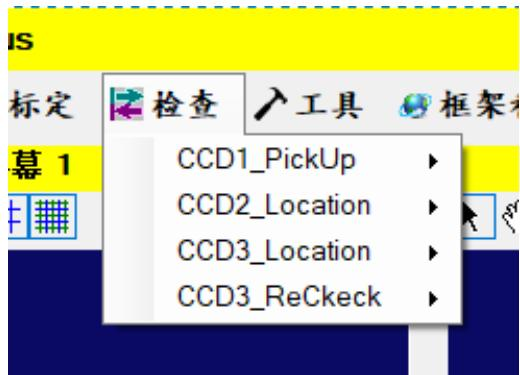

# 生产通讯协议

<table><tr><td>Machine Send</td><td>COGNEX Vision Send</td><td>Comment</td></tr><tr><td>P0,SN,X,Y,Angle</td><td>P0,SN,ErrorCode,X,Y,Angle</td><td>PickUp, SN: 当前产品的, Errorcode: 定义的错误代码, XYAgnle: 当前 Robot 的坐标。</td></tr><tr><td>P1, SN, X, Y, Angle</td><td>P1,SN,ErrorCode,X,Y,Angle</td><td>产品 1 定位, SN: 当前产品的, Errorcode: 定义的错误代码, XYAgnle: 当前 Robot 的坐标。</td></tr><tr><td>P100, SN,X, Y, Angle</td><td>P100,SN,ErrorCode,X,Y,Angle</td><td>产品 2 定位, SN: 当前产品的, Errorcode: 定义的错误代码, XYAgnle: 当前 Robot 的坐标。</td></tr><tr><td>P400,SN, X, Y2, Angle</td><td>P100,SN,ErrorCode,Gap1,Gap2</td><td>产品 2 定位, SN: 当前产品的, Errorcode: 定义的错误代码, Gap: 测量的间隙。</td></tr><tr><td colspan="3">· Use TCP/IP protocol, and the vision system is server, end by \r\n for each send and receive.</td></tr></table>

# Inspection | CCD1_PickUp

TB_CommandTool 解析指令  
TB_TrainRobot 训练 Robot 坐标  
TB_LocateTool 抓取产品特征   
TB_DisplayTool 将数据显示到 Display  
TB_SaveData 保存数据  
TB_SendData 将需要发送的数据整理到一起

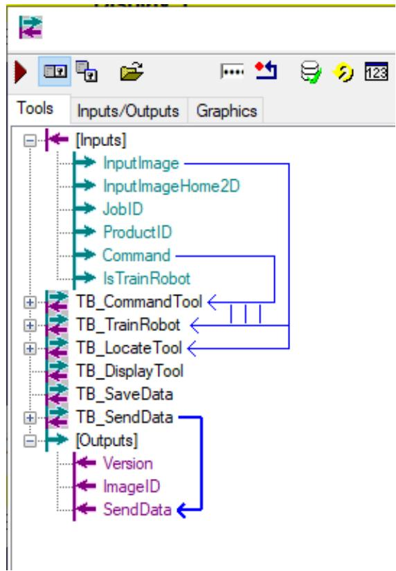

Note：先训练Robot取料的位置，再使用下列公式计算 Robot的取料移动到的位置

DestinationRobotPose=DestinationPartPose.Compose(CurrentPartPose.Invert().Compose(CurrentRobotPose))

TB_CommandTool 解析指令  
TB_LocateTool 抓取产品特征   
TB_DisplayTool 将数据显示到 Display  
TB_SaveData 保存数据  
• TB_SendData 将需要发送的数据整理到一起

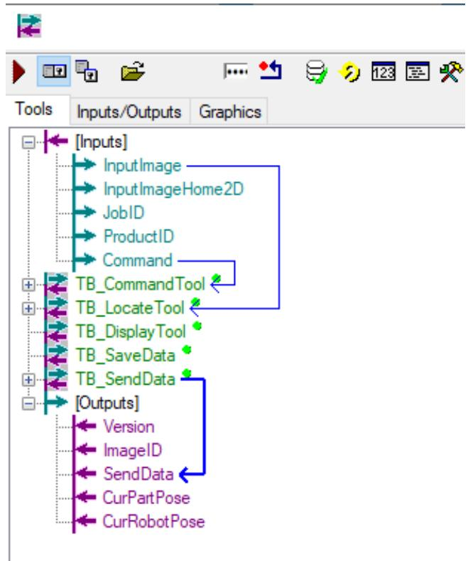

Note ：在这个 Inspection 里面需要把当前的获取的产品位置与 Robot 的位置给到 CCD3_Location 的 Inspection里面，用它们去计算 Robot 需要走到的位置。

TB_CommandTool 解析指令  
TB_LocateTool 抓取产品特征并计算 Robot 需要移动到的位置  
TB_DisplayTool 将数据显示到 Display  
TB_SaveData 保存数据  
TB_SendData 将需要发送的数据整理到一起

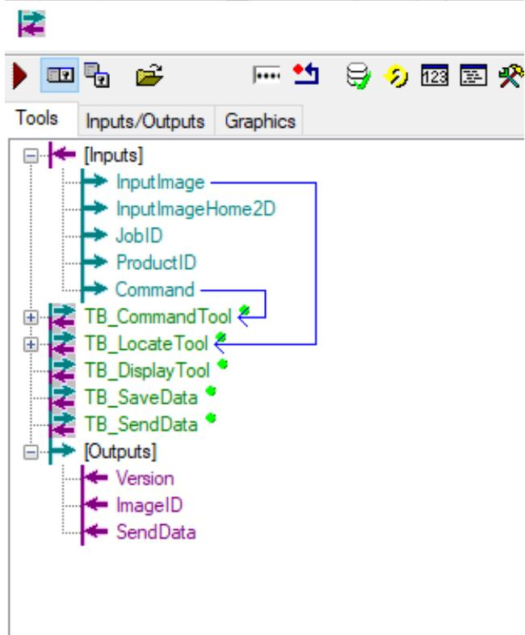

Note ：使用下列公式计算 Robot 的需要移动到的位置

DestinationRobotPose=DestinationPartPose.Compose(CurrentPartPose.Invert().Compose(CurrentRobotPose))

TB_CommandTool 解析指令  
TB_MeasurementGap 测量贴合后产品的间的 Gap ，每边都需要测量 10组 Gap  
TB_DisplayTool 将数据显示到 Display  
TB_SaveData 保存数据  
TB_SendData 将需要发送的数据整理到一起

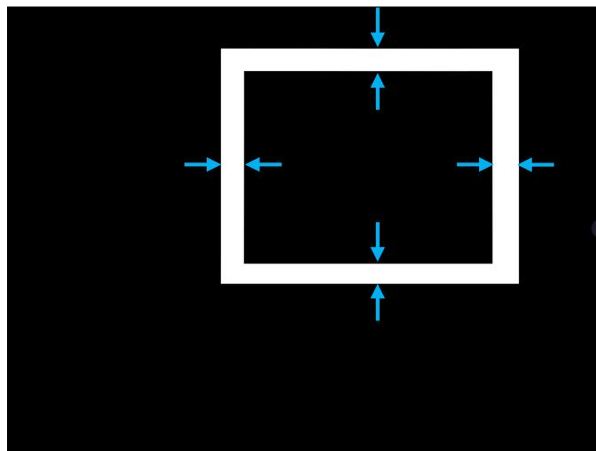

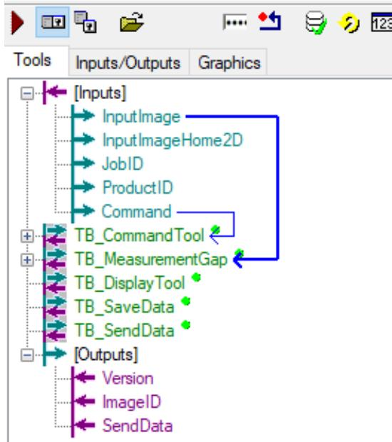

COGNEX

# FASTER FORWA

Thank You