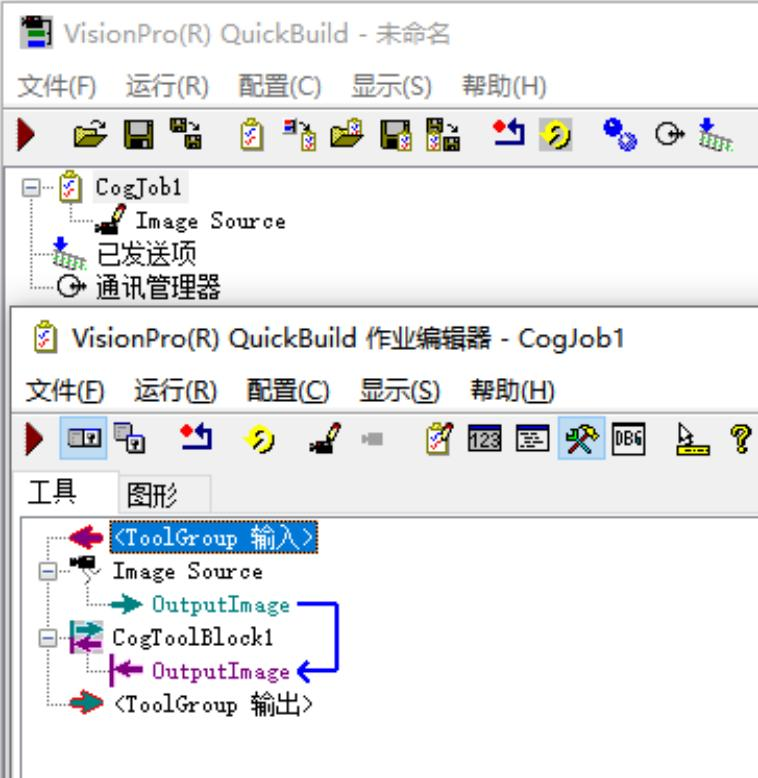
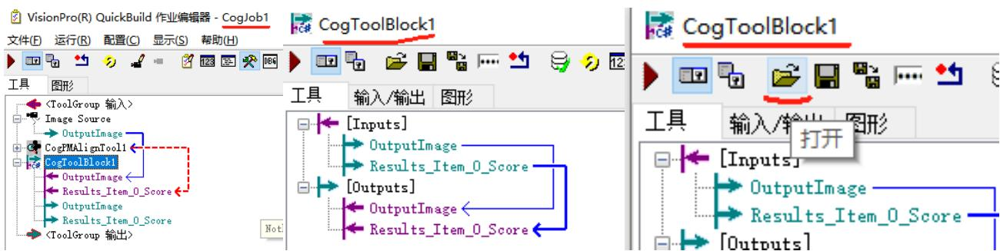

# 1. CogToolBlock

Visionpro 软件保存一般 5 种方式：

$\textcircled{1}$ 保存 Quickbuild，后缀名.VPP  
$\cdot$ 保存 Cogjob，后缀名.VPP  
$\textcircled{3}$ 保存 ToolBlock，后缀名.VPP  
$\textcircled{4}$ 保存工具，后缀名.VPP  
$\textcircled{5}$ 保存脚本，后缀名.cs

# 五中方式互相不通用，怎么保存，怎么打开。

# 注意：

1. CogToolBlock 界面点击运行，只会运行工具，不会切换图片，需要在 quickbuild 或者 cogjob 界面点击运行。  
2. 考试要求保存 Quickbuild、Cogjob、ToolBlock，按照要求来，ToolBlock 指的就是 CogToolBlock  
3. CogToolBlock 可以直接添加输入输出。Cogjob 界面的结果可以直接连线输入给 CogToolBlock，CogToolBlock 界面的工具结果可以直接连线输出给 Outputs  
4. 厂区车间电脑上视觉软件的 Inspection1 2 3 等等都是 ToolBlock 格式，可以在 Visionpro 中添加 CogToolBlock 工具块，然后在添加的 CogToolBlock 工具块界面左上角点击打开来选择打开某个 Inspection 或者是 Calibrationo 文件。

