# Machine Vision Basic

COGNEX

# 成像过程

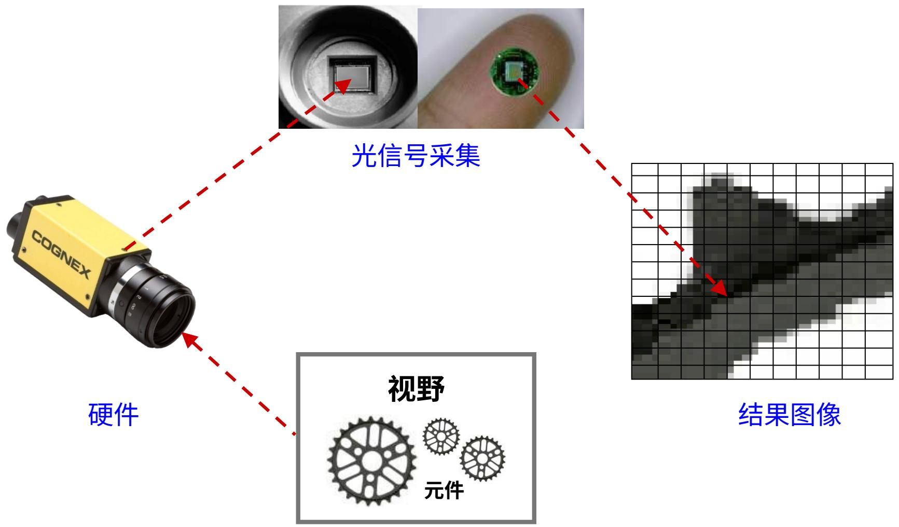

# 硬件相关术语

相机所能看到的现实世界的物理尺寸

被测物到相机镜头的距离

透镜中心到其焦点的距离

感光片成像区域的尺寸（通常由感光片长边决定）

被测物体清晰成像的最上表面与最下表面之间的距离

感光器尺寸与 FOV 之间的比值

# 相机所能看到的现实世界的物理尺寸

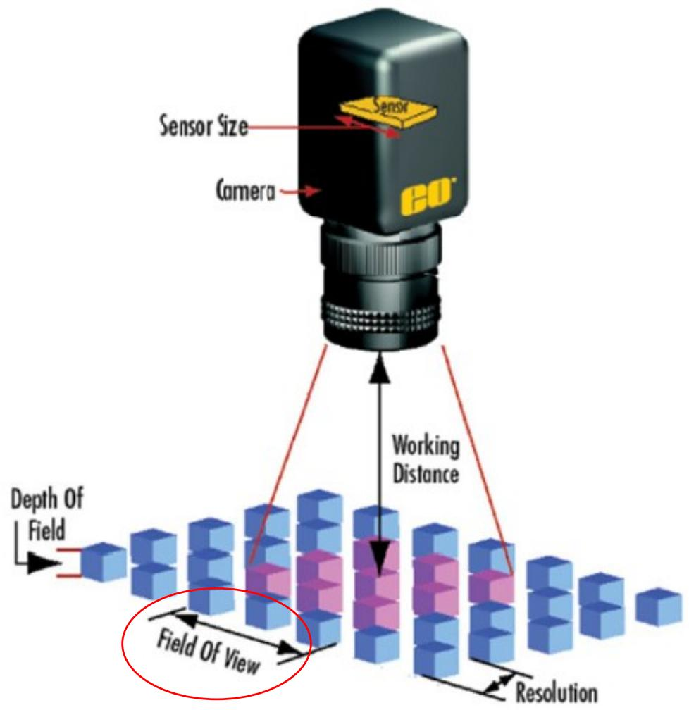

#

# 被测物到相机镜头的距离

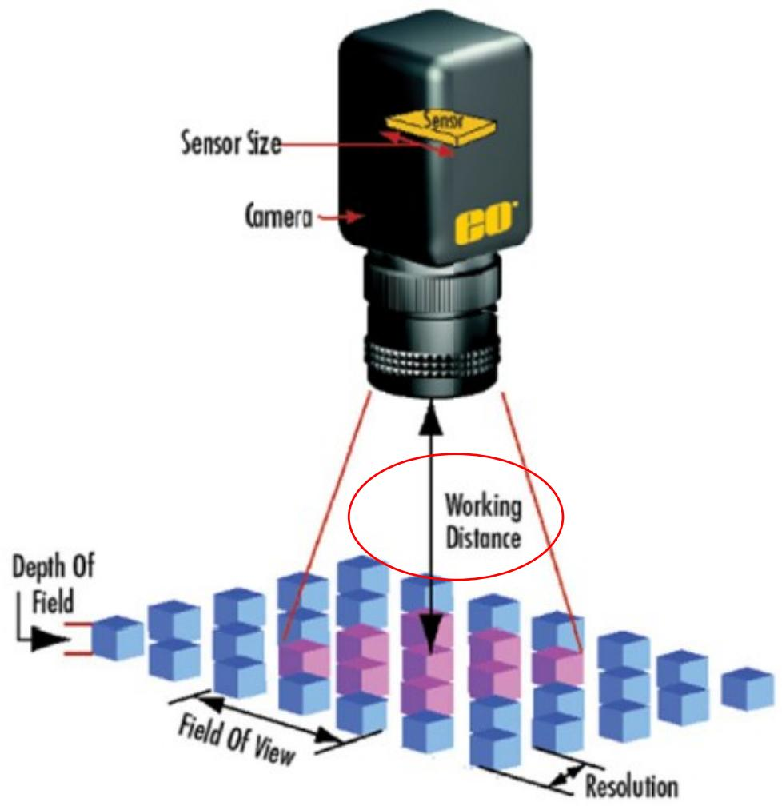

# 透镜中心到其焦点的距离

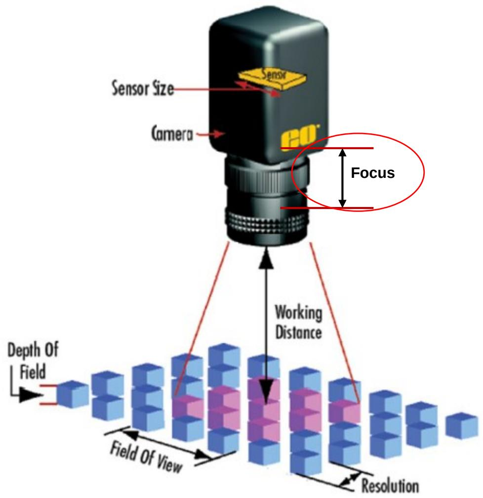

#

感光片成像区域的尺寸 （通常由感光片长边决定）

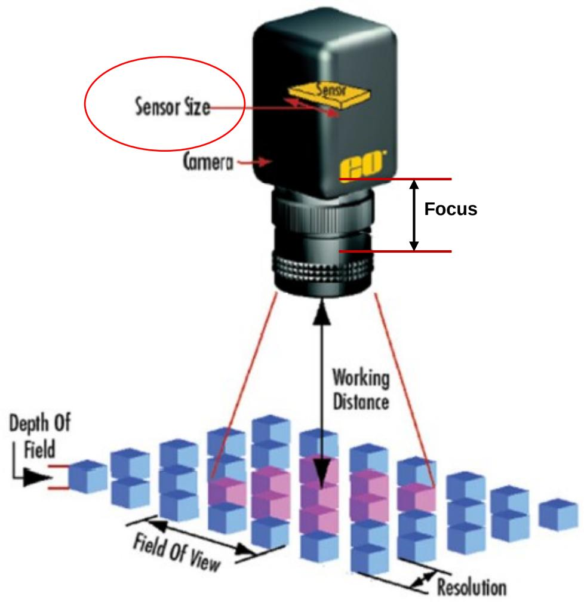

#

# 像元尺寸 (Pixel Size)

一般为 3μm-10μm 。 (1/3’:7.4X7.4μm 1/1.8’:4.4X4.4μm)

<table><tr><td></td><td>1/4 inch</td><td>1/3 inch</td><td>1/2 inch</td><td>2/3 inch</td><td>1 inch</td></tr><tr><td>对角线（mm）</td><td>4</td><td>6</td><td>8</td><td>11</td><td>16</td></tr><tr><td>幅面尺寸</td><td>3.6X2.7</td><td>4.8X3.6</td><td>6.4X4.8</td><td>8.8X6.6</td><td>12.8X9.6</td></tr></table>

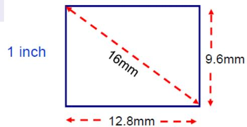

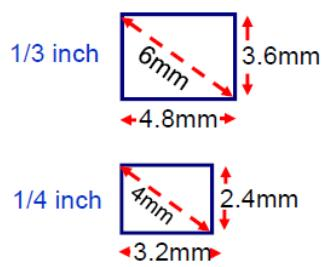

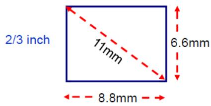

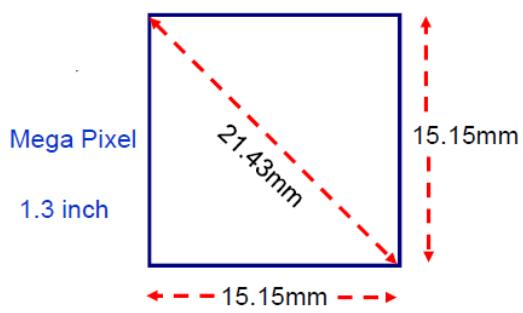

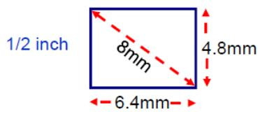

# 被测物体清晰成像的最上表面与最下表面之间的距离

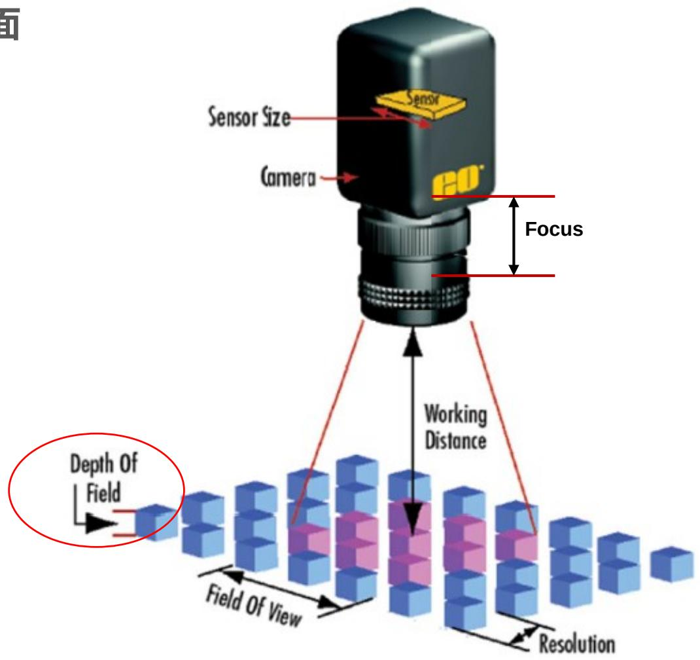

#

# 感光器尺寸与 FOV 之间的比值

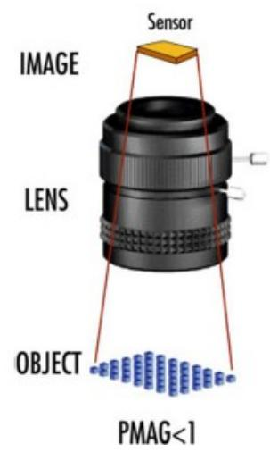

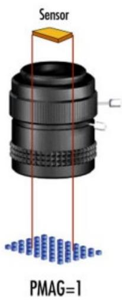

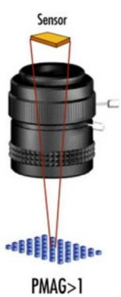

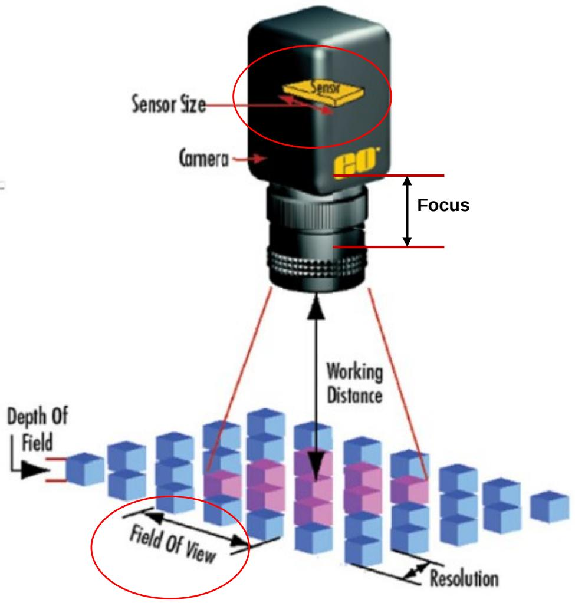

# 结果图像相关术语

? 像素 （ Pixel)  
感光器件上的基本感光单元，既相机识别到的图像上的最小单元  
像素深度 (Pixel Depth)  
 即每个像素数据的位数，一般常用的是 8Bit ，对于数字工业相机机一般还会有 10Bit 、 12Bit 等  
? 分辨率 （ Resolution)  
相机采集图像的像素点数  
像素分辨率 （ mm/pixel)  
每个像素代表的毫米值

# 相机的世界

Can you calculate what this is?

Now maybe you can see it…

Here it is:

2D Code

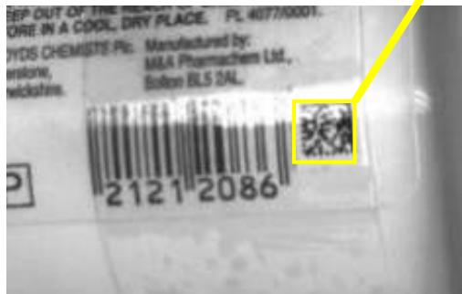

<table><tr><td>99 99 99 99 99 99 99 99 99 99 99 99 99 99 99 99 99 99 99 99 99 99 99 99 99 99 99 99 99 99 99 99 99 99 100 100 100 100 100 100 100 100 100 100 100 100 100 100 100 100 100 100 100 100 100 100 100 100 100 102 102 102 102 102 102 102 102 102 102 102 102 102 102 102 102 102 102 102 102 102 102 102 102 102 100 100 100 100 100 100 100 100 100 100 100 100 100 100 100 100 100 100 100 100 100 100 100 100 101 101 101 101 101 101 101 101 101 101 101 101 101 101 101 101 101 101 101 101 101 101 101 101 101 102 102 102 102 102 102 102 102 102 102 102 102 102 102 102 102 102 102 102 102 102 102 102 102 103 103 103 103 103 103 103 103 103 103 103 103 103 103 103 103 103 103 103 103 103 103 103 103 103 104 104 104 104 104 104 104 104 104 104 104 104 104 104 104 104 104 104 104 104 104 104 104 104 104 105 105 105 105 105 105 105 105 105 105 105 105 105 105 105 105 105 105 105 105 105 105 105 105 105 106 106 106 106 106 106 106 106 106 106 106 106 106 106 106 106 106 106 106 106 106 106 106 106 106 107 107 107 107 107 107 107 107 107 107 107 107 107 107 107 107 107 107 107 107 107 107 107 107 107 108 108 108 108 108 108 108 108 108 108 108 108 108 108 108 108 108 108 108 108 108 108 108 108 108 109 99 99 99 99 99 99 99 99 99 99 99 99 99 99 99 99 99 99 99 99 99 99 99 99 99 99 99 99 99 99 99 99 98 98 98 98 98 98 98 98 98 98 98 98 98 98 98 98 98 98 98 98 98 98 98 98 98 98 98 98 98 98 98 98 98 98
99 99 99 99 99 99 99 99 99 99 99 99 99 99 99 99 99 99 99 99 99 99 99 99 99 99 99 99 99 99 99 99 99 85 62 77 92 73 73 65 62 80 99 99 99 99 99 99 99 99 99 99 99 99 99 99 99 99 99 99 99 99 99 99 99 99 99 99 99 99 99 99 99 99 99
99 99 99 99 99 99 99 99 99 99 99 99 99 99 99 99 99 99 99 99 99 99 99 99 99 99 99 99 99 99 99 99 99
88 88 88 88 88 88 88 88 88 88 88 88 88 88 88 88 88 88 88 88 88 88 88 88 88 88 88 88 88 88 88 88 88 88 98
88 88 88 88 88 88 88 88 88 88 88 88 88 88 88 88 88 88 88 88 88 88 88 88 88 88 88 88 88 88 88 88 88
88 88 88 88 88 88 88 88 88 88 88 88 88 88 88 88 88 88 88 88 88 88 88 88 88 88 88 88 88
88 88 88 88 77 73 73 65 62 80 99 99 99 99 99 99 99 99 99 99 99 99 99 99 99 99 99 99 99 99 99 99 99 99
88 88 88 88 77 73 73 65 62 80 99 99 99 99 99 99 99 99 99 99 99 99 99 99 99 99 99 99 99 99
88 88 88 88 77 73 73 65 62 80 99 99 99
88 88 88 88 77 73 73 65 62 80 99 99 99
88 88 88 88 77 73 73 65 62 80 99 99
88 88 88 88 77 73 73 65 62 80 99
88 88 88 88 77 73 73 65 62
88 88 88 88 77 73 73 65 62
88 88 88 88 77 73 73 65 62
88 88 88 88 77 73 73 65 62
88 88 88 88 77 73
88 88 88 88 77 73
88 88 88 88
88 88 88
88
88
88
88
88
88
88
88
88
88
88
88
88
88
88
88
88
88
88
88
88
88
88
88
88
88
88
88
88
88
88
88
88</td></tr></table>

# Machine vision sees and interprets the world

# 一组矩阵亮度值

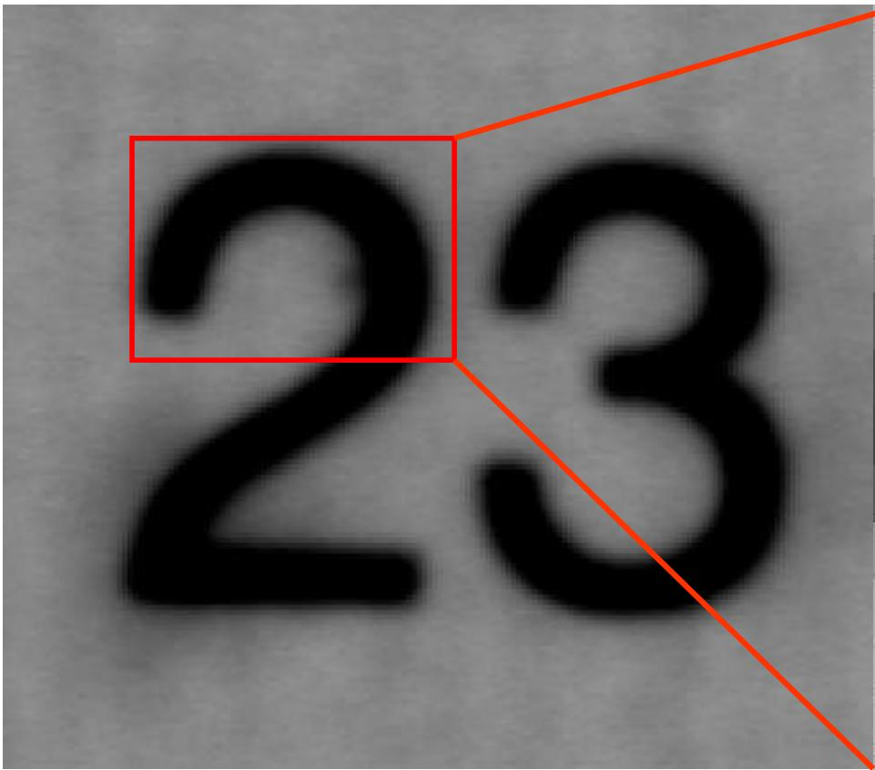

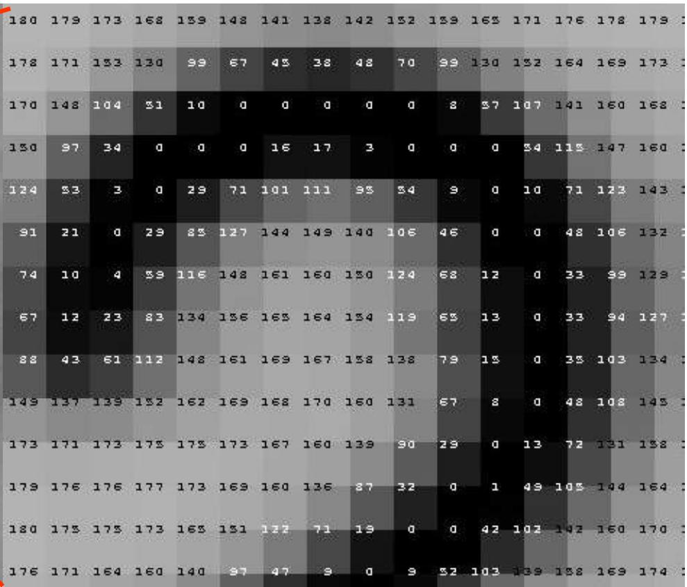

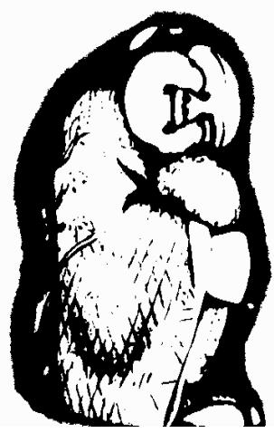

2

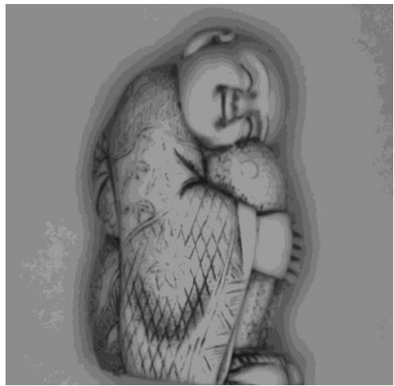

10

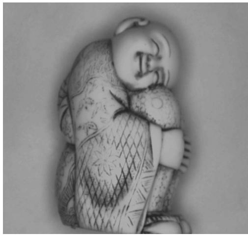

128

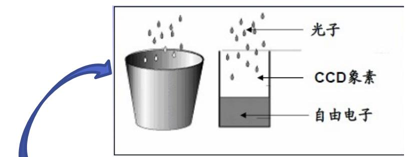

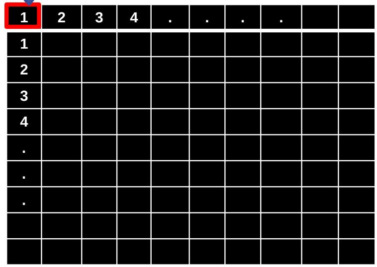

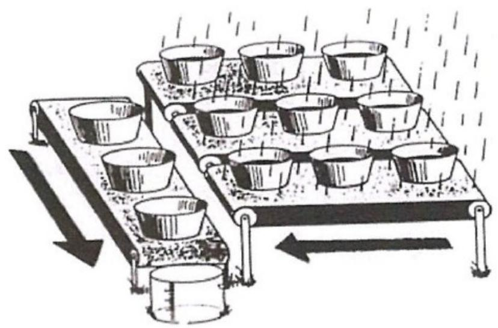

# 图像传感器

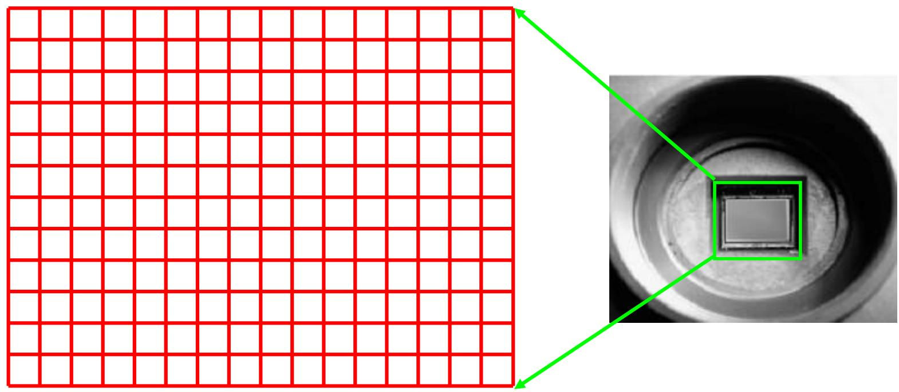

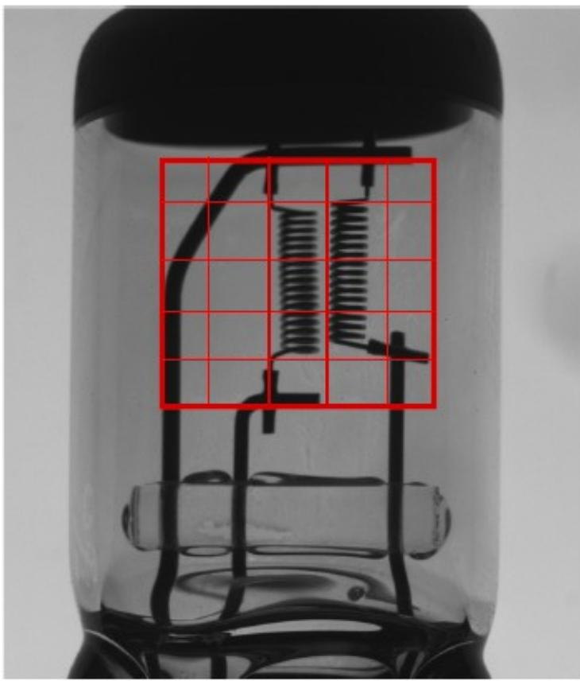

640 x 480 pixel

(0.3 megapixels)

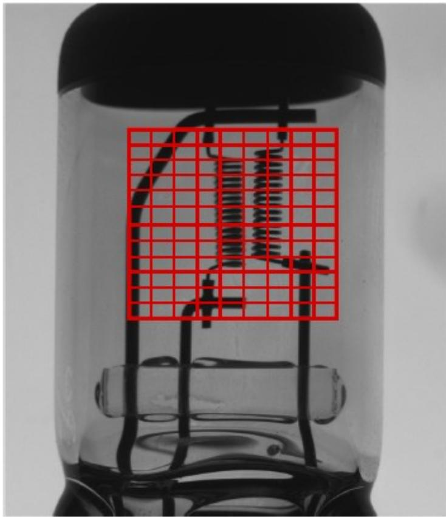

1600 x 1200 pixel

(2 megapixels)

# 图像及微小特征

当特征很小时通常很难分辨其几何特性。

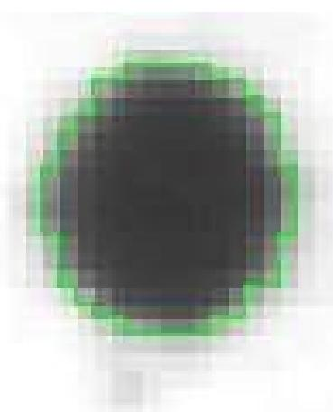  
Dot with fine resolution

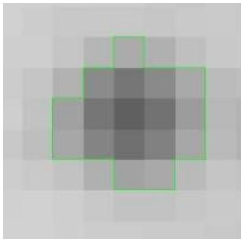  
Dot with coarse resolution

# . FOV/Resolution

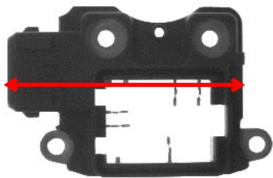  
50 x 30 mm Part

64 x 48 mmFOV

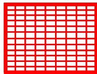

640 x 480 1600 x 1200 pixel Pixels on CC(2 Megapixel)

$$
\begin{array}{l} F O V _ {h o r i z o n t a l} = 6 4 m m \\ A c c u r a c y _ {V i s i o n \_ T o o l} = \frac {1}{4} p i x e l \\ \# \text {P i x e l s} _ {\text {h o r i z o n t a l}} = 1 6 0 0 \text {p i x e l s} \\ \text {A c c u r a c y} _ {\text {h o r i z o n t a l}} = \frac {\text {F O V} \times \text {A c c u r a c y} _ {\text {V i s i o n} - \text {T o o l}}}{\# \text {P i x e l s}} \\ \end{array}
$$

$$
\text {A c c u r a c y} _ {\text {h o r i z o n t a l}} = \frac {6 4 \times (\frac {1}{4} \times 2) p i x e l}{1 6 0 0 p i x e l s}
$$

Accuracy 0.02mm