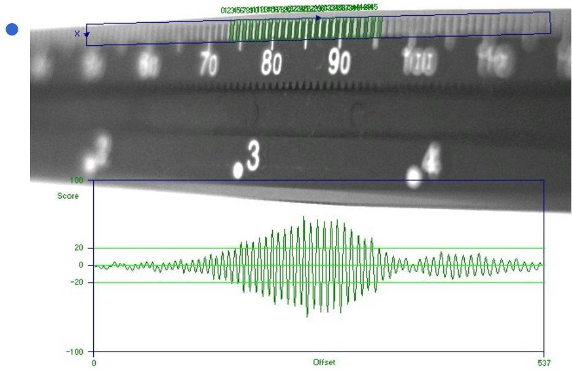
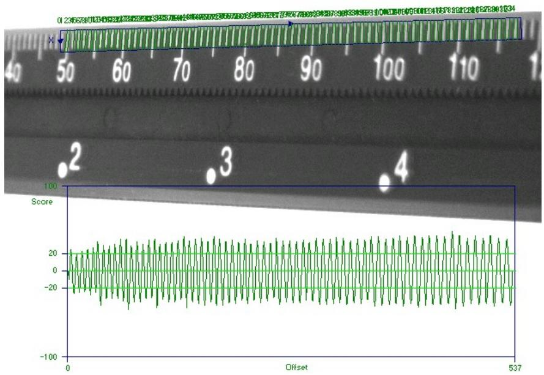
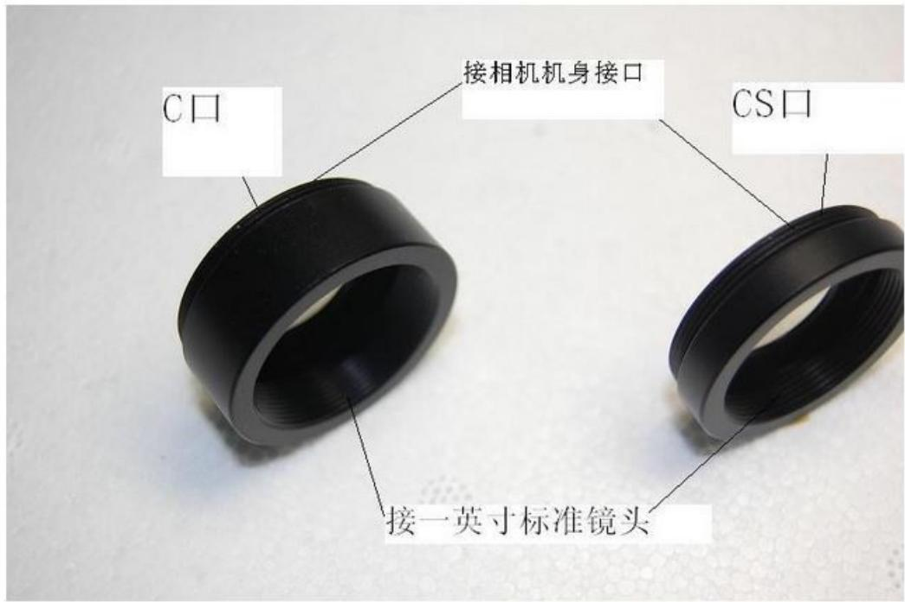
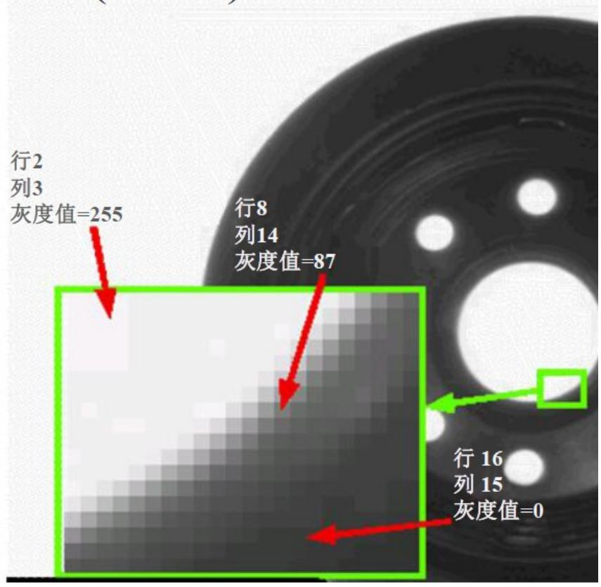
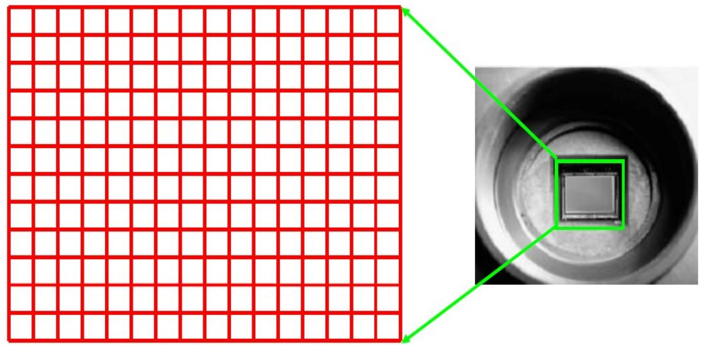

# 视觉相关术语

视野 （ FOV)

□ 相机所能看到的现实世界的物理尺寸

. 像素 （ Pixel)

感光器件上的基本感光单元，既相机识别到的图像上的最小单元！

分辨率 / 解析度 (Resolution)

图像上单个像素所代表的实际尺寸  
分辨率 $=$ 视野 % 像素数（相同方向）

精度  
检测值与真实值的差别   
. 重复度  
多次检测的数值差  
公差  
工件大小允许的变动量

# 视觉相关术语

. 物距

被测物到相机镜头的距离

. 焦距

• 透镜中心到其焦点的距离，焦距的单位通常用 mm( 毫米 ) 来表示，一个镜头的焦距一般都标在镜头上面  
. 光圈   
• 光圈是一个用来控制镜头通光量的装置 ，表示光圈大小我们是用光圈值（ F 值） ，如 F1.4 ， F2 ， F2.8  
曝光时间

光在感光器件表面使其感光的过程  
电子感光器件一般称为光电转换即电子快门时间

. 景深

图像清晰时在对焦范围内的 前后距离

# 视觉相关术语

定焦镜头  
镜头的焦距不可以调节  
变焦镜头  
镜头的焦距可以调节  
广角镜头   
焦距小于标准焦距 50mm 的  
远距镜头  
焦距大于标准焦距 50mm 的  
远心 （焦阑） 镜头  
没有透视变形  
? 定光圈镜头  
光圈不可以调节，通常情况下聚焦也不能调节

景深是在相机聚焦完成后，在焦点前后的范围内都能形成清晰的像，这一前一后的距离范围叫做景深。 直接受光圈的影响 – 光圈越小景深越大。

# 工业相机 _ 镜头接口

C 型镜头匹配 C 型相机  
CS 型镜头匹配 CS 型相机  
C 型镜头 + 5mm 接圈匹配 CS 型相机  
CS型镜头不匹配C型相机

<table><tr><td>接口类型</td><td>法兰后截距 (mm)</td><td>卡口环直径 (mm)</td><td>使用卡口的品牌</td></tr><tr><td>C</td><td>17.526</td><td>1(INCH)</td><td></td></tr><tr><td>CS</td><td>12.5</td><td>1(INCH)</td><td></td></tr><tr><td>4/3口</td><td>38.58</td><td>46.5</td><td>Olympus、Panasonic 、Leica</td></tr><tr><td>F</td><td>46.5</td><td>47</td><td>Nikon</td></tr><tr><td>EF</td><td>44</td><td>54</td><td>Canon EOS</td></tr><tr><td>PK</td><td>45.5</td><td>48.5</td><td>Pentax,Ricoh</td></tr><tr><td>C/Y</td><td>45.5</td><td>48</td><td>Contax,Yashica</td></tr></table>

1. 分辨率 (Resolution) ：

相机采集图像的像素点数 (Pixels) ，工业相机机一般是直接与光电传感器的像元数对应的  
. 2. 像素深度 (Pixel Depth) ：

即每个像素数据的位数，一般常用的是 8Bit ，对于数字工业相机机一般还会有 10Bit 、 12Bit 等  
3. 最大帧率 (Frame Rate)/ 行频 (Line Rate) ：

相机采集传输图像的速率，面阵相机一般为每秒采集的帧数 (Frames/Sec.) ，对于线阵相机机为每秒采集的行数 (Hz)

# 工业相机 _ 像素数据信息

像素数据 每个像素具有以下信息内容：  
在图像上的位置  
（行，列） 坐标  
亮度  
– 黑白图像的灰阶或彩色图像的RGB/HSI

  
灰阶：亮度（灰度）的单位，从0到255

# 附表 _ 光谱响应 _ 光波波长

光波波长  

<table><tr><td colspan="2">波段</td><td>符号</td><td>波长（nm）</td></tr><tr><td rowspan="4">紫外（UV）100~380</td><td>真空紫外</td><td>VUV</td><td>100~200</td></tr><tr><td>远紫外</td><td>FUV</td><td>200~280</td></tr><tr><td>中紫外</td><td>MUV</td><td>280~315</td></tr><tr><td>近紫外</td><td>NUV</td><td>315~380</td></tr><tr><td rowspan="8">可见光（VIS）380~780</td><td>紫</td><td>Violet</td><td>380~424</td></tr><tr><td>蓝</td><td>Blue</td><td>424~486</td></tr><tr><td>蓝绿</td><td>Blue green</td><td>486~517</td></tr><tr><td>绿</td><td>Green</td><td>517~527</td></tr><tr><td>黄绿</td><td>Yellow green</td><td>527~575</td></tr><tr><td>黄</td><td>Yellow</td><td>575~585</td></tr><tr><td>橙</td><td>Orange</td><td>585~647</td></tr><tr><td>红</td><td>Red</td><td>647~780</td></tr><tr><td rowspan="3">红外（IR）780nm~1mm</td><td>近红外</td><td>NIR</td><td>780nm~3um</td></tr><tr><td>中红外</td><td>MIR</td><td>3um~50um</td></tr><tr><td>远红外</td><td>FIR</td><td>50um~1mm</td></tr></table>

图像传感器

? 图像传感器由行列组成的矩阵式亮度感应元器件 组成。 The image sensor is a matrix of n rows and m columns of light sensitive elements

# 工业相机 _ 成像器

CCD (Charge Coupled Device)_ 电荷耦合装置

CCD 目前的技术比较成熟，但其工艺复杂、成本高、耗电量大、像素提升难度大。

CMOS (Complementary Metal Oxide Semiconductor)

_ 互补金属氧化物半导体

CMOS 由于制造工艺简单，因此可以在普通半导体生产线上进行生产，其制造成本相对比较低廉。

# 工业相机 _ 主要参数

# . 4. 曝光方式 (Exposure) 和快门方式 (Shutter) ：

线阵相机都是逐行曝光的方式，可以选择固定行频和外触发同步的采集方式，曝光时间可以与行周期一致，也可以设定一个固定的时间；面阵工业相机有帧曝光、场曝光和滚动行曝光等几种常见方式，工业相机机一般都提供外触发采图的功能。快门速度一般可到 10 微秒，高速工业相机还可以更快。

# 5. 像元尺寸 (Pixel Size) ：

像元大小和像元数 ( 分辨率 ) 共同决定了相机机靶面的大小。目前数字工业相机像元尺寸一般为 3μm-10μm ，一般像元尺寸越小，制造难度越大，图像质量也越不容易提高。 (1/3’:7.4X7.4μm 1/1.8’:4.4X4.4μm)

<table><tr><td></td><td>1英寸</td><td>2/3英寸</td><td>1/2英寸</td><td>1/3英寸</td><td>1/4英寸</td></tr><tr><td>对角线(mm)</td><td>16</td><td>11</td><td>8</td><td>6</td><td>4</td></tr><tr><td>幅面尺(mm)</td><td>12.8×9.6</td><td>8.8×6.6</td><td>6.4×4.8</td><td>4.8×3.6</td><td>3.6×2.7</td></tr></table>

# ? 6. 光谱响应特性 (Spectral Range) ：

指该像元传感器对不同光波的敏感特性，一般响应范围是 350nm －1000nm 。

# 工业相机 _ 成像器

CCD vs CMOS   

<table><tr><td></td><td>价格</td><td>噪声（图片暗部的不规则杂点）</td><td>耗电量</td><td>图像锐利度</td><td>速度</td><td>发展趋势</td></tr><tr><td>CCD</td><td>高</td><td>低</td><td>高</td><td>高</td><td>一般</td><td>技术较成熟</td></tr><tr><td>CMOS</td><td>低</td><td>较高</td><td>低</td><td>一般</td><td>快</td><td>生产厂家众多，技术不断有突破性进展</td></tr></table>

# . 全局快门 / 全域快门 (Global Shutter)

让整个感光元器件每行像素全部在同一时间进行曝光，也就是所有像元同时曝光。

全局快门曝光时间更短，这样不仅能提升效率，也能根除影像果冻现象。

# 滚动快门 (Rolling Shutter)

感光元件是从第一行、第二行、第三行 ... 这样按照顺序进行光线感测，一直到整片感光组件从上到下每一行都曝光完成为止。

卷帘快门曝光时间更长，另外就是在拍照的时候，假如工业相机有晃动，或者拍摄快速移动的物体，就会看到画面上的果冻现象。