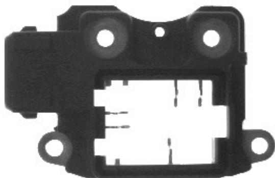
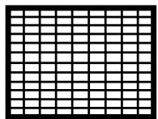
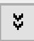

# 扫码枪

电源线：棕正蓝负

工作电压： 24V

扫码枪灯：电源指示灯(通电时绿色) 训练状态/触发状态指示灯(绿色/黄色) 读码成功/不成功指示灯(读取ok闪绿色，失败闪红色) 网络指示灯(接通为黄色) 错误指示灯(报警时为红色 )

扫码枪 IP ：参考相机

# 视觉调试流程：

确认硬件型号、数量及安装情况

安装扫码枪、 visionpro 、 .Net Framework 软件 视觉软件

配置相机扫码枪能连接上正常使用

确认相机视野焦距 打光效果等

标定并确定标定结果，

粗调 VPP 调试扫码枪 试跑流程

做静动态 grr cpk

调试 ok 备份视觉软件

# 标定注意事项

① 确认相机的焦距，视野是否调整 OK ，镜头及相机是否松动；  
$\textcircled{2}$ 运动机构是否调整 OK ；  
$\textcircled{3}$ 软件和视觉软件是否正常，通信是否正常；  
$\textcircled{4}$ 标定所使用的工具是否准备 OK ，标定工具是否破损，翘曲；  
⑤ Configuration 中棋盘格的尺寸与实际是否匹配；  
$\textcircled{6}$ 机器人吸取或放下棋盘格时，棋盘格是否有滑动现象或者吸不起来；  
$\textcircled{7}$ 检查标定误差是否在正常范围；

# 相机无法连接触发：

① 确认相机是否连接正确  
$\textcircled{2}$ 如果 VisionPro 可用，打开 Cognex GigE VisionConfiguration ，查看不拍照的相机是否在左侧的相机列表中。  
$\textcircled{3}$ 确认机构是否发送了正确的触发信号。  
$\textcircled{4}$ 可能由于主机卡顿，软件卡顿或 BUG 引起，将计算机关机，约十秒钟后，重新开启计算机  
$\textcircled{5}$ 检查相机是否损坏，如坏的话更换相机。  
$\textcircled{6}$ 相机配置参数设置不正确，重新查看并配置好正确参数  
$\textcircled{7}$ 权限位丢失，检查 8704E 板卡权限  
$\textcircled{8}$ 磁盘已满或者图片删除设置参数不合理，重新设置图片保存参数

# 相机蓝屏

① 主机 IP 或者相机 IP 有设置错误  
$\textcircled{2}$ 巨帧数据包改为 9014 、防火墙关闭、 ebus 勾选  
$\textcircled{3}$ 网口损坏 更换别的网口 硬件损坏需更换硬件（网线、相机、图像采集卡）

# 康耐视相机铭牌信息介绍：

CAM-CIC-5000R-24-G

CIC ：康耐视工业相机

5000 ： 500W 相机

R ：卷帘快门相机 (G: 全局快门 )

24 ：帧率： 表示 24 帧 / 秒

G ：黑白相机 (C: 彩色相机 )

通讯接口 GigE

# 精度计算

  
5” x 3” 元件

  
640 x 480   
CCD 像素

6.4” x 4.8” 视野

视野为 $6 . 4 \mathsf { m m } ^ { * } 4 . 8 \mathsf { m m }$ 分辨率为 $6 4 0 ^ { * } 4 8 0$

精确度视 觉工具 10 1 像素

视觉精度计算： 单方向视野范围 / 相机单方向分辨率

相机精度： 6.4mm/640 像素 =0.01mm

测量精度： 0.01mm* 视觉工具精度 =0.01mm*0.1=0.001mm

# 精度计算

1.康耐视500w相机拍照，视野为50mm*40mm，所使用的视觉工具进度为 ¼ 个像素，求测量精度？（ 500w 相机分辨率为 2592*1944 ）相机精度 :( 即像素分辨率 )

相机精度 =50mm/2592=0.0193mm

测量精度：

测量精度 = 相机精度 * 视觉工具精度 =0.0193mm*¼=0.004825mm

# 精度计算

eg ： 视野 40mm*30mm 相机分辨率 600*480

此时精度为： 40mm/640=0.0625mm

eg ：同样已知检测精度求分辨率时：

精度 0.01mm ，视野 4mm*3mm

此时 4mm/0.01mm=400 像素 3mm/0.01mm=300 像素

理论上分辨率大于 400*300 就行

# 码 PMM 值 ( 码密度 )

含义：码的每个 module( 模块 ) 的平均像素值 每个模块占了几个像素

意义：它是判断扫码稳定性的一个重要依据，它不是越大越好也不是越小越好，需要控制在一个合理的范围，二维码一般建议在5~8 ，一维码建议在 3 以上

# 码 PMM 值计算

1. 视野是 78mm*50mm 中间有个二维码尺寸为 5mm*5mm 二维码是 12*12Code

（通俗来讲就是求此二维码每个模块包含几个像素）

用扫码枪 DM50X(752*480) 的长边计算

$\textcircled{1}$ 先算出视野里每个 mm 单位所包含的像素个数：

752/78mm=9.6 表示每 mm 有 9.6 个像素

$\textcircled{2}$ 再算出每个模块尺寸为多少 mm ： 5/12=0.4166666667mm  
$\textcircled{3}$ 计算码密度： 9.6*0.0.4166666667mm=4

另一种： 5mm/78mm*752 像素 /

$$
1 2 = 4. 0 1 7 0 9 4 0 1 7 0 9 4 0 1 7 0 9 4 0 1 7 0 9 4 0 1 7 0 9 4
$$

# DataMatrix 码的判定

• 激光镭雕 喷码等方式出来的 DataMatrix 码质量不一，需要专门的仪器检测  
• Verifier ：等级测试仪   
• 等级测试仪是根据 ISO15415 或 AIM DPM 等标准来制定的，达到标准就说明这个码  
• 具有可读性的，达不到标准就是可能存在读取失败的风险  
• 常见低等级码： L 边损坏，对比度不佳，模块化不佳，模块偏离，条码损坏，条码变形

# 加快工具运行速度

# PMAlign ：

• 算法由 PatMax 改为 Patquick 会加快运行速度  
• 搜索区域越小搜索速度越快 ( 宽 )x( 高 )x( 角度范围 )x( 缩放范围 )  
提高接受阈值搜索变快  
• 减小搜素结果数量执行时间稍变快  
• 精细颗粒度越高， 时间越短  
• 粗糙颗粒度越高， 时间越短  
• 考虑极性稍稍加快速度  
提高对比度以便执行更快

# PMAlign

2PyAli4nT511 Topl1 11

中：

训练参数

训练区域与原点

Tune

运行参数

搜索区域

图形

结果

模式：

加载模式

保存模式

算法：

PatMax 与 PatQui ck

训练模式：

图像

忽略极性

# 图上按钮功能分别表示：

1. 运行  
2.电子模式  
3. 本地显示  
4. 浮动显示   
5. 打开  
6. 保存  
7. 另存  
8. 复位  
9. 图像掩膜编辑器  
10. 建模器  
11. 帮助

# Histogram

# 统计信息

最小值

24

最大值

249

中值

239

模式

242

平均值

169.029

标准差

95.6033

方差

9140

示例

307200

# Statistics

Minimum

24

Maximum

249

Medi an

239

Mode

242

Mean

169.029

Std. Dev.

95.6033

Variance

9140

Samples

307200

Minimum：最小值 灰度最大值

Maximum：最大值 灰度最小值

Median ：中值

比例刚过50%对应的灰度值

Mode ：模式

灰度值占比最高的像素的灰度值

Mean ：平均值

灰度平均值

Std. Dev.: 标准差

灰度标准差

Variance: 方差

灰度方差

Samples: 示例

区域内总像素数