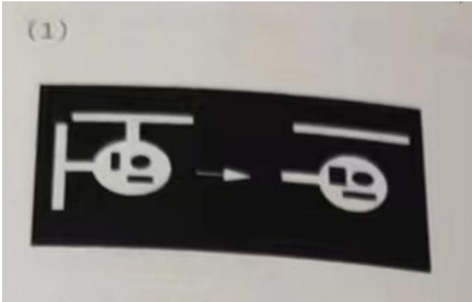
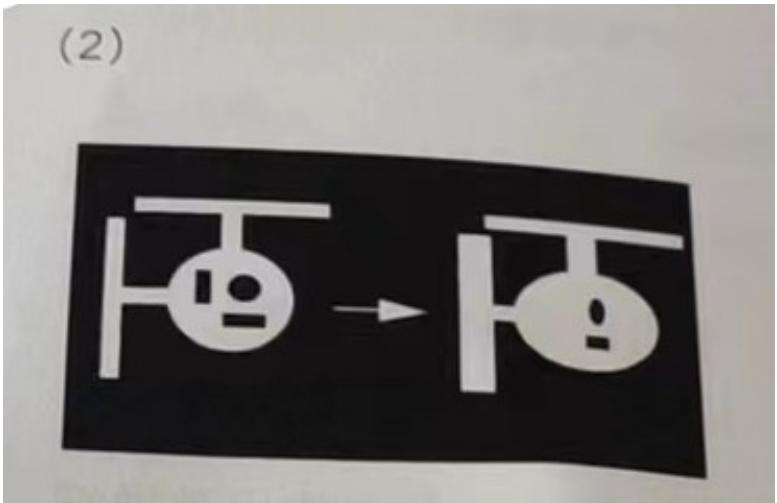
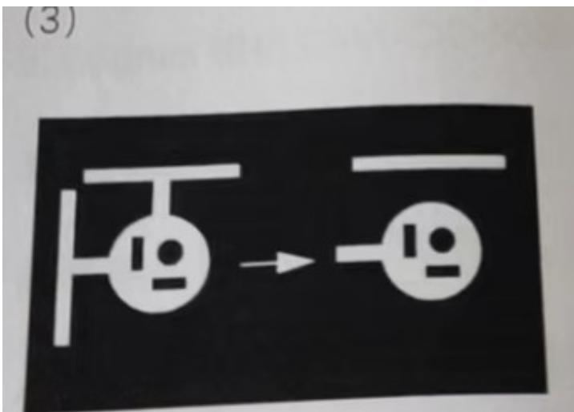
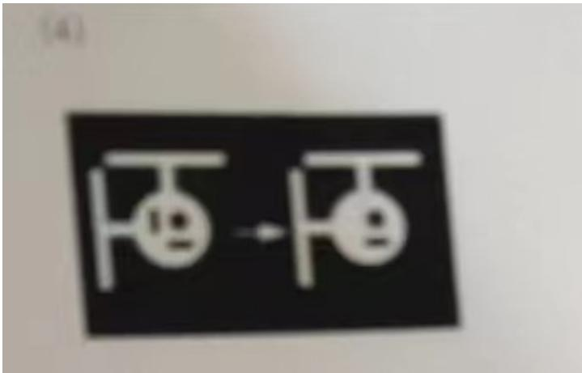

1.VisionPro 工具块 4 中运行状态，分别是：__运行___、_警告____、 _禁用__、__接受  
2.DS 相机，图像采样间距越大，图像数据量越___小__、图像质量_越好____、  
3.Cognex Framework 支持和 SI 通信的方式有__TCP___、__IO__、当前 Framework3.3.1.0 版本支持__8__个端口  
4.VisionPro 工具集中拟合线工具的全称是___CogFitLineTool_____、创造线段工具全称_CogCreateSegmentTool_  
5.灰度直方图工具经常在项目中被用到，灰度直方图的横轴(X轴)表示_灰阶____、纵轴(Y轴)表示__像素数__  
6.Checkboard 主要矫正_线性____、畸变和__非线性___、畸变。Npoint 标定校正___线性__、畸变。  
7.灰度直方图统计哪些信息最大值、最小值、__平均值___、_中值____、_方差____、__标准差___、等。

# 二、不定项选择题

1.调整哪儿些参数可以影响 CogPMAlignTool 运行时间( ABCD )

A.接受阈值 B 缩放 C 查找概数 D 极性  
2.下列哪个是 Global Shutter(全局曝光)型号相机（A）  
A.5000-20-G B. 5000R-14-G C.10MR-10-G D. 12MR-8-G

3.光学倍率公式正确的是（B）

A. 视野/像素数 B.CCD 芯片尺寸/FOV C.焦距/镜头通光孔径 D. Fov/焦距  
4.影响检测精度的因素有？（ABCD）

A.视野 B 相机像素 C 图像质量 D 视觉工具精度  
5.一下工具用于测量类的是？AD

A.CogCaliperTool B.CogFitLineTool C. CogCreateLineTool D.CogDistanceSegmentSegmentTool

# 三、判断题

1.关于 Patmax 模式粒度，粗糙模式粒度必须小于等于精细模式粒度（X）  
2.Cognex 相机 CAM-CIC-5000-20-G，一秒内最多拍 20 张图片（Y）  
3.因物料上下表面存在 4mm 高度差，所以要选用高景深、低畸变远心镜头（Y）  
4.CogFIndCircleTool在其他参数相同的情况下，增加忽略点数可以降低工具的运行时间（Y）  
5.消除图像中细小黑色斑点，可以采用形态学中的开运算（Y）

# 四、简答题

1.硬件触发飞拍过程出现个别图像黑屏现象如何分析？请从现象来整理排查思路，至少4点(15分)黑屏意味着相机拍照了，只是光源未亮、触发不同步或者镜头被遮挡等原因导致。

$\cdot$ 机构运行到某个穴位时，镜头被物体遮挡拍照导致。  
$\textcircled{2}$ 光源未亮导致拍照是黑的。  
$\cdot$ 光源触发和相机拍照不同步，拍照是黑的。  
$\cdot$ 光源触发线磨损或松动，导致个别穴位时线接触不良，光源未亮

2.简述 CogPMAlignTOol，CogFindlineTool，CogBlobTool 工具的作用及详细的使用步骤 15 分参考：

CogPMAlignTOol：可以计数、可以做模板匹配。

$\cdot$ 抓取训练图像，切换到训练图像。  
$\textcircled{2}$ 在训练图像内调整训练区域，框选出需要的特征作为模板，设定中心原点的位置。  
$\textcircled{3}$ 根据需求选择是否开启角度、缩放等参数。  
$\textcircled{4}$ 点击训练，点击运行查看结果。  
$\textcircled{5}$ 根据需求可以用掩膜、建模等方式做模板，没有结果可以修改、接受阈值、对比度阈值、角度、缩放、概数、极性等参数来获取结果。

CogFindlineTool：可以获取一个线段、一条直线。

$\textcircled{1}$ 调整卡尺区域，将抓边工具蓝线和抓取位置重合  
$\textcircled{2}$ 设定相应的卡尺数量、搜索长度、投影长度、搜索方向、搜索极性、忽略点数等。  
$\cdot$ 默认对比度计分、也可添加位置等计分。  
$\textcircled{4}$ 点击运行查看结果。

CogBlobTool：可以获取斑点的数量、面积等信息。

$\cdot$ 设定搜索区域(全图或部分区域)、

$\cdot$ 设定图像分割模式eg：硬阈值固定、动态、软阈值等   
$\cdot$ 设定搜索极性：白底黑点、黑底白点   
$\cdot$ 点击运行查看找到的斑点结果，根据需要做出斑点结果XY面积等的筛选

3.如下图，左边原始图像，转为右边图像，分辨使用了什么形态学操作，并说明形态学调整的作用？

1.水平(宽度)方向腐蚀操作。

以结构元中所有像素灰度值的最低值，替换中心像素的灰度值。

作用：减小斑点，增大空洞。

2.水平(宽度)方向膨胀操作

以结构元中所有像素灰度值的最高值，替换中心像素的灰度值。

作用：减小空洞，增大斑点。

3.水平方向开运算。先进行腐蚀运算，再进行膨胀运算。

作用：维持空洞，去除斑点。

4.水平方向闭运算。先进行膨胀运算，再进行腐蚀运算。

作用：维持斑点，去除空洞。