# Content

根据SI指令控制Inspection运行  
控制Inspection输入和输出  
VPP之间互传参数  
存图模块   
Machine Support添加Windows窗体

# 根据SI指令控制Inspection运行

T1,SN,1 运行VPP1 T2,SN,2运行VPP2   
```txt
public List<string> SimulatorCommandStrings  
{  
    get  
    {  
        return new List<string>();  
        {  
            "T1, SN, 1",  
                "T2, SN, 2",  
            };  
        //throw new NotImplementedException();  
    }  
} 
```

Status

Simulator

Log

  
Image Source:

Camera


Live Camera


File

  
Issue Commands:

Folder

Preset

Autocal

Custom

Batch

T1.SN.1

T2,SN,2

生成模拟指令按钮

根据SI指令控制Inspection运行  
public string TCPJobParser(CommandAndInfo command)   
{ //T1,SN,1 string[]commandArray $\equiv$ command.Command.Split(','); 获取SI发送的指令，并转成数组 string TriggerCommand $\equiv$ commandArray[O].ToUpper(); 对指令进行解析 string SN $=$ commandArray[1]; int InspectionID $\equiv$ Convert.ToInt32 commandedArray[2]）-1; string strReturn $= \text{串}$ bool runStatus $\equiv$ false; switch(TriggerCommand) { case "T1": RunJobParameters rjpl $\equiv$ new RunJobParameters(InspectionID); 实例化RunJobParameters类 runStatus $\equiv$ m_framework.RunJob commanded，LightControlAction.AutoOnAndOff，true，rjpl); 运行 break; } return strReturn; 返回数据到SI //throw new NotImplementedException();

# 根据SI指令控制Inspection运行

# 设置返回指令

# 方法一：在VPP里设置返回指令，在MachineSupport中调用

runStatus $=$ m_frameworkRunJobcommand,LightControlAioinAutoOnAndOff, true,rjp2); if(runStatus) { strReturn $=$ (string)rjp2.0puts["strReturn"]; } break;   
} return strReturn; //throw new NotImplementedException();

<table><tr><td>Name</td><td>Type</td><td>Value</td><td>Force Changed Event</td></tr><tr><td>Version</td><td>System.String</td><td>3.3.0.0</td><td>□</td></tr><tr><td>ImageID</td><td>System.String</td><td></td><td>□</td></tr><tr><td>strReturn</td><td>System.String</td><td>T1,1,2</td><td>□</td></tr></table>

# 方法二：在MachineSupport中直接定义返回指令

} break;   
} return TriggerCommand $^+$ ,1" $^+$ ,2"; //throw new NotImplementedException();

# 控制Inspection输入和输出

case "T1":   
```txt
RunJobParameters rjpl = new RunJobParameters(InspectionID);  
rjplInputs["InputValue"] = InspectionID;  
runStatus = m_framework.RunJob(cmd, LightControlAction.AutoOnAndOff, true, rjpl);  
if (runStatus)  
{  
    strReturn = (string)rjpl.Outputs["strReturn"];  
}  
break; 
```

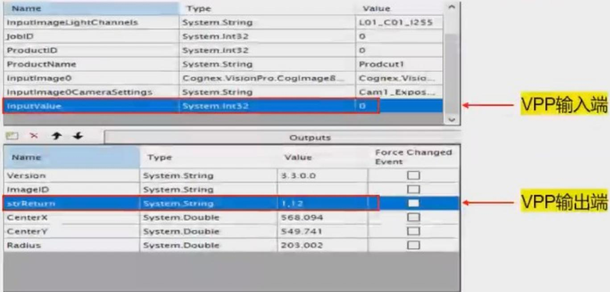

# VPP之间互传参数

将VPP1的输出端的数据传入到VPP2的输入端

<table><tr><td>Name</td><td>Type</td><td>Value</td><td>Force Changed Event</td></tr><tr><td>Version</td><td>System.String</td><td>3.3.0.0</td><td>□</td></tr><tr><td>ImageID</td><td>System.String</td><td></td><td>□</td></tr><tr><td>strReturn</td><td>System.String</td><td>1,12</td><td>□</td></tr><tr><td>CenterX</td><td>System.Double</td><td>568.094</td><td>□</td></tr><tr><td>CenterY</td><td>System.Double</td><td>549.741</td><td>□</td></tr><tr><td>Radius</td><td>System.Double</td><td>203.002</td><td>□</td></tr></table>


VPP1输出端

<table><tr><td>Name</td><td>Type</td><td>Value</td></tr><tr><td>ProductName</td><td>System.String</td><td>White</td></tr><tr><td>InputImage0</td><td>Cognex.VisionPro.CogImage8...</td><td>Cognex.Visio...</td></tr><tr><td>InputImage0CameraSettings</td><td>System.String</td><td>Cam1_Expos...</td></tr><tr><td>CenterX</td><td>System.Double</td><td>568.094</td></tr><tr><td>CenterY</td><td>System.Double</td><td>549.741</td></tr><tr><td>Radius</td><td>System.Double</td><td>203.002</td></tr><tr><td>InspectionID</td><td>System.Int32</td><td>1</td></tr></table>


VPP2输入端

# VPP之间互传参数

public class Universal_MachineSupport:IMachineSupport   
{ IFrameworkSupport m_framework; ulong partID; double CenterX $=$ 999.999,CenterY $=$ 999.999,Radius $=$ 999.999; 定义一个全局变量用于接受VPP1的数据 runStatus $=$ m_framework.RunJob commanded,LightControlAction.AutoOnAndOff, true, rjp1); if(runStatus) { strReturn $=$ (string)rjp1.Outputs["strReturn"]; 将VPP1输出端的值赋给该变量 CenterX=double)rpl. Outputs["CenterX"]; CenterY $=$ (double)rpl. Outputs["CenterY"]; Radius $=$ (double)rpl. Outputs["Radius"]; } break;   
case "T2": RunJobParameters rjp2 $=$ new RunJobParameters(InspectionID); rjp2. Inputs["CenterX"] $=$ CenterX; rjp2. Inputs["CenterY"] $=$ CenterY; rjp2. Inputs["Radius"] $=$ Radius; runStatus $=$ m_framework.RunJob commanded,LightControlAction.AutoOnAndOff, true,rjp2); if(runStatus) { strReturn $=$ (string)rjp2. Outputs["strReturn"]; } break;

# VPP之间互传参数

在需要传输大量数据时候，还有一种简便的数据传输方法：CogToolBlockTeminalCollection

将TooBlock输入端数据放入TerminalCollection集合中  
```javascript
CogToolBlockTerminalCollection Terminal = (CogToolBlockTerminalCollection) CogSerializer.DeepCopyObject(mToolBlock.Inputs); //mToolBlock.Outputs.Add(new CogToolBlockTerminal("Terminal",Terminal)); 在ToolBlock输出端添加特殊的类型  
mToolBlock.Outputs["X"].Value = Terminal[0].Value;  
mToolBlock.Outputs["Y"].Value = Terminal[1].Value;  
mToolBlock.Outputs["A"].Value = Terminal[2].Value; 对TerminalCollection集合解析 
```

# 存图模块

# 设置图像文件夹名称

1. public ulong(NewPart(string partName);

```javascript
ulong partID = ImageSaveQueue.gOnly.NewPart("PartName"); 设置图像PartID  
RunJobParameters rjpl = new RunJobParameters(InspectionID, partID); 将PartID添加到RunJobParameters 
```

a.如未定义PartID则PartName默认为Inspection Name

b.如未定义PartName则PartName默认为UnknownPart+Num

2. public void SetPartName(string newPartName, ImageFolderTag newTag, int timeoutInMs, bool cleanupOldPart, ulong partID);

ImageSaveQueue.gOnly.SetPartName("SN", ImageFolderTag.Tossing, 1000, true, partID);

SetPartName方法会对图像进行移动、复制、删除等操作，会占用电脑资源，可能会导致主机卡顿问题，不建议使用。

# 存图模块

# Image File Name Setting

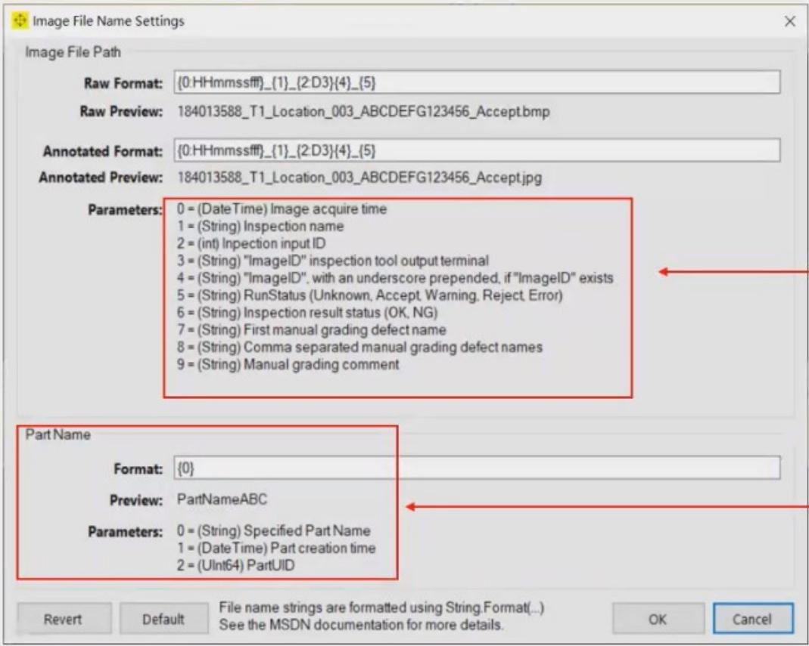

# Parameters:

0:图像采集时间 HHmmssfff  
1:Inspection名字  
2:Inspection的input_ID   
3:Inspection输出中的ImageID  
4:Inspection输出中的ImageID如果存在，用下划线强调  
5:VPP)_RunStatus状态(String)   
6:Inspection结果状态(String)   
7:第一次手动采图缺陷名字(可以自己测试)  
8:逗号分隔的手动采图缺陷名字(可以自己测试)  
9:手动采图内容(可以自己测试)

# PartName:

0:MachineSupport中自定义的PartName   
1:Part创建时间  
2:PartUID

# 存图模块

# Image Save Options

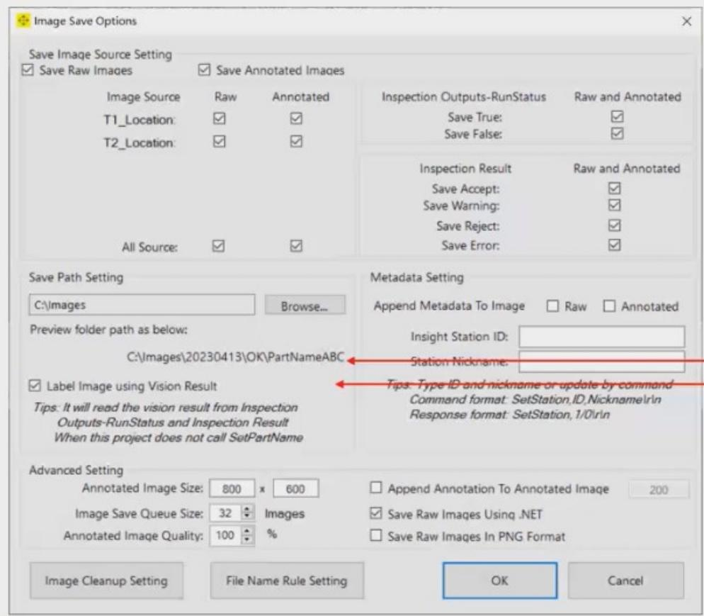

# 默认存图路径

未启用时：C:\Images\20230413TemporaryPartName

# MachineSupport添加自定义Windows窗体

定义一个Windows窗体，实现数据保存到配置文件的功能，并把该窗体添加到Framework中

# 添加Windows窗体

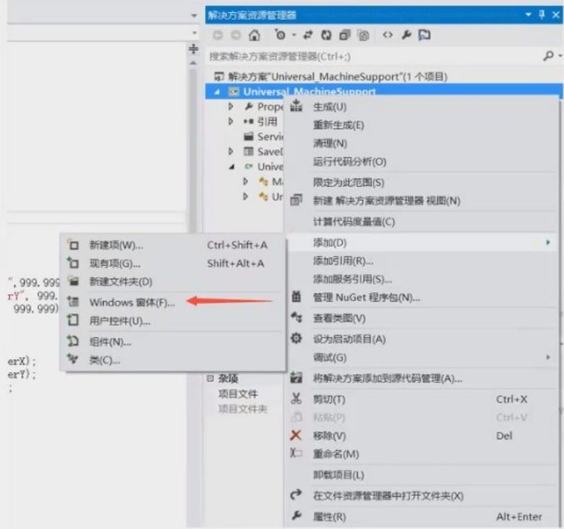

# 添加自定义控件

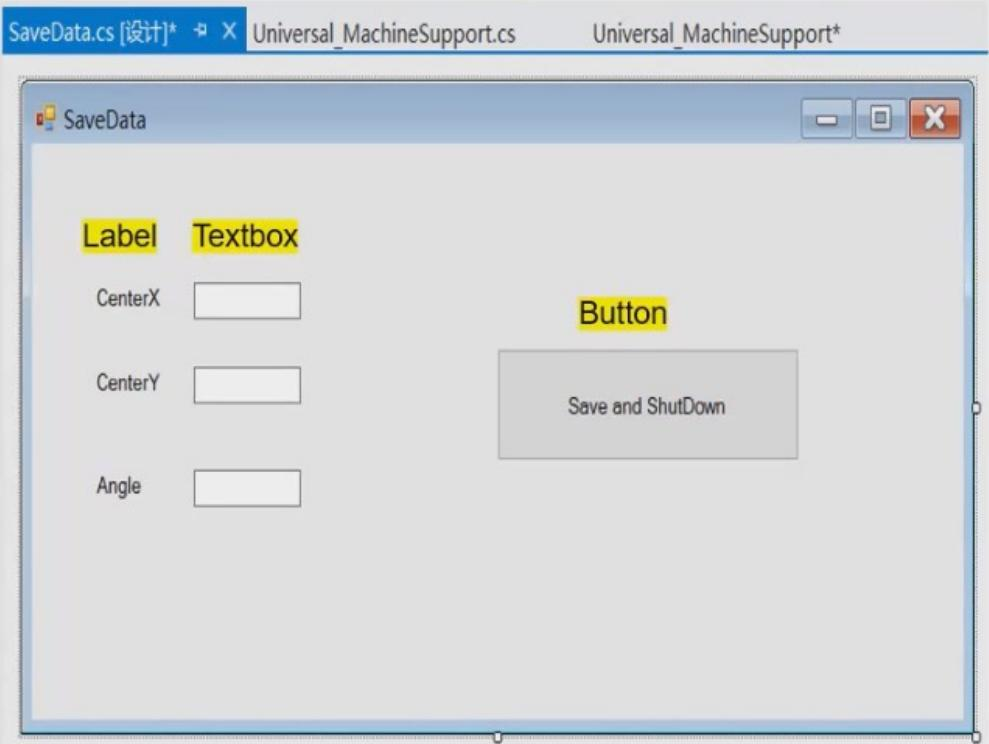

# MachineSupport添加自定义Windows窗体

using Cognex. VS. Utility; 添加命名空间用于调用Framework参数   
namespace Cognex. VS. MachineSupport   
public partial class SaveData : Form double CenterX = 999.999,CenterY = 999.999,Angle = 999.999; public void ReadSetting() 定义读配置文件的方法 CenterX=FrameworkConfiguration.gOnly.ReadNonGeneralSetting("SaveData", "CenterX", 999.999); CenterY=FrameworkConfiguration.gOnly.ReadNonGeneralSetting("SaveData", "CenterY", 999.999); Angle $=$ FrameworkConfiguration.gOnly.ReadNonGeneralSetting("SaveData", "Angle", 999.999); } public void WriteSetting() 定义写配置文件的方法 FrameworkConfiguration.gOnly.WriteNonGeneralSetting("SaveData", "CenterX", CenterX); FrameworkConfiguration.gOnly.WriteNonGeneralSetting("SaveData", "CenterY", CenterY); FrameworkConfiguration.gOnly.WriteNonGeneralSetting("SaveData", "Angle", Angle); } public SaveData() 程序自带的初始化方法 InitializeComponent(); ReadSetting(); textBox1.Text = CenterX.ToString("F3"); textBox2.Text = CenterY.ToString("F3"); textBox3.Text = Angle.ToString("F3"); } private void buttonl_Click(object sender, EventArgs e) 单击按钮事件 CenterX = Convert.ToDouble(textBox1.Text); CenterY = Convert.ToDouble(textBox2.Text); Angle = Convert.ToDouble(textBox3.Text); WriteSetting(); this.Close(); }

# MachineSupport添加自定义Windows窗体

```txt
void SetupCustomGUI() 在MachineSupport中创建一个添加窗体的方法  
{ // Add a custom menu to the framework's GUI //ToolStripMenuItem customMenu = new ToolStripMenuItem("Custom Menu"); ToolStripMenuItem ToolStrip_SaveData = new ToolStripMenuItem("SaveData"); 实例化ToolBarMenultem类，添加菜单 ToolStrip_SaveData.Click += ToolStrip_SaveData.Click; 单击事件用于调用自定义窗体 m_framework.AddToolBarMenuItem(ToolStrip_SaveData); 将窗体添加到Framework中  
} private void ToolStrip_SaveData_Click(object sender, EventArgs e) { SaveData mSaveData = new SaveData(); 实例化自定义窗体 mSaveData Activate(); 启用自定义窗体 mSaveData.Show(); 显示窗体  
public void Init(IFrameworkSupport framework) { m_framework = framework; SetupCustomGUI(); 在Framework初始化方法中调用该方法
```

# MachineSupport添加自定义Windows窗体

# 在Framework中查看结果

# Cognex AssemblyPlus


Run

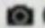

Camera


Calibration


Inspection


Tools


Settings

SaveData

Display 1

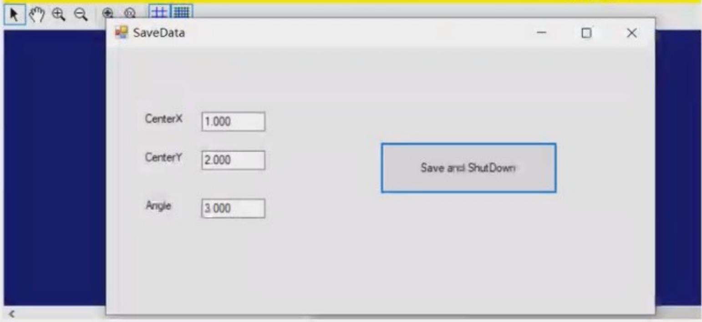

# 作业

根据提供的Machine Support，使用C:\Program Files\Cognex\VisionPro\Images\bracket_std图片，完成以下功能。

1.编写两条仿真指令"T1,SN,1","T2,SN,1",分别运行两个VPP。(20)   
2.将第一个VPP获取的圆心X,Y和Circle传到第二个VPP中并把Circle创建出来，第二个VPP抓取一条线得到角度A，最终把X，Y，A发送出去。(20)  
3.将得到的X，Y，A存入配置文件中。（20）  
4.将两张图片存入同一个文件夹中。 (20)  
5.自定义一个Windows窗体，实现将X，Y，A分别加上一个Offset值，并把其和存入配置文件的功能，最后将该窗体添加到Framework中。(20)

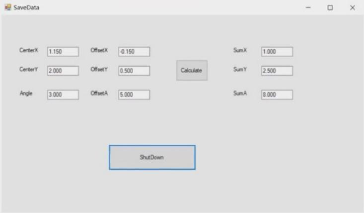

# 2022-2023L4 机试题

① 测量每个图片有多少个物料（白色方块），并显示在图片上。（20分）  
② 在图像上按从左到右、从上到下的顺序标记每颗物料的序号,序号显示在物料的中心附近。(30)  
(3) 将料盘按照下图的样式划分, 每个区域内一颗物料, 并显示分剖线。(20 分)  
(4) 在图像上找出每颗物料的四条边并显示。(30分)


# 2022-2023L4 机试题

1. 假设上图是一个的轴承,标注的都是轴承里的钢珠。按照上述要求编写 vpp 程序。

①抓取轴承中所有的钢珠，并按下述图像要求进行排序。(30分)  
②计算所有相邻钢珠的距离和①抓取到的所有钢珠中心坐标和半径存入D:/CognexData/Data.csv。(30分)  
③将①排序后的钢珠坐标向半径，按照排序循序显示在图像界面上。（20分）   
④判断轴承是否合格(以钢珠个数判断的话,只得分一半),界面显示 OK/NG (20 分)


# 例题一

请根据要求完成硬件选型，使用康耐视相机CAM-CIC-5000R-14-G（2592*1944芯片尺寸：5.76*4.29RollingShutter)，工作距离为100mm，FOV为57.6mm*42.9mm，求分别使用多大焦距的定焦镜头和多大倍率的远心镜头？

$$
\begin{array}{l} f / D = h / H \\ f = h / H \star D = 5.76 / 57.6 \star 100 = 10mm. \end{array}
$$

放大倍率 $= \frac{h}{H} = 5.76 / 57.6 = 0.1$ 倍


# 例题三

有一被测零件，尺寸为 $50 \mathrm{~mm} \times 40 \mathrm{~mm}$ ，视野大小为 $64 \mathrm{~mm} \times 48 \mathrm{~mm}$ ，使用的相机分辨率为1280 Pixel x 960 Pixel，抓边工具的精度为1/4像素，计算测量该工件宽度的测量精度？？

像素精度=FOV/分辨率=64/1280=0.05mm/Pixel

测量精度 $=$ 像素精度*抓边工具精度*2=0.05*1/4*2=0.025mm/Pixel

# 例题三

有一被测零件，尺寸为 $50 \mathrm{~mm} \times 40 \mathrm{~mm}$ ，视野大小为 $64 \mathrm{~mm} \times 48 \mathrm{~mm}$ ，使用的相机分辨率为1280 Pixel x 960 Pixel，抓边工具的精度为1/4像素，计算测量该工件宽度的测量精度？？

像素精度=FOV/分辨率=64/1280=0.05mm/Pixel

测量精度 $=$ 像素精度*抓边工具精度*2=0.05*1/4*2=0.025mm/Pixel

# 2022-2023L4 机试题

① 测量每个图片有多少个物料（白色方块），并显示在图片上。（20分）  
② 在图像上按从左到右、从上到下的顺序标记每颗物料的序号,序号显示在物料的中心附近。(30)  
(3) 将料盘按照下图的样式划分, 每个区域内一颗物料, 并显示分剖线。(20 分)  
(4) 在图像上找出每颗物料的四条边并显示。(30分)


# 2022-2023L4 机试题

① 测量每个图片有多少个物料（白色方块），并显示在图片上。（20分）  
② 在图像上按从左到右、从上到下的顺序标记每颗物料的序号，序号显示在物料的中心附近。（30）  
(3) 将料盘按照下图的样式划分, 每个区域内一颗物料, 并显示分剖线。(20 分)  
(4) 在图像上找出每颗物料的四条边并显示。(30分)

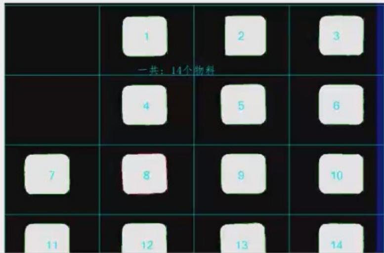

# 2022-2023L4 机试题

1. 假设上图是一个的轴承,标注的都是轴承里的钢珠。按照上述要求编写 vpp 程序。

①抓取轴承中所有的钢珠，并按下述图像要求进行排序。(30分)  
②计算所有相邻钢珠的距离和 ①抓取到的所有钢珠中心坐标和半径存入 D: /CognexData/Data.csv。(30分)  
③将①排序后的钢珠坐标向半径，按照排序循序显示在图像界面上。（20分）   
④判断轴承是否合格（以钢珠个数判断的话，只得分一半），界面显示OK/NG（20分）

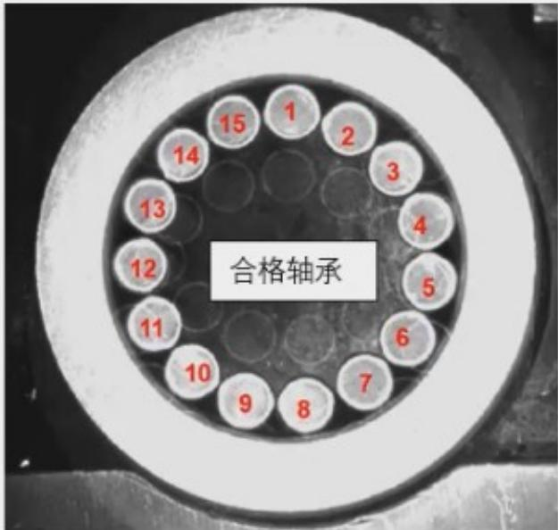

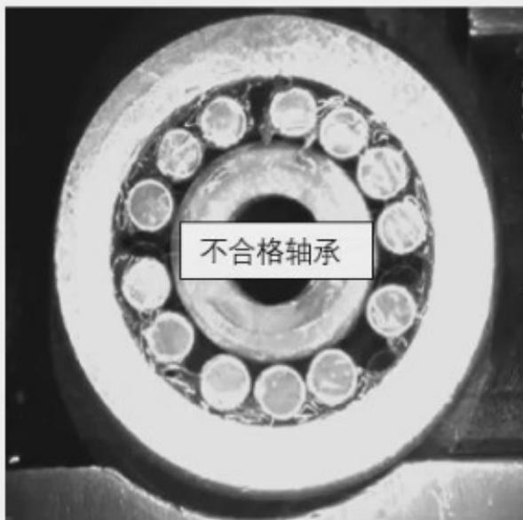

# 例题一

请根据要求完成硬件选型，使用康耐视相机CAM-CIC-5000R-14-G（2592*1944芯片尺寸：5.76*4.29RollingShutter)，工作距离为100mm，FOV为57.6mm*42.9mm，求分别使用多大焦距的定焦镜头和多大倍率的远心镜头？

$$
\begin{array}{l} f / D = h / H \\ f = h / H \star D = 5.76 / 57.6 \star 100 = 10mm. \end{array}
$$

放大倍率 $= \frac{h}{H} = 5.76 / 57.6 = 0.1$ 倍

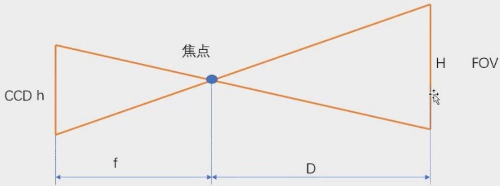

# 例题二

请根据要求完成硬件选型，如下图所示测量工件的宽度，工件要求公差为正负0.1mm，工作距离要求200mm，FOV为48.96mm*40.96mm，求使用的相机分辨率和镜头？

测量精度 $= 1 / 10$ 公差带 $= 0.1\star 0.2 = 0.02\mathrm{mm} / \mathrm{pixel}$

分辨率H=FOV/精度=48.96/0.02=2448pixel

分辨率W=FOV/精度=40.96/0.02=2048pixel

相机分辨率为2448*2048

CAM-CIC-5000-20-G (2448*2048 芯片尺寸：8.4*7.1)Global shutter 20fps

定焦镜头

f/D=h/H

f=8.4/48.96*200mm=34mm

远心镜头

M=h/H=8.4/48.96=0.17

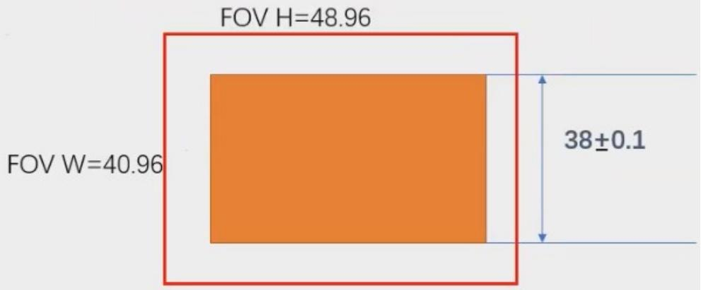

# Cognex相机

<table><tr><td>Model</td><td>Resolution</td><td>Pixel Size</td></tr><tr><td>CAM-CIC-5000-20-G</td><td>2448*2048</td><td>8.4*7.1</td></tr><tr><td>CAM-CIC-5000R-14-G</td><td>2592*1944</td><td>5.76*4.29</td></tr><tr><td>CAM-CIC-12MR-8-G</td><td>4024*3036</td><td>7.4*5.6</td></tr></table>

# 相机选型的重要计算公式？

焦距 $\mathrm{f} = \mathrm{{WD}} \times$ 靶面尺寸(H or V)/FOV(H or V)

视场FOV (H or V) = WD × 靶面尺寸 (H or V) / 焦距f

视场FOV(H or V) = 把面尺寸(H or V)/光学倍率

工作距离WD = f(焦距) × 靶面尺寸/FOV(H or V)

光学倍率 $=$ 靶面尺寸(H or V)/FOV(H or V)

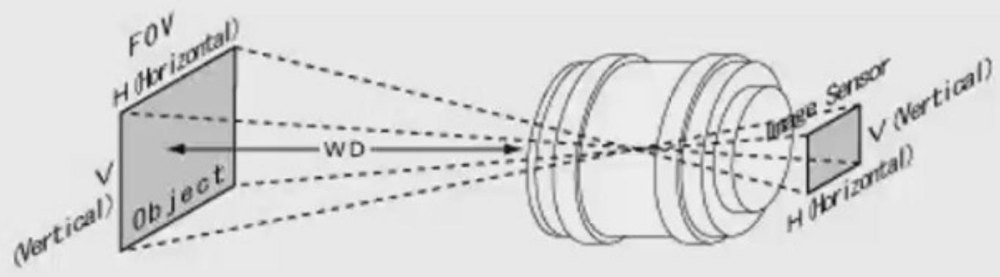

$$
\frac {f}{W D} = \frac {\text {S e n s o r S i z e (V) o r (H)}}{\text {F O V (V) o r a (H)}}
$$